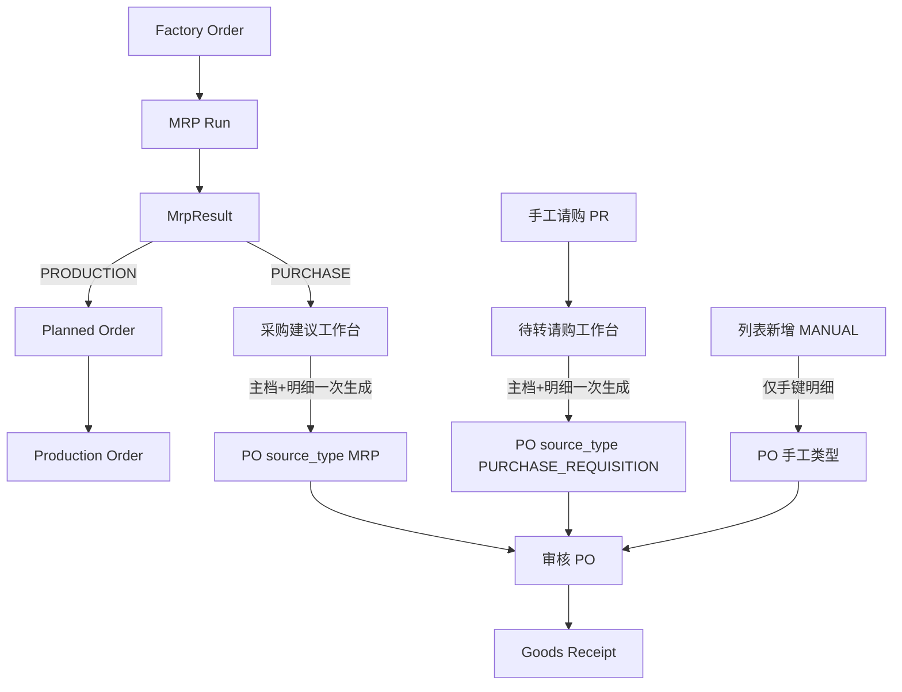

# 02. 目标流程：MrpResult 转采购单（To-Be）

> 原则：原物料需求以 FO + MRP 为准；采购员作业收敛到「采购建议工作台 → PO」。  
> PR 只服务手工请购。PO 草稿审核替代原物料路径上的 PR 审核。

---

## 1. 目标单据链

```text
                    ┌─ PRODUCTION ─→ PlannedOrder ─→ MO     （已有，不变）
FO ─→ MRP ─→ MrpResult
                    └─ PURCHASE ──→ 采购工作台 ─→ PO ─→ GR ─→ AP
                                      │
                                      │  Pegging: MRP_RESULT → PURCHASE_ORDER(item)
                                      ▼
                                 不再经过 PR
```

手工请购（并行、不混路径）：

```text
人工建 PR → 审核 → 待转请购工作台一键生成 PO   （与 MRP 相同：主档+明细一次落库）
Pegging: PURCHASE_REQUISITION → PURCHASE_ORDER
```

「先建主档」只给 `MANUAL`：采购员手键明细，无来源可勾。




采购员日常原物料：**一个作业**（工作台 + 已下 PO），不再打开 PR。

---


## 2. 采购员作业（原物料）

1. 进入 **采购建议工作台**（挂在 SCM，不是 MRP 计划员主界面）。
2. 看到未订满的 `PURCHASE` 类 `MrpResult`：物料、工厂、建议量、剩余可转量、需求日、建议供应商。
3. 勾选行；可改供应商、可改本次下单量（≤ 剩余量）。
4. 提交后系统按 `(factoryId, supplierId)` 分组，每组生成一张 `DRAFT` PO（主档 + 明细）。
5. 在 PO 上补单价/税率/预计交期（有来源清单则带末次价），再审核 PO。

与现行对比：


| 步骤    | As-Is              | To-Be                 |
| ----- | ------------------ | --------------------- |
| 确认需求  | 转 PR + 审 PR        | 无（MRP 建议即待买池）         |
| 指定供应商 | 建 PO 主档时、看不到完整待买清单 | 工作台行上指定/确认            |
| 拆单    | 人工在汇入窗挑行           | 按供应商自动拆主档             |
| 控制点   | 空的 PR 审核           | **PO 审核**（有供应商、数量、价格） |


MRP 结果列表可保留「转采购单」作为计划员快捷入口，语义与工作台同一 API；**不再提供「转采购申请」给原物料。**

---


## 3. 转单规则


### 3.0 三种诞生方式（调整结论）

原 PR 上的 `source_type`（MRP/MANUAL）+ `mrp_run_id` 表示「请购从哪来」。MRP 不再落 PR 之后，这两列在 PR 上失去意义，系统现未上线可直接**删除**；来源改记在 **PO 主档**。

采购开单有三条互斥路径，对应三个 `source_type`（创建时写入，之后不改）：

```text
有来源 ──工作台（主档+明细一次生成）──► PO
  MrpResult     → source_type = MRP
  已审 PR 明细  → source_type = PURCHASE_REQUISITION

无来源 ──列表「新增」先建主档，再手键──► PO  source_type = MANUAL
```


| `source_type`          | 谁创建主档                      | 专用外键         | 明细怎么来                       |
| ---------------------- | -------------------------- | ------------ | --------------------------- |
| `MRP`                  | 仅 `from-mrp-results`       | `mrp_run_id` | 转单时写入；pegging → `MrpResult` |
| `PURCHASE_REQUISITION` | 仅 `from-pr-items`（待转请购工作台） | 无            | 转单时写入；pegging → PR 明细       |
| `MANUAL`               | 仅列表「新增」（先主档）               | 无            | **仅**手键；**没有**来源可勾          |


请购类型**不再**走「新增空主档再汇入」。那条旧路径只留给 `MANUAL`。  
列表「新增」固定 `source_type = MANUAL`，不要请购/MRP 选项。

**不要**主档泛型 `source_id`。行级只用 pegging。

明细工具栏（仅 DRAFT）：


|                        | 汇入 PR                   | 手键新增行      |
| ---------------------- | ----------------------- | ---------- |
| `MRP`                  | 否                       | 否（可改单价/交期） |
| `PURCHASE_REQUISITION` | 是（漏勾时补行，同一工厂；供应商须与主档一致） | 否          |
| `MANUAL`               | 否                       | 是          |


补行不是建单路径：漏勾的 PR 也可再走工作台生成**另一张**同供应商 PO。补行只为少拆单。

### 3.1 准入

- `suggestedActionType = PURCHASE`
- 剩余可转量 `remainingQty > 0`
- 每行必须有 `supplierId`（请求传入，或来源清单默认供应商补齐）
- 供应商须存在且 `active_status` 可用
- 工厂以 MrpResult 为准；同一请求中不同工厂拆到不同 PO


### 3.2 剩余量

```text
remainingQty = requiredQuantity − convertedQuantity
```

- 允许部分转：一次只下一张供应商、或只下一半数量。
- 转单时 `convertedQuantity += convertQty`，与 pegging 同一事务（对标 PR `ordered_quantity`）。
- **`convert_status` 由数量派生，取代 `is_converted`：** `OPEN` / `PARTIAL` / `CONVERTED`（见 `03-schema设计.md` §5）。禁止再把「部分转」和「从未转」都标成 false。
- 工作台（最新 Run）列出 `remainingQty > 0` 的建议（即该 Run 上 `OPEN` 或 `PARTIAL`）。

不把 PR 计入剩余量：MRP 路径不再写 PR。

### 3.3 分组生成 PO

分组键：`(factoryId, supplierId)`。

同一组一张 PO：


| PO 主档                                  | 来源                                  |
| -------------------------------------- | ----------------------------------- |
| `factory_id`                           | MrpResult                           |
| `supplier_id`                          | 工作台确认值                              |
| `order_date`                           | 请求传入，默认当天                           |
| `currency_option_id` / `exchange_rate` | 供应商默认币别 + 当日汇率；无则手工在 PO 改           |
| `payment_term_option_id`               | 远端来源 (RemoteBusinessPartnerService) |
| `source_type`                          | `MRP`                               |
| `mrp_run_id`                           | 本组建议的 `MrpResult.mrpRunId`          |
| `status`                               | `DRAFT`                             |


| PO 明细                     | 来源                                                 |
| ------------------------- | -------------------------------------------------- |
| `material_id` / `unit_id` | MrpResult / 物料采购单位                                 |
| `ordered_quantity`        | 本次转换量                                              |
| `required_date`           | `MrpResult.requiredDate`                           |
| `expected_delivery_date`  | 默认同需求日，可随后改                                        |
| `unit_price`              | 来源清单 `last_price`，否则 `0`                           |
| 超量收货                      | 物料 `unlimitedOverReceipt` / `overReceiptTolerance` |


Pegging 每行一条：`demandType=MRP_RESULT`，`supplyType=PURCHASE_ORDER`，`supplyId=poItem.id`，`peggedQuantity=本次量`。

**主档保存** `mrp_run_id`**（仅** `source_type = MRP`**）。** 收紧为「一张 PO = 一厂 + 转单当时该厂最新 Run」之后，主档应记下来源运算。不要用泛型 `source_id` 兼任 Run / PR（见 3.0）。


|        | Pegging（明细）       | 主档 `mrp_run_id`     |
| ------ | ----------------- | ------------------- |
| 回答什么   | 这一行满足哪条建议 / 哪张 FO | 这张 PO 是哪一次 MRP 转出来的 |
| 能否互相替代 | 否                 | 否                   |


- 转单时写入，**不随后续重算改写**（审计快照：PO 来自 Run1，即使后来有了 Run2）。
- `PURCHASE_REQUISITION` / `MANUAL`：`mrp_run_id` 为空。
- 同一请求跨工厂：按厂拆 PO，每张写该厂那组行的 `mrpRunId`（校验已保证同组相同）。
- **不要**把后续 Run 的建议追加进已有 PO；要买缺口就再生成新 PO。

禁止把不同 Run 的未转剩余放进同一待转池（见 3.7）。跨工厂一次提交可以，拆成不同 PO。

### 3.4 一笔建议拆多供应商

工作台同一 `mrpResultId` 可出现多次（或一行内拆数量），只要 Σ 本次量 ≤ remaining。  
禁止用「一张 MrpResult 只能进一张 PO」的唯一约束。

### 3.5 回退

删除 `DRAFT` PO 明细或整单时：

1. 删除对应 `PURCHASE_ORDER` pegging
2. `convertedQuantity -= peggedQty`（下限 0），再按数量重算 `convert_status`
3. 不恢复 PR（本路径没有 PR）

已审核 PO 不允许用此回退；走 PO 现有关闭/冲销规则。

### 3.6 请购只走工作台；先建主档只给 MANUAL

**请购** `PURCHASE_REQUISITION`**（对齐 MRP）**

1. 待转请购工作台列出 pending PR 明细（现 `getPendingPurchaseRequisitionItems`）。
2. 勾选、指定供应商（可带 `suggested_supplier_id`）、填本次数量。
3. `POST .../from-pr-items` 按 `(factoryId, supplierId)` 分组，每组一张 DRAFT PO（主档+明细），`mrp_run_id` 空。
4. 校验、pegging、回写 `orderedQuantity` 与现汇入接口同一套服务。
5. **不**把某个 `pr.id` 写入 PO 主档。列表「新增」不能选请购类型。

DRAFT 请购单上保留「汇入 PR」仅作**补行**（工厂、供应商与主档一致）。漏勾也可再跑工作台出第二张单。

**手工** `MANUAL`**（原「路径 A」仅此使用）**

1. 列表「新增」→ 填工厂、供应商等 → `source_type` 固定 `MANUAL`。
2. 明细只手键。`items/from-pr` 对该类型拒绝。

`createPurchaseOrderItem` 仅 `MANUAL`。不要第四值 `MIXED`。

### 3.7 跨 Run 与重算：会重复采购（必须收紧）

再生式 MRP **不会**在同一工厂留下两代「纯未转」建议：新 Run 一开始就会删掉范围内 `convert_status = OPEN` 的旧结果。因此「工作台勾选 Run1 + Run2 的未转行」在**未转过 PO、也还没重算**时，同一工厂实际上只有一代结果，跨 Run 勾不到重复需求。

重复采购出现在 **转过 PO 之后再重算**，且工作台若按「所有 Run 上 remainingQty > 0」汇总：

```text
Run1 建议 R1 物料 M 数量 100
  → 转出 100（或 50）到 DRAFT/APPROVED PO，pegging 挂在 R1
  → 设计 6.2：有 PO pegging 的 R1 重算时保留
Run2 再生净算
  → 再写一条新建议 R2（同一 FO 需求）
  → 若工作台列出 R1 剩余 + R2 全量 → 同一需求被买两次
```

`remainingQty` 只相对**这一行** MrpResult 的 pegging，不知道新 Run 已经把同一 FO 需求又建议了一遍。跨 Run 相加会双计。

与现行 PR 路径的差别：DRAFT MRP PR **会被下一轮删除**，所以不会和 R2 同时出现在待转池。PO 是对外草稿，**不能**随 MRP 重算删掉，旧结果又为了 pegging 必须保留 → 待转池若跨 Run 就会叠两代。

**规则（取代「允许跨 Run」）：**


| 场景                                  | 是否允许                                                  | 原因                       |
| ----------------------------------- | ----------------------------------------------------- | ------------------------ |
| 同一工厂、历史 Run 的 remaining + 最新 Run 建议 | **禁止**                                                | 同一需求两代建议                 |
| 工作台默认待转池                            | 每厂仅 **最新一条 COMPLETED + OPERATIVE** Run 的 `PURCHASE` 行 | 与再生式「当前建议」一致             |
| `from-mrp-results`                  | 拒绝 `mrpResult.mrpRunId` 不是该厂最新 Run 的行                 | 防旧 id 重放                 |
| 一次提交含多个工厂                           | **允许**                                                | 各厂最新 Run 不同，需求不重叠        |
| 已挂 PO pegging 的旧结果                  | 保留作溯源，**不进**待转池                                       | remaining 只用于审计/删除 PO 回退 |


计划员若在 MRP 结果页转单：只允许当前打开的那一笔 Run，且该 Run 必须仍是该厂最新 COMPLETED 运算；否则提示「请使用最新 Run / 采购工作台」。

---


## 4. API

沿用「PP 发起转单 / SCM 落单据」的模块边界，但工作台主入口在 SCM（采购员权限）。

### 4.1 待转建议分页（工作台）

```http
POST /api/v1/scm/purchase-orders/pending-mrp-items/page
```

权限：采购单 `:create`

过滤：工厂、物料、需求日、供应商（建议）。**不提供跨 Run 多选。**  
只返回：各厂 **最新 COMPLETED OPERATIVE Run** 上 `PURCHASE` 且 `remainingQty > 0` 的行（可再按工厂收窄）。  
响应带：`mrpResultId`、`mrpRunId`、物料、工厂、`requiredDate`、`requiredQuantity`、`remainingQuantity`、`suggestedSupplierId`（来源清单默认）。

实现：SCM 经 `RemoteMrpResultService` 读未订满建议，或 PP 提供专用查询、SCM 组装供应商默认值。

### 4.2 从 MRP 建议生成 PO

```http
POST /api/v1/scm/purchase-orders/from-mrp-results
```

请求：

```json
{
  "orderDate": "2026-08-25",
  "items": [
    {
      "mrpResultId": 101,
      "supplierId": 12,
      "convertQuantity": 500
    }
  ]
}
```

行为：校验（含 3.7：每行必须属于该厂最新 Run；`convertQuantity ≤ remainingQty`）→ 按 `(factory, supplier)` 拆单 → 写 PO 主档/明细/pegging → 更新 `convertedQuantity` 与 `convert_status`。  
响应：生成的 PO 列表（id、orderNo、supplierId、行数）。

同一事务；任一行失败则整批回滚。

### 4.2b 从请购明细一键生成 PO（对齐 MRP）

```http
POST /api/v1/scm/purchase-orders/from-pr-items
```

请求形态对齐 `from-mrp-results`（`prItemId` + `supplierId` + `convertQuantity` + 可选 `orderDate`）。  
按 `(factoryId, supplierId)` 拆单，写出 `source_type = PURCHASE_REQUISITION` 的 DRAFT 主档+明细。  
这是请购类型**唯一建单入口**。`POST .../{id}/items/from-pr` 仅给已存在的请购类型 DRAFT **补行**。

### 4.3 MRP 结果页快捷入口（可选）

```http
POST /api/v1/pp/mrp-runs/{id}/results/convert-to-purchase-orders
```

内部转调 SCM `from-mrp-results`。该 `{id}` 必须仍是结果行所属工厂的最新 COMPLETED OPERATIVE Run，否则拒绝。若请求未带 `supplierId`，必须能用来源清单默认补齐，否则拒绝（禁止生成无供应商 PO）。

### 4.4 淘汰


| API                                                 | 处理                |
| --------------------------------------------------- | ----------------- |
| `POST .../results/convert-to-purchase-requisitions` | 前端和后端移除           |
| MRP 结果「转采购申请」按钮                                     | 改为「转采购单」或删除，避免双路径 |


---


## 5. 前端


### 5.1 采购建议工作台（主路径）

建议独立页：`/scm/purchase-proposals`，或 PO 列表工具栏「从 MRP 建议转单」打开抽屉。

交互要点：

- 表格可编辑：供应商、本次数量
- 数据范围：各厂最新 MRP Run（界面展示 Run 编号/日期，避免误当成跨历史建议）
- 提交前预览：按供应商拆成几张 PO
- 成功后跳转 PO 列表（可按本次生成的 id 过滤）

列：物料、规格、工厂、需求日、建议量、已转量、剩余、建议供应商、本次数量。

### 5.2 PO 列表 / 明细

- 「新增」= 仅 `MANUAL`（先主档，再手键）。不要来源类型下拉。
- 「从 MRP 建议转单」「从请购转单」两个工作台（交互同 5.1，数据源不同）。
- `PURCHASE_REQUISITION`：可「汇入 PR」补行；无手键新增。
- `MANUAL`：仅手键；不显示汇入 PR。
- `MRP`：不汇入 PR、不手键新增。
- 三种类型均可按 `source_type` 筛选。


### 5.3 MRP 结果

- `PURCHASE` 过滤下的执行按钮改为转 PO（或仅提示去工作台）。
- 不再生成 MRP PR。


### 5.4 PR 作业

- 仅内部请购。废除 PR 上的 `source_type` / `mrp_run_id` 后，列表不再按 MRP/MANUAL 过滤。
- 审核后只走待转请购工作台，**不要**先建空 PO。

---


## 6. 对 MRP 引擎的影响


### 6.1 预计入库（DRAFT PO 必须计入）

`MrpScheduledReceiptServiceImpl` 今日计入：已审/部分执行的 PR；已审/部分收货的 PO（`APPROVED` / `PARTIAL`）。**不含 DRAFT。**

对 PR 这是对的：DRAFT MRP PR 会在下一轮被删掉，不计入也不会残留双建议。  
对 PO 这是错的：转出的 DRAFT PO **不能**随重算删除。若仍不计入供给，Run2 会按全额需求再写 R2；工作台即使只显示最新 Run，采购员仍会把同一需求再转一张 PO。

**改定：MRP 预计入库包含 DRAFT / APPROVED / PARTIAL 的 PO 开量**（订购 − 已收；`CLOSED`/`COMPLETED` 仍排除）。手工新建的 DRAFT PO 同样占需求，避免与 MRP 建议重叠。

未转的 `MrpResult` 仍不算供给。

对照生产：`PROPOSED` PLO 重算时删除，故不计入供给；`FIRMED` PLO 才计入。PO 草稿已选定供应商，语义接近 FIRMED，而不是可丢弃的 PROPOSED。

### 6.2 再生式清理

停止「删除该厂 DRAFT MRP PR」。改为：


| 对象 | 清理条件 |
|------|----------|
| `convert_status = OPEN` 的 `MrpResult` | 删除（可按厂）；即从未转 PO |
| `PARTIAL` / `CONVERTED` 的结果 | **保留**；历史行不进工作台。若该行仍属该厂最新 Run 且为 `PARTIAL`，工作台仍可转剩余 |
| `PROPOSED` PLO | 维持现逻辑（删结果 + 删 PLO） |
| MANUAL PR | 从不被 MRP 清理 |
| 任何状态的 PO | **从不**因 MRP 重算删除 |

**实现要点：** 现网 `findUnconvertedResultIds`（只看 `is_converted=false`）对部分转不安全。改为按 `convert_status = OPEN` 删除。清理时**不要**删除 `PARTIAL`/`CONVERTED` 行上的 `PURCHASE_ORDER` pegging。详见 `03-schema设计.md` §5。


已审核未转完的历史 MRP PR（过渡期）：不删；开量仍进预计入库。上线前无历史则可跳过。

清理时**不要**删除 `demand_type=MRP_RESULT` 且 `supply_type=PURCHASE_ORDER` 的 pegging（否则 PO 与建议脱钩，回退/剩余量失效）。

### 6.3 转单后重跑 MRP（两道闸）

1. **供给闸（6.1）：** DRAFT+已审 PO 开量参与净算 → 新 Run 只建议「尚未被任何未关闭 PO 覆盖」的缺口。
2. **工作台闸（3.7）：** 只展示最新 Run，旧 R1 即使 `remainingQty > 0` 也不再可转。

仅做其中一道仍可能出问题：


| 只做                     | 仍可能                        |
| ---------------------- | -------------------------- |
| 只限制最新 Run，DRAFT 不计入供给  | 最新 Run 再出全量 R2，再转一张 PO     |
| 只把 DRAFT 计入供给，工作台跨 Run | 旧 R1 剩余 + 新 R2（可能已缩小）仍可能叠买 |


两道都做后：旧行不可转；新建议已扣除在途 PO。删除 DRAFT PO 后，下一轮（或当前最新 Run 上若尚未重算：回退使旧 remaining 恢复，但旧 Run 已不是最新 → 仍不可转，需再跑 MRP 才能买缺口）——回退场景见下。

**删除 DRAFT PO 后的待转：** pegging 删除后旧结果 remaining 恢复，但工作台仍只认最新 Run。若最新 Run 已按「含该 DRAFT」净算，删 PO 后最新建议偏小，必须 **再跑 MRP** 才会出现缺口。工作台在删单后提示「请重新运算 MRP」即可，不要把历史 Run 重新打开当待转池。

---


## 7. 实施阶段（系统未上线，可压缩）

未上线建议一次做到 Phase 1，避免先上 MRP-PR 再迁数据。


| 阶段          | 内容                                         | 采购员是否还要进 PR |
| ----------- | ------------------------------------------ | ----------- |
| **Phase 0** | 工作台 + `from-mrp-results`；供应商在请求中必填；暂不建来源清单 | 否（原物料）      |
| **Phase 1** | `material_suppliers`；默认供应商、末次价；工作台预填       | 否           |
| **Phase 2** | 去掉转 PR API/按钮；MRP 清理不再删 MRP PR；文档与权限       | 仅手工请购       |


Phase 0 即可消除「转 PR → 审 PR → 切 PO → 建主档 → 汇入」。Phase 1 消除逐行选供应商的重复劳动。

不推荐的权宜：只给 PR 列表加「转 PO」向导——中间档仍在，分组仍按工厂。

---


## 8. 权限与控制点


| 动作          | 建议权限                                     |
| ----------- | ---------------------------------------- |
| 查看/转 MRP 建议 | 采购单创建（或 `purchaseOrders.convertFromMrp`） |
| 改 PO 单价/交期  | 采购单更新                                    |
| 审核 PO       | 现有 PO 审核（原物料的实质控制点）                      |
| 手工 PR       | 现有 PR 权限，与采购员可分离                         |


原物料若以后要预算/额度，做在 **PO 审核** 或独立签核，不要把 PR 请回日常路径。

---


## 9. 验收要点

1. 勾选多行、两个供应商 → 生成两张 DRAFT PO，工厂正确，pegging 数量合计 = 转换量。
2. 部分转换后工作台剩余正确；`convert_status = PARTIAL`；剩余为 0 时为 `CONVERTED`。
3. 删除 DRAFT PO 后：pegging 回退；工作台**不会**自动拿出历史 Run 再转。须再跑 MRP 后，最新 Run 才出现缺口建议。
4. 无供应商且无默认来源 → API 拒绝，不产生 PO。
5. 请购类型只能由 `from-pr-items` 建单；列表「新增」只能出 `MANUAL` 且汇入 PR 失败；MRP 结果不再产生 PR。
6. 下一轮 MRP：无 PO pegging 的未转建议被替换；已挂 PO pegging 的旧结果保留但不进工作台。
7. DRAFT / APPROVED / PARTIAL PO 开量进入净算；工作台只列出各厂最新 Run。
8. 验收反例：Run1 转 100 到 DRAFT PO → 跑 Run2 → 工作台对物料 M 不应再出现 100（供给已覆盖时为 0；有缺口只出现 Run2 的差额）。禁止用 Run1 行再转一次。
9. 传入非该厂最新 Run 的 `mrpResultId` → `from-mrp-results` 拒绝。
10. 往 `MRP` / `MANUAL` 汇入 PR → 拒绝。请购类型一张 PO 可含多张 PR 的明细，主档无 `source_id`。

---


## 10. 待拍板（写入实施前确认）

1. **DRAFT PO 是否占用 MRP 供给？** **建议改为是**（见 6.1）。若坚持「仅审核后才占需求」，必须另做转单上限：`convertQuantity` 不得超过「最新建议量 − 该厂该料未关闭 PO 开量」，否则重算后必能重复转出。
2. **工作台是否允许跨工厂一次提交？** 默认允许，每厂只用该厂最新 Run。
3. **计划员 MRP 页是否保留转 PO 按钮？** 可保留，但仅当该 Run 仍是该厂最新 COMPLETED 运算。
4. **上线前是否直接下线 MRP→PR？** 建议是（无历史包袱）。
5. **跨 Run 待转？** **否**（3.7）。不作为可选项开放。
6. **PO 是否用泛型** `source_id`**？** **否**（3.0）。`source_type` 三值 + 仅 MRP 写 `mrp_run_id`。
7. **PR 上** `source_type` **/** `mrp_run_id`**？** **废除**（未上线可直接改表）。
8. **`mrp_results.is_converted`？** **废除**，改为 `convert_status`（`OPEN` / `PARTIAL` / `CONVERTED`）+ `converted_quantity`。见 `03-schema设计.md` §5。

