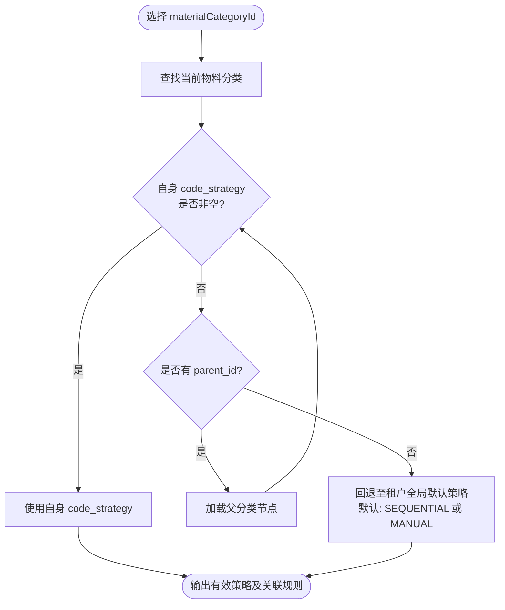

# 01. 策略分析与选型：为什么必须落在物料分类（Category）

---

## 1. 核心分歧与领域本质分析

在 ERP 主数据架构中，`material_types`（物料类型）与 `material_categories`（物料分类）承担着截然不同的业务职责：

```text
┌────────────────────────────────────────────────────────────────────────┐
│                        物料类型 (material_types)                        │
│ 职责：财务核算与物流控制（Financial & Logistics Control）                 │
│ 属性：is_inventoried, is_purchased, is_sold, is_manufactured, valuation │
│ 实例：FERT(产成品), HALB(半成品), ROH(原材料), VERP(包装物), DIEN(服务)     │
│ 数量级：每个租户通常仅 5 ~ 8 个，极少变动                                  │
└────────────────────────────────────────────────────────────────────────┘
                                    │
                         按财务行为控制凭证与单据
                                    ▼
┌────────────────────────────────────────────────────────────────────────┐
│                        物料主档 (materials - SKU)                       │
└────────────────────────────────────────────────────────────────────────┘
                                    ▲
                         按物理属性与业务分类治理
                                    │
┌────────────────────────────────────────────────────────────────────────┐
│                      物料分类 (material_categories)                     │
│ 职责：商品层级与物理属性组织（Commodity / Product Hierarchy）            │
│ 属性：树状层级 (parent_id, level)、分类代号 (code)、分类名称 (name)       │
│ 实例：服装 -> 男装 -> 梭织上衣； 配件 -> 箱包 -> 帆布袋； 原料 -> 纱线    │
│ 数量级：几十到数百个，依商品企划与供应链深度动态分级                          │
└────────────────────────────────────────────────────────────────────────┘
```

---

## 2. 为什么不能放在 `material_types`？

### 2.1 粒度过粗：同类型下「多产品形态」无法兼容
以典型制造业租户为例，其「成品（FERT）」通常包含多种形态的商品：
- **形态 A（服装鞋帽）**：强矩阵变体（款号 × 颜色 × 尺码），需要公式 `款号-色号-尺码流水`；
- **形态 B（周边配饰 / 标品文创）**：例如品牌雨伞、帆布包、水杯、均码礼盒。它们也是成品、可售且需核算库存，但**根本没有尺码组，更无款号概念**。如果强制走变体策略，用户必须为其虚构「伪款号」或建立「伪尺码」，污染主数据；
- **形态 C（贴牌定制 / OEM 来样）**：外销客户直接指定物料料号（如 `CUST-PO-99881`），必须允许手工直接录入。

若将 `code_strategy` 放在 `material_types` 上，FERT 只能配置一种策略，上述业务形态必然产生直接冲突。

### 2.2 反模式：导致物料类型恶性膨胀
如果为了区分编码规则而强行拆分物料类型，租户将被迫建立：
- `FERT_FASHION`（成品-服装）
- `FERT_ACC`（成品-配饰）
- `FERT_CUSTOM`（成品-客户指定）
- `ROH_FABRIC`（原料-面料）
- `ROH_STANDARD`（原料-标准辅料）

**严重后果**：
1. **财务评估类配置爆炸**：每个衍生类型都要重新配置 `material_type_valuation_class` 及对应总账科目；
2. **单据控制逻辑复杂化**：采购、MRP、生产工单中所有基于 `is_sold` / `is_manufactured` 的判定逻辑都要被冗余类型干扰；
3. **违反行业规范**：SAP 等主流 ERP 严禁将商品分类逻辑上移至物料类型层级。

---

## 3. 为什么 `material_categories` 是最优宿主？

### 3.1 编码规则与商品分类天然同构
企业现实中的编码体系，本质上都是围绕**商品品类体系**构建的：
- 原材料编号前缀通常是分类代号：如 `FAB-00001`（Fabric 面料）、`ZIP-00001`（Zipper 拉链）；
- 变体矩阵生成通常只针对特定品类：如「成衣」、「鞋靴」大类；
- 办公用品/备品备件走通用编号或手工录入。

### 3.2 树状层级（Tree Structure）天然支持策略继承
物料分类具有 `parent_id` 构成的树状结构。将 `code_strategy` 配置在分类上，可实现**「祖先定义、后代继承、特殊覆盖」**的优雅机制：

```text
根分类: [服装大类 (APP)] ──► code_strategy = FASHION_VARIANT
   │
   ├─► [男装 (MEN)] ─────────► (未设置) 继承父级 ──► FASHION_VARIANT
   │     └─► [外套 (COAT)] ──► (未设置) 继承父级 ──► FASHION_VARIANT
   │
   └─► [特定定制组 (CUST)] ──► code_strategy = MANUAL (显式覆盖)

根分类: [配件标品 (ACC)] ──► code_strategy = SEQUENTIAL (流水分配)
   │
   └─► [帆布袋 (BAG)] ──────► (未设置) 继承父级 ──► SEQUENTIAL
```

* **极大降低维护成本**：租户通常只需在 3~5 个顶级大类上设定策略，下属的成百上千个三级/四级分类自动继承，无需逐个配置；
* **高精细度覆盖能力**：若某个末级子品类有特殊规则，允许在其自身节点显式配置，覆盖父级策略。

---

## 4. 策略解析与继承算法（Resolution Algorithm）

系统在创建或保存物料时，根据物料所选的 `materialCategoryId` 解析其有效编码策略的流程如下：



### 算法伪代码（Java / Service 实现）：

```java
public EffectiveCodingPolicy resolvePolicy(Long categoryId, Long tenantId) {
    if (categoryId == null) {
        return EffectiveCodingPolicy.defaultManual();
    }
    
    MaterialCategory current = categoryRepository.findById(categoryId).orElse(null);
    while (current != null) {
        if (current.getCodeStrategy() != null) {
            return EffectiveCodingPolicy.builder()
                .strategy(current.getCodeStrategy())
                .numberRuleId(current.getNumberRuleId())
                .prefix(current.getCodePrefix() != null ? current.getCodePrefix() : current.getCode())
                .sourceCategoryId(current.getId())
                .build();
        }
        if (current.getParentId() == null) {
            break;
        }
        current = categoryRepository.findById(current.getParentId()).orElse(null);
    }
    
    // 根节点仍未配置时的安全兜底
    return EffectiveCodingPolicy.builder()
        .strategy(CodingStrategyEnum.MANUAL)
        .build();
}
```

---

## 5. 多租户适应性评估矩阵

| 场景 | 租户需求 | 配置方式 | 实际效果 |
| :--- | :--- | :--- | :--- |
| **纯鞋服品牌商** | 全品类均为款色码变体 | 在根分类 `服装`、`鞋靴` 设置 `FASHION_VARIANT` | 所有商品一键启用款色码变体矩阵生成与建议。 |
| **服装 + 跨界周边** | 成衣分色码，水杯/抱枕走连续流水 | `服装` 设置 `FASHION_VARIANT`；`文创周边` 设置 `SEQUENTIAL` | 用户在 Form 中选周边分类时，款色码自动隐藏，编码直接自动给号。 |
| **纯离散制造 (电子/机械)** | 无变体需求，原料按分类流水，成品手工录入 | `成品` 设置 `MANUAL`；`元器件` 设置 `SEQUENTIAL` | 徹底免除鞋服變體負擔，表單輕量高效。 |
| **OEM/ODM 代工廠** | 客供料號為主，部分通用包材自編 | 客供分類設置 `MANUAL`；包材設置 `SEQUENTIAL` | 完美相容客戶指定編碼，杜絕系統強制算號造成的料號衝突。 |
