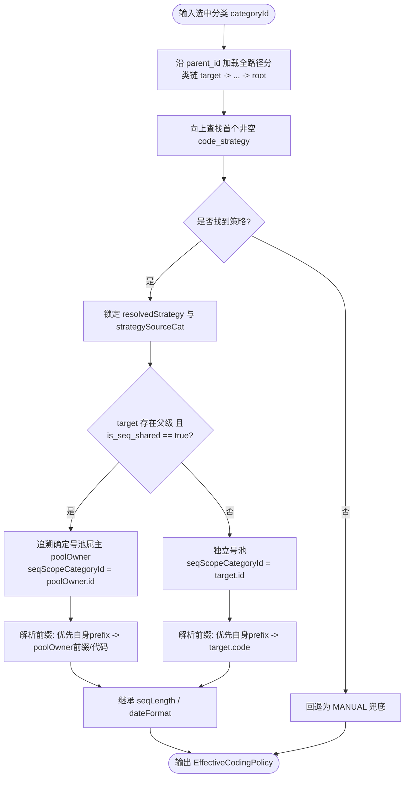

# 01. 策略分析与选型：为什么必须落在物料分类（Category）

---

## 1. 核心分歧与领域本质分析

在 ERP 主数据架构中，`material_types`（物料类型）与 `material_categories`（物料分类）承担着截然不同的业务职责：

```text
┌────────────────────────────────────────────────────────────────────────┐
│                        物料类型 (material_types)                        │
│ 职责：财务核算与物流控制（Financial & Logistics Control）                 │
│ 属性：is_inventoried, is_purchased, is_sold, is_manufactured, valuation │
│ 实例：FERT(产成品), HALB(半成品), ROH(原材料), VERP(包装物), DIEN(服务)     │
│ 数量级：每个租户通常仅 5 ~ 8 个，极少变动                                  │
└────────────────────────────────────────────────────────────────────────┘
                                    │
                         按财务行为控制凭证与单据
                                    ▼
┌────────────────────────────────────────────────────────────────────────┐
│                        物料主档 (materials - SKU)                       │
└────────────────────────────────────────────────────────────────────────┘
                                    ▲
                         按物理属性与业务分类治理
                                    │
┌────────────────────────────────────────────────────────────────────────┐
│                      物料分类 (material_categories)                     │
│ 职责：商品层级与物理属性组织（Commodity / Product Hierarchy）            │
│ 属性：树状层级 (parent_id, level)、分类代号 (code)、分类名称 (name)       │
│ 实例：服装 -> 男装 -> 梭织上衣； 配件 -> 箱包 -> 帆布袋； 原料 -> 纱线    │
│ 数量级：几十到数百个，依商品企划与供应链深度动态分级                          │
└────────────────────────────────────────────────────────────────────────┘
```

---

## 2. 为什么不能放在 `material_types`？

### 2.1 粒度过粗：同类型下「多产品形态」无法兼容
以典型制造业租户为例，其「成品（FERT）」通常包含多种形态的商品：
- **形态 A（服装鞋帽）**：强矩阵变体（款号 × 颜色 × 尺码），需要公式 `款号-色号-尺码流水`；
- **形态 B（周边配饰 / 标品文创）**：例如品牌雨伞、帆布包、水杯、均码礼盒。它们也是成品、可售且需核算库存，但**根本没有尺码组，更无款号概念**。如果强制走变体策略，用户必须为其虚构「伪款号」或建立「伪尺码」，污染主数据；
- **形态 C（贴牌定制 / OEM 来样）**：外销客户直接指定物料料号（如 `CUST-PO-99881`），必须允许手工直接录入。

若将 `code_strategy` 放在 `material_types` 上，FERT 只能配置一种策略，上述业务形态必然产生直接冲突。

### 2.2 反模式：导致物料类型恶性膨胀
如果为了区分编码规则而强行拆分物料类型，租户将被迫建立：
- `FERT_FASHION`（成品-服装）
- `FERT_ACC`（成品-配饰）
- `FERT_CUSTOM`（成品-客户指定）
- `ROH_FABRIC`（原料-面料）
- `ROH_STANDARD`（原料-标准辅料）

**严重后果**：
1. **财务评估类配置爆炸**：每个衍生类型都要重新配置 `material_type_valuation_class` 及对应总账科目；
2. **单据控制逻辑复杂化**：采购、MRP、生产工单中所有基于 `is_sold` / `is_manufactured` 的判定逻辑都要被冗余类型干扰；
3. **违反行业规范**：SAP 等主流 ERP 严禁将商品分类逻辑上移至物料类型层级。

---

## 3. 为什么 `material_categories` 是最优宿主？

### 3.1 编码规则与商品分类天然同构
企业现实中的编码体系，本质上都是围绕**商品品类体系**构建的：
- 原材料编号前缀通常是分类代号：如 `FAB-00001`（Fabric 面料）、`ZIP-00001`（Zipper 拉链）；
- 变体矩阵生成通常只针对特定品类：如「成衣」、「鞋靴」大类；
- 办公用品/备品备件走通用编号或手工录入。

### 3.2 树状层级（Tree Structure）天然支持策略继承
物料分类具有 `parent_id` 构成的树状结构。将 `code_strategy` 配置在分类上，可实现**「祖先定义、后代继承、特殊覆盖」**的优雅机制：

```text
根分类: [服装大类 (APP)] ──► code_strategy = FASHION_VARIANT
   │
   ├─► [男装 (MEN)] ─────────► (未设置) 继承父级 ──► FASHION_VARIANT
   │     └─► [外套 (COAT)] ──► (未设置) 继承父级 ──► FASHION_VARIANT
   │
   └─► [特定定制组 (CUST)] ──► code_strategy = MANUAL (显式覆盖)

根分类: [配件标品 (ACC)] ──► code_strategy = SEQUENTIAL (流水分配)
   │
   └─► [帆布袋 (BAG)] ──────► (未设置) 继承父级 ──► SEQUENTIAL
```

* **极大降低维护成本**：租户通常只需在 3~5 个顶级大类上设定策略，下属的成百上千个三级/四级分类自动继承，无需逐个配置；
* **高精细度覆盖能力**：若某个末级子品类有特殊规则，允许在其自身节点显式配置，覆盖父级策略。

---

## 4. 策略解析与继承算法（Resolution Algorithm）

系统在创建、保存物料或表单切换分类时，根据物料所选的 `materialCategoryId` 解析其有效编码策略与流水号配置。解析必须遵循**「策略类型向上继承、流水参数逐级覆盖、号池作用域自适应」**的精细化规则。

### 4.1 继承与覆盖优先级规则

1. **策略类型（`strategy`）**：
   - 沿分类树自底向上查找首个非空的 `code_strategy`；
   - 若根节点仍为空，回退至租户全局安全默认策略（`MANUAL`，避免对未知分类强行按未知公式算号）。
2. **共享流水池（`isSeqShared`）与号池作用域（`seqScopeCategoryId`）**：
   - 若当前节点具有父级且标记 `is_seq_shared = true`：号池统一锚定至父级所在号池（若上级也共用，则继续向上追溯至该号段所属的祖先节点 `poolOwner`）；
   - 若当前节点未开启共用（`is_seq_shared = false`，默认）：号池完全独立，`seqScopeCategoryId = categoryId`（自身节点），各分类号段相互隔离、互不挤占。
   - *约束*：根分类（`parent_id IS NULL`）无上级，`is_seq_shared` 恒为 `false`。
3. **编码前缀（`codePrefix`，仅 SEQUENTIAL）**：
   - 首选当前节点自身显式配置的 `code_prefix`；
   - 若未配置且处于共用号池模式（`is_seq_shared = true`）：默认继承号池属主（`poolOwner`）的前缀或代码，保证同号池编码前缀一致且流水连续；
   - 若未配置且处于独立号池模式（`is_seq_shared = false`）：**默认直接使用当前选中节点自身的分类代码 `code`**（例如针织面料 `KNIT` 独立发号，默认前缀即为 `KNIT`），杜绝因隐式继承父级前缀导致不同独立号池发生前缀碰撞。
4. **流水长度（`seqLength`）与日期掩码（`dateFormat`）**：
   - 自底向上寻找首个非空值；`seq_length` 默认 5 位，`date_format` 默认为空（主数据跨期永不重置）。



### 4.2 算法实现参考（Java / Service 实现）：

```java
public EffectiveCodingPolicy resolvePolicy(Long categoryId, Long tenantId) {
    if (categoryId == null) {
        return EffectiveCodingPolicy.builder()
                .strategy(CodingStrategyEnum.MANUAL)
                .build();
    }

    // 1. 沿树向上收集分类链 (chain.get(0) 为当前选中的 target，末尾为 root)
    List<MaterialCategory> chain = new ArrayList<>();
    MaterialCategory current = categoryRepository.findById(categoryId).orElse(null);
    Set<Long> visited = new HashSet<>();
    while (current != null && visited.add(current.getId())) {
        chain.add(current);
        if (current.getParentId() == null) {
            break;
        }
        current = categoryRepository.findById(current.getParentId()).orElse(null);
    }

    if (chain.isEmpty()) {
        return EffectiveCodingPolicy.builder()
                .strategy(CodingStrategyEnum.MANUAL)
                .build();
    }

    MaterialCategory target = chain.get(0);

    // 2. 解析策略类型 (自底向上寻找首个非空 code_strategy)
    CodingStrategyEnum resolvedStrategy = null;
    MaterialCategory strategySourceCat = null;
    for (MaterialCategory cat : chain) {
        if (cat.getCodeStrategy() != null) {
            resolvedStrategy = cat.getCodeStrategy();
            strategySourceCat = cat;
            break;
        }
    }

    if (resolvedStrategy == null) {
        return EffectiveCodingPolicy.builder()
                .categoryId(target.getId())
                .categoryCode(target.getCode())
                .strategy(CodingStrategyEnum.MANUAL)
                .build();
    }

    // 3. 计算号池作用域 ID (seqScopeCategoryId) 与号池属主
    boolean isShared = Boolean.TRUE.equals(target.getIsSeqShared()) && chain.size() > 1;
    MaterialCategory poolOwner = target;
    if (isShared) {
        // 沿分类链向上追溯号池属主：若上级分类也开启了 is_seq_shared，继续向上穿透至真正的主号池分类
        for (int i = 1; i < chain.size(); i++) {
            poolOwner = chain.get(i);
            if (!Boolean.TRUE.equals(poolOwner.getIsSeqShared()) || i == chain.size() - 1) {
                break;
            }
        }
    }
    Long seqScopeCatId = poolOwner.getId();

    // 4. 逐字段向上继承流水号配置参数
    String resolvedPrefix = null;
    Integer resolvedSeqLength = null;
    String resolvedDateFormat = null;

    // 4.1 前缀解析规则
    if (StringUtils.hasText(target.getCodePrefix())) {
        resolvedPrefix = target.getCodePrefix();
    } else if (isShared) {
        // 共用号池时默认使用号池属主的前缀或代码，保证同号池编码一致连续
        resolvedPrefix = StringUtils.hasText(poolOwner.getCodePrefix())
                ? poolOwner.getCodePrefix()
                : poolOwner.getCode();
    } else {
        // 独立号池模式：若自身未显式配置 codePrefix，默认直接使用自身分类代码 code，杜绝继承父级前缀导致跨分类号段撞车
        resolvedPrefix = target.getCode();
    }

    // 4.2 位宽与日期格式解析
    for (MaterialCategory cat : chain) {
        if (resolvedSeqLength == null && cat.getSeqLength() != null) {
            resolvedSeqLength = cat.getSeqLength();
        }
        if (resolvedDateFormat == null && StringUtils.hasText(cat.getDateFormat())) {
            resolvedDateFormat = cat.getDateFormat();
        }
    }
    if (resolvedSeqLength == null) {
        resolvedSeqLength = 5;
    }

    return EffectiveCodingPolicy.builder()
            .categoryId(target.getId())
            .categoryCode(target.getCode())
            .strategy(resolvedStrategy)
            .sourceCategoryId(strategySourceCat.getId())
            .sourceCategoryName(strategySourceCat.getName())
            .codePrefix(target.getCodePrefix())
            .effectivePrefix(resolvedPrefix)
            .seqLength(resolvedSeqLength)
            .dateFormat(resolvedDateFormat)
            .isSeqShared(isShared)
            .seqScopeCategoryId(seqScopeCatId)
            .build();
}
```

---

## 5. 多租户适应性评估矩阵

| 场景 | 租户需求 | 配置方式 | 实际效果 |
| :--- | :--- | :--- | :--- |
| **纯鞋服品牌商** | 全品类均为款色码变体 | 在根分类 `服装`、`鞋靴` 设置 `FASHION_VARIANT` | 所有商品一键启用款色码变体矩阵生成与建议。 |
| **服装 + 跨界周边** | 成衣分色码，水杯/抱枕走连续流水 | `服装` 设置 `FASHION_VARIANT`；`文创周边` 设置 `SEQUENTIAL` | 用户在 Form 中选周边分类时，编码直接自动给号，款色码折叠为可选扩展属性。 |
| **纯离散制造 (电子/机械)** | 无变体需求，原料按分类流水，成品手工录入 | `成品` 设置 `MANUAL`；`元器件` 设置 `SEQUENTIAL` | 徹底免除鞋服變體負擔，表單輕量高效。 |
| **OEM/ODM 代工廠** | 客供料號為主，部分通用包材自編 | 客供分類設置 `MANUAL`；包材設置 `SEQUENTIAL` | 完美相容客戶指定編碼，杜絕系統強制算號造成的料號衝突。 |

---

## 6. 物理约束精准分流与变体子系统全域切面机制（Refined Physical Constraints & Variant Boundary）

在 V1 实施中，`materials` 物理表上创建了无条件的部分唯一索引 `(tenant_id, product_model_id, color_id, product_size_id)`。
这在 V1 单一鞋服假设下看似合理，但在 V2 多策略体系下产生了严重冲突：
- **OEM 客供料号冲突**：代工厂为不同品牌客户生产同一版型尺码时，客户 A 指定编码 `NIKE-40`，客户 B 指定 `ADI-40`。两者款型尺码相同但编码完全不同，V1 的硬性物理索引会无差别报错；
- **跨表策略不可见**：PostgreSQL 物理索引无法跨表条件感知 `material_categories.code_strategy`；
- **配件与衍生品受限**：同一款型下的非服装类周边物料受到同等硬性排他约束；
- **变体子系统与款号主数据全局误伤**：在 V1 中，物料预览查重 `findVariant`（将变体格子标记为 `EXISTS` 并跳过生成）、色模式锁定 `assertColorModeForSave`、款号尺码组锁定 `sizeGroup.locked` 以及本款颜色占用校验 `skuCode.immutable`，均无差别统计全表 `materials`。一旦录入客供料，成衣变体批量生成将误判已存在并拒绝出码，甚至导致款号主数据无法换组或换色。

### 6.1 精准物理防线：物化策略列（`is_fashion_variant`）与条件唯一索引

单纯直接 DROP 变体物理唯一索引并全交由 Java 应用层查重存在明显缺陷（例如：款号 `code` 变更、外部高并发直接写库时缺乏数据库级底线防护）。
V2 采用**「物化策略标记 + 精准部分唯一索引 + 领域策略全域切面」**的工业级设计：

1. **`materials` 表新增物化列**：
   - 增加列 `is_fashion_variant boolean NOT NULL DEFAULT false`；
   - 在物料落库时，根据分类有效策略计算写入（仅 `policy.getStrategy() == FASHION_VARIANT` 时为 `true`）。
2. **精细化替换物理索引**：
   - 将 V1 的无条件部分唯一索引替换为带有 `is_fashion_variant = true` 条件的物理唯一索引：
     ```sql
     CREATE UNIQUE INDEX uk_materials_tenant_fashion_variant_color
         ON lychee_erp.materials (tenant_id, product_model_id, color_id, product_size_id)
         WHERE is_fashion_variant = true
           AND product_model_id IS NOT NULL
           AND color_id IS NOT NULL
           AND product_size_id IS NOT NULL;

     CREATE UNIQUE INDEX uk_materials_tenant_fashion_variant_nocolor
         ON lychee_erp.materials (tenant_id, product_model_id, product_size_id)
         WHERE is_fashion_variant = true
           AND product_model_id IS NOT NULL
           AND color_id IS NULL
           AND product_size_id IS NOT NULL;
     ```
3. **架构收益**：
   - **鞋服变体**（`is_fashion_variant = true`）：继续享受数据库层级坚不可摧的三维排他保护，彻底杜绝并发撞车；
   - **OEM 代工与标品**（`is_fashion_variant = false`）：完全不进入该索引，不受变体排他限制，自由挂载款号尺码并赋予客户料号；
   - **全局编码兜底**：`UNIQUE(tenant_id, code)` 作为全租户最终防线。

### 6.2 变体子系统与款号主数据全域切面收敛

所有涉及鞋服变体矩阵的状态机与约束校验（包括 `MaterialVariantService` 与 `ProductModelServiceImpl`），统一划定在 `is_fashion_variant = true` 的集合内：

| 变体与款号行为 | V1 现状（全表无差别） | V2 重构后（变体切面收敛 `is_fashion_variant=true`） | 涉及服务 |
| :--- | :--- | :--- | :--- |
| **变体预览 `findVariant`** | 全表查是否存在同款色码，命中即标 `EXISTS` | **仅查变体物料**：`where is_fashion_variant = true`。OEM 料号不阻断变体生成。 | `MaterialVariantService` |
| **单笔变体查重 `assertVariantUnique`** | 全表排他 | **仅排他变体物料**，排除当前编辑行自身。 | `MaterialVariantService` |
| **色模式锁定 `colorMode.locked`** | 该款全表有任意带色/无色物料即锁死 | **仅统计变体物料**，代工客供料不参与成衣色模式决策。 | `MaterialVariantService` / `ProductModelServiceImpl` |
| **尺码组锁定 `sizeGroup.locked`** | 该款有任意完整物料禁止换组 | **仅限变体物料**锁定尺码组（`existsByProductModelId...AndIsFashionVariantTrue`）。 | `ProductModelServiceImpl` |
| **本款颜色锁定 `skuCode.immutable` / `in_use`** | 该款该色有任意物料禁止改字母或删除 | **仅限变体物料**占用锁定（`existsByProductModelIdAndColorId...AndIsFashionVariantTrue`）。 | `ProductModelServiceImpl` |
| **尺码流水落库 `persistAllocatedTokens`**| 只要有款+码就占 01~99 流水 | **仅变体物料**分配并占位尺码流水；代工/流水物料不挤占成衣尺码流水表。 | `MaterialVariantService` |

---

## 7. 独立号池隔离与租户内前缀防碰撞机制（Prefix Collision Prevention）

在 `SEQUENTIAL` 策略下，每个分类虽然在 `sys_doc_sequence` 中拥有独立的流水记录（`seq_key = MATERIAL_CAT:{id}`），但这仅能保证**计数器相互独立**，而最终生成的物料编码 `code` 在租户内是全局唯一的（`UNIQUE(tenant_id, code)`）。

### 7.1 前缀碰撞隐患与防范规则
若两个独立号池的分类（如分类 A `FAB-KNIT` 与分类 B `FAB-WOVEN`）未显式配置前缀且其代码发生巧合，或管理员在不同分类上配置了相同的 `code_prefix = 'FAB'`：
- 计数器各自从 1 递增，两个分类将同时尝试生成 `FAB-00001`；
- 后端发号器重试 3 次后必然崩溃，导致严重的号段阻塞。

### 7.2 租户前缀唯一性校验规则
1. **分类配置保存门禁**：
   - 在物料分类新增/修改（`createMaterialCategory` / `updateMaterialCategory`）时，系统解析所有启用 `SEQUENTIAL` 策略分类的**最终生效前缀（Effective Prefix）**；
   - 规则：**处于不同流水号池（`seqScopeCategoryId` 不同）的两个分类，严禁拥有相同的有效前缀**；
   - 若发现冲突，分类保存时直接抛出校验异常：`validation.materialCategory.prefix.duplicate`（如：“编码前缀 'FAB' 已被分类 [针织面料] 占用，独立号池间前缀不得重复”）。
2. **共用号池合规**：
   - 若子分类配置了 `is_seq_shared = true`，其号池属主一致，允许且推荐共享相同前缀，流水由属主集中递增，安全无碰撞。
