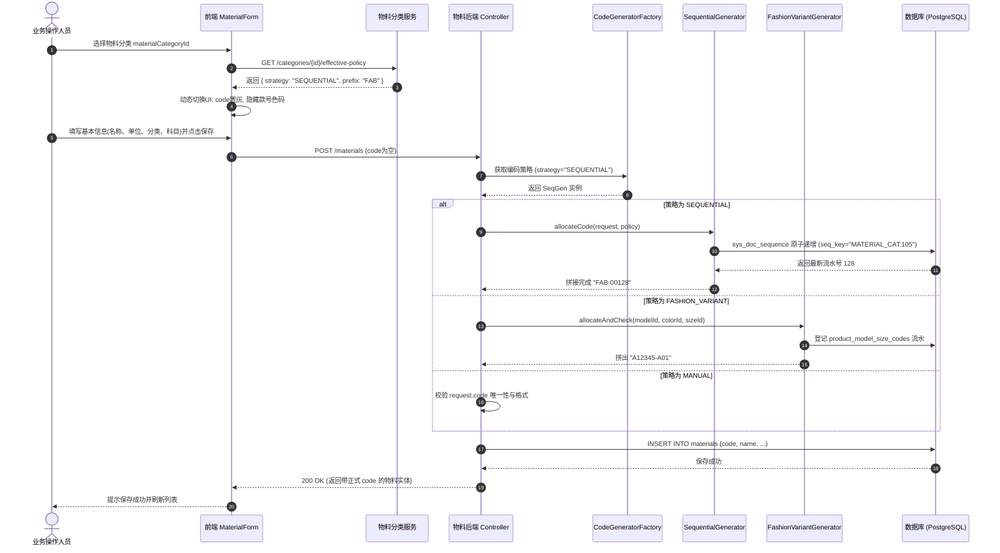

# 02. 编码策略体系与目标业务流程

---

## 1. 三大编码策略详细定义

```text
                               ┌─────────────────────────┐
                               │     物料编码策略体系     │
                               └────────────┬────────────┘
                ┌───────────────────────────┼───────────────────────────┐
                ▼                           ▼                           ▼
   ┌─────────────────────────┐ ┌─────────────────────────┐ ┌─────────────────────────┐
   │ 策略 1: FASHION_VARIANT  │ │   策略 2: SEQUENTIAL    │ │     策略 3: MANUAL      │
   │  (款色码变体矩阵策略)    │ │   (分类前缀序列流水号)  │ │   (外部手工/客户指定)   │
   ├─────────────────────────┤ ├─────────────────────────┤ ├─────────────────────────┤
   │ 适用：成衣、鞋靴、文胸   │ │ 适用：标品配件、原料、包│ │ 适用：OEM客供料、老系统 │
   │ 规则：款号+本款色+尺码号 │ │ 规则：前缀+年月+递增流水│ │ 规则：用户自由录入      │
   │ 例：A12345-A01          │ │ 例：FAB-2609-00042      │ │ 例：CUST-PO-99881       │
   │ 核心维度：款/色/码必填  │ │ 核心维度：维度字段隐藏/空│ │ 核心维度：手填+唯一性校验│
   └─────────────────────────┘ └─────────────────────────┘ └─────────────────────────┘
```

### 1.1 策略一：`FASHION_VARIANT`（款色码变体矩阵）
* **定位**：承接鞋服时尚行业核心业务（完全向下兼容 V1 设计）。
* **编码公式**：
  $$\text{区分颜色：} \text{code} = \text{model.code} + \text{"-"} + \text{colorLetter} + \text{sizeSku} \quad (\text{例：A12345-A01})$$
  $$\text{不区分色：} \text{code} = \text{model.code} + \text{"-"} + \text{sizeSku} \quad (\text{例：A12345-01})$$
* **数据约束**：
  - `productModelId`、`productSizeId` 必填；
  - 若款号维护了本款颜色（`distinguishColor == true`），`colorId` 必填且必须属于本款颜色池；
  - 尺码必须属于款号绑定的尺码组；
  - 尺码流水（01~99）由 `product_model_size_codes` 严格分配并落库；
  - **变体唯一性与排他性**：由流水表 `product_model_size_codes` 的物理部分唯一索引与策略服务 `assertVariantUnique` 双重保障，彻底解耦 `materials` 物理表上的硬性索引。
* **作业入口**：
  - **批量主入口**：`/mm/materials` 工具栏「组合生成（`VariantGenerateDrawer`）」；
  - **单笔补充入口**：`MaterialForm`（仅用于单件补码）。

---

### 1.2 策略二：`SEQUENTIAL`（分类前缀序列流水号）
* **定位**：适用于原材料（面料、辅料）、包材、备品备件以及非变体单一成品（如帆布包、水杯）。
* **编码公式**：
  $$\text{code} = \text{Prefix} + \text{Separator} + [\text{DateSegment}] + \text{Sequence}$$
  - **Prefix（前缀）**：优先取分类上配置的 `code_prefix`，未配置时取分类 `code`（如 `FAB`）；
  - **Separator（分隔符）**：默认 `-`；
  - **DateSegment（可选日期掩码）**：若分类配置了 `date_format` 则嵌入（如 `yyMM`），物料主数据默认推荐为空以保证号码跨期永不重置；
  - **Sequence（递增序列）**：支持指定补零位数 `seq_length`（默认 5 位，如 `00042`）。
* **数据约束与流水池隔离**：
  - 款号、颜色、尺码**不是编码的一部分**，表单默认隐藏或收折这些维度；
  - **流水物理隔离**：每个分类拥有专属的 `seq_key = 'MATERIAL_CAT:' + seqScopeCategoryId`，在 `sys_doc_sequence` 中独立递增，确保各分类号段相互隔离、互不挤占；
  - **共用父级流水（可选）**：当子分类配置 `is_seq_shared = true` 时，号池作用域 `seqScopeCategoryId` 自动锚定父级号池属主 ID，其默认前缀也统一继承号池属主的前缀/代码，实现多子分类共享同一大类号段且编码格式统一；
  - **高并发原子递增与断号权衡**：保存时若前端未传入 `code`，由后端的 `SequentialCodeGenerator` 基于 `sys_doc_sequence`（PostgreSQL `INSERT ON CONFLICT DO UPDATE RETURNING`）在独立事务中原子递增发号。该设计确保高并发下**绝对不会产生重复编码且锁持有时间极短**；若后续业务事务发生异常回滚，已领取的号码不回滚（工业 ERP 允许极罕见断号，严禁重号）。

---

### 1.3 策略三：`MANUAL`（外部手工录入 / 客户指定）
* **定位**：适用于 OEM 代工客户指定料号、带行业通用标准号（如国标代码、CAS 号）的原材料、以及历史系统迁移数据。
* **编码公式**：
  - 由操作人员在界面直接键入任意有效字符串。
* **数据约束**：
  - 后端执行 `NOT BLANK`、最大长度（$\le 50$）及租户内唯一性校验（`existsByCode`）；
  - 可选支持正规表达式掩码（Regex Pattern）格式校验；
  - **与变体硬约束解耦（OEM 赋能）**：允许不同客户指定料号挂载相同的款号或尺码（如 `NIKE-40` 与 `ADI-40` 挂同一版型），彻底摆脱 V1 物理唯一索引对代工定制的死锁限制。

---

## 2. 前端表单（MaterialForm）动态自适应行为矩阵

当用户在 `MaterialForm` 中切换 `materialCategoryId`（物料分类）时，前端通过分类继承算法实时解析出当前分类的有效策略，表单界面**瞬时自适应重构**：

| 表单区域 / 字段 | `FASHION_VARIANT`（变体策略） | `SEQUENTIAL`（自动序列策略） | `MANUAL`（手工策略） |
| :--- | :--- | :--- | :--- |
| **物料编码（`code`）** | 禁用直接输入，通过款式+色+码动态建议回填；带有 Alert 建议状态机。 | **只读/禁用输入**。<br/>显示占位符：「*保存时系统自动分配流水号*」。 | **必填输入框**。<br/>允许用户直接键盘输入。 |
| **产品款式（`productModelId`）** | **必填**。仅展示可售且自制的款号。 | **隐藏**（或作为可选属性收折）。 | **隐藏**（或作为可选属性收折）。 |
| **颜色选择（`colorId`）** | **必填（分色时）**。受款式颜色池约束。 | 渲染通用全局色卡选择（可选）。 | 渲染通用全局色卡选择（可选）。 |
| **尺码选择（`productSizeId`）** | **必填**。受款号绑定的尺码组约束。 | 渲染通用全局尺码选择（可选）。 | 渲染通用全局尺码选择（可选）。 |
| **批量生成向导入口** | 工具栏**激活「组合生成」**。 | 工具栏**禁用或隐藏**「组合生成」。 | 工具栏**禁用或隐藏**「组合生成」。 |

---

## 3. 全生命周期端到端业务时序

### 3.1 单笔新增/保存时序（含策略分流）



### 3.2 组合生成向导（VariantGenerateDrawer）前置与双重防呆

在鞋服矩阵生成场景中，用户通过「组合生成」向导批量生成 SKU。现网向导分为三步：1) 选择款号；2) 勾选颜色与尺码矩阵；3) 填写公共主数据（含分类、单位、科目等）。防呆机制需在前后端双向设防：

```text
打开「组合生成向导」
  │
  ├─ 步骤 1: 款号校验
  │    ├─ 款号是否已选？──(否)──► 拦截：「请先选择款号」
  │    └─ 款号是否绑定尺码组？──(否)──► 拦截：「请先为该款号维护尺码组」
  │
  ├─ 步骤 2: 矩阵勾选
  │    └─ 仅允许勾选状态为 NEW 的合法格子 (1~200 个)
  │
  └─ 步骤 3: 目标分类选择与保存 (前后端双重门禁)
       │
       ├─► 前端门禁: 监听 values.materialCategoryId，自动校验策略。
       │     若策略 != FASHION_VARIANT ──► 红色提示：「该分类非变体编码策略，不能用于变体批量生成」，禁用提交按钮。
       │
       └─► 后端门禁 (API 强拦截):
             POST /api/mm/materials/variant-generate 接口收到请求后，
             立即解析 common.materialCategoryId 的有效策略。
             若 policy.getStrategy() != FASHION_VARIANT:
             直接抛出 400 业务异常 (validation.material.variant.generate.notFashionVariantCategory)，拒绝执行生成。
```

---

## 4. 物料全生命周期行为规格（Lifecycle Operations）

除了单笔新增与批量生成外，物料主档在修改、复制、导入等操作中必须遵循严格的策略自适应规则：

### 4.1 修改物料（UPDATE / PUT）
1. **物料编码（`code`）不可变性与免发号保证**：
   - 物料主档一旦持久化落库，其 `code` 成为库存、BOM、采购及财务凭证的核心业务主键引用，**永久只读，严禁修改**；
   - 后端在 `updateMaterial` 中校验：若 `StringUtils.hasText(request.getCode())` 且 `!request.getCode().equals(entity.getCode())`，抛出不可修改校验异常（`validation.material.code.immutable`）；
   - 若入参 `request.getCode()` 为空或未传（如前端只读字段未序列化提交），后端自动沿用 `entity.getCode()`，**严禁在修改流程中触发发号器分配流水**，避免号码浪费与断号。
2. **分类变更约束（Category Switch）**：
   - 若用户修改物料分类，系统重新解析目标分类的有效策略：
     - 若新旧策略一致（如 `SEQUENTIAL` -> `SEQUENTIAL`）：允许修改分类，但**不重新生成已分配的物料编码**，避免单据断链；
     - 若从非变体策略变更为 `FASHION_VARIANT`：必须校验其是否已补齐款号、颜色、尺码等全部必填维度；
     - 若试图跨策略变更导致原有模型失真：前端弹窗提示风险，建议用户将旧物料标记为停用，并在新分类下重新建档。
3. **变体三维锁定（V1 规则继承）**：
   - 具有完整款号与尺码的物料，保存后禁止修改 `productModelId`, `colorId`, `productSizeId`（抛出 `validation.material.variant.dimension.immutable`）；
   - 在 `FASHION_VARIANT` 策略下校验时，将 `existing` 实体传入校验服务，确保排除当前实体自身，避免更新自身时误报变体冲突。

### 4.2 复制物料（handleCopy）
现网列表页提供「复制」功能（`handleCopy`），在 V2 架构下的自适应行为如下：
1. **`SEQUENTIAL` 策略**：
   - 复制时自动将 `id`、`code` 清空并传给新增抽屉；
   - 表单中 `code` 保持只读灰显，提示「保存时系统自动分配流水号」，点击保存时生成全新的递增序列号。
2. **`FASHION_VARIANT` 策略**：
   - 复制时清空 `code`，但保留款号、分类等基础字段；
   - 用户必须更改颜色（`colorId`）或尺码（`productSizeId`），表单根据新变体重新触发变体建议状态机；
   - 若用户未修改颜色或尺码直接保存，将被 `assertVariantUnique` 业务查重拦截。
3. **`MANUAL` 策略**：
   - 复制时清空 `code`，输入框高亮开放，等待用户录入全新料号。

### 4.3 Excel 批量导入与 OpenAPI 接口
1. **统一路由**：批量导入程序与外部集成接口必须统一调用 `MaterialCodeGeneratorFactory`，不得绕过策略直插数据库。
2. **`SEQUENTIAL` 导入**：
   - Excel 模板中允许 `code` 列为空；
   - 导入服务遍历保存时，若该行所属分类为 `SEQUENTIAL` 且 `code` 为空，后端自动原子递增分配编码并回填落库；
   - 若 Excel 显式提供了 `code`，则原样校验防重并存入（支持手工补录）。
3. **`FASHION_VARIANT` 导入**：
   - 要求款号、颜色、尺码非空且合法，由变体服务自动核验编码公式并占位流水。
4. **`MANUAL` 导入**：
   - `code` 列必填，为空则整行报错。

### 4.4 分类删除与停用
1. **物理删除限制**：分类已被任何物料引用时，受数据库外键 `fk_materials_category` 保护，绝对禁止物理删除；
2. **停用（Status Option）**：分类停用后，新建物料的下拉树中禁用该节点；已有关联物料不受影响；
3. **流水计数器留存**：即使分类停用，`sys_doc_sequence` 中对应的 `seq_key` 记录永久保留，绝不清零或物理删除。

---

## 5. 物料类型（MaterialType）与分类策略（CodingStrategy）的协同

| 控制维度 | 物料类型 (`material_types`) | 物料分类 (`material_categories`) |
| :--- | :--- | :--- |
| **关注核心** | 财务评估、总账科目、进销存单据流 | 物理品类、产品形态、编码规则 |
| **典型字段** | `is_sold`, `is_manufactured`, `is_inventoried` | `code_strategy`, `code_prefix`, `seq_length` |
| **表单显隐控制** | 决定是否触发标准成本核算、是否加载评估类下拉 | **唯一决定** `code` 只读态、款号/色/码的显隐与必填 |
| **冲突兜底原则** | 若分类策略为 `FASHION_VARIANT`，但物料类型不是自制成品：前端在表单顶部给出提示警示，后端以分类策略为准执行款色码完整性校验。 |
