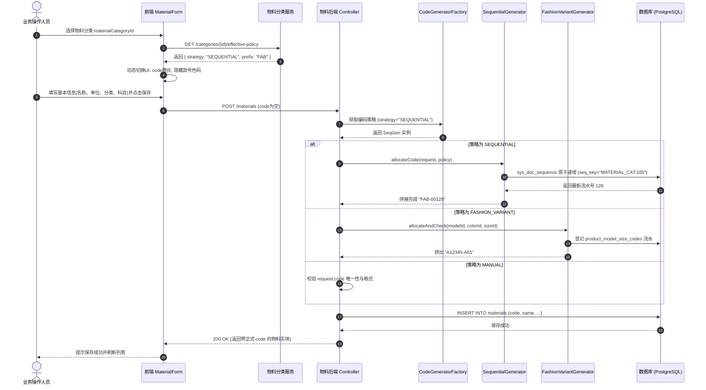

# 02. 编码策略体系与目标业务流程

---

## 1. 三大编码策略详细定义

```text
                               ┌─────────────────────────┐
                               │     物料编码策略体系     │
                               └────────────┬────────────┘
                ┌───────────────────────────┼───────────────────────────┐
                ▼                           ▼                           ▼
   ┌─────────────────────────┐ ┌─────────────────────────┐ ┌─────────────────────────┐
   │ 策略 1: FASHION_VARIANT  │ │   策略 2: SEQUENTIAL    │ │     策略 3: MANUAL      │
   │  (款色码变体矩阵策略)    │ │   (分类前缀序列流水号)  │ │   (外部手工/客户指定)   │
   ├─────────────────────────┤ ├─────────────────────────┤ ├─────────────────────────┤
   │ 适用：成衣、鞋靴、文胸   │ │ 适用：标品配件、原料、包│ │ 适用：OEM客供料、老系统 │
   │ 规则：款号+本款色+尺码号 │ │ 规则：前缀+年月+递增流水│ │ 规则：用户自由录入      │
   │ 例：A12345-A01          │ │ 例：FAB-2609-00042      │ │ 例：CUST-PO-99881       │
   │ 核心维度：款/色/码必填  │ │ 核心维度：维度字段隐藏/空│ │ 核心维度：手填+唯一性校验│
   └─────────────────────────┘ └─────────────────────────┘ └─────────────────────────┘
```

### 1.1 策略一：`FASHION_VARIANT`（款色码变体矩阵）
* **定位**：承接鞋服时尚行业核心业务（完全向下兼容 V1 设计）。
* **编码公式**：
  $$\text{区分颜色：} \text{code} = \text{model.code} + \text{"-"} + \text{colorLetter} + \text{sizeSku} \quad (\text{例：A12345-A01})$$
  $$\text{不区分色：} \text{code} = \text{model.code} + \text{"-"} + \text{sizeSku} \quad (\text{例：A12345-01})$$
* **数据约束**：
  - `productModelId`、`productSizeId` 必填；
  - 若款号维护了本款颜色（`distinguishColor == true`），`colorId` 必填且必须属于本款颜色池；
  - 尺码必须属于款号绑定的尺码组；
  - 尺码流水（01~99）由 `product_model_size_codes` 严格分配并落库；
  - **变体唯一性与排他性**：由流水表 `product_model_size_codes` 的物理部分唯一索引与策略服务 `assertVariantUnique` 双重保障，彻底解耦 `materials` 物理表上的硬性索引。
* **作业入口**：
  - **批量主入口**：`/mm/materials` 工具栏「组合生成（`VariantGenerateDrawer`）」；
  - **单笔补充入口**：`MaterialForm`（仅用于单件补码）。

---

### 1.2 策略二：`SEQUENTIAL`（分类前缀序列流水号）
* **定位**：适用于原材料（面料、辅料）、包材、备品备件以及非变体单一成品（如帆布包、水杯）。
* **编码公式**：
  $$\text{code} = \text{Prefix} + \text{Separator} + [\text{DateSegment}] + \text{Sequence}$$
  - **Prefix（前缀）**：优先取分类上配置的 `code_prefix`，未配置时取分类 `code`（如 `FAB`）；
  - **Separator（分隔符）**：默认 `-`；
  - **DateSegment（可选日期掩码）**：若分类配置了 `date_format` 则嵌入（如 `yyMM`），物料主数据默认推荐为空以保证号码跨期永不重置；
  - **Sequence（递增序列）**：支持指定补零位数 `seq_length`（默认 5 位，如 `00042`）。
* **数据约束与流水池隔离**：
  - 款号、颜色、尺码**不是编码的一部分**，表单默认隐藏或收折这些维度；
  - **流水物理隔离**：每个分类拥有专属的 `seq_key = 'MATERIAL_CAT:' + categoryId`，在 `sys_doc_sequence` 中独立递增，确保各分类号码绝对连续、不跳号、不互相挤占；
  - **共用父级流水（可选）**：当子分类配置 `is_seq_shared = true` 时，自动锚定父分类流水池，实现多子分类共享同一大类号段；
  - 保存时若前端未传入 `code`，由后端的 `SequentialCodeGenerator` 在持久化事务中原子递增分配，确保 100% 连续且并发安全。

---

### 1.3 策略三：`MANUAL`（外部手工录入 / 客户指定）
* **定位**：适用于 OEM 代工客户指定料号、带行业通用标准号（如国标代码、CAS 号）的原材料、以及历史系统迁移数据。
* **编码公式**：
  - 由操作人员在界面直接键入任意有效字符串。
* **数据约束**：
  - 后端执行 `NOT BLANK`、最大长度（$\le 50$）及租户内唯一性校验（`existsByCode`）；
  - 可选支持正规表达式掩码（Regex Pattern）格式校验；
  - **与变体硬约束解耦（OEM 赋能）**：允许不同客户指定料号挂载相同的款号或尺码（如 `NIKE-40` 与 `ADI-40` 挂同一版型），彻底摆脱 V1 物理唯一索引对代工定制的死锁限制。

---

## 2. 前端表单（MaterialForm）动态自适应行为矩阵

当用户在 `MaterialForm` 中切换 `materialCategoryId`（物料分类）时，前端通过分类继承算法实时解析出当前分类的有效策略，表单界面**瞬时自适应重构**：

| 表单区域 / 字段 | `FASHION_VARIANT`（变体策略） | `SEQUENTIAL`（自动序列策略） | `MANUAL`（手工策略） |
| :--- | :--- | :--- | :--- |
| **物料编码（`code`）** | 禁用直接输入，通过款式+色+码动态建议回填；带有 Alert 建议状态机。 | **只读/禁用输入**。<br/>显示占位符：「*保存时系统自动分配流水号*」。 | **必填输入框**。<br/>允许用户直接键盘输入。 |
| **产品款式（`productModelId`）** | **必填**。仅展示可售且自制的款号。 | **隐藏**（或作为可选属性收折）。 | **隐藏**（或作为可选属性收折）。 |
| **颜色选择（`colorId`）** | **必填（分色时）**。受款式颜色池约束。 | 渲染通用全局色卡选择（可选）。 | 渲染通用全局色卡选择（可选）。 |
| **尺码选择（`productSizeId`）** | **必填**。受款号绑定的尺码组约束。 | 渲染通用全局尺码选择（可选）。 | 渲染通用全局尺码选择（可选）。 |
| **批量生成向导入口** | 工具栏**激活「组合生成」**。 | 工具栏**禁用或隐藏**「组合生成」。 | 工具栏**禁用或隐藏**「组合生成」。 |

---

## 3. 全生命周期端到端业务时序

### 3.1 单笔新增/保存时序（含策略分流）



### 3.2 组合生成向导（VariantGenerateDrawer）业务前置防呆

```text
打开「组合生成向导」
  │
  ├─ 检查 1: 款号是否已选？──(否)──► 拦截：「请先选择款号」
  ├─ 检查 2: 款号是否已绑定尺码组？──(否)──► 拦截：「请先为该款号维护尺码组」
  └─ 检查 3: 目标物料分类策略是否为 FASHION_VARIANT？
        │
        ├─► [是] 正常进入矩阵勾选（色 × 码笛卡尔积）
        └─► [否] 明确弹窗提示：「当前物料分类采用非变体编码策略（流水/手工），无需使用矩阵生成，请直接走单笔新增」。
```
