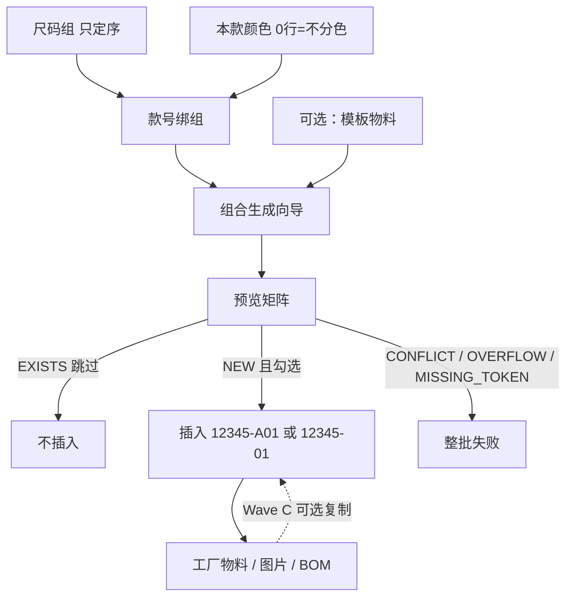

# 02. 目标流程：变体生成（To-Be）

> 原则：SKU 仍是 `materials`。区分色时写齐款+色+码；不分色时款+码、`color_id` 为空。原料保持单笔 CRUD。

---

## 1. 目标作业链

```text
维护色卡 / 尺码主数据（名称与排序，不进 SKU）
        │
维护尺码组（只定：本组有哪些码、从小到大 sequence）
维护款号：绑尺码组
        ├─ 区分颜色：维护本款颜色（A/B/C…）
        └─ 不区分颜色：本款颜色 0 行，SKU 无字母
        │
打开「组合生成」
        │ 区分色：本款色 × 组内码；不分色：只勾组内码
        ▼
预览：NEW / EXISTS / CONFLICT / OVERFLOW / MISSING_TOKEN
        │
INSERT  code = 12345-A01  或  12345-01
流水按「该款+该色」已落库 + 存量未占号 + 本次勾选；已占用号不重排
存量不改 materials.code
```



与现网对照：

```text
现网：新建或复制 × N
To-Be：预览笛卡尔积 → 剔除格 → 一次生成
单笔新建 / 编辑 / 复制：保留，给原料和补一格用
```

---

## 2. 作业

### 2.1 Wave A 前置：组、色号、流水

生成器不能从全域字典直接拼码。先维护：

1. **尺码组**：组内 `product_size_id` + `sequence`（建议 10,20,30）。**组上不存 SKU 流水。** `sequence` 无库唯一；排序 `sequence, product_size_id`。作用：限制可选码、决定「谁比谁小」。
2. **款号**绑定一个尺码组（生成必填）。已有成品尺码必须 ⊆ 该组，否则拒绑。已有完整变体后禁止换组。
3. **本款颜色**
   - **≥1 行**：区分颜色。每行 `color_id` + `sku_code`（`A`–`Z`）+ `sequence`。SKU 含该字母。
   - **0 行**：不区分颜色。SKU **无字母**；生成格子 `color_id` 为空。
4. **款×色尺码流水**（`product_model_size_codes`）：`(款号, 颜色可空, 尺码) → 01–99`。生成 / 单笔保存按 §3.1 分配并落库。行一旦写入不改号、不删（物料删除也不释放）。

新增本款色：默认下一个空闲字母。色模式锁定见 §3.7（看完整变体物料，不是「该款有任意物料」）。向导若本款 0 色，须提示将按不分色生成，生成后不能再改为分色。

均码：组内一档即可，流水 `01`。不要用空尺码。不分色不必建 `FREE` 色卡。

建议该色（或不分色时该款）**首次生成把会用到的尺码一次勾齐**，这样最小码就是 `01`。事后插入更小码：新码拿下一个空闲号，**不**把已占用的 `01` 改给新最小码。

### 2.2 Wave A：组合生成（物料页）

入口：`/mm/materials` 工具栏「组合生成」。款号未绑组 → 拦截。

1. 选款号。可选模板物料（带公共属性，不带编码/色/码）。
2. **区分色**：多选本款色 × 组内码。**不分色**：只多选组内码，无色行。
3. 预览。每格建议编码见 §3.1。EXISTS 禁用。剔除不生产的格。
4. 确认公共属性。只提交 NEW。
5. 成功后按该款刷新列表。

### 2.3 单笔表单（Wave A 一并改）

能解析到公式所需 token 时，建议编码与生成器相同。**不再** `分类.code + 款号.code`。

- 区分色：要有本款字母，且该款+该色+该码已有或可分配流水。
- 不分色：`color_id` 应空；只要该款+该码流水。
- 缺 token：不自动填。原料手填。

dirty / 复制 / 名称规则同前。

单笔保存（`POST/PUT /materials`，含复制）：与生成器**同一套**校验与流水分配，禁止绕过。已绑组则尺码必须在组内。本款 ≥1 色则 `color_id` 必须在本款；本款 0 色则成品 `color_id` 必须空。能分配则手建也写流水表。原料三维度仍可空。

**UPDATE 变体三键**：实体已是完整变体（款+码均非空）时，`productModelId` / `colorId` / `productSizeId` 必须与库中一致，否则 `validation.material.variant.dimension.immutable`。有款无码仍可补齐（须过组内/本款色校验）。前端对完整变体三字段只读。新建 / 复制不受此锁。

### 2.4 Wave B：报表与复用

组内 `sequence` 改为 FO/SO 打印列序的权威（有组时）。`product_sizes.sequence` 仅无组时兜底。跨款同单：各行用所属款的组序；列并集按组 `sequence`，同分再按 `product_size_id`，不把不同尺码组强行对齐成一套档位。

从它款复制本款颜色：`POST /product-models/{id}/colors/copy-from/{sourceModelId}`，只插尚无的 `color_id`，**字母按目标款空闲位重分配**（不照抄源款 A/B，避免两款字母含义不同却撞车）。允许目标手改字母后再生成。

### 2.5 Wave C：生成后从属数据

生成请求上三个独立开关，默认 **关**：

| 开关 | 行为 |
|------|------|
| 复制工厂物料 | 按模板物料的 `material_factories` 逐厂插入（同厂+新 SKU） |
| 复制图片 | 仅当存在「同款同色」的模板图时复制到新 SKU；否则跳过该格图片 |
| 复制 BOM | 复制模板物料当前有效 BOM 头行到新 SKU（版本号沿用）。尺码耗用不同时不要开 |

任一从属写入失败 → 整批回滚（与 SKU 同一事务）。

---

## 3. 规则

### 3.1 编码

两层 code，禁止混用：

| 层 | 字段 | 用途 |
|----|------|------|
| 租户色卡 / 尺码 | `colors.code` / `product_sizes.code` | 主数据识别与排序 |
| SKU | `materials.code` | 单据、条码 |

```text
SEP = "-"

区分颜色（本款颜色 ≥1 行）：
  code = productModel.code + SEP + colorSku + sizeSku
  例 12345-A01

不区分颜色（本款颜色 0 行）：
  code = productModel.code + SEP + sizeSku
  例 12345-01
```

色号与尺码流水之间**不再**加分隔符（`-A01` 不是 `-A-01`）。

硬规则：

- `SEP` 锁定 `-`。款号 `code` 不要含 `-`（系统认 FK，不靠拆码）。
- `colorSku` ∈ `A`–`Z`，来自 `product_model_colors.sku_code`。不分色则整段省略。
- `sizeSku` ∈ `01`–`99`，来自 `product_model_size_codes`，作用域 **`(款号, color_id)`**；不分色 `color_id` 为空。
- **分配**（作用域 = 款 + `color_id`，不分色 `color_id` 为空）：
  1. 已落库流水保持不变。
  2. **存量占用**：该作用域已有物料、尚无流水行的尺码（不论本次是否勾选），按组 `sequence ASC, product_size_id ASC` 接在 `max` 之后占号。只写流水表，**不改**存量 `materials.code`。组外尺码不得出现（绑组已拒；若仍出现 → 整批失败）。
  3. 本次勾选中仍无流水的尺码：再接 `max+1`。作用域全空则从 `01`。
  预览只计算；生成 / 单笔把 2+3 的新行 INSERT。已有行不改。
- **不是** `product_sizes.code`，**不是**组内固定档位。同组另一款的 40 可以是另一套 01。
- varchar(50)。区分色 `len(款号)+4>50` → OVERFLOW；不分色 `+3>50`。
- 不加分类前缀；V1 无自定义公式。
- EXISTS / CODE_CONFLICT 同前。区分色缺本款字母 → MISSING_TOKEN。流水在同一生成事务内落库；预览给出拟分配号。
- 存量 `materials.code` 已是 `款号-` + 可选字母 + 两位数字、且与拟分配号相同但不是同一变体 → `CODE_CONFLICT`。不自动改存量编码。上线前核对该款是否已有这类「长得像新公式」的手工号。
- 人工核对：末 2 位=流水；其前一位若为 `A–Z` 则为区分色。

一款最多 26 色；一款一色最多 99 档。

### 3.2 名称

```text
name = join(" ", nonBlank(model.name ?? model.code,
                          color?.name,
                          size.name ?? size.code))
```

不分色跳过颜色段。超 200 截断。

### 3.3 变体唯一

```text
区分色： (tenant, model, color, size) WHERE 三者 NOT NULL
不分色： (tenant, model, size)        WHERE model、size NOT NULL AND color IS NULL
```

原料不进索引。手建 / 复制 / 生成同一套校验（含组内尺码、本款色、色模式、流水占用）。两条部分唯一索引**不**拦「同款有色+无色混用」，色模式由 §3.7 拦。

### 3.4 生成准入

- `productModelId` 必填且已绑尺码组。
- **区分色**：`colorIds` 非空且 ⊆ 本款；格上 `colorId` 必填。
- **不分色**：`colorIds` 必须空；格上 `colorId` 必须空。
- `productSizeIds` ⊆ 该组且非空。
- `common` 同现网必填。勾选 NEW 1～200。


### 3.5 事务与并发

- 预览只读，不写库。
- 生成单事务：全部插入成功或全部回滚（含流水行、SKU）。
- `EXISTS` 不插入物料；缺流水行则仍写入占用号。
- 选中格被人抢先插入，或流水表部分唯一冲突 → 整批失败，提示重预览。
- 禁止前端循环 `POST /materials` 冒充生成器。

### 3.6 不改的行为

- 删除物料、BOM 引用拦截、工厂物料页、图片管理页：现网不变。删除物料**不**删除 `product_model_size_codes`。
- 停用色/码/款号：生成器仍可引用（与现网单笔一致）。若要禁停用项，另开主数据状态专题。
- 已有 SKU 的编码不因规则上线而重算，也不做一次性按旧 code 刷流水。占用在该作用域首次分配时懒落库。

### 3.7 色模式锁定

完整变体 = `product_model_id` 与 `product_size_id` 均非空。

| 该款已有 | 禁止 |
|----------|------|
| 带 `color_id` 的完整变体 | 本款颜色清到 0 行；再保存 `color_id` 为空的成品 |
| `color_id` 为空的完整变体 | 新增本款颜色；再保存带 `color_id` 的成品 |
| 尚无完整变体 | 0 行 / ≥1 行可切换 |

仅挂款号、尺码为空的行不触发锁定。

---

## 4. API

权限前缀与现网物料相同。预览 `read`，生成 `create`。

| 方法 | 路径 | 权限 | 波次 |
|------|------|------|------|
| POST | `/api/v1/mm/materials/variant-preview` | read | A |
| POST | `/api/v1/mm/materials/variant-generate` | create | A |
| CRUD | `/api/v1/mm/product-size-groups`（含组内 items） | `/mm/product-size-groups:*` | A |
| GET/PUT | `/api/v1/mm/product-models/{id}/colors` | read / update | A |
| POST | `/api/v1/mm/product-models/{id}/colors/copy-from/{sourceModelId}` | update | B |

现网 `POST /api/v1/mm/materials` **保留**。生成与单笔走同一套校验 + 唯一键 + 流水分配，不另写一套 Entity。

### 4.1 预览请求 / 响应

```text
request:
  productModelId: long
  colorIds: long[]          // 区分色必填；不分色必须 []
  productSizeIds: long[]

response:
  distinguishColor: boolean
  sizeColumns: [{ id, code, name, sequence }]
  colorRows:   [{ id, code, name, sequence, skuCode }]  // 不分色为空数组
  cells: [{
    colorId,                 // 不分色为 null
    productSizeId,
    sizeSkuCode,             // 拟分配或已占用的 01–99
    status: NEW | EXISTS | CODE_CONFLICT | OVERFLOW | MISSING_TOKEN,
    proposedCode, proposedName,
    existingMaterialId, existingCode
  }]

```

预览**不算**公共属性。OVERFLOW / CONFLICT 仍返回 200，由格子状态表达。

### 4.2 生成请求 / 响应

```text
request:
  productModelId: long
  cells: [{ colorId, productSizeId }]     // 不分色 colorId 省略或 null
  common: MaterialRequest 去掉 code/name/productModelId/colorId/productSizeId
  copyFactoryAssignments?: boolean        // Wave C，默认 false
  copyImages?: boolean
  copyBom?: boolean
  templateMaterialId?: long               // Wave C 复制源；Wave A 也可只用来给前端带 common

response:
  created: MaterialResponse[]             // 插入顺序：颜色序 × 尺码序
  skippedExisting: int
```

选中格出现 `CODE_CONFLICT` / `OVERFLOW` / `MISSING_TOKEN` / 越权 → **400**，body 带格子列表，不部分插入。

`common` 必须完整，不在服务端偷偷用 `templateMaterialId` 补字段（避免前后端各算一套）。模板只是前端预填。

---

## 5. 前端

### 5.1 向导（物料页）

独立抽屉，不要塞进 `MaterialForm`。

步骤：款号与模板（须已绑组）→ 勾色/码（不分色无色步）→ 预览 → 公共属性 → 提交。

- 区分色：列标尺码名，行标 `A 黑色`；格上预览 `12345-A01`。
- 不分色：选款后提示将按不分色生成；单行矩阵，格上 `12345-01`。
- EXISTS 灰显。勾选格不得含 CONFLICT / OVERFLOW / MISSING_TOKEN。CONFLICT 时提示：存量编码可能已占用拟分配号，不自动改旧码。

### 5.2 单笔表单

§2.3。完整变体编辑时款/色/码只读。QuickCreate 仍建租户色卡/尺码。

### 5.3 Wave A 主数据页

- 尺码组：头 + 组内行（显示名、`sequence`，可拖拽；**无 sku_code 列**）。
- 款号：`sizeGroupId`（存量尺码须 ⊆ 组）；本款颜色（0 行=不分色；有行则字母 A–Z）。
- 菜单：「尺码组」。

---

## 6. 模块边界

| 动作 | 模块 |
|------|------|
| 预览 / 生成 / 变体唯一 / 单笔编码建议 | `lychee-erp-mm` + `MaterialService` |
| 尺码组、款色字母、款×色流水 | `lychee-erp-mm`；实体放 `lychee-erp-basis` |
| FO/SO 打印列序 | Wave B 改用组内 sequence；A 不改打印 |
| BOM 复制 | Wave C |
| 菜单 | A 增加「尺码组」 |

---

## 7. 本专题不做

- 把 `product_models` 并进 `materials` / 给物料加 `parent_id`
- 拼接 `colors.code` / `product_sizes.code` 进 SKU
- 用 `PrefixedCode` 给 SKU 编号；用户可配编码公式
- 扩 `materials.code` 长度；分类 code 当前缀
- 按勾选顺序现算 A/01 却不写入 token 表
- 生成器在区分色时允许色为空、或在不分色时仍要求色
- 尺码流水挂在尺码组上（同组 40=06）
- 无分隔符拼接；可配分隔符引擎
- Excel 矩阵导入（导入中心另案）
- 生成后自动改已有 SKU 的编码
- 两位以上色号、三位尺码流水（超 26 色 / 99 档另开）
- Wave A 复制图片 / 工厂物料 / BOM
- 可配置物料（KMAT）；二维护码独立维度（继续一个 `product_sizes` 如 `30x32`）
