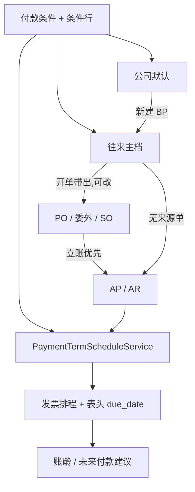

# 02. 目标流程：付款条件主档与发票排程（To-Be）

> 原则：用户选 **付款条件**，不填天数、不解析名称。规则在主档条件行上；发票按基准日展开 **付款排程** 后冻结。  
> 缺条件或条件无有效行 → **拒绝开单/立账**，禁止静默 30 天。

系统未上线：**一次交付**完整模型（主档 + 条件行 + 发票排程 + FK 替换 + 下线 `PAYMENT_TERM` 选项）。

---

## 1. 概念分层

```text
付款条件 fi_payment_terms          身份：NET30 / EOM30 / PAY25 / COD / 2-10-NET30
    └── 条件行 fi_payment_term_lines   算法 + 金额占比 + 可选现金折扣
往来 / 公司默认
    └── business_partners.payment_term_id
    └── companies.default_payment_term_id   （仅新建 BP 带出）
业务单（只存条件，不算到期日）
    └── PO / 委外 / SO.payment_term_id
发票（计算并冻结）
    ├── header.payment_term_id + base_date + due_date
    └── ap/ar_invoice_schedules              每条条件行一笔到期
收付（现网对发票；列预留对排程）
    └── payment_lines.ap_invoice_schedule_id / ar_invoice_schedule_id
            可空；本波核销 UI 仍可对发票头
```

与税码专题的关系：税在 **行**、付款条件在 **头**。两者都从 `option_values` 毕业，但不要合成一张「财务选项」表。

| 维度 | 表 | 回答什么 |
|------|-----|----------|
| 税码 | `tax_codes` | 这行货怎么计税、进哪一个税目 |
| 付款条件 | `fi_payment_terms` | 这张票何时到期、是否分期、提前付是否折扣 |



---

## 2. 目标单据链

```text
维护：付款条件（头+行）→ 公司默认（可选）→ 往来条件
         │
         ▼
开 PO / 委外 / SO（DRAFT）
         │  从往来带出 payment_term_id；用户可改；保存必填
         ▼
审核后下游复制条件 ID，不再改算法
         │
    PO / 委外 ──► GR ──► AP：解析基准日，展开排程，派生 due_date
    SO      ──► 发货 ──► AR：同上
    手工发票：必选条件；基准日默认发票日；改条件/基准日/含税合计 → 重建 DRAFT 排程
```

采购工作台转 PO：每张 PO 写入供应商 BP 的条件；BP 未维护 → **整批失败**（与无供应商同级）。

---

## 3. 条件行算法

### 3.1 表头字段（规则身份，不参与加减日期）

| 字段 | 说明 |
|------|------|
| `code` / `name` | 显示与唯一键；**禁止**用名称计算 |
| `base_date_type` | `INVOICE_DATE` / `SOURCE_DATE` |
| `partner_scope` | `BOTH` / `CUSTOMER` / `SUPPLIER`（下拉过滤） |
| `is_active` | 停用后新单不可选；已有单据与排程保留 |

### 3.2 条件行字段

| 字段 | 说明 |
|------|------|
| `line_no` | 排序 |
| `percent` | 占发票 **含税合计** 的百分比；同行必须加总 100.00 |
| `calc_method` | `NET_DAYS` / `EOM_PLUS_DAYS` / `FIXED_DAY` / `IMMEDIATE` |
| `days` | `NET_DAYS`、`EOM_PLUS_DAYS` 使用；其余忽略，存 0 |
| `extra_months` | 先按日历月平移基准日，再套算法；`IMMEDIATE` 忽略 |
| `fixed_day` | `FIXED_DAY` 使用，1–31 |
| `discount_percent` | 现金折扣 %；0 = 无折扣 |
| `discount_days` | 自 **基准日** 起几天内付款可享受折扣（不是自到期日倒算） |

一行 = 一笔到期（可带一个折扣窗）。`2/10 Net 30` 是 **一行**：净额 30 天 + 折扣 10 天 2%。不要把折扣拆成第二行（第二行会再占金额百分比）。

### 3.3 基准日

立账时写入发票 `base_date`，之后 DRAFT 重建排程都用这个日期，避免每次重读 GR。

| `base_date_type` | 自动立账 | 手工发票 |
|------------------|----------|----------|
| `INVOICE_DATE` | `invoice_date` | `invoice_date` |
| `SOURCE_DATE` | AP：所选收货日的最早一天；AR：发货日；多来源合并取最早 | 等于 `invoice_date`（无来源） |

**不做 `POSTING_DATE`。** 过账日在 DRAFT 尚不存在，过账后再重算会改到期日，账龄抖动。

DRAFT 改 `invoice_date`：

- `INVOICE_DATE` → `base_date = invoice_date`，重建排程（未手改到期的行）。
- `SOURCE_DATE` → `base_date` 不变，除非用户改 `base_date`。

已过账 / 非 DRAFT：禁止改条件、基准日、排程。

### 3.4 到期日函数

统一先做月平移：

```text
anchor = base_date.plusMonths(extra_months)     // IMMEDIATE 跳过，直接 = base_date
```

| `calc_method` | 公式 |
|---------------|------|
| `IMMEDIATE` | `base_date` |
| `NET_DAYS` | `anchor.plusDays(days)` |
| `EOM_PLUS_DAYS` | `endOfMonth(anchor).plusDays(days)` |
| `FIXED_DAY` | 见下 |

`FIXED_DAY`：

```text
day = min(fixed_day, lastDayOfMonth(anchor))
candidate = date(anchor.year, anchor.month, day)
if candidate < base_date:          // 已过本月该日，滚到下一月
    next = anchor.plusMonths(1)
    day = min(fixed_day, lastDayOfMonth(next))
    candidate = date(next.year, next.month, day)
return candidate
```

2 月 `fixed_day = 31` → 当月最后一天。用 `java.time`，禁止手写闰年。

现金折扣截止：

```text
discount_until = discount_percent > 0 ? base_date.plusDays(discount_days) : null
```

与净额算法无关。`discount_percent > 0` 时 `discount_days >= 0` 必填。

### 3.5 算例（实现单测必须覆盖）

基准日均为 `2026-08-15`，发票含税 `1,000.00`，除非另注。

| 条件 | 行 | 到期日 | 金额 | 折扣 |
|------|----|--------|------|------|
| `NET30`：NET_DAYS 30，100% | 1 | 2026-09-14 | 1000.00 | 无 |
| `EOM30`：EOM_PLUS_DAYS 30 | 1 | 2026-09-30 | 1000.00 | 无 |
| `EOM0`：EOM_PLUS_DAYS 0 | 1 | 2026-08-31 | 1000.00 | 无 |
| `NEXT-EOM`：EOM_PLUS_DAYS 0，`extra_months=1` | 1 | 2026-09-30 | 1000.00 | 无 |
| `PAY25`：FIXED_DAY 25，`extra_months=1` | 1 | 2026-09-25 | 1000.00 | 无 |
| `PAY25-0`：FIXED_DAY 25，`extra_months=0`，基准 2026-08-26 | 1 | 2026-09-25 | — | 已过 25 号则滚月 |
| `COD`：IMMEDIATE | 1 | 2026-08-15 | 1000.00 | 无 |
| `2-10-N30`：NET_DAYS 30 + 折扣 2%/10 天 | 1 | 2026-09-14 | 1000.00 | until 2026-08-25 |
| `30-70`：NET 30 @30% + NET 60 @70% | 1 / 2 | 09-14 / 10-14 | 300.00 / 700.00 | 无 |

月末：`EOM_PLUS_DAYS`，基准 `2026-01-31`，`extra_months=1` → `endOfMonth(2026-02-28)=2026-02-28`（不要变成 3 月 3 日）。`plusMonths` 后取当月最后一天。

### 3.6 排程金额

支付基数 = 发票 `total_amount`（含税）。与税码专题锁定的未税单价不冲突：税在行上算完，付款按票面合计。

```text
for i in 0 .. n-2:
    amount[i] = round(total * percent[i] / 100, 2, HALF_UP)
amount[last] = total - sum(amount[0..n-2])
```

`percent` 合计必须精确等于 `100.00`（`BigDecimal.compareTo`）。禁止 double。  
FOC 整张票合计为 0：仍生成排程，金额全 0；到期日照算（账龄无余额）。

### 3.7 表头 `due_date`

```text
header.due_date = MAX(schedule.due_date)
```

账龄列表、现有 `idx_*_due_date` 继续用表头。多期时「最晚一笔」代表整张票清完的日子；明细账龄按排程行。

禁止只改表头 `due_date` 而排程不动。UI 不提供独立的表头到期日编辑。

---

## 4. 何时带出 / 何时计算 / 何时禁止

| 动作 | 条件来源 | 是否算排程 |
|------|----------|------------|
| 新建 BP | 公司 `default_payment_term_id`（可空） | 否 |
| 保存 BP | 可空（实施期）；`partner_scope` 须兼容往来类型 | 否 |
| 新建 PO / 委外 / SO | 往来条件；请求可覆盖 | 否 |
| 工作台 / 请购转 PO | 供应商 BP；无则整批失败 | 否 |
| DRAFT 改往来 | **重带** 条件（覆盖头上原值，除非请求显式带了 `paymentTermId`） | 否 |
| 已审业务单改条件 | **禁止** | — |
| AP/AR 从 GR/发货/订单 | **优先来源单 `payment_term_id`**，空则往来，再空则失败 | **是** |
| 手工 AP/AR | 请求必填；可先带往来默认 | **是** |
| DRAFT 改条件 / `base_date` / `invoice_date`（见 §3.3）/ 含税合计 | 用票上条件 | **重建未覆写行** |
| DRAFT 用户改某排程 `due_date` | — | 该行 `due_date_overridden=true`；重算金额时保留该日期 |
| 改条件 | 所有行 `due_date_overridden` 打回 false，全量重建 | 是 |
| 非 DRAFT | 禁止改条件与排程 | — |

来源单优先序（自动立账）：

```text
1. 来源 PO / 委外 / SO 的 payment_term_id
2. business_partners.payment_term_id
3. ValidationException（不要公司默认、不要 30 天）
```

公司默认 **只** 用于新建往来带出，避免「开票时悄悄换了一套 Cond」。

合并多张发货/收货开一张票：条件必须一致（同一 `payment_term_id`），否则拒绝合并。`SOURCE_DATE` 取最早来源日。

---

## 5. 现金折扣与收付

条件行定义「若在 `discount_until` 前核销，可按该行未核销额 × `discount_percent`」。

本波：

- 排程写入 `discount_percent` / `discount_until` / `discount_amount`（= round(行金额 × % / 100, 2)）。
- `payment_lines.discount_amount` 已存在；核销时 **可带出建议折扣**（付款日 ≤ `discount_until` 且该排程未清）。
- 核销仍允许对 **发票头** 分配（现网）；`ap_invoice_schedule_id` / `ar_invoice_schedule_id` 可空。有排程且调用方传了 ID 则校验属于该发票。
- 付款建议批次（`财务/04-01`）**本波不做 UI**，但过滤键按排程 `due_date` 设计，避免以后再改模型。

折扣会计：沿用现网 `payment_lines.journal_entry_id`（折扣调整凭证）。本波不新增折扣科目判定；无科目时允许录折扣金额但过账规则保持现网（若现网折扣过账未完成，不在本专题扩 scope）。

---

## 6. 主数据维护职责

| 数据 | 模块 | 谁维护 |
|------|------|--------|
| 付款条件头 + 行 | **FI** | 财务 |
| `companies.default_payment_term_id` | BASIS 表单，值来自 FI | 实施/管理员 |
| `business_partners.payment_term_id` | FI | 财务（与统驭科目、信用额同屏） |
| PO / 委外 / SO 条件 | SCM / SD | 业务员可覆写 |
| 发票条件与排程 | FI | DRAFT 可改条件；排程到期日可覆写 |

供应商/客户页继续 **只读** 展示名称，不提供写入（避免与 BP 双维护）。

条件 `code` 租户内唯一，建议：`NET30`、`EOM30`、`PAY25`、`COD`、`210NET30`、`SPLIT3070`。

删除：已被往来、公司、业务单、发票引用 → 拒绝；改 `is_active = false`。  
条件行：已被发票排程 `payment_term_line_id` 引用 → 禁止删该行；可停用整份条件。未上线测试数据可清，生产规则按引用卡。

至少一行且 `percent` 合计 100。保存头时一并校验行。

`partner_scope`：

- `SUPPLIER` 不得挂到客户 BP / SO / AR。
- `CUSTOMER` 不得挂到供应商 BP / PO / 委外 / AP。
- `BOTH` 通用。

---

## 7. API

主数据挂 FI。计算给跨模块用，SCM/SD **不算到期日**。

### 7.1 主档 CRUD

```http
标准分页 CRUD
  /api/v1/fi/payment-terms
  GET /api/v1/fi/payment-terms/{id}          # 含 lines
  PUT 时 lines 全量替换（未引用的行可删）

GET /api/v1/fi/payment-terms/options
  ?partnerScope=SUPPLIER|CUSTOMER|BOTH
  ?activeOnly=true
```

`options` 返回现有 `OptionValueDTO` 形（`id, code, name, activeStatus`），供单据下拉，**不要**再打 `categoryCode=PAYMENT_TERM`。

权限：`/fi/payment-terms:*`，与科目、评估类同级。  
`options`：有开单/往来维护权限即可。

### 7.2 展开排程（内部 + 调试）

```http
POST /api/v1/fi/payment-terms/resolve-schedule
```

```json
{
  "paymentTermId": 1,
  "baseDate": "2026-08-15",
  "totalAmount": 1000.00
}
```

响应：`dueDate`（max）、`lines[]`：`paymentTermLineId, lineNo, percent, amount, dueDate, discountPercent, discountDays, discountUntil, discountAmount`。

`RemotePaymentTermService`（`lychee-erp-common` 契约，FI 实现）：

```text
get(id) → 头+行（校验启用、scope）
resolveSchedule(termId, baseDate, total) → 同上
options(scope) → List<OptionValueDTO>
```

SCM/SD 只调用 `get` / `options` 做校验与展示；**不要**为了 PO 去算 due date。

### 7.3 单据 DTO

| 对象 | 请求 | 响应 |
|------|------|------|
| BP / PO / 委外 / SO | `paymentTermId` | `paymentTermId` + code/name |
| AP / AR | `paymentTermId` 必填；`baseDate` 可空（按类型解析）；**禁止**客户端传表头 `dueDate` 作为真相 | `paymentTermId`、`baseDate`、`dueDate`、`schedules[]` |
| 排程覆写 | `schedules[].id` + `dueDate` + `dueDateOverridden` | 原样 |

废除：`paymentTermOptionId`、客户端用天数推到期日、手工开票默认 +30。

`RemoteBusinessPartnerFinanceDTO.paymentTermOptionId` **改名** `paymentTermId`（未上线，直接改契约）。

---

## 8. 前端

### 8.1 财务主数据页

| 路由 | 类型 |
|------|------|
| `/fi/payment-terms` | 主从：头 + 条件行（标准 CRUD 技能） |

表单：code、name、基准日类型、往来范围、启用、说明。  
子表：占比、算法、天数、月数、固定日、折扣 %、折扣天数。按 `calc_method` 显隐栏位。保存前前端也可校验合计 100，以后端为准。

菜单挂 FI 主数据，靠近科目 / 评估类 /（未来）税码。

### 8.2 公司 / 往来 / 业务单

| 页面 | 动作 |
|------|------|
| 公司 | 可选「默认付款条件」下拉（`options?partnerScope=BOTH`） |
| BP | `OptionValueSelect` 换成付款条件下拉，按往来类型过滤 scope |
| 供应商 / 客户 | 只读 code/name，字段改 `paymentTermId` |
| PO / 委外 / SO | 同上拉；换往来带出；已审只读 |
| AP / AR | 条件下拉 + 只读基准日（可改）+ **排程子表**；表头到期日只读展示 |
| 手工开票新建 | 不预填 +30；选往来后带条件并预览排程（调 `resolve-schedule` 或等保存回写） |

i18n：zh-CN / en-US / vi-VN。用「付款条件」「到期日」「付款排程」「现金折扣」，不要让用户「填天数」。

---

## 9. 对现有流程的改动点（摘要）

| 流程 | 改动 |
|------|------|
| ADM `PAYMENT_TERM` | **删除类别与值**（changeset）；前端零引用 |
| `PaymentTermDueDateHelper` | **删除**；由 `PaymentTermScheduleService` 替代 |
| BP / PO / SO FK | `payment_term_option_id` → `payment_term_id` → `fi_payment_terms` |
| 委外 | **新增** `payment_term_id` |
| 公司 | **新增** `default_payment_term_id` |
| 转 PO | DTO 改名；无条件失败 |
| AP/AR 自动立账 | 来源单条件优先；写 `base_date` + 排程；不写死 30 |
| 手工开票 | 必选条件；去掉前端 +30 |
| 账龄 | 表头 `due_date` 仍可用；明细按排程 |
| 收付 | 加可空 `ap/ar_invoice_schedule_id`；建议折扣可从排程带 |

---

## 10. 验收要点

1. `NET30`、发票日 2026-08-15、金额 1000 → 一笔排程 2026-09-14 / 1000；表头到期日相同。  
2. `EOM30` 同上 → 到期 2026-09-30。  
3. `PAY25`（次月 25）→ 2026-09-25。  
4. `COD` → 到期 = 基准日。  
5. `2-10-N30` → 到期 09-14，折扣截止 08-25，建议折扣 20.00。  
6. `30-70` → 两笔 300 / 700，到期 +30 / +60；表头 due = 较晚者。  
7. 改条件名称不影响任何已算日期。  
8. BP 无条件时工作台转 PO → 失败，无草稿 PO。  
9. PO 条件与 BP 不同 → 从该 PO 收货开 AP 用 **PO** 条件。  
10. 合并两张条件不同的发货开 AR → 拒绝。  
11. DRAFT 改发票含税合计 → 排程金额重摊，手改过的到期日保留。  
12. DRAFT 改条件 → 排程全量重建，覆写标志清除。  
13. 已过账发票改条件 → 拒绝。  
14. `SUPPLIER` 条件不能选到 SO/客户/AR。  
15. 删除已被引用的条件 → 拒绝。  
16. 前端与 API 均不再出现 `PAYMENT_TERM` / `paymentTermOptionId`。  
17. 手工开票不选条件保存 → 失败；默认到期日不是 +30。  
18. 基准 2026-01-31 + `extra_months=1` + `EOM_PLUS_DAYS 0` → 2026-02-28。

---

## 11. 已锁定（原设计选择）

开发按下列取值，细节见 [04-实施清单.md](./04-实施清单.md) §2。

1. **option_values / metadata** — 否，独立表。  
2. **只做头上一个 `due_days`** — 否，必须条件行（分期 + 折扣一次做完）。  
3. **静默 30 天** — 否，失败。  
4. **发票只存 due_date** — 否，存条件 + 基准日 + 排程。  
5. **自动立账只读 BP** — 否，来源单优先。  
6. **委外** — 要加条件。  
7. **PR / 发货 / GR 行** — 不加条件。  
8. **过账日基准** — 不做。  
9. **付款建议 UI** — 本波不做。  
10. **核销必须对排程** — 否，本波可对发票头；列预留。  
11. **供应商/客户可写条件** — 否，只读。  
12. **公司默认用于开票兜底** — 否，仅新建 BP。  
13. **支付基数** — 含税合计。  
14. **表头到期日手改** — 否，只派生。
