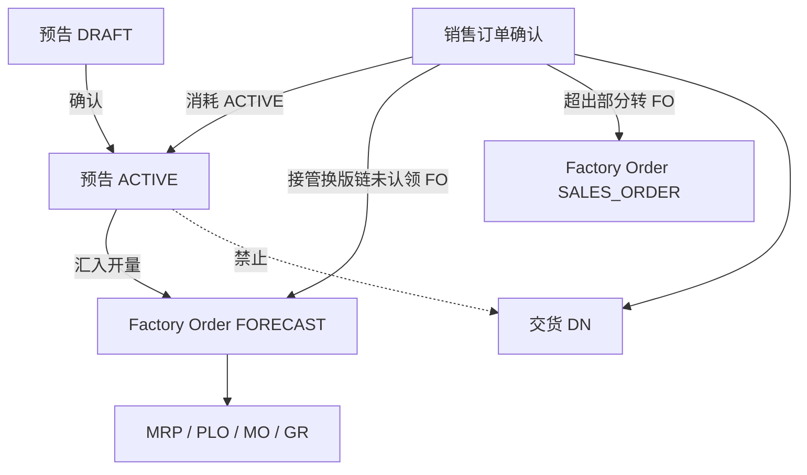

# 02. 目标流程：预告订单（To-Be）

> 原则：预告是可滚动、可被正式单消耗的**计划需求**；投产经 FO 进入现网执行链；交货只认 SO。  
> 命名一律 **预告订单 / `SALES_FORECAST`**。表结构以 [03-schema设计.md](./03-schema设计.md) 为准。

---

## 1. 目标单据链

```text
客户预告 DRAFT ──确认──► ACTIVE
                         │
                         │  open_to_allocate
                         ▼
                   汇入 FO (sourceType=FORECAST) ──► MRP → PLO → MO → GR
                         │
客户正式 SO 确认 ─────────┤
                         ├─ 按 公司+客户+物料+桶 消耗预告（FORECAST→SO）
                         ├─ 先接管换版链上未认领 FO，再吃当前 ACTIVE
                         ├─ 已转 FO 的重叠量：接管 pegging 为 SO→FO（不新建 FO）
                         └─ 超出预告的量：现网 SO→FO

DN / AR：只允许 source = SALES_ORDER
```



与正式单对照：

```text
SO CONFIRMED  ─► add-items-from-so        ─► FO(SALES_ORDER) ─► MRP …
SFO ACTIVE    ─► add-items-from-forecast  ─► FO(FORECAST)    ─► 同一条执行链
SO CONFIRMED  ─► consume + takeover                         ─► 不重复投产
SO CONFIRMED  ─► pending-delivery / DN                       ─► 出货
```

---

## 2. 作业

### 2.1 预告维护（SD）

1. 进入 `/sd/sales-forecasts`（SD 菜单，客户与正式订单之间）。
2. 新增表头：公司、客户、预告日、`version`、`bucket_type`（默认 `WEEK`）、客户预告号、业务员、备注。系统发 `SFO` 单号。
3. DRAFT 下维护明细：物料、单位（默认销售单位）、`required_date`、数量、客户行参考。服务按表头 `bucket_type` 写 `bucket_date`。
4. 确认 → `ACTIVE`（至少一行）。同一公司+客户若已有 ACTIVE：本事务内关闭旧单并写 `supersedes_id`（关单规则见 §3.3）。
5. ACTIVE 后不可改数量/物料/桶/版本；可改备注。允许单行关闭剩余开量。
6. 无下游时可反确认回 DRAFT、或取消；有 `allocated` 不可取消。关单见 §3.3。

### 2.2 预告转 FO（PP）

对标现网「汇入 SO」：

1. 建 FO：`sourceType = FORECAST`，客户从预告带出，**工厂在 FO 上选**。
2. 「汇入预告明细」：调 `pending-production` 预告行，勾选并填转出数量（≤ `open_to_allocate`）。
3. 写 FO 行：`product_material_id`、`quantity`、`due_date = required_date`；pegging `SALES_FORECAST → FACTORY_ORDER`；回写预告 `allocated_quantity`。
4. 其后确认 FO、MRP、工单、入库 **与现网相同**，引擎不读预告表。

一张 `FORECAST` FO 只接受预告行（对标 SO FO 只接受 SO 行）。接管后同一 FO 行上游可变成 SO，表头 `source_type` 仍为诞生时的 `FORECAST`。

### 2.3 正式单消耗（SO 确认时自动）

业务员不在预告页点「消耗」。`bulk-confirm` SO 时：

1. 本批 SO 按 `order_date ASC, order_no ASC, id ASC` 稳定排序后逐单处理（`Set` 无序，禁止直接迭代抢量）。
2. 每单锁 **同一 `company_id + customer_id`** 的当前 `ACTIVE` 预告；换版链按 §3.3.1 回溯，只对仍有 `allocated > 0` 的 `CLOSED` 前序单 `FOR UPDATE`。
3. 每条 SO 行按 `item_no` 升序。交期：行 `expected_delivery_date`，空则表头；仍空则 **该行不消耗**。
4. 对该行剩余量 `Q`（初值 = 行数量）按 §3.5 扣减：先接管换版链上未认领 FO，再吃当前 ACTIVE。
5. 凡实际会消耗/接管的预告行，`unit_id` 必须与 SO 行相同，否则 **整单确认失败**。
6. 无匹配或开量用尽：该行确认成功，后续按现网转 FO。
7. 已接管量写入 SO `allocated_quantity`，禁止再为这部分 `add-items-from-so`。

同一 SO 内多行同料同桶：在已锁预告行上按 `item_no` **累减内存开量**；**该 SO 处理完** 再 `updateQuantitiesAtomic` 一次落库（见 `04` §3.4）。禁止每行重新读未刷新快照，禁止用 Hibernate 脏检查分列 `setAllocated` / `setConsumed`。

反确认见 §3.6。禁止在 `SalesOrderServiceImpl` 上直接调 PP Remote 再回调本类 `updateAllocatedQuantities`（循环依赖）。

---

## 3. 规则

### 3.1 准入与编辑

- 创建：`company_id`、`customer_id`、`forecast_date`、`version`、`bucket_type` 必填。客户、公司、`bucket_type` 创建后不可改（确认前也不改客户，避免部分唯一索引与明细桶语义漂移）。
- 确认：头 `DRAFT`、至少一行、行全部 `DRAFT`。
- ACTIVE 后：禁止改 `forecast_quantity` / 物料 / 单位 / `required_date` / `version`。要改量 → 关行或滚动新版本。
- 删除：仅整单 `DRAFT` 且无下游（此时 allocated/consumed 必为 0）。明细删除同理，仅 DRAFT。

### 3.2 时间桶

保存明细时服务计算 `bucket_date`，忽略客户端乱填。校验 `required_date` 落在该桶内。同一单同一物料同一桶只能一行。

SO 消耗用的交期：行 `expected_delivery_date`，空则表头 `expected_delivery_date`；仍空则 **不消耗**（不当日桶，避免误吃）。

V1 **不做** 跨桶前向/后向消耗（只精确匹配一桶）。

### 3.3 滚动换版与关单

同一 `(tenant, company, customer)` 最多一张 `ACTIVE`（库约束）。确认新版本时 **同一事务**：

1. 锁旧 ACTIVE。
2. 旧单直接 `CLOSED`，仍为 `ACTIVE` 的行跟随。**不**要求 `open_to_allocate = 0`，**不**要求 `allocated = 0`。
3. 新单 `supersedes_id = 旧单 id`，再 `ACTIVE`。

关单（手工或换版）之后：

| 数量 | 关单后 |
|------|--------|
| 未转 FO 的开量（`open_to_allocate`） | **作废**。CLOSED 不可再转 FO，也不可再被 SO 吃未转部分 |
| 已转 FO 未接管（`allocated`） | **保留**。后续 SO 沿 `supersedes_id` 链接管，避免旧 FO 成孤儿、再开一张 FO |
| 已消耗（`consumed`） | 不变 |
| 账面 `open_to_consume > 0` | 允许。其中未转部分已作废；已转部分仍可接管 |

`open_to_allocate` 与「已转未接管量（`allocated`）」不是同一列。初稿把关单写成「`open_to_allocate` 必须 = 0」与「客户未下满、剩余作废」互相矛盾，且会把换版卡在在制 FO 上——**作废该条**。

取消：仅 `DRAFT`，或 `ACTIVE` 且 `allocated = 0` **且** `consumed = 0`。已消耗或已转 FO 的预告用关闭，不用取消。

反确认 `ACTIVE → DRAFT`：条件与取消 ACTIVE 相同（无 allocated、无 consumed）；清空 `confirmed_at` / `confirmed_by`。已被后单 `supersedes_id` 指向的关闭单不能复活。

### 3.3.1 换版链回溯（服务层 while，禁止递归 SQL）

SO 确认从当前 ACTIVE 的 `supersedes_id` 往回走。**不要** `WITH RECURSIVE`，用简单 `while`：

```text
seen = {}
cur = active.supersedes_id
while cur != null:
  if cur ∈ seen: break          # 循环引用，防护性中断
  seen.add(cur)
  加载前序头（先不加锁）
  if 头不存在或 status ≠ CLOSED: break   # DRAFT/ACTIVE/CANCELLED 都停
  if 任一明细 allocated > 0:
      FOR UPDATE 该头 + 这些行
      纳入接管池
  else:
      不对该单加锁                     # 减锁，但还要继续走
  cur = 该头.supersedes_id             # 即使本单 allocated 全 0 也继续
```

**禁止**「本单所有行 `allocated == 0` 就停止回溯」。中间版本可能已清零，更早版本仍可能挂着未接管 FO（W35 开量为 0 ≠ W34 的 40 件 FO 已消失）。链尾只认 `supersedes_id IS NULL`、非 CLOSED、或环。

### 3.4 转 FO 数量

```text
qty ≤ open_to_allocate
头 ACTIVE、行 ACTIVE
FO.sourceType = FORECAST
FO.customer_id 与预告客户一致（FO 客户空则写入）
单位：FO 行不存单位，数量按预告行 unit_id 的数量写入（与 SO 汇入相同）
```

删 DRAFT FO 行：回滚该行 `FORECAST→FO` pegging，预告 `allocated −=`。FO 非 DRAFT 不准删行（沿用现网）。

`pending-production` 预告行：头 `ACTIVE`、`line_status=ACTIVE` 且 `open_to_allocate > 0`。可筛公司、客户、物料、桶日期、预告单号。

### 3.5 消耗与接管

匹配键见 `03` §5.2。数量账见 `03` §4.1。对 SO 行剩余量 `Q`（初值 = 行数量）：

```text
1. 换版链 CLOSED 头（沿 supersedes_id 从当前 ACTIVE 往回走，近的先、远的后）
   同料同桶且 allocated > 0 的行：只接管，不吃未转开量（未转部分已作废）
2. 当前 ACTIVE 头
   行 ACTIVE：先吃未转 FO 开量，再接管本行已转 FO
   行已 CLOSED 但仍有 allocated：只接管（单行关闭后 FO 仍须被认领）
3. 仍剩的 Q：不碰预告，确认成功，之后按现网 SO→FO
```

**ACTIVE 行内顺序：先未转开量，再接管。** 避免有现货/未排产开量时先把在制从预告上撕掉。  
**换版链顺序：先接管旧 FO，再动 ACTIVE。** 避免新版本确认后旧 FO 成孤儿、SO 再开一张 FO。

对每个被接管的预告行，令 `t` 为本次接管量：

| 动作 | 预告账 | Pegging |
|------|--------|---------|
| 吃未转开量 `u` | `consumed += u` | `FORECAST→SO` |
| 接管 `t` | `allocated −t`、`consumed +t` | 该行 `FORECAST→FO` 按 FO `due_date` 升序、pegging id 升序扣减；每扣 `x`：FO 行新增/累加 `SO→FO`；写 `FORECAST→SO` |

`t` 不得超过该行当前 `allocated`。ACTIVE 行上 `u + t` 不得超过该行当时的 `open_to_consume`（已扣本单前面行的内存累减）。  
`allocated` 与 `consumed` 必须 **同一条 UPDATE** 改两列（`updateQuantitiesAtomic`），禁止先加 `consumed` 再减 `allocated`，禁止 Hibernate 分列 dirty flush（会瞬间违反 CHECK，且同一 `@Transactional` 里下一张 SO 读到旧快照）。  
`BigDecimal.compareTo`，禁止浮点近似。

单位：SO 行 `unit_id` 必须等于**实际扣到的**预告行 `unit_id`，否则该 SO **整单确认失败**。无预告、或有预告但该料该桶无行（含换版链上无 `allocated`）：不算单位错误。

接管 **不改** FO 表头 `source_type`。打印/进度按 pegging 取上游：优先 `SALES_ORDER`，否则 `SALES_FORECAST`。

SO 行后续 `add-items-from-so`：可转量仍为 `quantity − allocated_quantity`。已被接管的量由 **SD 确认方** 写入 SO `allocated_quantity`（与现网同一列），避免再转一次。PP 接管接口 **不** 回写 SO allocated（避免 `SalesOrderServiceImpl` ↔ `RemoteFactoryOrderService` 循环依赖）。

```text
接管时：
  预告账 + FORECAST→SO     → SD consume
  FORECAST→FO / SO→FO      → PP takeoverFromForecast（只改 pegging）
  SO.allocated_quantity += t → SD 确认方自己加
```

未转 FO 就被消耗的量 **不** 增加 SO allocated（还没进工厂）。这部分仍可走 `add-items-from-so`。

### 3.6 SO 反确认 / 关闭

现网 `allocated > 0` 一律禁反确认。接管也会写 SO allocated，若不区分来源，误确认后销售员无法反确认（下游 FO 不是他建的，也不能去删）。V1 按 **FO 诞生来源** 拆：

| SO 行 allocated 来源 | 反确认 |
|----------------------|--------|
| 存在 `SO→FO` 且 FO.`sourceType = SALES_ORDER`（业务员自己汇入） | **拒绝**（现网，须先删 DRAFT FO 行把 allocated 清零） |
| allocated > 0 **仅** 来自 `sourceType = FORECAST` 的接管 | 这些 FO **全部仍为 DRAFT** → 允许：先 `revertTakeover`，再回滚 `FORECAST→SO` / 预告账，再改 SO 为 DRAFT。任一 FO 非 DRAFT → **拒绝** |
| allocated = 0，仅有未转 FO 的 `FORECAST→SO` | 允许：只回滚消耗 |
| 关闭 SO | **不**回滚消耗。预告已吃掉的量保持，避免再被别的 SO 吃 |
| 删 DRAFT SO | 尚未确认，无消耗 |

`sourceType = FORECAST` 的 FO 只能经预告汇入或被接管改上游，不会出现「业务员手工汇入 SO 行」。用表头 `source_type` 区分即可，SO 行不加标记列。

### 3.7 交货

禁止 `DeliverySourceDocType.SALES_FORECAST`。预告入库的成品用库存满足后续 SO 的 DN。ATP/预留 V1 不做（靠数量账 + 人工）。

---

## 4. API

对标 `/api/v1/sd/sales-orders`。权限前缀 `/sd/sales-forecasts`。旧四个扁平接口删除重建。

### 4.1 预告头 / 行

| 方法 | 路径 | 权限 |
|------|------|------|
| POST | `/api/v1/sd/sales-forecasts/page` | read |
| GET | `/{id}` | read |
| POST | `/` | create |
| PUT | `/{id}` | update |
| DELETE | `/bulk-delete` | delete |
| POST | `/bulk-confirm` | update |
| POST | `/bulk-unconfirm` | update |
| POST | `/bulk-close` | update |
| POST | `/bulk-cancel` | update |
| POST | `/{id}/items/page` | read |
| POST | `/{id}/items` | update |
| PUT | `/{id}/items/{itemId}` | update |
| DELETE | `/{id}/items/bulk-delete` | update |
| POST | `/{id}/items/{itemId}/close` | update |
| POST | `/items/pending-production` | read |

V1 **不做** PDF。

`pending-production` 返回行上带：`forecastNo`、`forecastDate`、`companyId`、`customerId`、`openToAllocate`、`requiredDate` 等（对标 SO pending 填展示字段）。

### 4.2 FO

| 方法 | 路径 | 说明 |
|------|------|------|
| POST | `/api/v1/pp/factory-orders/{id}/add-items-from-forecast` | 对标 `add-items-from-so`；body 为 `forecastItemId + quantity` |

`sourceType=FORECAST` 的 FO：**禁止** `add-items-from-so` 与手工行。  
`sourceType=SALES_ORDER`：**禁止** `add-items-from-forecast`。  
`MANUAL`：保持现网，只手键，不汇入预告。

删 FO 行：按 pegging `demandType` 回滚 SO 或预告的 allocated。

### 4.3 Remote（禁止 TODO 空壳）

见 `03` §7.1。签名必须一次写全，禁止 TODO 空壳。

```text
PP  add-items-from-forecast
  → RemoteSalesForecastService.getForecastItems
  → RemoteSalesForecastService.updateAllocatedQuantities

SD  SalesOrderServiceImpl.confirm   （同模块走 SalesForecastService，不走 Remote）
  → SalesForecastService.consume
        锁预告、改账、写 FORECAST→SO，返回各行 u / t
  → RemoteFactoryOrderService.takeoverFromForecast
        只改 FORECAST→FO / SO→FO，不回写 SO
  → SO.allocated += t              （确认方自己写）

SD  unconfirm（允许回滚接管时）
  → RemoteFactoryOrderService.revertTakeoverFromForecast
  → SalesForecastService.consume（负向）或专用 rollback
```

同一事务（SO 确认所在 TX；跨模块用现有 Remote 同库调用，不要异步）。失败整单回滚。  
`SalesOrderServiceImpl` 已实现 `RemoteSalesOrderService.updateAllocatedQuantities`：PP 接管 **禁止** 再调它，否则确认路径循环依赖。

### 4.4 枚举导出

`EnumController` 增加 `SalesForecastStatus`、`SalesForecastBucketType`。  
`FactoryOrderSourceType`、`PeggingOrderType`、`DocumentTypeEnum` 按 `03` 扩。

---

## 5. 前端

### 5.1 预告页

唯一主作业：`/sd/sales-forecasts`。复制 `pages/sd/sales-orders` 主从表：

- 无价税、付款、地址、交货数量
- 头：单号、日期、客户、版本、桶类型、客户预告号、状态、公司、业务员
- 行：物料、单位、需求日、桶日（只读）、预告量、已转 FO、已消耗、开量（前端派生，见下）、行状态
- 按钮：确认 / 反确认 / 关闭 / 取消 / 删草稿；行关闭
- 列表默认按 `forecastNo` 降序

开量派生（列表、详情、行编辑只读列；**不**落库、**不**当可转 FO 的权威）：

```text
raw = forecastQuantity − allocatedQuantity − consumedQuantity
openToAllocate = (行 CLOSED/CANCELLED 或 头 CLOSED/CANCELLED) ? 0 : raw
```

与后端「关单/关行后未转开量作废」一致。禁止对已关闭行显示正数剩余，避免业务员以为还能转 FO。`pending-production` 只返回头行 ACTIVE 且 `raw > 0` 的行，抽屉里不出现已关行。

locale：zh-CN / en-US / vi-VN 正式名「预告订单」/ `Sales Forecast`。不要「销售预测」作菜单名（易理解成统计预测）。

### 5.2 FO 页

`sourceType=FORECAST` 时「汇入预告」抽屉，复制 `ImportSOModal`，数据源改 `pending-production` 预告。  
`SALES_ORDER` 仍只汇入 SO。表头来源枚举增加 Forecast。

### 5.3 SO 页

确认无需新按钮。可在 SO 行只读展示「本行消耗预告量」（从 `FORECAST→SO` pegging 聚合），V1 可省略，用溯源树查看。

---

## 6. 模块边界

| 动作 | 模块 |
|------|------|
| 预告 CRUD / 确认 / 关取消 / 数量账 / consume / 写 SO allocated | `lychee-erp-sd` |
| 汇入 FO、FORECAST→FO、接管/回滚 FO pegging（不写 SO allocated） | `lychee-erp-pp` |
| MRP / MO / GR | **不改**需求种子 |
| DN / AR | **不加**预告来源 |
| 溯源树 | common pegging：`SALES_FORECAST` 作为需求根时，对标 SO 特例往下展 |
| 前端预告页 | `lychee-frontend/src/pages/sd/sales-forecasts` |
| 菜单 | `/sd/sales-forecasts`，建议 `SD04`、排序 `4015`（客户与 SO 之间） |

---

## 7. V1 不做

- MRP 直连播种 `MrpSourceType.FORECAST`
- 跨桶消耗、按比例消耗、安全库存混算
- 预告交货 / 开票 / 价税
- 一张 FO 同时汇入 SO 行与预告行（接管造成的上游混合除外）
- 预告 PDF、ATP 预留库存
- 多张 ACTIVE 预告（按产品线拆分）——被部分唯一索引禁止
- 把 CRM「市场预测」做成另一张表
- 迁移旧单表数据
- Excel / EDI 矩阵导入（物料 × 周）。V1 只手维护；导入另开专题
- 反确认已确认/已开工的 FORECAST FO（接管后 FO 非 DRAFT 仍拒绝）
