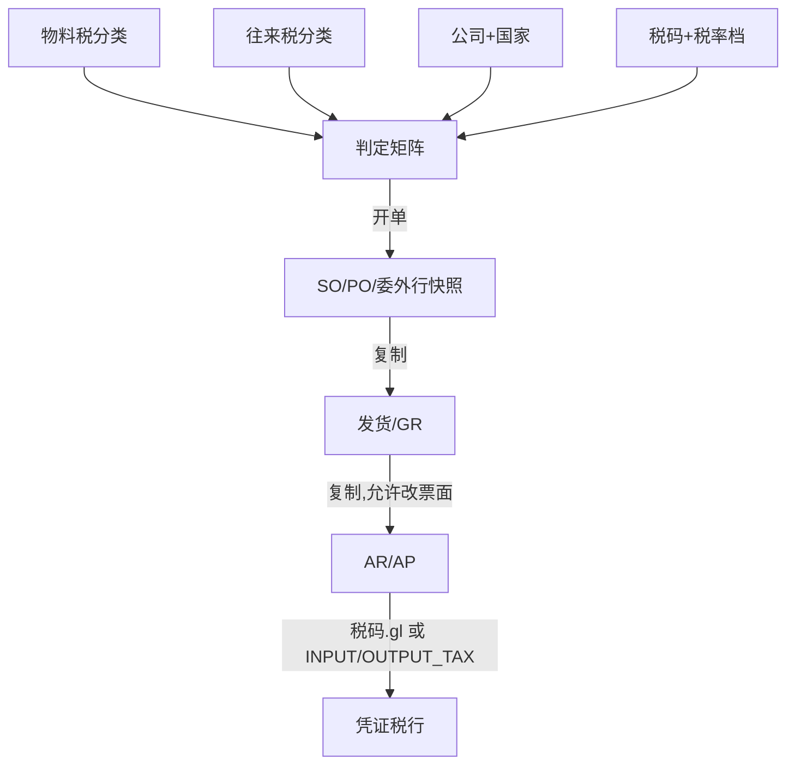

# 02. 目标流程：税码判定与单据快照（To-Be）

> 原则：用户选 **税码**，不填百分比。税率从税码在单据日的有效档复制到行上，之后冻结。  
> 判定用「公司 × 方向 × 往来税分类 × 物料税分类」；漏配则拒绝开单，禁止静默 0%。

---

## 1. 概念分层

```text
国家（公司.country_code）
    └── 税码 tax_codes              进项10% / 销项8% / 免税 / 零税率 …
            └── 税率档 tax_code_rates   有效期内的百分比（政策调整只加新档）
税分类 tax_classes
    ├── 物料税分类  → materials.tax_class_id
    └── 往来税分类  → suppliers / customers.tax_class_id
判定矩阵 tax_determinations
    国家 + 公司(可空) + 进/销项 + 往来分类 + 物料分类 → 税码
单据行快照
    tax_code_id + tax_rate + tax_amount   （历史不受主数据变更影响）
```

与科目判定的关系：

| 维度 | 表 | 回答什么 |
|------|-----|----------|
| 评估类 | `valuation_classes` | 存货/收入/费用/在建走哪一个 GL |
| 税码 | `tax_codes` | 税务身份、税率、能否抵扣、税行 GL（可覆盖） |

过账时：货行仍走现有 `REVENUE` / `GRIR` / `EXPENSE` / `CIP`；**税行**优先用税码上的科目覆盖，否则回退 `INPUT_TAX` / `OUTPUT_TAX` 通配。

---

## 2. 目标单据链

```text
维护：税码 + 税率档 + 税分类 + 判定矩阵 + 物料/供应商/客户分类
         │
         ▼
开 SO / PO / 委外（DRAFT）
         │  TaxDeterminationService：带出税码，按单据日复制税率，算税额
         ▼
审核后下游只复制快照，不再判定
         │
    SO ──► 发货 ──► AR（可改税码/票面税额）──► 过账贷销项（或 0 税率无税行）
    PO / 委外 ──► GR ──► AP（可改税码/票面税额）──► 过账借进项或不可抵扣费用
```



采购工作台（`chartExp/Purchase`）第 5 步「在 PO 上补税率」改为：**转单时已判定**；PO 上只允许改税码（改完重算），不再手填百分比。

---

## 3. 判定规则

方向由单据类型决定，不由用户选：

| 单据 | 方向 |
|------|------|
| 销售订单 / 发货 / AR | `OUTPUT` |
| 采购订单 / 委外 / 收货 / AP | `INPUT` |

公司解析：

| 单据 | 公司 |
|------|------|
| SO / AR / AP | 表头 `company_id` |
| PO / 委外 / GR | `factories.company_id`（经 `factory_id`） |

### 3.1 入参

```text
companyId, direction, partnerTaxClassId, materialTaxClassId, documentDate
```

- 往来分类：供应商或客户的 `tax_class_id`（必填；主数据未维护则判定失败）。
- 物料分类：`materials.tax_class_id`（必填，无物料杂项行可空）。
- `documentDate`：SO/PO/委外用 `order_date`；发票用 `invoice_date`。用于取税率档，**不是**判定矩阵的键。

AP/AR 表头往来是 `business_partners`，BP **不加**税分类。杂项行（无上游快照、须判定）按下面取分类，FI 只走 Remote，不 import SCM/SD 实体：

```text
partnerTaxClassId:
  BP.partner_type = SUPPLIER → RemoteSupplierDTO.taxClassId（source_id）
  BP.partner_type = CUSTOMER → RemoteCustomerDTO.taxClassId（source_id）
  反查不到或 taxClassId 空 → 判定失败

materialTaxClassId:
  行上有 materialId → RemoteMaterialDTO.taxClassId（空则失败）
  行上无物料       → null（走矩阵物料通配）
```

### 3.2 匹配顺序（先公司后国家默认，先具体后通配）

同一 `tenant` 下只取 `is_active = true`、判定行 `country_code` = 公司国家、税码国家 = 公司国家、税码方向兼容（`INPUT`/`OUTPUT`/`BOTH` 与本次方向匹配）的行：

```text
1. company_id = 本公司  AND partner_class = 入参 AND material_class = 入参
2. company_id = 本公司  AND partner_class = 入参 AND material_class IS NULL
3. company_id = 本公司  AND partner_class IS NULL AND material_class = 入参
4. company_id = 本公司  AND 两个分类都 NULL          （公司默认税码）
5. 上列 1–4 把 company_id 换成 NULL（该国默认）
6. 仍无 → ValidationException，禁止写行
```

同层禁止两行（唯一约束含 `country_code`，因此 VN / CN 可各写一套国家默认）。不要「找不到就 0%」。

### 3.3 取税率

命中税码后：

```text
SELECT rate FROM tax_code_rates
 WHERE tax_code_id = ?
   AND valid_from <= documentDate
   AND (valid_to IS NULL OR valid_to >= documentDate)
 ORDER BY valid_from DESC
 LIMIT 1
```

无档 → 拒绝。`rate` 为百分比，`10.00` = 10%。复制到行的 `tax_rate`，**不要**把税码当前主档税率动态投影到已保存的行。

### 3.4 何时判定 / 何时复制 / 何时禁止

| 动作 | 税码来源 |
|------|----------|
| 新建 SO/PO/委外行（含工作台转单、请购转 PO、手键） | **判定**；请求可带 `taxCodeId` 覆盖（须同国家、方向兼容、启用） |
| DRAFT 改物料或往来 | **重新判定**（覆盖行上税码，除非请求显式传入 `taxCodeId`） |
| DRAFT 只改数量/单价 | 不改税码；按行上 `tax_rate` 重算金额 |
| DRAFT 改单据日（`order_date` / `invoice_date`） | **不**重跑矩阵；按行上 `tax_code_id` + 新单据日重取税率档并重算。AP/AR 若 `tax_amount_overridden` 则不重取、不重算税额 |
| DRAFT 用户改税码 | 按单据日重取税率档并重算；AP/AR 同时把 `tax_amount_overridden` 打回 `false` |
| 已审核业务单改税 | **禁止** |
| GR / 发货 从上游建行 | **复制** `tax_code_id` + `tax_rate`，不判定 |
| AP/AR 从 GR/发货/订单建行 | **复制**快照，**不**按 `invoice_date` 重取。跨政策调整日：用户改税码（按发票日取档）或票面覆盖 |
| AP/AR 无来源杂项行 | **判定**（往来经 BP→供应商/客户；无物料则物料分类通配） |

工作台 `from-mrp-results` / `from-pr-items`：生成 PO 行时调用判定，**废除写死 0**。无税分类或矩阵未配 → 整批失败回滚（与无供应商同一严格度）。

---

## 4. 金额公式（全系统唯一）

锁定：**单价一律未税**。税码上不设「含税价」标志。UI 标签写「未税单价」。

业务单据（SO/PO/委外）及由公式驱动的 DRAFT 行：

```text
line_amount / subtotal_amount = qty × unit_price     → HALF_UP, 2 位
tax_amount                    = subtotal × rate/100  → HALF_UP, 2 位
total_amount                  = subtotal + tax_amount
header.*                      = SUM(lines)           → 禁止用表头税率重算
```

`BigDecimal.compareTo` 与现网采购金额账同一套，禁止 double。

金额与税率均在**单据币**上计算；AP/AR 过账折本币沿用现有 `exchange_rate`，本波不改汇差逻辑。

**AP/AR 票面覆盖：**

- 改税码：重取税率并按公式重算（默认）；`tax_amount_overridden` 打回 `false`。
- 改 `tax_amount`：允许，使 `total = line_amount + tax_amount`；用于发票票面尾差。`tax_rate` 仍保留快照，不反推税率。
- 改 `line_amount`：若未覆盖税额，按公式重算税额；若已覆盖，只重算 `total`（以行上 `tax_amount_overridden` 为准，见 03）。
- `tax_type IN (ZERO, EXEMPT, NON_TAXABLE)`：**禁止**把 `tax_amount` 覆盖为 > 0（保存与过账都拒）。这类税码语义是无税行，票面尾差只能改未税金额。

FOC 收货行：现网有 `is_foc`。FOC **不判定税、税额为 0**（赠品不进进项）；二期不另建模。

---

## 5. 税码语义（0% 必须能区分）

| `tax_type` | 典型税率 | 凭证税行 | 含义 |
|------------|----------|----------|------|
| `STANDARD` | 10 / 13 / 9 / 6 / 8 / 5 | 有（税额>0） | 应税 |
| `REDUCED` | 同上低档 | 有 | 应税低税率，申报与标准档分开时靠税码而不是靠百分比 |
| `ZERO` | 0 | **无**（税额=0） | 零税率（出口等），仍是增值税体系内 |
| `EXEMPT` | 0 | 无 | 免税 |
| `NON_TAXABLE` | 0 | 无 | 不在增值税范围 |

`is_deductible` 仅对 `INPUT` 有意义：

| 进项税码 | AP 过账税行 |
|----------|-------------|
| `is_deductible = true` 且税额>0 | 借税码 `input_gl_account_id`，空则 `INPUT_TAX`（222102） |
| `is_deductible = false` 且税额>0 | 借税码 `input_gl_account_id`（应指向费用或「不可抵扣进项」科目），**禁止**回退到 `INPUT_TAX`；未配科目则过账失败 |
| 税额 = 0 | 无税行 |

销项：税额>0 贷 `output_gl_account_id`，空则 `OUTPUT_TAX`（222101）。

**不可抵扣不回写库存成本。** GR 已按未税价入账；AP 把不可抵扣税额打到费用科目。二期不重开存货。资本化进项（计入资产）用税码科目指向 CIP/资产，不走本系统自动摊入 `INV_STOCK`。

---

## 6. 主数据维护职责

| 数据 | 模块 | 谁维护 |
|------|------|--------|
| 税分类、税码、税率档、判定矩阵 | **FI** | 财务 |
| `companies.country_code` | BASIS | 实施/管理员；开账后慎改 |
| `materials.tax_class_id` | MM | 物料主数据；必填 |
| `suppliers.tax_class_id` | SCM | 供应商主数据；必填 |
| `customers.tax_class_id` | SD | 客户主数据；必填 |
| `business_partners` | FI | **不加**税分类（避免与 SCM/SD 双维护）；过账只读发票行快照 |

税码 `code` 租户内唯一，建议带国家前缀：`VN-IN-10`、`VN-OUT-0`、`CN-OUT-13`。  
判定行自带 `country_code`（NOT NULL）；税码国家必须等于判定行国家。公司级行的 `country_code` 必须等于该公司 `country_code`。

物料/往来保存时：税分类 `class_scope` 必须匹配（物料不能选往来分类）。未填分类允许保存主数据（实施期），但 **开单判定失败**——不要在主数据保存时强制，以便先导物料再配矩阵；工作台与开单是卡口。

实施建议：先税分类与税码 → 再矩阵 → 再批填物料/往来默认分类 → 最后开单。

---

## 7. 下游复制（含税码）

与现网 GR `tax_rate` 快照同一原则，补上 `tax_code_id`：

```text
PO/委外行  ──copy──►  GR 行（tax_code_id, tax_rate）──copy──► AP 行
SO 行      ──copy──►  发货行                         ──copy──► AR 行
```

GR/发货 **禁止**改税码。AP/AR 在 `DRAFT` 可改。三单匹配比数量与未税金额；税额以发票为准（票面覆盖）。

---

## 8. API

税主数据标准 CRUD 挂 FI。判定给跨模块用，不让 SCM/SD 直接依赖 FI 实体。

### 8.1 税分类 / 税码 / 税率档 / 判定

```http
标准分页 CRUD
  /api/v1/fi/tax-classes
  /api/v1/fi/tax-codes
  /api/v1/fi/tax-codes/{id}/rates          # 子表：税率档
  /api/v1/fi/tax-determinations
```

税码列表过滤（单据行下拉走标准分页，不另开 API）：

```http
GET /api/v1/fi/tax-codes?countryCode=VN&direction=INPUT&isActive=true&asOf=2026-08-27
```

- `countryCode`：税码国家。
- `direction`：`INPUT` / `OUTPUT`；结果含 `BOTH`。
- `isActive`：开单下拉只传 `true`。
- `asOf` 可选：响应带该日有效档 `currentRate`；不传则不带费率。选中后仍以 `resolve`（覆盖路径）写入行为准，前端不算税。

权限：`/fi/tax-codes:*` 等（与科目、评估类同级财务主数据）。  
删除：已被判定或单据行引用 → 拒绝；改 `is_active = false`。税率档允许追加，禁止删已被单据使用期间的档（按 `valid_from` 与已有单据日相交则拒删）。

### 8.2 判定（内部 Remote + 可选调试查询）

```http
POST /api/v1/fi/tax-determinations/resolve
```

```json
{
  "companyId": 1,
  "direction": "INPUT",
  "partnerTaxClassId": 10,
  "materialTaxClassId": 3,
  "documentDate": "2026-08-27",
  "taxCodeId": null
}
```

响应：`taxCodeId`, `taxCode`, `taxType`, `direction`, `isDeductible`, `taxRate`, `inputGlAccountId`, `outputGlAccountId`。  
`taxCodeId` 有值时跳过矩阵，只校验国家/方向/启用并取税率档（用户覆盖）。

`RemoteTaxDeterminationService`（`lychee-erp-common` 契约，FI 实现）：SCM/SD/WM 开行、转单时调用。工作台不要为了税再调一套 MM 主数据权限。

### 8.3 单据行 DTO

现有 `taxRate` **保留为只读快照**（响应仍返回）。请求侧：

- 业务行 Create/Update：`taxCodeId` 可选；不传则判定。
- **禁止**客户端传 `taxRate` 作为计税依据（忽略或 400）。费率以后端税码档为准。
- AP/AR：另允许 `taxAmount` + `taxAmountOverridden`。

---

## 9. 前端

### 9.1 财务主数据页

| 路由 | 类型 |
|------|------|
| `/fi/tax-classes` | 单表；筛选 `classScope` |
| `/fi/tax-codes` | 主从：主档税码，展开/抽屉维护税率档 |
| `/fi/tax-determinations` | 单表；国家、公司（可空=该国默认）、方向、两个分类（可空=通配）、税码 |

标准 CRUD 页技能。税码表单：国家、方向、类型、是否抵扣、可选进项/销项科目。税率档：`rate`、`validFrom`、`validTo`。

### 9.2 物料 / 供应商 / 客户

表单与列表加「税分类」下拉（按 `class_scope` 过滤）。非财务人员只选分类，不选税码。

### 9.3 单据行

- 税率输入改为 **税码下拉**（`tax-codes` 列表：`countryCode` + `direction` + `isActive`；可用 `CachedFormSelect`，cacheKey 含这三项）。`resolve` 与计税**不**缓存。
- 选税码后只读展示 `taxRate`、算出的税额/含税。
- 工作台转 PO：行上可显示判定结果税码，允许改后再提交（请求带 `taxCodeId`）。
- AP/AR：税码 + 税额（票面）；改税额打 `taxAmountOverridden`。

i18n：zh-CN / en-US / vi-VN。字段名用「税码」「税率（%）」「税分类」，不要再单独叫用户「填税率」。

---

## 10. 对现有流程的改动点（摘要）

| 流程 | 改动 |
|------|------|
| 采购工作台转 PO | 每行判定；失败整批回滚；不再写 `taxRate=0` |
| 请购转 PO | 同上 |
| MANUAL PO / 委外手键 | 保存时判定或用传入税码 |
| SO 新建/复制行 | 废除写死 0 |
| GR / 发货 | 多复制 `tax_code_id` |
| AP/AR 过账 | 税行科目按税码；不可抵扣不得进 `INPUT_TAX` |
| 采购 02「PO 上补税率」 | 改为「可改税码」；默认已带出 |

---

## 11. 验收要点

1. 国内标准供应商 + 货物物料 → PO/SO 自动带出对应进项/销项税码，税率为当前档（如 VN 10.00），金额公式与现网一致。  
2. 境外/出口往来分类 × 货物 → 零税率税码，税额 0，过账 **无** 税行。  
3. 矩阵未配或主数据无分类 → 开单/转单 API 失败，不落行。  
4. 追加税率档（如 10% 从某日改为 8%）→ 旧单据 `tax_rate` 不变；新单用新档。  
5. GR/发货与来源行税码、税率一致；改来源主数据税分类不影响已审 PO。  
6. AP 可抵扣：借 222102（或税码覆盖科目）；不可抵扣：借税码指定费用，不借 222102。  
7. AR 应税：贷 222101（或覆盖科目）；税额 0：无税行。  
8. 用户在 DRAFT PO 改税码后数量变了，税额按新税率重算。  
9. AP 票面税额 +0.01 覆盖后过账按覆盖额，且 `tax_rate` 仍为税码档。  
10. 工作台一次转两供应商：两张 PO 都带判定税码，不再全 0。  
11. 税码国家与公司国家不一致 → 判定/覆盖均拒绝。  
12. 已审核 PO 改税码 → 拒绝。  
13. AP 杂项行：经 BP→供应商取出往来税分类后判定成功；BP 无对应供应商/客户或分类未维护 → 失败。  
14. DRAFT PO 改 `order_date` 跨过税率档生效日 → 行上税码不变，`tax_rate` 与税额按新档重算。  
15. 零税率税码的 AP 行把税额改为 0.01 → 保存拒绝。

---

## 12. 已锁定（原设计选择）

开发按下列取值，细节见 [04-实施清单.md](./04-实施清单.md) §2。

1. **单价含税** — 否，全系统未税。  
2. **找不到税码是否默认 0%** — 否，失败。  
3. **税码是否 option_values** — 否，独立表（有税率档与科目）。  
4. **税分类是否直接存税码在物料上** — 否，分类 + 矩阵（与评估类同一哲学）。  
5. **来源清单 `material_suppliers` 加税码** — 否，税是法定维度不是报价维度。  
6. **BP 表加税分类** — 否。  
7. **`fi_account_determination` 增加 tax_code 维度** — 否；税码可选 GL 覆盖 + 通配回退。  
8. **不可抵扣进项摊入库存** — 否。  
9. **电子发票 / 申报表** — 本波不做。  
10. **美国销售税、欧盟 OSS 多管辖权** — 不做；只做公司国家 VAT。  
11. **PR 行加税** — 否，税在 PO。  
12. **表头税码** — 否。  
13. **BP 税分类** — 否；发票杂项行经 `source_id` 反查供应商/客户。  
14. **判定矩阵国家** — 行上存 `country_code`，国家默认按国家各写一套。  
15. **改单据日** — 重取税率档，不重跑矩阵；票面覆盖行除外。  
16. **零税类票面覆盖出税额** — 禁止。
