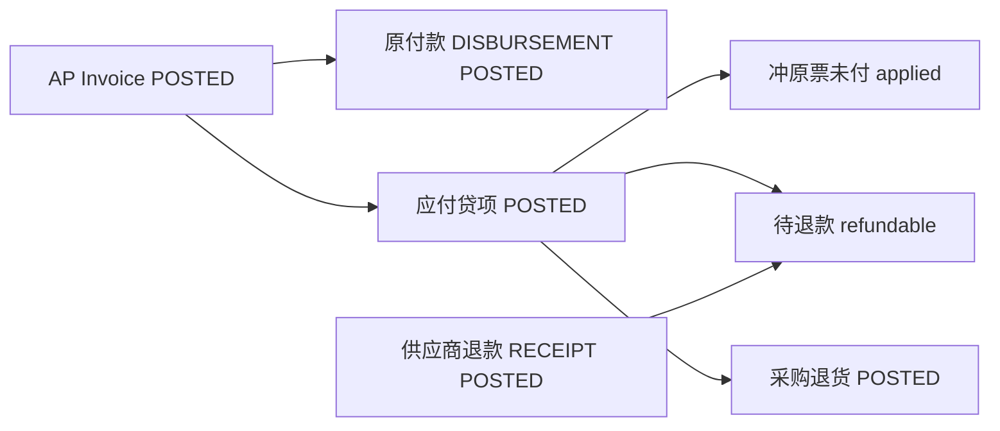

# 02. 目标流程：供应商退款主流程 V1

> 正式名称：**供应商退款 / `SUPPLIER_REFUND`**。  
> 资金载体复用 `payments`，组合固定为 `RECEIPT + SUPPLIER + SUPPLIER_REFUND`。  
> 完整目标流程见 [../供应商退款/02-目标流程.md](../供应商退款/02-目标流程.md)。本文是本期要落地的子集。

---

## 1. 目标单据链



三个维度独立。退款不引用采购退货行。本期贷项仍是「按原行数量 × 原单价」的数量型贷回，可有或无 WM 退货，不做纯金额折让。

作业顺序：

```text
1. 从已过账 AP 生成贷项（全额已付也可以，只要还有可贷数量）
2. 过账贷项 → 若 refundable > 0，点「登记供应商退款」
3. 确认到账金额与一行核销后过账
4. 仓库按占用下降做采购退货（可贷不退）
```

撤回：先 VOID 退款 → 冲销采购退货（如有）→ VOID 贷项 → 必要时再动原付款。

---

## 2. 适用场景

以下先假设该票剩余实付现金盖得住待退款。折扣上限见 §4。

### 2.1 全额已付后退款

```text
AP total=100, paid=100, remaining=0
Credit Memo total=40
applied=0, refundable=40, refund remaining=40
```

退款 40 过账后：`refunded=40`，`refund_status=REFUNDED`。原 AP 仍 `paid=100`，原付款仍 `POSTED`。

### 2.2 部分已付、同一张贷项既冲未付又形成退款

```text
AP 100, paid=60, remaining before=40
Credit Memo=70
applied=40, refundable=30
AP remaining after=0
```

供应商只退 30。可先退 20 再退 10（两张退款单，同一张贷项）。

### 2.3 贷项未超过未付

```text
AP 100, paid=20, remaining before=80
Credit Memo=30
applied=30, refundable=0, refund_status=NOT_REQUIRED
```

与应付贷项 V1 一致，不出现退款入口。

### 2.4 本波不做的作业

- 现金先到账、贷项尚未过账：不要先开无核销行的退款。等贷项过账再开退款单。
- 一笔银行流水核多张贷项：拆成多张 `SR`，或完整设计落地后再做。

---

## 3. 应付贷项金额拆分

### 3.1 AP 表头

```text
credited_amount         = 已过账、未作废贷项总额
applied_credit_amount   = 上述贷项中已用于冲原票未付的金额
remaining_amount        = total_amount − paid_amount − applied_credit_amount
```

```text
0 ≤ applied_credit_amount ≤ credited_amount ≤ total_amount
remaining_amount ≥ 0
```

`payment_status` 仍只反映原票是否还有待付。全额已付后出现待退款时，原 AP 保持 `PAID`；是否尚欠退款只看贷项 `refund_status / refund_remaining_amount`。

历史已过账贷项均满足 V1 `total ≤ remaining`，迁移：

```text
applied_credit_amount = credited_amount
```

### 3.2 过账拆分

锁贷项、原 AP、原 AP 行之后：

```text
remainingBefore      = total − paid − appliedCredit
grossCreditAvailable = total − credited
```

校验：

```text
creditMemo.total ≤ grossCreditAvailable
每行 quantity ≤ creditableQty
```

不再使用 `creditMemo.total ≤ remainingBefore`。

```text
appliedAmount    = min(creditMemo.total, remainingBefore)
refundableGross  = creditMemo.total − appliedAmount
refundableAmount = refundableGross          // 通过 §4 现金上限之后
refundedAmount   = 0
refundRemaining  = refundableAmount
```

本位币快照一律重乘，**不**读取 AP 未结本位币，**不**从贷项 Journal 反推：

```text
memoTotalBase     = round(creditMemo.total × exchangeRate, 2)
appliedBase       = round(appliedAmount × exchangeRate, 2)
refundableBase    = memoTotalBase − appliedBase
```

普通 AP 付款汇兑上线后，新单据再改用真实 `remaining_base`；本期快照不回放。

回写原 AP：

```text
credited_amount       += creditMemo.total
applied_credit_amount += appliedAmount
remaining_amount       = total − paid − appliedCredit
```

贷项完整 `total` 仍用于凭证、税、数量与收货占用。

### 3.3 退款状态

生命周期仍用 `invoice_status`。另加：

| 条件 | `refund_status` |
|------|-----------------|
| `refundable = 0` | `NOT_REQUIRED` |
| `refundable > 0` 且 `refunded = 0` | `UNREFUNDED` |
| `0 < refunded < refundable` | `PARTIAL` |
| `refunded = refundable` | `REFUNDED` |

VOIDED 贷项保留过账时的金额快照；可退款查询只看 `POSTED && refund_remaining > 0`。

---

## 4. 付款折扣：实付现金上限

现网 `paid_amount` 含 `allocated + discount`，供应商实际只收到 `allocated`。本波不做折扣比例转回。

贷项过账、`refundableGross > 0` 时：

```text
cashPaid = Σ(
  POSTED DISBURSEMENT
  AND allocation_type = INVOICE
  AND ap_invoice_id = 原 AP
  AND payment_lines 所在 Payment 为 POSTED
  AND allocated_amount          // 不含 discount_amount
)

cashReserved = Σ(
  同一原 AP 上其他 POSTED、非 VOIDED 贷项的 refundable_amount
)

cashAvailable     = cashPaid − cashReserved
refundableGross   = creditMemo.total − appliedAmount

refundableGross = 0                 → 通过（与折扣无关）
refundableGross ≤ cashAvailable     → refundable = refundableGross
refundableGross > cashAvailable     → 拒绝
```

拒绝文案：待退款超过该票剩余实付现金，差额属于付款折扣，本期不支持折扣转回。

```text
AP 100，实付 98，折扣 2
贷项 40 → refundable=40 ≤ 98 → 允许
贷项 100 → 100 > 98 → 拒绝
先贷 40 再贷 60 → 第二张 60 > 58 → 拒绝
```

禁止静默 `min(gross, cashAvailable)` 导致 `applied + refundable < total`。

无折扣时 `cashPaid = paid_amount`，上限不改变无折扣场景。

---

## 5. 供应商退款收款

### 5.1 用途矩阵

本期只允许：

| `payment_purpose` | `payment_type` | `partner_type` | 子账 |
|-------------------|----------------|----------------|------|
| `STANDARD` | `RECEIPT` | `CUSTOMER` | AR |
| `STANDARD` | `DISBURSEMENT` | `SUPPLIER` | AP |
| `SUPPLIER_REFUND` | `RECEIPT` | `SUPPLIER` | AP |

其它组合拒绝。`EMPLOYEE` 不扩展。

供应商退款：

- 复用 `payments` 表、API、工作流、权限
- 单号 `DocumentTypeEnum.SUPPLIER_REFUND`，前缀 `SR`，写入 `payment_no`
- `sourceModule = AP`，银行凭证 `sourceDocType = SUPPLIER_REFUND`
- `amount > 0`，`is_prepayment = false`
- `payment_purpose`：DRAFT 且无核销行时可改；一旦有行或已提交则不可改
- 创建/更新/过账校验：内部银行同公司、同币别、有效，银行 GL 属于该公司；对方银行若填则属于同一供应商且有效。该校验 **仅 SUPPLIER_REFUND** 强制，不扩大到 STANDARD
- 伙伴类型从 `BusinessPartner` 回填并校验，禁止伪造

### 5.2 核销行

`PaymentAllocationType` 增加 `AP_CREDIT_MEMO`：

```text
allocation_type  = AP_CREDIT_MEMO
ap_credit_memo_id
allocated_amount = payment.amount
discount_amount  = 0
```

一张 `SUPPLIER_REFUND` **过账时必须恰好一行** 该类型核销，且：

1. 贷项 `POSTED`，`refund_remaining ≥ allocated`
2. 公司、供应商、币别与表头一致（币别必须等于贷项/原票币别，禁止交叉货币）
3. 不得同时填 `ar_invoice_id` / `ap_invoice_id` / `applied_payment_id`
4. 不允许 `INVOICE` / `GL_ACCOUNT` / `PREPAYMENT`
5. 同一 Payment 不得出现第二行核销

一张贷项可以被多张退款分次核销。不同 DRAFT 可指向同一贷项余额，第二张 POST 时在锁内因余额不足失败。

草稿行沿用 `/items`：只存行，不回写贷项。Payment POST 时应用该行：

```text
creditMemo.refunded += allocated
creditMemo.refund_remaining = refundable − refunded
刷新 refund_status
payment.unallocated = 0
```

STANDARD 的 `recalculatePaymentAmounts` 逻辑不变。`SUPPLIER_REFUND` 过账后 `unallocated` 必须为 0。

**不**引入 `allocation_status`、`clearing_date`、单行 reverse。POSTED 后：

- `DELETE /allocations/{lineId}` 对 `SUPPLIER_REFUND` **拒绝**
- `POST /allocations` 对 `SUPPLIER_REFUND` **拒绝**（改金额或目标：VOID 整单再开）

### 5.3 有效退款核销

```text
payments.status = POSTED
AND payments.payment_purpose = SUPPLIER_REFUND
AND payment_lines.allocation_type = AP_CREDIT_MEMO
AND payment_lines.ap_credit_memo_id = 该贷项
```

VOIDED 的退款单不计入。行随 VOID 保留作审计，但表头已 VOIDED，查询必须带 `payments.status = POSTED`。

---

## 6. 凭证

### 6.1 贷项

仍按完整金额、既有贷项过账逻辑。`applied / refundable` 不另出凭证。

### 6.2 退款资金

头档金额、退款日汇率（冻结在 Payment）：

```text
借：公司银行 GL
贷：供应商 AP
```

`JournalSourceModule.AP`，`sourceDocType = SUPPLIER_REFUND`，`sourceDocId = payment.id`。描述用「供应商退款」，不要写成普通收款。

### 6.3 退款段汇兑（简单重乘）

不接入普通 AP/AR 核销。每条退款核销行：

```text
sourceBase      = round(allocated × creditMemo.exchangeRate, 2)
settlementBase  = round(allocated × payment.exchangeRate, 2)
fxDifference    = settlementBase − sourceBase
```

不做剩余上限、不吃尾差。分次退款累计 `sourceBase` 可以和 `refundableBase` 差 0.01 级，本波接受。

`fxDifference > 0`：

```text
借：供应商 AP（仅本位币）       fxDifference
贷：已实现汇兑收益（仅本位币）  fxDifference
```

`fxDifference < 0`：方向相反。为 0 则不出调整凭证，也不要求 `EXCHANGE_DIFF` 科目。

非 0 时：`AccountDeterminationService.resolve(EXCHANGE_DIFF)`，禁止前端传入，禁止落到 `PRICE_VAR`。缺科目则整单过账回滚。

```text
sourceDocType = SUPPLIER_REFUND_ALLOC
sourceDocId   = payment_line.id
postDate      = payment.payment_date
journal id 写入 payment_lines.journal_entry_id
```

VOID 时按行上 `journal_entry_id` 走现网 `reverseEntry`（原凭证日），不按当前汇率重算。

原付款对 AP 的本位币残差不在本期处理。

---

## 7. 工作流与作废

### 7.1 退款 Payment

```text
DRAFT → PENDING_APPROVAL → APPROVED → POSTED → VOIDED
```

DRAFT 维护头档与那一行核销。POST：先银行凭证，再应用核销，必要时汇兑凭证。

VOID：恢复贷项 `refunded / refund_remaining / refund_status`，冲汇兑凭证（若有），再冲银行凭证。无 `reversal_date`；期间已关则与现网付款 VOID 相同（需重开期间或不能 VOID）。

`POST /{id}/void` 请求体不改，STANDARD 不受影响。

### 7.2 贷项 VOID

存在有效退款核销则拒绝。采购退货闸、占用回加保持现网。

通过后：

```text
credited       -= memo.total
appliedCredit  -= memo.applied
重算 remaining
冲贷项凭证
回加收货占用
```

### 7.3 原付款

目标 AP 存在非 VOIDED 且 `refundable > 0` 的贷项时：

- 禁止 `removeAllocation` 该 AP 的原付款行
- 禁止 VOID 含该行的原付款

`refundable = 0` 的贷项不挡。检查按 AP id 批量查，禁止 N+1。

实现时 **不要** 先锁 AP 再锁贷项（会与贷项过账 CM→AP 死锁）。只按 AP id 查询贷项，串行靠 AP 行锁；或先按 id 升序锁贷项再锁 AP。

### 7.4 撤销顺序

```text
1. VOID 供应商退款
2. 冲销 POSTED 采购退货（如有）
3. VOID 应付贷项
4. 移除原付款核销或 VOID 原付款（仅确有需要）
```

开放期间换日冲销不在本期。贷项/退货仍按各自现网期间规则。

---

## 8. 并发

贷项 POST：锁贷项 → 原 AP → 原 AP 行，再拆分、写凭证、回写、回减占用。

退款 POST：

```text
Payment → ApCreditMemo → original ApInvoice
```

即使不改 AP 金额也锁原 AP，与贷项 POST/VOID、原付款撤销同序。

两张退款同时消费同一贷项最后余额：一方成功，另一方余额不足回滚。

普通 `applyAp / restoreAp` 改 `findByIdForUpdate`。

未识别的 `allocation_type` 必须抛错。`AP_CREDIT_MEMO` 禁止走进 `applyAp`。

---

## 9. API

复用 `/api/v1/fi/payments`。

头档增加 `paymentPurpose: STANDARD | SUPPLIER_REFUND`，默认 `STANDARD`。

| API | 行为 |
|-----|------|
| `POST /api/v1/fi/payments` | 创建退款草稿 |
| 现有 submit / approve / post / void | 退款 POST 应用那一行；VOID 恢复贷项 |
| `POST /{id}/items` 等草稿行 API | 仅允许一行 `AP_CREDIT_MEMO` |
| `POST /{id}/allocations` | `SUPPLIER_REFUND` 拒绝 |
| `DELETE /{id}/allocations/{lineId}` | `SUPPLIER_REFUND` 拒绝 |

`PaymentLineRequest` 增加 `apCreditMemoId`。不要 `clearingDate` / `reversalDate`。

可退款查询：

```text
POST /api/v1/fi/ap-credit-memos/refundable/page
```

固定 `POSTED && refund_remaining > 0`，再按公司、供应商、币别过滤。

返回贷项 id/code、原 AP、外部贷项号、贷项日、币别/汇率、`refundable / refunded / refundRemaining`、`refundableBase`。

权限：`/fi/ap-credit-memos:read` + `/fi/payments:read`；过账/VOID 另需 `/fi/payments:update`。

Payment 分页支持按 `paymentPurpose` 过滤。

---

## 10. 前端

### 10.1 Payment

- 用途：标准收付款 / 供应商退款
- 选退款后固定 `RECEIPT + SUPPLIER`，核销改为选一张可退款贷项
- 默认 `allocated = amount`；从贷项跳入时 `amount = refundRemaining`
- 展示历史汇率、退款日汇率、预估汇差；过账后以服务端为准
- POSTED 退款不提供追加核销、不提供删行

### 10.2 贷项与发票

贷项展示 applied / refundable / refunded / remaining / refundStatus。

`POSTED && refundRemaining > 0` 且有 Payment create 权限时：「登记供应商退款」，预填 purpose、公司、供应商、币别、贷项、金额。

有有效退款时禁用 VOID，后端仍硬闸。

应付发票「生成贷项」改为「有可贷数量且尚未贷回总额未满」，去掉 `remainingAmount > 0`。`CreateFromApInvoiceModal` 同步。

### 10.3 文案

三语：供应商退款、待退款/部分退款/已退款/无需退款、超过实付现金（折扣）、公司供应商币别不一致、须先 VOID 退款、原付款已有下游退款贷项、汇兑科目缺失、银行账户无效。

---

## 11. 权限、关帐、审计

- 沿用 `/fi/payments:*`，不新增退款 CRUD 权限
- 未过账退款按 `payment_date` 挡关帐，与现网 Payment 相同
- `reference_no` 是否必填与现网 Payment 一致
- 操作日志、打印、凭证跳转显示「供应商退款」；`SUPPLIER_REFUND_ALLOC` 经 `payment_line` 跳回该 Payment

---

## 12. 本期不做

- 资金先行、后补核销、`clearing_date`
- 单行 reverse、`reversal_date`、全表核销状态机
- 一张退款核多张贷项
- 普通 AP/AR 付款汇兑、交叉货币
- 折扣比例转回（只做实付现金上限）
- 供应商预付款退回、贷项冲未来 AP、客户退款
- 纯金额/改单价折让贷项
- 通用开放项账龄、银行流水导入、短款容差
- 退款改库存或收货占用
- 负金额 Payment / 负数量贷项
