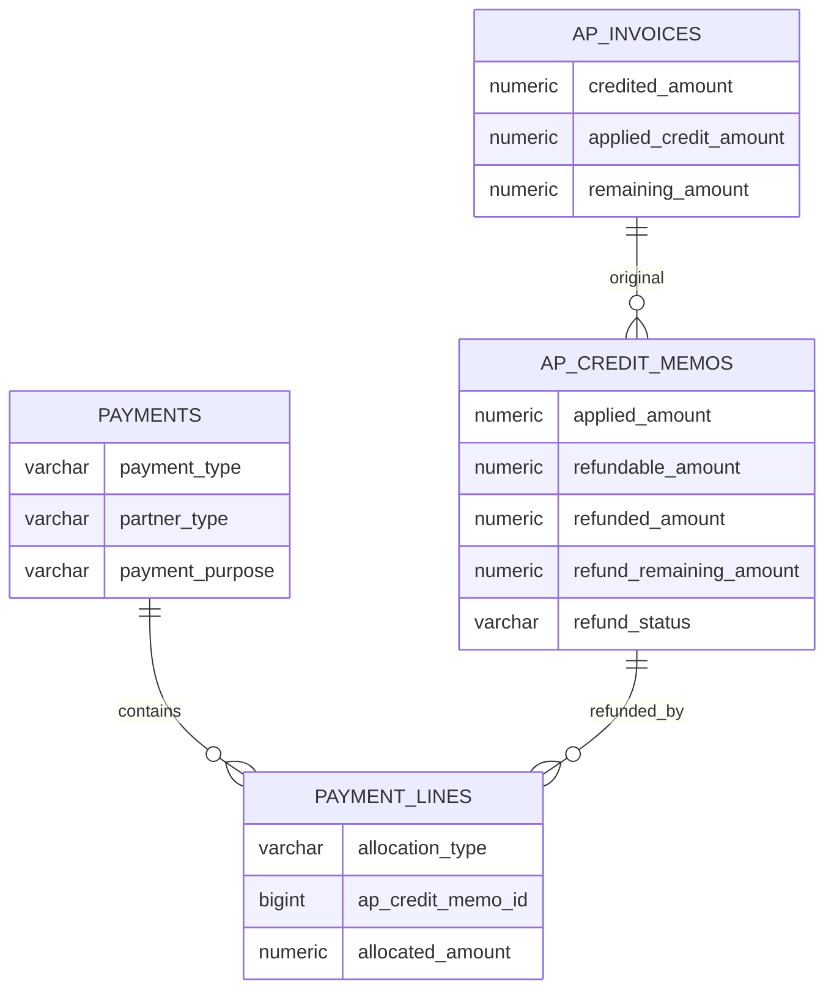

# 03. Schema：供应商退款主流程 V1

> 目标结构，不代表当前库已有这些字段。  
> 完整设计见 [../供应商退款/03-schema设计.md](../供应商退款/03-schema设计.md)。本文件是本期要落地的字段集。  
> 实施以 Liquibase 为准，并同步 `schema_tables` 与 `FI_schema_design.md`。

---

## 1. 改动总览

| 对象 | 动作 |
|------|------|
| `ap_invoices.applied_credit_amount` | 新增 |
| `ap_credit_memos` | 新增 applied / refundable 交易币与本位币快照、已退、待退、退款状态 |
| `payments.payment_purpose` | 新增 |
| `payment_lines.ap_credit_memo_id` | 新增 |
| `payment_lines` 汇兑快照 | 新增四列，仅退款核销行使用 |
| `PaymentAllocationType.AP_CREDIT_MEMO` | 新增 |
| `DocumentTypeEnum.SUPPLIER_REFUND` | 新增 |

**本波不增加：**

- `payments.reversal_date`
- `payment_lines.allocation_status` / `clearing_date` / `reversal_date` / `reversed_at` / `reversed_by`
- 独立 `supplier_refunds` 表
- 采购退货、收货表字段

---

## 2. AP 发票

```sql
ALTER TABLE lychee_erp.ap_invoices
    ADD COLUMN applied_credit_amount numeric(18,2) NOT NULL DEFAULT 0;

COMMENT ON COLUMN lychee_erp.ap_invoices.applied_credit_amount
    IS '已过账未作废贷项中实际冲减本票未付金额的合计';
```

```text
credited_amount        = 非 VOIDED 已过账贷项 total_amount 合计
applied_credit_amount  = 上述贷项 applied_amount 合计
remaining_amount       = total_amount − paid_amount − applied_credit_amount
0 ≤ applied_credit_amount ≤ credited_amount ≤ total_amount
remaining_amount ≥ 0
```

`credited_amount` 不得再直接进入 remaining 公式。

迁移：

```sql
UPDATE lychee_erp.ap_invoices
SET applied_credit_amount = credited_amount;
```

之后校验 `remaining = total − paid − applied_credit`。有差异则中止迁移，禁止 `max(0, ...)`。

---

## 3. 应付贷项

```sql
ALTER TABLE lychee_erp.ap_credit_memos
    ADD COLUMN applied_amount numeric(18,2) NOT NULL DEFAULT 0,
    ADD COLUMN refundable_amount numeric(18,2) NOT NULL DEFAULT 0,
    ADD COLUMN applied_base_amount numeric(18,2) NOT NULL DEFAULT 0,
    ADD COLUMN refundable_base_amount numeric(18,2) NOT NULL DEFAULT 0,
    ADD COLUMN refunded_amount numeric(18,2) NOT NULL DEFAULT 0,
    ADD COLUMN refund_remaining_amount numeric(18,2) NOT NULL DEFAULT 0,
    ADD COLUMN refund_status varchar(20) NOT NULL DEFAULT 'NOT_REQUIRED';
```

`refund_status`：`NOT_REQUIRED, UNREFUNDED, PARTIAL, REFUNDED`。

POSTED 时：

```text
applied + refundable = total
appliedBase + refundableBase = round(total × exchangeRate, 2)
0 ≤ refunded ≤ refundable
refund_remaining = refundable − refunded
```

本位币快照：

```text
appliedBase     = round(applied × exchangeRate, 2)
refundableBase  = round(total × exchangeRate, 2) − appliedBase
```

草稿到 APPROVED 拆分字段保持 0，只在持有原 AP 锁的 POST 事务内计算。

安全 CHECK（不依赖生命周期，以免挡住过账中间更新）：

```sql
ALTER TABLE lychee_erp.ap_credit_memos
    ADD CONSTRAINT ck_ap_credit_memos_applied_nonnegative
        CHECK (applied_amount >= 0),
    ADD CONSTRAINT ck_ap_credit_memos_refundable_nonnegative
        CHECK (refundable_amount >= 0),
    ADD CONSTRAINT ck_ap_credit_memos_applied_base_nonnegative
        CHECK (applied_base_amount >= 0),
    ADD CONSTRAINT ck_ap_credit_memos_refundable_base_nonnegative
        CHECK (refundable_base_amount >= 0),
    ADD CONSTRAINT ck_ap_credit_memos_refunded_range
        CHECK (refunded_amount >= 0 AND refunded_amount <= refundable_amount),
    ADD CONSTRAINT ck_ap_credit_memos_refund_remaining_nonnegative
        CHECK (refund_remaining_amount >= 0);
```

等式由服务层在锁内校验。

```sql
CREATE INDEX idx_ap_credit_memos_refundable
    ON lychee_erp.ap_credit_memos
       (tenant_id, company_id, partner_id, currency_option_id)
    WHERE invoice_status = 'POSTED'
      AND refund_remaining_amount > 0;
```

历史回填：

```sql
UPDATE lychee_erp.ap_credit_memos
SET applied_amount = total_amount,
    refundable_amount = 0,
    applied_base_amount = round(total_amount * exchange_rate, 2),
    refundable_base_amount = 0,
    refunded_amount = 0,
    refund_remaining_amount = 0,
    refund_status = 'NOT_REQUIRED'
WHERE invoice_status IN ('POSTED', 'VOIDED');
```

DRAFT / PENDING_APPROVAL / APPROVED 保持 0。

---

## 4. Payment 头档

```sql
ALTER TABLE lychee_erp.payments
    ADD COLUMN payment_purpose varchar(30) NOT NULL DEFAULT 'STANDARD';

COMMENT ON COLUMN lychee_erp.payments.payment_purpose
    IS 'STANDARD, SUPPLIER_REFUND';

CREATE INDEX idx_payments_purpose
    ON lychee_erp.payments
       (tenant_id, company_id, payment_purpose, status);
```

```java
public enum PaymentPurpose {
    STANDARD,
    SUPPLIER_REFUND
}
```

组合只由后端校验。`SUPPLIER_REFUND` 要求 `is_prepayment = false`。DRAFT 无核销行时可改 purpose；有行或非 DRAFT 不可改。

单号：

```text
DocumentTypeEnum.SUPPLIER_REFUND
prefix = SR
日期 = yyyyMM
序号 = 4 位，MONTHLY
```

`STANDARD → PAYMENT`，`SUPPLIER_REFUND → SUPPLIER_REFUND`，仍写入 `payment_no`。

不增加 `reversal_date`。

---

## 5. Payment 核销行

```sql
ALTER TABLE lychee_erp.payment_lines
    ADD COLUMN ap_credit_memo_id bigint NULL,
    ADD COLUMN source_exchange_rate numeric(18,6) NULL,
    ADD COLUMN source_base_amount numeric(18,2) NULL,
    ADD COLUMN settlement_base_amount numeric(18,2) NULL,
    ADD COLUMN exchange_difference_amount numeric(18,2) NULL;

ALTER TABLE lychee_erp.payment_lines
    ADD CONSTRAINT fk_payment_lines_ap_credit_memo
        FOREIGN KEY (ap_credit_memo_id)
        REFERENCES lychee_erp.ap_credit_memos (id);

CREATE INDEX idx_payment_lines_ap_credit_memo
    ON lychee_erp.payment_lines (ap_credit_memo_id);

CREATE UNIQUE INDEX uk_payment_lines_payment_credit_memo
    ON lychee_erp.payment_lines
       (tenant_id, payment_id, ap_credit_memo_id)
    WHERE ap_credit_memo_id IS NOT NULL;
```

本波一单只有一行核销，该唯一索引主要防重复插入。同一贷项出现在多张 Payment 上是允许的。

`AP_CREDIT_MEMO` 行：

```text
ap_credit_memo_id IS NOT NULL
ar_invoice_id / ap_invoice_id / 排程 id / applied_payment_id 均为 NULL
discount_amount = 0
```

DTO + service 校验；可选针对 `allocation_type='AP_CREDIT_MEMO'` 的 CHECK。不要重写其它 allocation type 的历史约束。

不回填、不增加 `allocation_status`。STANDARD 行继续物理删除核销；退款 POSTED 禁止删行，只 VOID 整单。VOID 后行仍在，靠 `payments.status = VOIDED` 排除有效核销。

汇兑快照（仅 `AP_CREDIT_MEMO` 在应用核销时写入，之后不改）：

```text
source_exchange_rate       = creditMemo.exchange_rate
source_base_amount         = round(allocated × memo.rate, 2)
settlement_base_amount     = round(allocated × payment.rate, 2)
exchange_difference_amount = settlement − source
```

本位币三列相等，汇差 0。`journal_entry_id`：有汇兑凭证时指向该凭证；无汇差则为 NULL。VOID 用该 id 冲销。

与 STANDARD 折扣/GL 行共用 `journal_entry_id` 列：退款行无折扣，不冲突。

---

## 6. 实体关系



一贷项多分次退款；一退款单只核一张贷项。

---

## 7. Repository 与锁

```text
PaymentRepository.findByIdForUpdate
ApCreditMemoRepository.findByIdForUpdate
ApInvoiceRepository.findByIdForUpdate
```

退款过账：Payment → CreditMemo → 原 AP。

可退款分页不能代替过账校验。有效退款行必须带 `payments.status = POSTED` 且 `payment_purpose = SUPPLIER_REFUND`。

另需：按 AP 汇总实付 `allocated_amount`、按 AP 汇总其它贷项 `refundable`、按贷项查有效退款是否存在。

---

## 8. 落库顺序

### 8.1 贷项 POST

```text
1. 锁贷项、原 AP、原 AP 行
2. 重算 quantity 与 grossCreditAvailable
3. 拆 applied / refundableGross
4. 校验实付现金上限
5. 写交易币与重乘本位币快照
6. 完整贷项凭证
7. AP credited / appliedCredit / remaining
8. 回减收货占用
9. 贷项 → POSTED
```

### 8.2 退款 POST

```text
1. 锁 Payment、贷项、原 AP
2. 校验用途、恰好一行、全额分配、币别与余额
3. 银行凭证
4. 写汇兑快照；fx≠0 则写调整凭证
5. 贷项 refunded / remaining / status
6. payment.unallocated = 0
```

### 8.3 退款 VOID

```text
1. 锁 Payment、贷项、原 AP
2. 冲核销行汇兑凭证（若有）
3. refunded -= allocated，重算 remaining / status
4. 冲银行凭证（现网 reverseEntry）
```

不物理删除 POSTED 退款行。

---

## 9. 数据一致性

每次贷项 POST/VOID、退款 POST/VOID 后：

```text
AP:
  remaining = total − paid − appliedCredit
  0 ≤ appliedCredit ≤ credited ≤ total

Credit Memo POSTED / VOIDED 快照:
  applied + refundable = total
  appliedBase + refundableBase = round(total × rate, 2)
  refunded + refundRemaining = refundable

同一原 AP:
  Σ(POSTED 非 VOID 贷项 refundable) ≤ Σ(该 AP 有效付款行 allocated)

Supplier Refund POSTED:
  恰好一行 AP_CREDIT_MEMO
  allocated = amount
  unallocated = 0
```

禁止用触发器维护合计。

---

## 10. 文档同步（代码落地后）

- Liquibase：字段、约束、索引、外键、回填、`SR` 单号
- `schema_tables/FI/` 下 ap_invoices / ap_credit_memos / payments / payment_lines
- `database/FI_schema_design.md`
- `财务/02.1-API端点与状态矩阵.md`
- 应付贷项 `02` / `03` / `04` 中 `remaining = total − paid − credited` 改为 `applied_credit`
- **不要**把完整设计目录里的 `clearing_date` / `allocation_status` 写进本期 changeset
