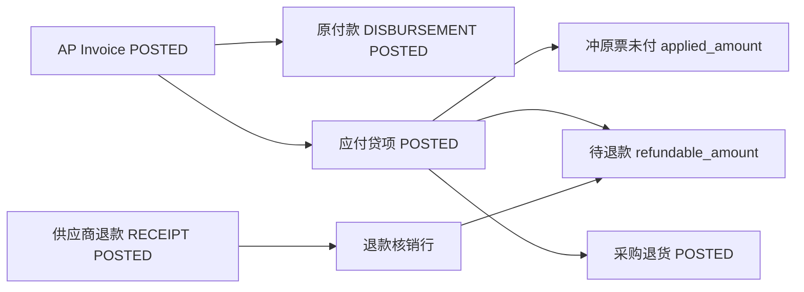

# 02. 目标流程：供应商退款（To-Be）

> 正式名称：**供应商退款 / `SUPPLIER_REFUND`**。  
> 资金载体复用 `payments`，业务组合固定为 `RECEIPT + SUPPLIER + SUPPLIER_REFUND`。  
> 退款核销应付贷项的待退款开放金额；原付款保留，退款不动库存与收货占用。

---

## 1. 目标单据链



三个维度保持独立：

```text
应付贷项：借 AP / 贷 GR/IR、费用与税；释放收货占用
采购退货：库存出库与暂估侧处理
供应商退款：借银行 / 贷 AP；结清贷项待退款金额
```

退款不引用采购退货行。是否实际退货由 WM 单据表达；本期贷项仍须使用现有“按原行数量 × 原单价”的数量型贷回，可有或无实际 WM 退货，不支持纯金额折让。

---

## 2. 适用场景

以下金额示例均假设原 AP 的有效付款行 `discount_amount = 0`。

### 2.1 全额已付后退款

```text
AP total                 = 100
AP paid                  = 100
AP remaining             = 0
Credit Memo total        = 40

credit applied           = 0
credit refundable        = 40
credit refund remaining  = 40
```

供应商退款 40 核销后：

```text
credit refunded          = 40
credit refund remaining  = 0
refund status            = REFUNDED
```

原 AP 仍保留 `paid_amount = 100`，原付款仍为 `POSTED`。

### 2.2 部分已付、贷项同时冲未付与退款

```text
AP total                 = 100
AP paid                  = 60
AP remaining before CM   = 40
Credit Memo total        = 70

credit applied           = 40
credit refundable        = 30
AP remaining after CM    = 0
```

供应商只需实际退款 30。

### 2.3 贷项未超过未付金额

```text
AP total                 = 100
AP paid                  = 20
AP remaining before CM   = 80
Credit Memo total        = 30

credit applied           = 30
credit refundable        = 0
AP remaining after CM    = 50
refund status            = NOT_REQUIRED
```

该场景与应付贷项 V1 行为一致，不需要供应商退款。

### 2.4 退款先到账

允许先建立并过账：

```text
Payment:
  payment_type      = RECEIPT
  partner_type      = SUPPLIER
  payment_purpose   = SUPPLIER_REFUND
  amount            = 实际到账
  unallocated       = amount
```

之后待应付贷项过账，再通过核销 API 分配。资金过账不要求预先存在核销行。

---

## 3. 应付贷项金额拆分

### 3.1 AP 表头语义

原票保留两个贷项金额：

```text
credited_amount         = 已过账、未作废贷项总额
applied_credit_amount   = 上述贷项中已用于冲原票未付的金额
remaining_amount        = total_amount − paid_amount − applied_credit_amount
```

约束：

```text
0 ≤ applied_credit_amount ≤ credited_amount
remaining_amount ≥ 0
```

`credited_amount` 不改成“仅已应用金额”，避免改变现有报表和 UI 的“贷项总额”语义。

AP `payment_status` 仍只反映原票是否存在待付金额。全额已付后形成待退款金额时，原 AP 保持 `PAID`；供应商是否尚欠退款只看贷项 `refund_status / refund_remaining_amount`，不在 AP 表头增加第四种付款状态。

历史数据中所有已过账贷项均受 V1 `total ≤ remaining` 限制，因此迁移时：

```text
applied_credit_amount = credited_amount
```

### 3.2 贷项过账拆分

过账前锁定贷项、原 AP 与原 AP 行，先取得：

```text
remainingBefore = total − paid − appliedCredit
grossCreditAvailable = total − credited
```

校验：

```text
creditMemo.total ≤ grossCreditAvailable
每行 quantity ≤ creditableQty
```

不再使用：

```text
creditMemo.total ≤ remainingBefore
```

拆分：

```text
appliedAmount     = min(creditMemo.total, remainingBefore)
refundableAmount  = creditMemo.total − appliedAmount
memoTotalBase     = round(creditMemo.total × exchangeRate, 2)
apRemainingBase   = 原 AP 实际未结本位币开放金额
appliedCandidate  = round(appliedAmount × exchangeRate, 2)
appliedBase       = appliedAmount 结清 remainingBefore
                    ? apRemainingBase
                    : min(appliedCandidate, apRemainingBase)
refundableBase    = memoTotalBase − appliedBase
refundedAmount    = 0
refundRemaining   = refundableAmount
```

本位币时 `apRemainingBase = remainingBefore`。外币时必须由“普通 AP 付款汇兑”前置能力提供原 AP 实际未结本位币金额，禁止只用 `remainingBefore × exchangeRate` 重算，也禁止读取贷项 Journal 后再反推。

若 `refundableAmount > 0`，原 AP 存在任一有效付款行 `discount_amount > 0` 时拒绝过账。本期不把付款折扣视为现金，也不设计折扣比例转回；只产生 `appliedAmount`、无需现金退款的贷项不受影响。

“有效付款折扣行”定义为：

```text
payments.status = POSTED
AND payments.payment_type = DISBURSEMENT
AND payment_lines.ap_invoice_id = originalApInvoice.id
AND payment_lines.allocation_type = INVOICE
AND payment_lines.allocation_status = APPLIED
AND payment_lines.discount_amount > 0
```

回写原 AP：

```text
credited_amount       += creditMemo.total
applied_credit_amount += appliedAmount
remaining_amount       = total − paid − appliedCredit
```

贷项的完整 `total_amount` 仍用于凭证、税、数量与收货占用；`appliedAmount` 只影响原票子账剩余。

### 3.3 贷项退款状态

生命周期状态继续使用 `invoice_status`，另加退款执行状态：

| 条件 | `refund_status` |
|------|-----------------|
| `refundable = 0` | `NOT_REQUIRED` |
| `refundable > 0` 且 `refunded = 0` | `UNREFUNDED` |
| `0 < refunded < refundable` | `PARTIAL` |
| `refunded = refundable` | `REFUNDED` |

退款状态不替代 `POSTED / VOIDED`。

---

## 4. 供应商退款收款

### 4.1 业务用途矩阵

`payments` 增加 `payment_purpose`：

| `payment_purpose` | `payment_type` | `partner_type` | 子账 |
|-------------------|----------------|----------------|------|
| `STANDARD` | `RECEIPT` | `CUSTOMER` | AR |
| `STANDARD` | `DISBURSEMENT` | `SUPPLIER` | AP |
| `SUPPLIER_REFUND` | `RECEIPT` | `SUPPLIER` | AP |

本期其他组合全部拒绝。`EMPLOYEE` 不在本专题扩展。

供应商退款：

- 复用 `payments` 表、API、工作流和权限；
- 单号使用 `DocumentTypeEnum.SUPPLIER_REFUND`，前缀 `SR`；
- `sourceModule = AP`；
- `sourceDocType = SUPPLIER_REFUND`；
- 金额必须为正；
- `is_prepayment = false`；
- 可无核销行先过账；
- `unallocated_amount > 0` 时可继续核销。
- 创建、更新和过账均须校验内部银行账户属于同一公司、币别一致、状态有效，且银行 GL 属于该公司；对方银行账户若填写，必须属于同一供应商且有效。
- `payment_purpose` 建单后不可修改；不能通过改用途绕过已有核销行规则。

### 4.2 退款核销行

`PaymentAllocationType` 增加 `AP_CREDIT_MEMO`，核销行使用：

```text
allocation_type       = AP_CREDIT_MEMO
ap_credit_memo_id     = 被核销贷项
allocated_amount      = 本次退款金额
discount_amount       = 0
clearing_date         = 核销日期
```

校验：

1. 外部追加核销时 `payments.status = POSTED`；Payment POST 内部应用拟核销行时允许表头仍为 `APPROVED`。
2. `payment_purpose = SUPPLIER_REFUND` 且 `is_prepayment = false`。
3. 贷项必须 `POSTED`。
4. 公司、供应商、币别一致。
5. `allocated_amount > 0`。
6. 外部追加时 `allocated_amount ≤ payment.unallocated_amount`；POST 应用拟核销行时按全部 PROPOSED 行聚合校验，不能再次从已经预扣的展示值逐行扣减。
7. `allocated_amount ≤ creditMemo.refund_remaining_amount`。
8. 同一 Payment 不得重复引用同一贷项。DRAFT 可通过 items API 更新；POSTED 后只能反向核销原行再新增。
9. `discount_amount` 必须为 0；退款差额本期不走现金折扣。
10. 不允许同时填写 `ar_invoice_id`、`ap_invoice_id`、`applied_payment_id`。
11. `SUPPLIER_REFUND` 只允许 `AP_CREDIT_MEMO` 行；不允许 `INVOICE`、`GL_ACCOUNT`、`PREPAYMENT`。
12. `clearing_date` 必填，不早于 Payment `payment_date`、贷项 `credit_date`、该 Payment 既有反向核销日及该贷项既有反向核销日，且必须落在开放期间。

一张退款单可以核销多张贷项，但所有贷项必须与表头同公司、同供应商、同币别。

应用核销：

```text
creditMemo.refunded_amount += allocated_amount
creditMemo.refund_remaining_amount =
    refundable_amount − refunded_amount
payment.unallocated_amount =
    payment.amount − Σ(当前阶段 counted allocation lines)

DRAFT / PENDING_APPROVAL / APPROVED → 计 PROPOSED
POSTED                           → 计 APPLIED
```

纯退款核销不重复生成银行分录；只有汇率差异时生成按行调整凭证。

### 4.3 核销行生命周期

`payment_lines` 增加：

```text
PROPOSED → APPLIED → REVERSED
```

- DRAFT Payment 建立的拟核销行为 `PROPOSED`，用于显示预计 `unallocated_amount`，不回写贷项。
- Payment POST 时一次锁定所有目标贷项、聚合校验，再把全部 PROPOSED 行应用并转为 `APPLIED`；最终余额按目标状态 APPLIED 显式重算，不能因表头在动作处理器中暂时仍为 APPROVED 而回头统计 PROPOSED。
- POSTED Payment 后补核销直接建立 `APPLIED` 行。
- 反向核销或 Payment VOID 后转为 `REVERSED`，保留审计，不再计入 Payment 或贷项合计。
- DRAFT 删除 PROPOSED 行仍可物理删除。

状态字段适用于全部 PaymentLine，以便统一 POST / VOID；本期只有供应商退款的 AP_CREDIT_MEMO APPLIED 行强制走 REVERSED。STANDARD Payment 的 POSTED allocation 仍沿用现网“恢复后物理删除”。

“有效退款核销行”正式定义为：

```text
payments.status = POSTED
AND payments.payment_purpose = SUPPLIER_REFUND
AND payment_lines.allocation_type = AP_CREDIT_MEMO
AND payment_lines.allocation_status = APPLIED
```

不同 Payment 的 PROPOSED 行不预占贷项开放金额；两张草稿可选择同一余额，第二张 POST 时在锁内失败。

---

## 5. 凭证

### 5.1 应付贷项

贷项完整金额仍按既有逻辑过账：

```text
借：供应商 AP
贷：GR/IR、CIP 或费用
贷：进项税
价差、汇差：与原 AP 方向相反
```

拆分 `applied / refundable` 不产生额外凭证。

### 5.2 供应商退款资金

退款 Payment 过账时，按头档金额与退款日汇率：

```text
借：公司银行 GL
贷：供应商 AP
```

伙伴维度必须为供应商。

### 5.3 退款核销汇兑损益

Payment 汇率按退款日取得并在表头冻结；贷项使用其历史汇率。

每条核销行：

```text
sourceCandidate      = round(allocatedAmount × creditMemo.exchangeRate, 2)
settlementCandidate  = round(allocatedAmount × payment.exchangeRate, 2)
sourceBase / settlementBase 按下述剩余上限分摊
fxDifference         = settlementBase − sourceBase
```

分次核销使用“候选值 + 剩余上限”，禁止简单地让最后一行承接可能为负的尾差：

```text
sourceTotalBase     = creditMemo.refundableBaseAmount
sourceConsumedBase  = Σ(该贷项有效行 + 本事务较早行的 sourceBase)
sourceRemainingBase = sourceTotalBase − sourceConsumedBase
sourceCandidate     = round(allocatedAmount × memoRate, 2)
sourceBase          = min(sourceCandidate, sourceRemainingBase)

settlementTotalBase     = round(payment.amount × paymentRate, 2)
settlementConsumedBase  = Σ(该 Payment 有效行 + 本事务较早行的 settlementBase)
settlementRemainingBase = settlementTotalBase − settlementConsumedBase
settlementCandidate     = round(allocatedAmount × paymentRate, 2)
settlementBase          = min(settlementCandidate, settlementRemainingBase)
```

若本行分别结清贷项或用完 Payment，则直接取对应 `remainingBase`。所有本位币分摊必须 `≥ 0`。Payment POST 批量应用 PROPOSED 行时，按 `line_no / id` 稳定排序并使用事务内工作合计，不能只查询数据库中定义为“有效”的行。

这样既不会因极小金额逐行四舍五入产生负尾差，也能保证全部结清时累计值等于贷项历史本位币金额和退款银行凭证本位币金额。

若 `fxDifference > 0`，退款日同币金额价值高于贷项历史价值：

```text
借：供应商 AP（仅本位币）       fxDifference
贷：已实现汇兑收益（仅本位币）  fxDifference
```

若 `fxDifference < 0`：

```text
借：已实现汇兑损失（仅本位币）  abs(fxDifference)
贷：供应商 AP（仅本位币）       abs(fxDifference)
```

若为 0，不生成调整凭证。

要求：

- 伙伴 AP 行带 `SUPPLIER` 维度；
- `fxDifference != 0` 时，汇兑科目通过统一的 FI 科目解析器取得，禁止前端传入；差额为 0 时不要求配置；
- 调整凭证 `sourceModule = AP`；
- `sourceDocType = SUPPLIER_REFUND_ALLOC`；
- `sourceDocId = payment_line.id`；
- `postDate = payment_line.clearing_date`；
- 凭证 id 写入 `payment_lines.journal_entry_id`；
- 反向核销或 VOID 退款单时冲销该凭证。

汇兑计算与凭证组装抽为可复用组件，但普通 AP/AR 收付款本期不接入。

外币启用闸：现有普通 AP 付款尚未处理“AP 历史汇率 vs 原付款汇率”的已实现汇兑。本专题只保证贷项待退款与供应商退款之间的汇兑正确；普通 AP 付款汇兑未正确落地前，生产环境只启用本位币供应商退款。

---

## 6. 工作流与作废顺序

### 6.1 退款 Payment

沿用现有：

```text
DRAFT → PENDING_APPROVAL → APPROVED → POSTED → VOIDED
```

- DRAFT 可维护头档和拟核销行。
- POST 时先生成银行凭证，再聚合应用已有 PROPOSED 核销行并转 `APPLIED`。
- POSTED 可追加核销或反向核销既有 APPLIED 行。
- VOID 时填写开放期间的 `reversal_date`，先恢复全部贷项退款开放金额、将行转 `REVERSED`、冲核销调整凭证，再按同一日期冲银行凭证。
- `reversal_date` 是会计日期；`voided_at` 继续记录实际操作时间。
- 单行反向要求 `reversal_date ≥ clearing_date`；Payment VOID 要求 `reversal_date` 不早于 `payment_date`、全部行的 `clearing_date` 以及既有 REVERSED 行的 `reversal_date`。
- 凭证服务按 `reversal_date` 生成新的 POSTED 冲销凭证，并在原凭证保留 reversal 关联；禁止改写原凭证日期。

### 6.2 应付贷项 VOID

存在以下任一条件时拒绝：

1. 存在有效退款核销行；
2. 本贷项涉及的收货行存在 `POSTED` 采购退货；
3. 既有收货占用无法回加。

退款 Payment 已 VOID 的历史行不拦贷项 VOID，但保留审计引用。

贷项 VOID：

```text
apInvoice.credited_amount       -= creditMemo.total
apInvoice.applied_credit_amount -= creditMemo.applied_amount
重算 apInvoice.remaining
冲贷项凭证
回加收货占用
```

### 6.3 原付款核销的撤销

贷项的 `applied / refundable` 是按过账时原票已付状态冻结的。若某个原付款核销被移除或其 Payment 被 VOID，会改变拆分依据。

因此，当目标 AP 存在非 VOIDED 且 `refundable_amount > 0` 的贷项时：

- 禁止移除该 AP 的原付款核销行；
- 禁止 VOID 含该核销行的原付款；
- 提示先处理下游供应商退款、采购退货与贷项。

只存在 `refundable_amount = 0` 的贷项时，付款撤销仍可按现有公式恢复原票 remaining。

### 6.4 完整撤销顺序

```text
1. 反向退款核销或 VOID 供应商退款 Payment
2. 冲销 POSTED 采购退货（如有）
3. VOID 应付贷项
4. 移除原付款核销或 VOID 原付款（如确有需要）
```

遵循“后置单据阻断前置单据”。

这里定义的是业务依赖顺序。开放期间冲销日本期只扩展到退款核销与供应商退款 Payment；采购退货冲销、应付贷项 VOID 继续遵循各自现网期间规则，原期间关闭时仍可能需要重开，不在本专题扩大。

---

## 7. 并发与事务

### 7.1 贷项过账

同一事务：

1. 锁贷项；
2. 锁原 AP；
3. 锁原 AP 行；
4. 重算数量与 `grossCreditAvailable`；
5. 计算 `applied / refundable` 交易币及本位币快照；
6. 写贷项凭证；
7. 回写原 AP；
8. 回减收货占用；
9. 状态转 `POSTED`。

### 7.2 退款核销

同一事务，锁顺序：

```text
Payment → ApCreditMemo（id 升序）→ original ApInvoice（id 升序）
```

在锁内重算：

- Payment 最新 `unallocated_amount`；
- 每张贷项最新 `refund_remaining_amount`；
- 汇兑差额；
- 退款状态。

两张退款 Payment 并发核销同一贷项时，只允许一方消费同一开放金额；另一方必须因余额不足回滚。

退款核销必须按 id 升序锁定去重后的原 AP，即使本次不修改 AP 金额，也要与贷项 POST / VOID、原付款撤销形成一致锁序。

### 7.3 付款与贷项并发

普通 AP 付款应用/恢复也必须改用 `ApInvoiceRepository.findByIdForUpdate`，与贷项过账共享 AP 行锁，避免 `paid / credited / appliedCredit / remaining` 丢更新。

---

## 8. API

复用 `/api/v1/fi/payments`。

### 8.1 头档

现有 Payment CRUD 与工作流请求/响应增加：

```text
paymentPurpose: STANDARD | SUPPLIER_REFUND
```

供应商退款仍使用现有：

| API | 行为 |
|-----|------|
| `POST /api/v1/fi/payments` | 创建退款或未分配退款草稿 |
| `POST /{id}/submit` | 提交 |
| `POST /{id}/approve` | 审批 |
| `POST /{id}/post` | 过账银行资金并应用拟核销 |
| `POST /{id}/void` + `PaymentVoidRequest{reversalDate}` | 恢复贷项开放金额，在开放期间冲凭证；仅 SUPPLIER_REFUND 必填，STANDARD 可省略 |

### 8.2 核销

DRAFT 拟核销沿用 items API：

| API | 行为 |
|-----|------|
| `POST /{id}/items` | 建立 PROPOSED 贷项核销行 |
| `POST /{id}/items/bulk-create` | 批量建立 PROPOSED 贷项核销行 |
| `PUT /{id}/items/{itemId}` | 更新 PROPOSED 行 |
| `DELETE /{id}/items/bulk-delete` | 物理删除 PROPOSED 行 |

POSTED 后：

| API | 行为 |
|-----|------|
| `POST /{id}/allocations` | POSTED 退款追加一条或多条贷项核销 |
| `POST /{id}/allocations/{lineId}/reverse` + `AllocationReverseRequest{reversalDate}` | 行转 REVERSED，恢复贷项开放金额并在开放期间冲汇兑凭证 |

现有 `DELETE /{id}/allocations/{lineId}` 对 `SUPPLIER_REFUND + AP_CREDIT_MEMO + APPLIED` 必须拒绝，防止物理删除已过账退款核销；只能使用 reverse API。

`PaymentLineRequest` 增加：

```text
allocationType: AP_CREDIT_MEMO
apCreditMemoId: Long
clearingDate: LocalDate
```

### 8.3 可退款贷项查询

新增：

```text
POST /api/v1/fi/ap-credit-memos/refundable/page
```

固定条件：

```text
invoice_status = POSTED
refund_remaining_amount > 0
```

并按 Payment 表头过滤公司、供应商、币别。

返回 `ApCreditMemoRefundableResponse`：贷项 id/code、原 AP id/code、外部贷项号、贷项日、公司、供应商、币别/汇率、`refundable / refunded / refundRemaining` 及 `refundableBase`。

该分页是本期供应商待退款工作清单。现有 AP 发票账龄仍只展示应付发票 remaining，不把贷项待退款净入发票 payment status；通用供应商开放项净额账龄另行建设。

权限：

```text
/fi/ap-credit-memos:read
/fi/payments:read
追加或反向核销时另需 /fi/payments:update
```

---

## 9. 前端

### 9.1 Payment 页面

复用 `/fi/payments`：

- 增加“业务用途”：标准收付款 / 供应商退款；
- 选择供应商退款后固定 `RECEIPT + SUPPLIER`；
- 表头显示退款日汇率；
- 核销弹窗改为选择“可退款应付贷项”；
- 展示贷项号、原 AP、供应商贷项号、可退款金额、已退款、待退款；
- 允许一单勾选多张贷项并填写本次退款金额；
- 核销日默认 `max(当天, 退款日, 所选贷项日期, 相关历史反向核销日)`；
- 显示逐行汇兑损益预估；
- POSTED 且有未分配金额时允许继续核销。
- 反向核销与 VOID 弹窗要求选择开放期间的冲销日。

### 9.2 应付贷项页面

增加：

- `appliedAmount`；
- `refundableAmount`；
- `refundableBaseAmount`；
- `refundedAmount`；
- `refundRemainingAmount`；
- `refundStatus`。

当 `POSTED && refundRemainingAmount > 0` 且具有 Payment create 权限时显示“登记供应商退款”，跳转 Payment 新增页并预填：

- `paymentPurpose=SUPPLIER_REFUND`；
- 公司、供应商、币别；
- 来源贷项。

现金先到账的场景仍可直接从 Payment 页面建立未分配退款。

应付发票页现有“生成贷项”条件必须从 `remainingAmount > 0` 改为“仍有可贷数量/尚未贷回总额”。全额已付 AP 也必须能进入应付贷项作业。

---

## 10. 权限、关帐与审计

- 沿用 `/fi/payments:*` 权限，不新增第二套退款 CRUD 权限。
- “登记供应商退款”入口校验 `/fi/payments:create`。
- 未过账供应商退款按 `payment_date` 继续阻挡财务关帐；POSTED / VOIDED 不拦。
- 后补核销按 `clearing_date` 校验开放期间；不因原退款期间已经关闭而要求重开原期间。
- 反向核销或 VOID 使用用户填写的开放期间 `reversal_date`；原 paymentDate / clearingDate 只保留历史，不要求重开。
- 上述强制 `reversal_date` 仅适用于 SUPPLIER_REFUND；STANDARD Payment VOID 继续走现网规则。
- `reference_no` 用于记录银行流水号，提交前建议必填；是否强制与现有 Payment 统一，不在本期单独改变。
- 操作日志显示正式业务名“供应商退款”，不能只显示泛化的“收款”。
- Journal 来源必须可跳回 Payment，并根据 `payment_purpose` 打开供应商退款模式。

---

## 11. 本期不做

- 供应商预付款退回；
- 将贷项开放金额冲抵其他或未来 AP；
- 一张贷项核销多张原 AP（贷项仍一对一原票）；
- 客户退款；
- 普通 AP/AR 收付款的汇兑损益改造；
- 普通 AP 付款汇兑完成前启用外币供应商退款；
- 原 AP 存在付款折扣时形成待退款金额；
- 纯金额或改单价折让贷项；
- 通用供应商开放项核销与净额账龄；
- 银行流水导入、自动匹配与银企直联；
- 退款差额、短款核销和容差；
- 退款再次影响库存、采购退货或收货占用；
- 用负金额 Payment 或负数量贷项表达退款。
