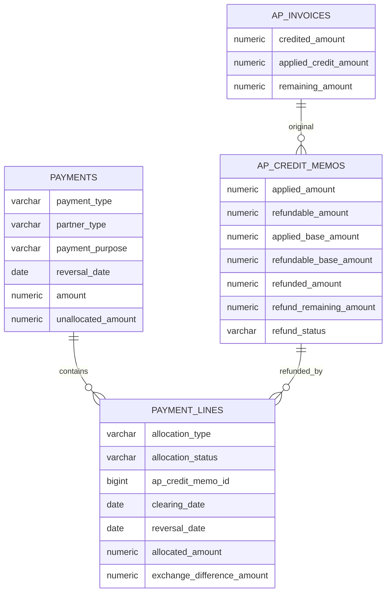

# 03. Schema 设计：供应商退款

> 本文件描述目标结构，不代表当前数据库已具备这些字段。  
> 实施时以 Liquibase changeset 为准，并同步 `schema_tables` 与 `FI_schema_design.md`。

---

## 1. 改动总览

| 对象 | 动作 |
|------|------|
| `ap_invoices.applied_credit_amount` | 新增：实际用于冲减原票未付的贷项金额 |
| `ap_credit_memos` | 新增贷项应用/可退款的交易币与本位币快照、已退款、待退款及退款状态 |
| `payments.payment_purpose / reversal_date` | 新增：区分业务用途并记录会计冲销日 |
| `payment_lines.ap_credit_memo_id` | 新增：退款核销目标 |
| `payment_lines` 生命周期 | 新增核销状态、核销日、冲销日与冲销审计 |
| `payment_lines` 汇兑快照 | 新增：贷项历史本位币金额、退款本位币金额、汇差 |
| `PaymentAllocationType.AP_CREDIT_MEMO` | 新增 |
| `DocumentTypeEnum.SUPPLIER_REFUND` | 新增：单号与凭证来源 |
| 独立 `supplier_refunds` 表 | 不新增 |
| 采购退货、收货表 | 不修改 |

---

## 2. AP 发票

### 2.1 新字段

```sql
ALTER TABLE lychee_erp.ap_invoices
    ADD COLUMN applied_credit_amount numeric(18,2) NOT NULL DEFAULT 0;

COMMENT ON COLUMN lychee_erp.ap_invoices.applied_credit_amount
    IS '已过账未作废贷项中实际冲减本票未付金额的合计';
```

### 2.2 金额语义

```text
credited_amount        = 非 VOIDED 已过账贷项 total_amount 合计
applied_credit_amount  = 上述贷项 applied_amount 合计
remaining_amount       = total_amount − paid_amount − applied_credit_amount
```

约束：

```text
0 ≤ applied_credit_amount ≤ credited_amount ≤ total_amount
remaining_amount ≥ 0
```

`credited_amount` 保留“供应商共开了多少贷项”的业务含义；不得继续直接用于 remaining 公式。

### 2.3 迁移

现存已过账贷项均满足 V1 `creditMemo.total ≤ invoice.remainingBefore`，因此全部应用于原票：

```sql
UPDATE lychee_erp.ap_invoices
SET applied_credit_amount = credited_amount;
```

迁移后运行一致性检查：

```text
remaining_amount
= total_amount − paid_amount − applied_credit_amount
```

若存在差异应中止迁移并先修数据，禁止用 `max(0, ...)` 静默吞掉问题。

---

## 3. 应付贷项

### 3.1 新字段

```sql
ALTER TABLE lychee_erp.ap_credit_memos
    ADD COLUMN applied_amount numeric(18,2) NOT NULL DEFAULT 0,
    ADD COLUMN refundable_amount numeric(18,2) NOT NULL DEFAULT 0,
    ADD COLUMN applied_base_amount numeric(18,2) NOT NULL DEFAULT 0,
    ADD COLUMN refundable_base_amount numeric(18,2) NOT NULL DEFAULT 0,
    ADD COLUMN refunded_amount numeric(18,2) NOT NULL DEFAULT 0,
    ADD COLUMN refund_remaining_amount numeric(18,2) NOT NULL DEFAULT 0,
    ADD COLUMN refund_status varchar(20) NOT NULL DEFAULT 'NOT_REQUIRED';

COMMENT ON COLUMN lychee_erp.ap_credit_memos.applied_amount
    IS '贷项过账时实际冲减原 AP remaining 的金额';
COMMENT ON COLUMN lychee_erp.ap_credit_memos.refundable_amount
    IS '贷项中对应原 AP 已付部分、应由供应商退回的冻结金额';
COMMENT ON COLUMN lychee_erp.ap_credit_memos.applied_base_amount
    IS '贷项实际结清原 AP 未结本位币开放金额的快照';
COMMENT ON COLUMN lychee_erp.ap_credit_memos.refundable_base_amount
    IS 'round(total_amount * exchange_rate, 2) - applied_base_amount，作为退款开放项历史本位币总额';
COMMENT ON COLUMN lychee_erp.ap_credit_memos.refunded_amount
    IS '有效供应商退款核销合计';
COMMENT ON COLUMN lychee_erp.ap_credit_memos.refund_remaining_amount
    IS '待退款金额 = refundable_amount - refunded_amount';
COMMENT ON COLUMN lychee_erp.ap_credit_memos.refund_status
    IS 'NOT_REQUIRED, UNREFUNDED, PARTIAL, REFUNDED';
```

### 3.2 金额约束

生命周期进入 `POSTED` 时必须满足：

```text
applied_amount + refundable_amount = total_amount
applied_base_amount + refundable_base_amount =
    round(total_amount × exchange_rate, 2)
0 ≤ refunded_amount ≤ refundable_amount
refund_remaining_amount = refundable_amount − refunded_amount
```

`applied_base_amount` 的来源：

```text
本位币：applied_amount
外币：普通 AP 付款汇兑前置能力提供的原 AP 实际未结本位币开放金额
      若本贷项只部分应用，则取候选值与该开放金额的较小值；
      若结清原 AP remaining，则取完整开放金额。
```

禁止简单使用 `round(applied_amount × exchange_rate, 2)` 代替外币 AP 实际开放金额；也禁止读取刚生成的贷项 Journal 再反推。`refundable_base_amount` 使用贷项总本位币金额减 `applied_base_amount`。

草稿到审批阶段尚未计算最终拆分，金额字段保持 0；拆分只能在持有原 AP 锁的 POST 事务内确定。

数据库加入不依赖生命周期状态的安全约束：

```sql
ALTER TABLE lychee_erp.ap_credit_memos
    ADD CONSTRAINT ck_ap_credit_memos_applied_nonnegative
        CHECK (applied_amount >= 0),
    ADD CONSTRAINT ck_ap_credit_memos_refundable_nonnegative
        CHECK (refundable_amount >= 0),
    ADD CONSTRAINT ck_ap_credit_memos_applied_base_nonnegative
        CHECK (applied_base_amount >= 0),
    ADD CONSTRAINT ck_ap_credit_memos_refundable_base_nonnegative
        CHECK (refundable_base_amount >= 0),
    ADD CONSTRAINT ck_ap_credit_memos_refunded_range
        CHECK (refunded_amount >= 0 AND refunded_amount <= refundable_amount),
    ADD CONSTRAINT ck_ap_credit_memos_refund_remaining_nonnegative
        CHECK (refund_remaining_amount >= 0);
```

交易币拆分等式、本位币拆分等式及 `refund_remaining_amount = refundable_amount − refunded_amount` 同时由服务层在锁内校验。若最终落库采用可延迟约束，可再补数据库等式约束；不要用会阻断 APPROVED → POSTED 中间更新的即时状态约束。

### 3.3 状态索引

退款选单固定查 `POSTED && refund_remaining_amount > 0`：

```sql
CREATE INDEX idx_ap_credit_memos_refundable
    ON lychee_erp.ap_credit_memos
       (tenant_id, company_id, partner_id, currency_option_id, refund_status)
    WHERE invoice_status = 'POSTED'
      AND refund_remaining_amount > 0;
```

### 3.4 历史贷项回填

现存数据没有已付退款：

```sql
UPDATE lychee_erp.ap_credit_memos
SET applied_amount = total_amount,
    refundable_amount = 0,
    applied_base_amount = round(total_amount * exchange_rate, 2),
    refundable_base_amount = 0,
    refunded_amount = 0,
    refund_remaining_amount = 0,
    refund_status = 'NOT_REQUIRED'
WHERE invoice_status IN ('POSTED', 'VOIDED');
```

DRAFT / PENDING_APPROVAL / APPROVED 保持金额拆分字段为 0，在未来过账时按新规则计算。

---

## 4. Payment 头档

### 4.1 业务用途

```sql
ALTER TABLE lychee_erp.payments
    ADD COLUMN payment_purpose varchar(30) NOT NULL DEFAULT 'STANDARD',
    ADD COLUMN reversal_date date NULL;

COMMENT ON COLUMN lychee_erp.payments.payment_purpose
    IS 'STANDARD, SUPPLIER_REFUND';
COMMENT ON COLUMN lychee_erp.payments.reversal_date
    IS 'SUPPLIER_REFUND POSTED VOID 必填的会计冲销日；STANDARD 可为 NULL；voided_at 为实际操作时间';

CREATE INDEX idx_payments_purpose
    ON lychee_erp.payments
       (tenant_id, company_id, payment_purpose, status);
```

枚举建议：

```java
public enum PaymentPurpose {
    STANDARD,
    SUPPLIER_REFUND
}
```

组合约束由后端统一校验：

```text
STANDARD + RECEIPT        + CUSTOMER
STANDARD + DISBURSEMENT   + SUPPLIER
SUPPLIER_REFUND + RECEIPT + SUPPLIER
```

`SUPPLIER_REFUND` 另要求：

```text
is_prepayment = false
payment_purpose 建单后不可修改
```

不建议只从 `payment_type + partner_type` 动态推导用途，原因：

- 列表、权限、打印与凭证来源需要稳定业务语义；
- 后续可能增加客户退款等相反方向场景；
- 历史单据必须明确区分普通收款与供应商退款。

本期只有 `SUPPLIER_REFUND` 的 POSTED VOID 强制填写 `reversal_date`；STANDARD Payment 继续沿用现网冲销规则。凭证服务新增带日期的重载，不删除现有调用入口。

### 4.2 单号

新增：

```text
DocumentTypeEnum.SUPPLIER_REFUND
prefix = SR
日期格式 = yyyyMM
序号 = 4 位，MONTHLY
```

`PaymentServiceImpl` 根据 `payment_purpose` 选择：

```text
STANDARD        → DocumentTypeEnum.PAYMENT
SUPPLIER_REFUND → DocumentTypeEnum.SUPPLIER_REFUND
```

仍写入 `payments.payment_no`，不增加第二个编号字段。

---

## 5. Payment 核销行

### 5.1 贷项引用

```sql
ALTER TABLE lychee_erp.payment_lines
    ADD COLUMN ap_credit_memo_id bigint NULL,
    ADD COLUMN clearing_date date NULL,
    ADD COLUMN allocation_status varchar(20) NULL,
    ADD COLUMN reversal_date date NULL,
    ADD COLUMN reversed_at timestamp NULL,
    ADD COLUMN reversed_by bigint NULL;

ALTER TABLE lychee_erp.payment_lines
    ADD CONSTRAINT fk_payment_lines_ap_credit_memo
        FOREIGN KEY (ap_credit_memo_id)
        REFERENCES lychee_erp.ap_credit_memos (id);

CREATE INDEX idx_payment_lines_ap_credit_memo
    ON lychee_erp.payment_lines (ap_credit_memo_id, allocation_status);

CREATE UNIQUE INDEX uk_payment_lines_payment_credit_memo
    ON lychee_erp.payment_lines
       (tenant_id, payment_id, ap_credit_memo_id)
    WHERE ap_credit_memo_id IS NOT NULL
      AND allocation_status IN ('PROPOSED', 'APPLIED');
```

实际 changeset 必须先完成 §5.2 `allocation_status` 回填，再创建该部分唯一索引。

`PaymentAllocationType`：

```text
INVOICE
GL_ACCOUNT
PREPAYMENT
AP_CREDIT_MEMO
```

`PaymentAllocationStatus`：

```text
PROPOSED
APPLIED
REVERSED
```

`AP_CREDIT_MEMO` 行要求：

```text
ap_credit_memo_id IS NOT NULL
clearing_date IS NOT NULL
allocation_status IN (PROPOSED, APPLIED, REVERSED)
ar_invoice_id IS NULL
ap_invoice_id IS NULL
ap_invoice_schedule_id IS NULL
ar_invoice_schedule_id IS NULL
applied_payment_id IS NULL
discount_amount = 0
```

这些互斥规则必须在 DTO validator 与 service 中校验。数据库可增加针对 `allocation_type='AP_CREDIT_MEMO'` 的 CHECK，但不要一次重写其他历史 allocation type 的约束。

日期规则：

```text
clearing_date ≥ payment.payment_date
clearing_date ≥ creditMemo.credit_date
clearing_date ≥ 同一 Payment 或贷项历史 REVERSED 行的最大 reversal_date
clearing_date 落在开放财务期间
```

现有 PaymentLine 的 `clearing_date` 回填为 NULL；本期只要求 `AP_CREDIT_MEMO` 行必填。前端默认 `max(当天, payment_date, credit_memo.credit_date, 相关历史 reversal_date)`，后端仍须最终校验。

### 5.2 核销生命周期与迁移

迁移时按 Payment 表头状态回填：

```sql
UPDATE lychee_erp.payment_lines l
SET allocation_status = CASE
    WHEN p.status = 'POSTED' THEN 'APPLIED'
    WHEN p.status = 'VOIDED' THEN 'REVERSED'
    ELSE 'PROPOSED'
END
FROM lychee_erp.payments p
WHERE p.id = l.payment_id;

ALTER TABLE lychee_erp.payment_lines
    ALTER COLUMN allocation_status SET DEFAULT 'PROPOSED',
    ALTER COLUMN allocation_status SET NOT NULL;

ALTER TABLE lychee_erp.payment_lines
    ADD CONSTRAINT ck_payment_lines_allocation_status
        CHECK (allocation_status IN ('PROPOSED', 'APPLIED', 'REVERSED')),
    ADD CONSTRAINT ck_payment_lines_ap_credit_memo_target
        CHECK (
            allocation_type <> 'AP_CREDIT_MEMO'
            OR (
                ap_credit_memo_id IS NOT NULL
                AND clearing_date IS NOT NULL
                AND ar_invoice_id IS NULL
                AND ap_invoice_id IS NULL
                AND ap_invoice_schedule_id IS NULL
                AND ar_invoice_schedule_id IS NULL
                AND applied_payment_id IS NULL
                AND discount_amount = 0
            )
        );
```

审计外键：

```sql
ALTER TABLE lychee_erp.payment_lines
    ADD CONSTRAINT fk_payment_lines_reversed_by
        FOREIGN KEY (reversed_by) REFERENCES lychee_erp.users (id);
```

规则：

- DRAFT 删除 `PROPOSED` 行：物理删除。
- 任意用途 Payment POST：全部 `PROPOSED → APPLIED`。
- POSTED 后补核销：直接建立 `APPLIED`。
- 反向核销：`APPLIED → REVERSED`；Payment VOID：仍为 `PROPOSED / APPLIED` 的行均转 `REVERSED`，写相应审计字段。
- `REVERSED` 行不可再次应用或修改；重新核销建立新行。
- 单行反向：`reversal_date ≥ clearing_date` 且期间开放。
- 供应商退款 Payment VOID：表头 `reversal_date` 不早于 `payment_date`、全部行 `clearing_date` 及既有 REVERSED 行 `reversal_date`，本次反向的行使用同一冲销日。

`allocation_status` 适用于全部 PaymentLine，但本期 API 变化保持收敛：

- STANDARD Payment 沿用现有 POSTED allocation DELETE，恢复业务影响后物理删除；
- SUPPLIER_REFUND 的 AP_CREDIT_MEMO APPLIED 行禁止 DELETE，必须转 REVERSED；
- Payment VOID 对任意用途保留行并将仍为 PROPOSED / APPLIED 的行转 REVERSED。
- STANDARD VOID 继续调用现有冲销入口，`payments.reversal_date` 与行级 `reversal_date` 可以为 NULL；只有账务结果不变，`allocation_status` 是新增审计状态。

有效退款核销：

```text
payments.status = POSTED
AND payments.payment_purpose = SUPPLIER_REFUND
AND payment_lines.allocation_type = AP_CREDIT_MEMO
AND payment_lines.allocation_status = APPLIED
```

### 5.3 汇兑快照

```sql
ALTER TABLE lychee_erp.payment_lines
    ADD COLUMN source_exchange_rate numeric(18,6) NULL,
    ADD COLUMN source_base_amount numeric(18,2) NULL,
    ADD COLUMN settlement_base_amount numeric(18,2) NULL,
    ADD COLUMN exchange_difference_amount numeric(18,2) NULL;
```

对 `AP_CREDIT_MEMO` 行：

```text
source_exchange_rate       = creditMemo.exchange_rate
source_base_amount         = 按 allocated × source rate 的候选值及剩余上限分摊
settlement_base_amount     = 按 allocated × payment rate 的候选值及剩余上限分摊
exchange_difference_amount = settlement base − source base
```

本位币三项本位币金额相等，汇差为 0。

本位币分摊使用剩余上限：

```text
source_remaining_base =
    memo.refundable_base_amount
    − Σ(有效行与本事务较早行 source_base)
source_base =
    min(round(allocated × memo.rate, 2), source_remaining_base)

settlement_remaining_base =
    round(payment.amount × payment.rate, 2)
    − Σ(有效行与本事务较早行 settlement_base)
settlement_base =
    min(round(allocated × payment.rate, 2), settlement_remaining_base)
```

结清贷项或用完 Payment 时直接取对应 remaining base。所有 base 分摊必须非负；批量 POST 按 `line_no / id` 稳定排序并维护事务内工作合计，不能依赖表头已经为 POSTED。

这些值在应用核销时写入，之后不可修改；反向核销或 VOID 时依赖 `journal_entry_id` 冲销，不重新按当前配置计算历史凭证。

汇兑调整凭证：

```text
post_date = clearing_date
reverse_date = reversal_date
```

普通 AP 付款汇兑未正确落地前，外币供应商退款不得在生产启用；该门槛属于功能启用校验/发布控制，不增加数据库状态字段。仅在 `exchange_difference_amount != 0` 时要求 `EXCHANGE_DIFF` 科目。

`payment_lines.journal_entry_id` 继续复用：

- 普通 INVOICE：折扣/调整凭证；
- GL_ACCOUNT：直接记账凭证；
- AP_CREDIT_MEMO：已实现汇兑损益凭证。

---

## 6. 实体关系



一个贷项可以被多张供应商退款分次核销；一张供应商退款也可以核销多张贷项。

---

## 7. Repository 与锁

需要：

```text
PaymentRepository.findByIdForUpdate
ApCreditMemoRepository.findAllByIdForUpdate
ApInvoiceRepository.findAllByIdForUpdate（或按升序逐个锁）
ApOpenItemBaseAmountSupport.requireRemainingBase（外币启用前置能力）
```

退款核销事务锁顺序：

```text
1. Payment
2. ApCreditMemo，id 升序
3. 原 ApInvoice，id 升序
```

普通 AP 付款 `applyAp / restoreAp` 至少必须改用 `findByIdForUpdate`。

可退款查询不能代替过账校验；真正应用核销时必须重新加锁并重算：

```text
payment.unallocated_amount
creditMemo.refund_remaining_amount
creditMemo.refund_status
```

汇总与存在性查询中的“有效退款行”必须使用 §5.2 的完整条件，不能只判断 `ap_credit_memo_id IS NOT NULL`。

---

## 8. 落库顺序

### 8.1 贷项 POST

```text
1. 锁贷项、原 AP、原 AP 行
2. 重算 quantity 与 grossCreditAvailable
3. 重算 AP remainingBefore
4. 写 applied / refundable 交易币与本位币快照、refundRemaining / refundStatus
5. 写完整贷项凭证
6. AP credited += memo.total
7. AP appliedCredit += memo.applied
8. AP remaining = total − paid − appliedCredit
9. 回减收货占用
10. 贷项 → POSTED
```

### 8.2 退款核销

```text
1. 锁 Payment
2. 锁全部目标贷项
3. 按 id 升序锁去重后的原 AP
4. 校验用途、状态、伙伴、公司、币别与金额
5. 写 payment_line、APPLIED 状态与汇兑快照
6. 按 clearing_date 校验开放期间，必要时写汇兑调整凭证
7. creditMemo.refunded += allocated
8. creditMemo.refundRemaining = refundable − refunded
9. 刷新 refundStatus
10. 以目标状态 APPLIED 显式计算 payment.unallocated；不能依赖此刻可能仍为 APPROVED 的 Payment 表头来选择 PROPOSED
```

### 8.3 反向核销 / VOID

按相反方向：

```text
1. 锁 Payment、目标贷项与去重后的原 AP
2. 校验 reversal_date 落在开放期间
3. 按 reversal_date 冲 payment_line 汇兑凭证
4. creditMemo.refunded -= allocated
5. 重算 refundRemaining / refundStatus
6. payment_line → REVERSED，写冲销审计
7. 恢复 Payment unallocated
8. Payment VOID 时再按同一 reversal_date 冲银行凭证
```

POSTED 退款核销不再物理删除；只有 DRAFT PROPOSED 行继续物理删除。Payment VOID 保留全部行并回滚影响。

---

## 9. 数据一致性

每次贷项 POST / VOID、退款核销 / 反向核销 / Payment VOID 后校验：

```text
AP:
  remaining = total − paid − appliedCredit
  0 ≤ appliedCredit ≤ credited ≤ total

Credit Memo:
  applied + refundable = total          // POSTED / VOIDED 历史快照
  appliedBase + refundableBase = round(total × exchangeRate, 2)
  refunded + refundRemaining = refundable
  0 ≤ refunded ≤ refundable
  0 ≤ Σ(APPLIED sourceBase) ≤ refundableBase

Supplier Refund Payment:
  DRAFT / PENDING_APPROVAL / APPROVED:
    unallocated = amount − Σ(PROPOSED counted allocation)
  POSTED unallocated = amount − Σ(APPLIED counted allocation)
  0 ≤ Σ(APPLIED settlementBase) ≤ round(amount × exchangeRate, 2)
  VOIDED 不再参与开放金额计算
  unallocated ≥ 0
```

禁止用数据库触发器维护这些合计；统一由 FI 事务服务在行锁内维护，避免 Java 与数据库双写规则分叉。

---

## 10. 文档与 schema_tables 同步项

实施时同步：

- Liquibase：上述字段、约束、索引、外键、回填与 `SR` 单号规则；
- `schema_tables/FI/ap_invoices.sql`；
- `schema_tables/FI/ap_credit_memos.sql`；
- `schema_tables/FI/payments.sql`；
- `schema_tables/FI/payment_lines.sql`；
- `database/FI_schema_design.md`；
- `财务/02.1-API端点与状态矩阵.md`；
- `财务/09.收付款先资金后核销实施计划.md`；
- 应付贷项 `02` / `03` / `04`。

本设计阶段不直接修改这些“已落地现状”文件；等代码与迁移同批交付后再切换其口径。
