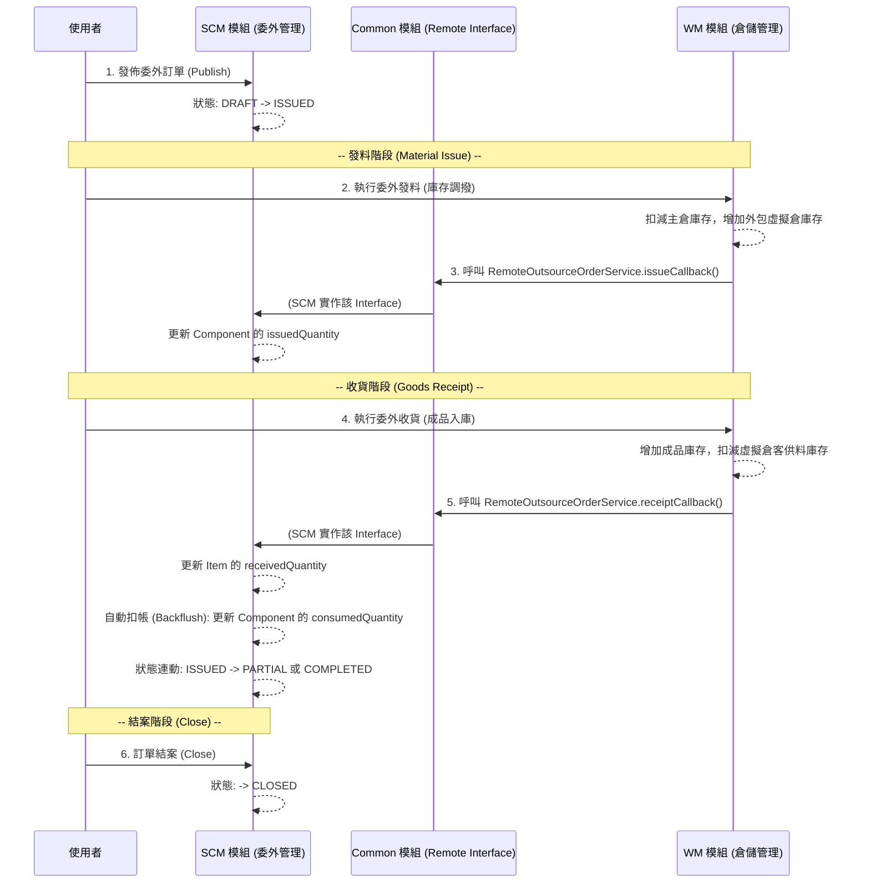

# 委外加工系統：狀態流轉分析與執行計劃

根據 `docs/chartExp/委外加工系統設計.md` 與現有程式碼，目前系統已完成 `OutsourceOrder`、`OutsourceOrderItem` 與 `OutsourceOrderComponent` 的基礎 CRUD 與 BOM 展開，但尚未實作後續的業務狀態流轉。

基於 ERP 規範，**委外開單屬於 SCM 模組，而實際的發料與收貨屬於 WM (倉儲) 模組**。因此，SCM 模組的職責是提供「內部回調 API (Internal Callback API)」，供 WM 模組在完成實體庫存異動後，通知 SCM 更新單據進度與狀態。

## 一、 跨模組狀態流轉架構 (多模組單體)

## 二、 狀態流轉分析

目前系統定義的狀態 (`OutsourceOrderStatus`) 包含：`DRAFT` (草稿)、`ISSUED` (已發佈)、`PARTIAL` (部分處理)、`COMPLETED` (已完成)、`CLOSED` (已結案)。

### 1. 發佈訂單 (Publish)
*   **觸發條件**：使用者確認草稿無誤後發佈。
*   **狀態變化**：訂單與明細狀態由 `DRAFT` 變更為 `ISSUED`。
*   **前提**：訂單必須包含明細，且明細已展開 BOM（若需要）。

### 2. 委外發料回調 (Material Issue Callback)
*   **觸發條件**：WM 模組完成原料發放（庫存調撥至外包商虛擬倉）後，呼叫 SCM 模組。
*   **業務邏輯**：僅針對 `is_supplier_provided = false` (客供料) 的 Component 進行數量更新。
*   **資料變化**：增加 `OutsourceOrderComponent.issuedQuantity` (已發放數量)。
*   **狀態變化**：訂單狀態維持 `ISSUED` (或自訂發料中狀態，但通常以收貨進度為主)。

### 3. 委外收貨回調與自動扣帳 (Goods Receipt Callback & Backflush)
*   **觸發條件**：WM 模組完成成品收貨入庫後，呼叫 SCM 模組。
*   **業務邏輯**：
    1.  **收貨入庫**：增加 `OutsourceOrderItem.receivedQuantity`。
    2.  **自動扣帳 (Backflush)**：根據收貨比例，自動計算並增加對應客供料的 `OutsourceOrderComponent.consumedQuantity` (已耗用數量)。
*   **狀態變化**：
    *   **明細狀態**：若 `receivedQuantity` < `orderedQuantity`，狀態為 `PARTIAL`；若 >=，則為 `COMPLETED`。
    *   **訂單狀態**：依據所有明細狀態連動，若全數完成則為 `COMPLETED`，否則為 `PARTIAL`。

### 4. 結案 (Close)
*   **觸發條件**：訂單全數交貨完畢，或因故提早終止。
*   **狀態變化**：訂單與明細狀態強制變更為 `CLOSED`。
*   **後續處理**：結案後不允許再進行發料或收貨。

---

## 三、 執行計劃 (Execution Plan)

以下是分步驟的實作計劃（聚焦於 SCM 模組的職責）：

*   **Step 1: 實作訂單發佈功能 (Publish Order)**
    *   於 `OutsourceOrderController` 新增 `POST /api/v1/scm/outsource-orders/{id}/publish` API。
    *   實作檢核邏輯（確認狀態為 `DRAFT` 且有明細）。
    *   更新訂單及明細狀態為 `ISSUED`。

*   **Step 2: 實作委外發料回調功能 (Issue Callback)**
    *   於 `lychee-erp-common` 模組新增 `RemoteOutsourceOrderIssueRequest` DTO，包含發料明細與數量。
    *   於 `lychee-erp-common` 模組的 `RemoteOutsourceOrderService` 介面新增 `issueCallback` 方法。
    *   於 `lychee-erp-scm` 模組實作該方法，包含檢核邏輯（狀態需為 `ISSUED` 或 `PARTIAL`）。
    *   更新對應 `OutsourceOrderComponent` 的 `issuedQuantity`。

*   **Step 3: 實作委外收貨與自動扣帳回調功能 (Receipt Callback & Backflush)**
    *   於 `lychee-erp-common` 模組新增 `RemoteOutsourceOrderReceiptRequest` DTO，包含收貨明細與數量。
    *   於 `lychee-erp-common` 模組的 `RemoteOutsourceOrderService` 介面新增 `receiptCallback` 方法。
    *   於 `lychee-erp-scm` 模組實作該方法，更新 `OutsourceOrderItem` 的 `receivedQuantity`。
    *   **實作狀態連動邏輯**：判斷並更新 Item 與 Order 的狀態 (`PARTIAL` 或 `COMPLETED`)。
    *   **實作 Backflush 邏輯**：依本次收貨數量比例，計算並更新對應 Component 的 `consumedQuantity`。

*   **Step 4: 實作結案功能 (Close Order)**
    *   於 `OutsourceOrderController` 新增 `POST /api/v1/scm/outsource-orders/{id}/close` API。
    *   更新訂單及明細狀態為 `CLOSED`。
    *   *(進階)*：檢查是否有未耗用的客供料 (`issuedQuantity > consumedQuantity`)，給予前端提示。