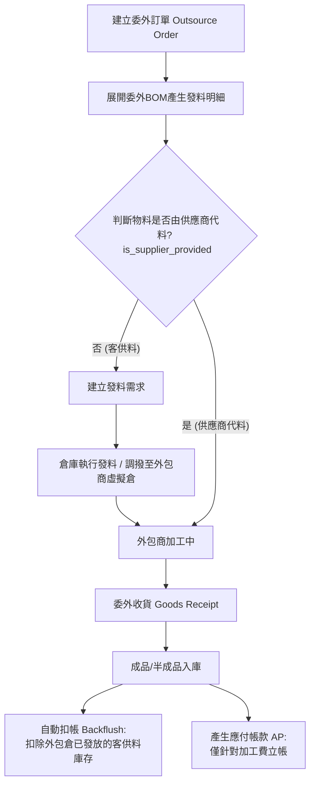

# 委外加工系統設計 (Subcontracting System Design)

## 1. 業務情境概述
委外加工 (Subcontracting) 是指將公司內部的部分製程或整項產品的生產交由外部供應商 (外包商) 執行。
在物料提供的責任上，通常會分為兩種常見情境：
*   **不代料 / 客供料 (Company Provided)**：公司自身提供原物料給外包商進行加工。系統需要追蹤發料到外包商的庫存，並在成品收回時扣除耗用。
*   **代料 (Supplier Provided)**：外包商自行準備部分或全部的原物料。這些物料的成本通常已包含在加工費中，公司內部系統不需追蹤這些物料的庫存發放與耗用。

## 2. 系統架構設計

為滿足上述需求，建議在 ERP 中新增三張核心資料表：

1.  `outsource_orders` (委外訂單主檔)：記錄委外對象(外包商)、交期、總加工費等。
2.  `outsource_order_items` (委外訂單明細檔)：記錄預計收回的成品或半成品，以及**加工費單價**。
3.  `outsource_order_components` (委外發料明細檔)：記錄生產成品所需的原料。此表需支援「是否代料」的註記。

### 2.1 關鍵欄位設計：處理代料與不代料
在 `outsource_order_components` (發料明細檔) 中，新增一個關鍵欄位 `is_supplier_provided` (boolean)：
*   `is_supplier_provided = false` (不代料/客供料)：公司需負責發料。系統將產生發料需求，倉儲需調撥庫存至外包商專屬的虛擬倉庫，並在成品入庫時扣帳 (Backflush)。
*   `is_supplier_provided = true` (供應商代料)：外包商自備該項原料。系統 **不會** 產生發料需求，不影響公司的原料庫存，僅作為 BOM 展開與成本核算的參考。

## 3. 作業流程



## 4. Table Schema 建議

### 4.1 委外訂單主檔 (`outsource_orders`)
```sql
CREATE TABLE lychee_erp.outsource_orders (
    id bigserial PRIMARY KEY,
    tenant_id bigint NOT NULL,
    order_no varchar(50) NOT NULL,
    factory_id bigint NOT NULL,
    supplier_id bigint NOT NULL,
    order_date date NOT NULL,
    status varchar(20) NOT NULL, -- DRAFT, ISSUED, PARTIAL, COMPLETED, CLOSED
    subtotal_amount numeric(18,2) DEFAULT 0, -- 加工費小計
    tax_amount numeric(18,2) DEFAULT 0,
    total_amount numeric(18,2) DEFAULT 0,
    currency_option_id bigint NULL,
    exchange_rate numeric(18,6) NOT NULL DEFAULT 1,
    remarks text NULL,
    created_at timestamp without time zone NULL,
    updated_at timestamp without time zone NULL,
    created_by bigint NULL,
    updated_by bigint NULL
);
```

### 4.2 委外訂單明細檔 (`outsource_order_items`)
```sql
CREATE TABLE lychee_erp.outsource_order_items (
    id bigserial PRIMARY KEY,
    tenant_id bigint NOT NULL,
    outsource_order_id bigint NOT NULL REFERENCES lychee_erp.outsource_orders(id),
    material_id bigint NOT NULL, -- 收回的成品/半成品
    unit_id bigint NOT NULL,
    ordered_quantity numeric(18,6) NOT NULL DEFAULT 0,
    received_quantity numeric(18,6) NOT NULL DEFAULT 0,
    unit_price numeric(18,4) NOT NULL DEFAULT 0, -- ★ 加工費單價 (非成品物料總成本)
    subtotal_amount numeric(18,2) DEFAULT 0,
    required_date date NULL,
    status varchar(20) NOT NULL,
    remarks text NULL,
    -- (省略 created_at 等審計欄位)
);
```

### 4.3 委外發料明細檔 (`outsource_order_components`)
```sql
CREATE TABLE lychee_erp.outsource_order_components (
    id bigserial PRIMARY KEY,
    tenant_id bigint NOT NULL,
    outsource_order_item_id bigint NOT NULL REFERENCES lychee_erp.outsource_order_items(id),
    material_id bigint NOT NULL, -- 需要耗用的原料
    unit_id bigint NOT NULL,
    required_quantity numeric(18,6) NOT NULL DEFAULT 0,
    issued_quantity numeric(18,6) NOT NULL DEFAULT 0, -- 實際發放數量 (客供料)
    consumed_quantity numeric(18,6) NOT NULL DEFAULT 0, -- 已扣帳耗用數量 (隨成品收貨扣減)
    is_supplier_provided boolean NOT NULL DEFAULT false, -- ★ 關鍵欄位：是否為供應商代料
    remarks text NULL,
    -- (省略 created_at 等審計欄位)
);
```

## 5. 系統模組整合考量
1. **WM (倉儲管理)**：需要建立外包商專用的虛擬倉庫 (Subcontractor Warehouse)，以追蹤在外包商手中的客供料庫存 (所有權仍在公司)。
2. **FI (財務管理)**：
    * 應付帳款 (AP)：僅針對「加工費」立帳。
    * 成本計算：委外成品的入庫成本 = (客供料的耗用成本) + (本次加工費)。供應商代料的成本已隱含在加工費中。
