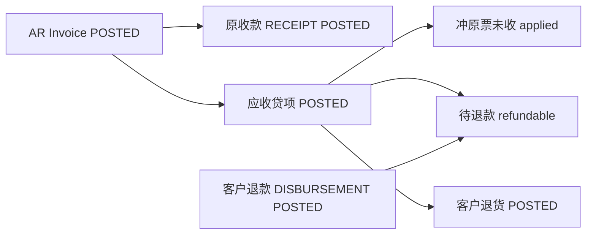

# 02. 目标流程：客户退款主流程 V1

> 正式名称：**客户退款 / `CUSTOMER_REFUND`**。  
> 资金载体复用 `payments`，组合固定为 `DISBURSEMENT + CUSTOMER + CUSTOMER_REFUND`。  
> 拆分公式与供应商退款 V1 相同，只是已付改已收、AP 改 AR。细节算法见 [../供应商退款-主流程V1/02-目标流程.md](../供应商退款-主流程V1/02-目标流程.md) §3–§4，下文只写差异与客户侧路径。

---

## 1. 目标单据链



三个维度独立。退款不引用客户退货行。本期贷项仍是数量型贷回，可有或无 WM 退货，不做纯金额折让。

作业顺序：

```text
1. 从已过账 AR 生成贷项（全额已收也可以，只要还有可贷数量）
2. 过账贷项 → 若 refundable > 0，点「登记客户退款」
3. 确认出账金额与一行核销后过账
4. 仓库按占用下降做客户退货（可贷不退）
```

撤回：先 VOID 退款 → 冲销客户退货（如有）→ VOID 贷项 → 必要时再动原收款。

---

## 2. 适用场景

与供应商退款 V1 §2 同构（把已付换成已收）：全额已收后退款、部分已收同一张贷项既冲未收又形成退款、贷项未超过未收则 `NOT_REQUIRED`。

本波不做：现金先出账、一笔银行流水核多张贷项、无贷项的预收款退回。

---

## 3. 应收贷项金额拆分

在 [应收贷项](../应收贷项/02-目标流程.md) §3.5 已定义。本波只消费 `refund_remaining`。

```text
remaining = total − received − applied_credit
applied + refundable = memo.total
refund_remaining = refundable − refunded
```

`receipt_status` 仍只反映原票是否还有待收。全额已收后出现待退款时，原 AR 保持 `RECEIVED`。

实收现金上限：

```text
cashReceived = Σ(POSTED STANDARD RECEIPT 核该 AR 的 allocated_amount)   // 不含 discount
cashReserved = Σ(同一原 AR 上其他 POSTED 非 VOID 贷项的 refundable)
cashAvailable = cashReceived − cashReserved
refundableGross ≤ cashAvailable 否则拒绝
```

---

## 4. 客户退款付款

### 4.1 用途矩阵（改定）

| `payment_purpose` | `payment_type` | `partner_type` | 子账 |
|-------------------|----------------|----------------|------|
| `STANDARD` | `RECEIPT` | `CUSTOMER` | AR |
| `STANDARD` | `DISBURSEMENT` | `SUPPLIER` | AP |
| `SUPPLIER_REFUND` | `RECEIPT` | `SUPPLIER` | AP |
| `CUSTOMER_REFUND` | `DISBURSEMENT` | `CUSTOMER` | AR |

其它组合拒绝。`EMPLOYEE` 不扩展。

客户退款：

- 复用 `payments` 表、API、工作流、权限
- 单号 `DocumentTypeEnum.CUSTOMER_REFUND`，前缀 `CR`，写入 `payment_no`
- `sourceModule = AR`，银行凭证 `sourceDocType = CUSTOMER_REFUND`
- `amount > 0`，`is_prepayment = false`
- `payment_purpose`：DRAFT 且无核销行时可改；一旦有行或已提交则不可改
- 创建/更新/过账校验：内部银行同公司、同币别、有效，银行 GL 属于该公司；对方银行若填则属于同一客户且有效。**仅 CUSTOMER_REFUND** 强制（对标供应商退款，不扩大到 STANDARD）
- 伙伴类型从 `BusinessPartner` 回填并校验

### 4.2 核销行

`PaymentAllocationType` 增加 `AR_CREDIT_MEMO`：

```text
allocation_type   = AR_CREDIT_MEMO
ar_credit_memo_id
allocated_amount  = payment.amount
discount_amount   = 0
```

一张 `CUSTOMER_REFUND` **过账时必须恰好一行** 该类型核销，且：

1. 贷项 `POSTED`，`refund_remaining ≥ allocated`
2. 公司、客户、币别与表头一致（禁止交叉货币）
3. 不得同时填 `ar_invoice_id` / `ap_invoice_id` / `ap_credit_memo_id` / `applied_payment_id`
4. 不允许 `INVOICE` / `GL_ACCOUNT` / `PREPAYMENT` / `AP_CREDIT_MEMO`
5. 同一 Payment 不得出现第二行核销

一张贷项可以被多张退款分次核销。POST 时：

```text
creditMemo.refunded += allocated
creditMemo.refund_remaining = refundable − refunded
刷新 refund_status
payment.unallocated = 0
```

POSTED 后禁止 `POST /allocations` 与 `DELETE /allocations/{lineId}`（改金额或目标：VOID 整单再开）。

有效退款核销必须带 `payments.status = POSTED` 且 `payment_purpose = CUSTOMER_REFUND`。

---

## 5. 凭证

贷项仍按完整金额。`applied / refundable` 不另出凭证。

退款资金（头档金额、退款日汇率）：

```text
借：客户 AR
贷：公司银行 GL
```

`JournalSourceModule.AR`，`sourceDocType = CUSTOMER_REFUND`。描述用「客户退款」，不要写成普通付款。

退款段汇兑：按贷项汇率重乘，算法与供应商退款 V1 §6.3 相同。

```text
sourceBase     = round(allocated × creditMemo.exchangeRate, 2)
settlementBase = round(allocated × payment.exchangeRate, 2)
fxDifference   = settlementBase − sourceBase
```

非 0 时 `AccountDeterminationService.resolve(EXCHANGE_DIFF)`。  
`sourceDocType = CUSTOMER_REFUND_ALLOC`，`sourceDocId = payment_line.id`。VOID 按行上 `journal_entry_id` 走 `reverseEntry`。

---

## 6. 工作流与作废

退款 Payment：`DRAFT → PENDING_APPROVAL → APPROVED → POSTED → VOIDED`。  
POST：先银行凭证，再应用核销，必要时汇兑。  
VOID：恢复贷项 `refunded / refund_remaining / refund_status`，冲汇兑，再冲银行凭证。无 `reversal_date`。

贷项 VOID：存在有效退款则拒绝。客户退货闸、占用回加保持应收贷项现网。

原收款：目标 AR 存在非 VOIDED 且 `refundable > 0` 的贷项时，禁止 `removeAllocation` 该 AR 行、禁止 VOID 含该行的原收款。锁序避免与贷项 POST（CM→AR）死锁：退款 POST 为 Payment → CreditMemo → 原 AR。

撤销顺序：

```text
1. VOID 客户退款
2. 冲销 POSTED 客户退货（如有）
3. VOID 应收贷项
4. 移除原收款核销或 VOID 原收款（仅确有需要）
```

---

## 7. API

复用 `/api/v1/fi/payments`。

头档 `paymentPurpose` 增加 `CUSTOMER_REFUND`。

| API | 行为 |
|-----|------|
| `POST /api/v1/fi/payments` | 创建退款草稿 |
| 现有 submit / approve / post / void | 退款 POST 应用那一行；VOID 恢复贷项 |
| 草稿行 API | 仅允许一行 `AR_CREDIT_MEMO` |
| `POST /{id}/allocations` | `CUSTOMER_REFUND` 拒绝 |
| `DELETE /{id}/allocations/{lineId}` | `CUSTOMER_REFUND` 拒绝 |

`PaymentLineRequest` 增加 `arCreditMemoId`。

可退款查询见应收贷项 `POST /api/v1/fi/ar-credit-memos/refundable/page`。

权限：沿用 `/fi/payments:*` + 贷项 read。不新增退款 CRUD 权限。

---

## 8. 前端

- 用途增加「客户退款」；选后固定 `DISBURSEMENT + CUSTOMER`，核销改为选一张可退款应收贷项
- 从贷项跳入时 `amount = refundRemaining`
- 展示历史汇率、退款日汇率、预估汇差
- POSTED 退款不提供追加核销、不提供删行
- 贷项页：`POSTED && refundRemaining > 0` 时「登记客户退款」
- 有有效退款时禁用 VOID 贷项

三语文案：客户退款、待退款/部分退款/已退款/无需退款、超过实收现金（折扣）、须先 VOID 退款、原收款已有下游退款贷项。

---

## 9. 本期不做

- 资金先行、后补核销、`clearing_date`
- 单行 reverse、一张退款核多张贷项
- 普通 AP/AR 付款汇兑、交叉货币
- 折扣比例转回
- 客户预收款退回、贷项冲未来 AR
- 退款改库存或交货占用
- 负金额 Payment / 负数量贷项
