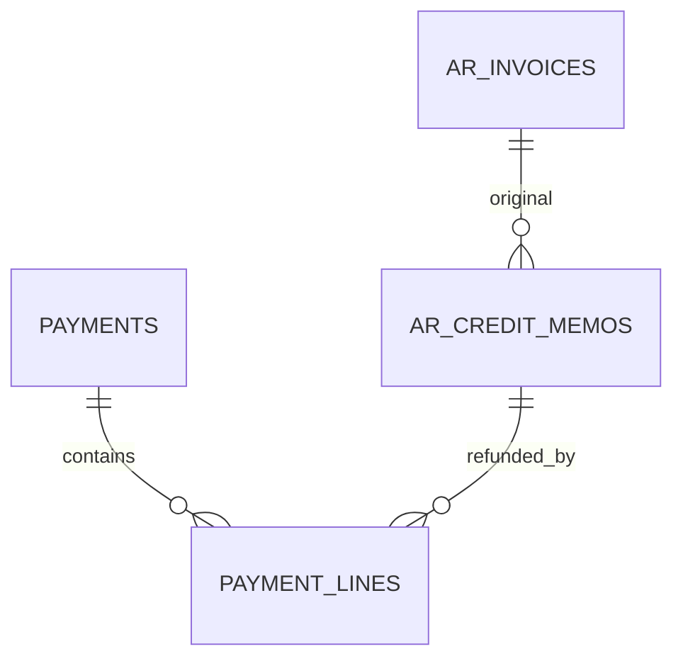

# 03. Schema：客户退款主流程 V1

> 目标结构。应收贷项表的拆分字段在 [../应收贷项/03-schema设计.md](../应收贷项/03-schema设计.md) 一次加齐，本波不再改贷项表。  
> 实施以 Liquibase 为准，并同步 `schema_tables` 与 `FI_schema_design.md`。

---

## 1. 改动总览

| 对象 | 动作 |
|------|------|
| `payments.payment_purpose` 注释 / 枚举 | 增加 `CUSTOMER_REFUND` |
| `payment_lines.ar_credit_memo_id` | **新增** |
| `PaymentAllocationType.AR_CREDIT_MEMO` | **新增** |
| `DocumentTypeEnum.CUSTOMER_REFUND` | **新增** |
| `payment_lines` 汇兑快照四列 | **复用**（供应商退款已加）；客户退款核销行同样写入 |
| 独立 `customer_refunds` 表 | **不加** |
| 客户退货、交货表 | **不改** |
| `clearing_date` / 核销状态机 | **不加** |

---

## 2. Payment 头档

`payment_purpose` 已有列。更新注释：

```text
STANDARD, SUPPLIER_REFUND, CUSTOMER_REFUND
```

```java
public enum PaymentPurpose {
    STANDARD,
    SUPPLIER_REFUND,
    CUSTOMER_REFUND
}
```

`CUSTOMER_REFUND` 要求 `DISBURSEMENT + CUSTOMER` 且 `is_prepayment = false`。DRAFT 无核销行时可改 purpose。

单号：

```text
DocumentTypeEnum.CUSTOMER_REFUND
prefix = CR
日期 = yyyyMM
序号 = 4 位，MONTHLY
```

仍写入 `payment_no`。不增加 `reversal_date`。

---

## 3. Payment 核销行

```sql
ALTER TABLE lychee_erp.payment_lines
    ADD COLUMN ar_credit_memo_id bigint NULL;

ALTER TABLE lychee_erp.payment_lines
    ADD CONSTRAINT fk_payment_lines_ar_credit_memo
        FOREIGN KEY (ar_credit_memo_id)
        REFERENCES lychee_erp.ar_credit_memos (id);

CREATE INDEX idx_payment_lines_ar_credit_memo
    ON lychee_erp.payment_lines (ar_credit_memo_id);

CREATE UNIQUE INDEX uk_payment_lines_payment_ar_credit_memo
    ON lychee_erp.payment_lines
       (tenant_id, payment_id, ar_credit_memo_id)
    WHERE ar_credit_memo_id IS NOT NULL;
```

`AR_CREDIT_MEMO` 行：

```text
ar_credit_memo_id IS NOT NULL
ar_invoice_id / ap_invoice_id / ap_credit_memo_id / 排程 id / applied_payment_id 均为 NULL
discount_amount = 0
```

汇兑快照四列仅在应用核销时写入，之后不改。VOID 用 `journal_entry_id` 冲销。

---

## 4. 实体关系



一贷项多分次退款；一退款单只核一张贷项。

---

## 5. 锁与落库顺序

```text
PaymentRepository.findByIdForUpdate
ArCreditMemoRepository.findByIdForUpdate
ArInvoiceRepository.findByIdForUpdate
```

退款 POST：Payment → ArCreditMemo → 原 AR。

### 5.1 退款 POST

```text
1. 锁 Payment、贷项、原 AR
2. 校验用途、恰好一行、全额分配、币别与余额
3. 银行凭证
4. 写汇兑快照；fx≠0 则写调整凭证
5. 贷项 refunded / remaining / status
6. payment.unallocated = 0
```

### 5.2 退款 VOID

```text
1. 锁 Payment、贷项、原 AR
2. 冲核销行汇兑凭证（若有）
3. refunded -= allocated，重算 remaining / status
4. 冲银行凭证
```

不物理删除 POSTED 退款行。

---

## 6. 数据一致性

每次贷项 POST/VOID、退款 POST/VOID 后：

```text
AR:
  remaining = total − received − appliedCredit
  0 ≤ appliedCredit ≤ credited ≤ total

Credit Memo POSTED / VOIDED 快照:
  applied + refundable = total
  refunded + refundRemaining = refundable

同一原 AR:
  Σ(POSTED 非 VOID 贷项 refundable) ≤ Σ(该 AR 有效收款行 allocated)

Customer Refund POSTED:
  恰好一行 AR_CREDIT_MEMO
  allocated = amount
  unallocated = 0
```

禁止用触发器维护合计。

---

## 7. 文档同步（代码落地后）

- Liquibase：`ar_credit_memo_id`、约束、索引、`CR` 单号、purpose 注释
- `schema_tables/FI/payments.sql`、`payment_lines.sql`
- `FI_schema_design.md`、`财务/02.1-API端点与状态矩阵.md`
- **不要**把 `clearing_date` / `allocation_status` 写进本期 changeset
