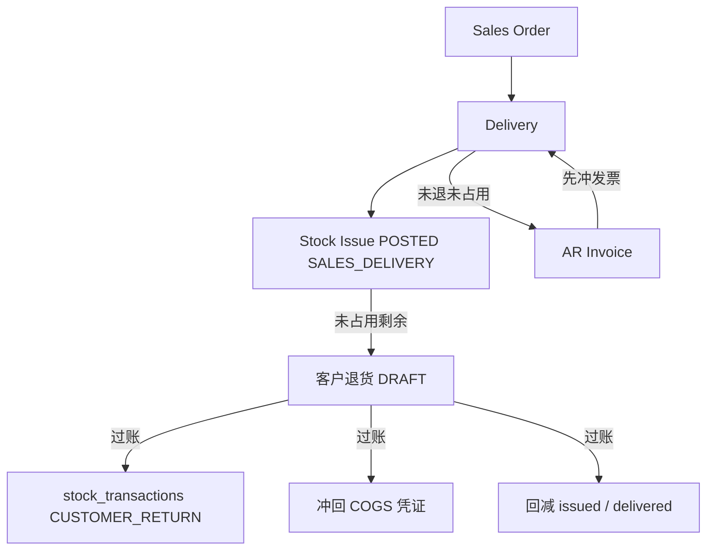

# 02. 目标流程：客户退货（To-Be）

> 原则：客户退货是 WM 库存单据，一对一已过账 `SALES_DELIVERY` 领料；只退未被 AR 占用的数量（含发票草稿）。  
> 命名一律 **客户退货 / `CUSTOMER_RETURN`**。

---

## 1. 目标单据链

```text
SO ─► DN ─► 领料 SALES_DELIVERY(POSTED) ─► 客户退货单 ─► 库存 +  / 冲回 COGS
                         │                      │
                         │                      └─► 回减 DN.issued_quantity、SO.delivered_quantity
                         │
                         └─► AR（仅未退、未被占用剩余）
```



与采购退货 / 退料对照：

```text
收货 POSTED ─► 采购退货 ─► PURCHASE_RETURN（−）
领料 POSTED ─► 退料单   ─► STOCK_ISSUE_RETURN（+，仅内部）
销售出库 POSTED ─► 客户退货 ─► CUSTOMER_RETURN（+）
```

领料冲销仍是**整单纠错**，沿用 `STOCK_ISSUE` 进出对调。客户退货是**业务退回**，可部分、可多次，保留原领料单与交货单。

---

## 2. 作业

1. 进入 `/wm/customer-returns`（WM 菜单，与采购退货、退料并列）。
2. 新增：选择一张可退的已过账销售出库领料（同工厂、`issue_type = SALES_DELIVERY`、存在可退行、全部来源行为同一客户）。
3. 系统带出客户、工厂、币别、汇率（来自关联交货，不可改）。
4. 「汇入可退明细」勾选原领料行，默认带可退数量、仓、批号、`stock_type = UNRESTRICTED`。
5. 可改：退货数量（≤ 可退）、`stock_type`、备注、原因码。不可改：物料、仓、批号、单价、税、来源领料行 / 交货行。
6. 过账：入库 + 数量账 + COGS。草稿可删；已过账可整单冲销退货单（不是冲原领料或原交货）。

交货页、领料页可提供「生成客户退货」跳到新建并带上 `originalStockIssueId`（权限：`/wm/customer-returns:create`）。不在交货页直接过账退货。

---

## 3. 规则

### 3.1 准入

- 原单：`stock_issues.status = POSTED` 且 `issue_type = SALES_DELIVERY`
- 全部明细 `source_doc_type = DELIVERY` 且 `source_doc_item_id` 指向交货行
- 这些交货行必须属于 **同一** `customer_id`；币别、汇率必须一致（从交货表头复制）。不一致则该领料不可出现在 `returnable-issues`
- 工厂从原领料复制，之后不改
- V1 **不含**：内部领料、无原出库的直接退、换货、样品交货特例、`delivery_type = RETURN`

### 3.2 一对一

- 表头 `original_stock_issue_id`：一张客户退货只对一张销售出库领料
- 同一领料允许多张退货（部分退）
- 明细 `original_issue_item_id` 必须属于该领料；同一退货单内一行对一条领料行（唯一约束）
- 禁止手键无来源行
- 一张交货可被多张领料出完：退货按领料拆，不按交货一对一

### 3.3 可退数量

领料行 `returned_quantity`（**基本单位**）在 `SALES_DELIVERY` 上改为累加已过账客户退货（内部退料不会写这些行）。  
交货行新增 `returned_quantity`（**单据单位**，仅已过账客户退货累加），供开票闸使用。

与开票比较一律用**单据单位**，禁止把领料 `returned_quantity` 再换算回单据单位。

开票占用在交货行。同一交货行可能被多张领料、多个批次出完，未开票池 **按交货行共享**：

```text
postedReturnedTxn     = SUM(已过账客户退货行.transaction_quantity)   // 同 original_issue_item_id
otherDraftTxn         = SUM(其他 DRAFT 客户退货行.transaction_quantity)
otherDraftBase        = SUM(其他 DRAFT 客户退货行.base_quantity)
unreturnedTxn         = issue.transaction_quantity − postedReturnedTxn − otherDraftTxn
unreturnedBase        = issue.base_quantity − issue.returned_quantity − otherDraftBase

postedReturnedOnDI    = SUM(已过账客户退货行.txn)   // 这些行的原领料行.source_doc_item_id = 该交货行
otherDraftOnDI        = SUM(其他 DRAFT 客户退货行.txn)  // 同上，排除本单
uninvoicedTxn         = delivery.transaction_quantity − delivery.invoiced_quantity
remainingUninvoiced   = uninvoicedTxn − postedReturnedOnDI − otherDraftOnDI
returnableTxn         = min(unreturnedTxn, remainingUninvoiced)
```

- `invoiced_quantity` 语义 = **已被 AR 行占用（含 DRAFT）**，不是「已过账发票」。见 01 §5
- `BigDecimal.compareTo`，禁止浮点近似
- 交货无赠品字段；V1 不单列 FOC
- 草稿占用：排除本单 / 本行
- 过账校验：`transaction_quantity ≤ returnableTxn` **且** `base_quantity ≤ unreturnedBase`
- **已被 AR 占用的数量不能退。** 提示区分：对方是 DRAFT 则改/删发票行；已过账则先过账应收贷项或作废发票。i18n，不要静默截断

贷项：已开票可退靠贷项过账回减 `invoiced_quantity`，本公式不改。见 [应收贷项](../应收贷项/README.md)。

### 3.4 仓 / 批 / 库存状态

| 字段 | 规则 |
|------|------|
| `warehouse_id` | 从原领料行复制，不可改。非库存物料保持不过库存 |
| `batch_no` | 从原领料行复制，不可改（无批号仍为 `''`） |
| `stock_type` | 默认 `UNRESTRICTED`（现网销售出库行无 `stock_type`，出库按可用）。**允许改**为 `UNRESTRICTED` / `INSPECTION` / `BLOCKED` |

过账是入库，不要求原仓原批「有足够出库实物」。禁止改仓改批「退到别的批次」。质检/冻结由 `stock_type` 表达。

### 3.5 单价与凭证金额

- 行单价、税码、税率：从关联交货行快照，不重查 SO
- 表头币别与汇率：从关联交货冻结（§3.1 已要求同领料内一致）
- 库存流水 `unit_cost`：取原领料过账写入的成本（`findPostedUnitCostsBySourceDocItem(STOCK_ISSUE, originalStockIssueId, STOCK_ISSUE)`），**禁止**退货时重查当前标准成本
- COGS 冲回：存货侧用冻结 `unit_cost` × 基本数量；借存货、贷 COGS。`setScale(2, HALF_UP)`
- **清尾**：该领料行原出库成本金额 − 已过账退货已冲回金额 = 剩余；当本行是「最后一笔把未退基本量退完」时，COGS 冲回用**剩余金额**，避免分次取整留分钱
- `require_standard_cost_on_stock_post = false`：只记数量，`journal_entry_id` 可空（与领料一致）

凭证挂在**客户退货单** `journal_entry_id`，不改写原领料 `journal_entry_id`。  
`return_date` = 凭证 `postDate`。财务期间关闭时过账失败。数量记账无凭证时与领料一样不拦库存期间；本波不新做库存关帐。

客户退货 **不** 冲收入 / 销项税。收入侧只在 [应收贷项](../应收贷项/README.md)。

### 3.6 过账

同一事务：

1. 锁原领料行、关联交货行，重算可退，超则失败
2. 库存物料：`applyCustomerReturn`（`CUSTOMER_RETURN`，入库）
3. 领料行 `returned_quantity += base_quantity`
4. 交货行 `returned_quantity += transaction_quantity`（单据单位）
5. `issueCallback(−transaction_quantity)`：回减交货 `issued_quantity`、SO `delivered_quantity`
6. 刷新该交货行 / 表头 `invoice_status`（剩余可开票口径见 §3.9）
7. 非数量记账：冲回 COGS（`afterPosted` 保持 no-op；贷项在 FI 独立过账）
8. 表头 `approved_by` / `approved_at` 记过账人（对标采购退货 / 退料）
9. 状态 → `POSTED`

不删 `DELIVERY → STOCK_ISSUE` 溯源。靠 `original_issue_item_id`。

`issueCallback` 本波必须补负向状态（销售出库冲销一并受益）：

| 回写对象 | 退货后 |
|----------|--------|
| 交货行 `issued` | 减少；未发满 → `RELEASED`，发满 → `DELIVERED` |
| 交货表头 | 全行 `DELIVERED` 才 `DELIVERED`；否则从 `DELIVERED` 退回 `RELEASED`，清空 `actual_delivery_date`（现网已有） |
| SO 行 `delivered` | 减少。`CLOSED` / `CANCELLED`：**只改数量，不改行状态** |
| SO 行其它状态 | `delivered ≥ quantity` → `DELIVERED`；否则若当前为 `DELIVERED` → `CONFIRMED` |
| SO 表头 | `CLOSED` / `CANCELLED`：不改状态。否则按行重算：全 `DELIVERED` → `DELIVERED`；否则若当前为 `DELIVERED` → `CONFIRMED`（未交量重新进入可交 / MRP 汇总） |

**不**自动 `CLOSED`。`CLOSED` 的 SO 允许退货（货是真退），但不得无声复活进 MRP。

### 3.7 冲销客户退货单

仅 `POSTED` → `REVERSED`：

1. 反向库存（类型仍为 `CUSTOMER_RETURN`，进出对调）
2. 领料行 `returned_quantity -= base_quantity`（不得负）
3. 交货行 `returned_quantity -= transaction_quantity`（不得负）
4. `issueCallback(+transaction_quantity)`。回加已发视同再出库：交货行不得超过 `transaction_quantity`（现网 `issued_quantity.exceeds`）。将超则拒绝，提示先冲后补的出库
5. 冲本单凭证，`journal_entry_id` 置空

### 3.8 禁止冲销原领料 / 原交货

原领料存在 `DRAFT` 或 `POSTED` 客户退货 → `reverseStockIssue` 拒绝（对标 `validation.stock_issue.has_returns`；文案用客户退货专用 key，不要复用内部退料）。

本波一并补上：`SALES_DELIVERY` 领料所涉任一交货行 `invoiced_quantity > 0` 也禁止冲销该领料。文案：先删除或冲销占用该行的 AR（含草稿）。

交货作废 / 取消：存在草稿或已过账客户退货则拒绝（若现网已有取消 API）。

### 3.9 从交货开 AR

可开票数量：

```text
returnedTxn = delivery_item.returned_quantity   // 仅 POSTED 客户退货单据量，不要换算领料 returned_quantity
billableTxn = transaction_quantity − invoiced_quantity − returnedTxn
```

- 草稿退货不扣可开票（过账才入账）；草稿已占用可退，避免超开+超退并发时由 §3.3 再拒
- **强制闸门**在 `updateInvoicedQuantity`：`newInvoiced ≤ transaction_quantity − returnedTxn`
- `invoice_status` 的「总量」改为剩余可开票基数：`billableTotal = transaction_quantity − returnedTxn`，再 `resolveItemStatus(billableTotal, invoiced)`。全退且从未开票：`billableTotal = 0` 且 `invoiced = 0` → 仍为 `UNINVOICED`；`getDeliveryForBilling` 无剩余行时用明确 i18n（不要当成 `already_invoiced`）

---

## 4. 与领料冲销的分工

| | 领料冲销 | 客户退货 |
|--|----------|----------|
| 用途 | 整单记错，作废 | 业务退客户 |
| 原单 | 变为 `REVERSED` | 保持 `POSTED` |
| 部分数量 | 否 | 是 |
| 流水账类型 | `STOCK_ISSUE` 对调 | `CUSTOMER_RETURN` |
| 已开票 | 禁止（本波补） | 只退未开票 |
| 已有退货 | 禁止 | — |

---

## 5. API

对标 `/api/v1/wm/purchase-returns`。权限前缀 `/wm/customer-returns`。

| 方法 | 路径 | 权限 |
|------|------|------|
| POST | `/api/v1/wm/customer-returns/page` | read |
| POST | `/api/v1/wm/customer-returns/returnable-issues/page` | read |
| GET | `/api/v1/wm/customer-returns/returnable-issues/{originalStockIssueId}` | read |
| GET | `/{id}` | read |
| POST | `/` | create |
| PUT | `/{id}` | update |
| DELETE | `/bulk-delete` | delete |
| POST | `/{id}/post` | update |
| POST | `/{id}/reverse` | update |
| POST | `/{id}/items/page` | read |
| POST | `/{id}/returnable-items/page` | read |
| POST | `/{id}/items` | update |
| POST | `/{id}/items/batch-from-issue` | update |
| PUT | `/{id}/items/{itemId}` | update |
| DELETE | `/{id}/items/bulk-delete` | update |

`returnable-issues`：`POSTED` + `SALES_DELIVERY` + 同源客户/币别 + 存在 `returnableTxn > 0` 的行。  
建表头必须带 `originalStockIssueId`；明细只接受该领料的行 id。

不要提供 `goods-receipts/items/from-source` 的 `CUSTOMER_RETURN_ITEM` 实现。

---

## 6. 前端

唯一作业：`/wm/customer-returns`。页面结构复制 `pages/wm/purchase-returns`：

- 主从表、DRAFT 可改
- 汇入可退领料行（`ImportIssueItemModal`）
- 过账 / 冲销按钮
- 仓、批号只读；`stock_type`、数量可编辑
- 展示关联交货号、SO 号（只读）

交货列表/详情、销售出库领料：有可退行且具备 create 权限时显示「客户退货」。  
**不要**独立 SD 菜单当主作业，**不要**负向交货类型，**不要**收货转换。

文案：zh-CN / en-US / vi-VN 均用「客户退货」对应译名（英文 `Customer Return`）。不要「销售退货 / Return Delivery」作为正式名称。

---

## 7. 已开票与贷项

V1 硬规则：已占用数量不可退（含 AR 草稿）。`assertReturnableAgainstInvoice` 已实现；`afterPosted` / `afterReversed` 保持 no-op。

**不改** §3.3 公式，也**不**在退货过账里生成贷项。已开票要退：

```text
财务过账应收贷项 → invoiced_quantity ↓ → 客户退货按 V1 可退
撤回：先冲销退货，再 VOID 贷项
```

完整规则见 [应收贷项](../应收贷项/02-目标流程.md)。WM 仍只依赖 CreditMemo 断言 + `updateInvoicedQuantity`，不写 AR / 贷项实体。

只贷不退（数量争议、不退货）：允许。占用下降后也可再开一张 AR 把数量重新占用。

---

## 8. 模块边界

| 动作 | 模块 |
|------|------|
| 单据 CRUD / 过账 / 冲销 | `lychee-erp-wm` |
| 回减 / 加回交货已发、SO 已交 | 现有 `RemoteDeliveryService.issueCallback`（本波补负向状态） |
| 交货已退 / 可开票 | `RemoteDeliveryService` 新回写 + 现有 `updateInvoicedQuantity` |
| COGS 冲回 | `RemoteCustomerReturnFinanceService`（新，对标领料 finance） |
| 贷项 | FI 独立子域，见 [应收贷项](../应收贷项/README.md)。WM 只保留未开票断言 |
| 可开票扣已退 | `RemoteDeliveryServiceImpl.getDeliveryForBilling` |

PP / MRP：非 `CLOSED` 的 SO 已交减少后未交变大，允许再交。

---

## 9. V1 不做

- 委外 / 内部领料当客户退货
- 换货（退 + 再发）
- 无原出库的直接退
- 负交货 / `delivery_type = RETURN` 作业
- 收货转换 `CUSTOMER_RETURN_ITEM`
- 扩展 `stock_issue_returns` 覆盖 `SALES_DELIVERY`
- AR 贷项（独立专题 [应收贷项](../应收贷项/README.md)）
- 客户退款（独立专题 [客户退款-主流程V1](../客户退款-主流程V1/README.md)）
- 一张退货跨多张领料
- 退货后自动关闭 SO
