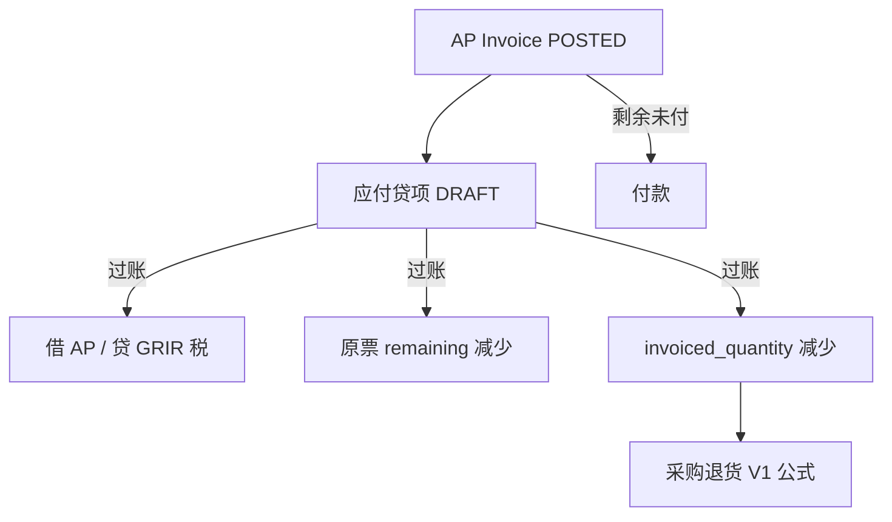

# 02. 目标流程：应付贷项（To-Be）

> 原则：应付贷项是 FI 单据，一对一已过账 AP 发票；过账时全额核销该发票剩余、回减收货占用。  
> 采购退货不生成贷项。V1 可退公式不改。  
> 命名一律 **应付贷项 / `AP_CREDIT_MEMO`**。

---

## 1. 目标单据链

```text
AP(POSTED) ─► 应付贷项 ─► 借应付 / 贷 GR/IR（或 CIP/费用）+ 进项转出
                │
                ├─► 原票 remaining ↓、credited_amount ↑
                └─► 收货行 invoiced_quantity ↓（仅 RECEIPT 行）
                         │
                         └─► 采购退货按 V1：占用下降即可退
```



与发票作废对照：

```text
VOID AP     ─► 整单冲凭证 + 回吐全部占用；有过账付款则禁止
应付贷项    ─► 部分数量/金额；原票保留 POSTED；只冲未付剩余
```

与采购退货对照：

```text
贷项先过账 ─► 只动应付与占用，不动库存
退货后过账 ─► 出库 + 冲回 GR/IR（暂估侧）
```

---

## 2. 作业

1. 进入 `/fi/ap-credit-memos`（FI「应收应付」菜单，排在应付发票之后）。
2. 新增：从一张 **POSTED** AP 生成草稿（公司、供应商、币别、汇率从原票复制，不可改）。
3. 勾选可贷行，默认带可贷数量。可改：数量（`≤` 可贷）、税额（`tax_amount_overridden`，对标 AP）、备注。不可改：物料、单价、税码、来源行、GL。
4. 提交时填写供应商贷项号（`external_credit_note_no`，禁止占位符）。
5. 审批 → 过账：凭证 + 核销原票剩余 + 回减占用。
6. 草稿可删；已过账可 VOID（见 §3.7），不是冲原 AP。

应付发票页：已过账、有可贷行且具备 create 权限时显示「生成贷项」。不在退货页生成贷项。

---

## 3. 规则

### 3.1 准入

- 原单：`ap_invoices.invoice_status = POSTED`
- 一张贷项只对一张 AP（`original_ap_invoice_id`）
- 公司、伙伴、币别、汇率从原票冻结，之后不改
- 明细 `original_ap_invoice_line_id` 必须属于该发票；同贷项内一行对一条发票行（唯一约束）
- 禁止手键无来源行；禁止贷项行来源改为别的发票

### 3.2 数量与金额（正数）

行数量、单价、金额均为 **正数**。凭证借贷在过账服务里对调，禁止负数量。

```text
postedCreditedQty = SUM(已过账贷项行.quantity)          // 同 original_ap_invoice_line_id，排除 VOIDED
otherDraftQty     = SUM(其他 DRAFT 贷项行.quantity)
creditableQty     = ap_line.quantity − postedCreditedQty − otherDraftQty
```

- `BigDecimal.compareTo`，禁止浮点近似
- 草稿占用可贷数量（排除本单），**不**回写 `invoiced_quantity`
- 过账校验：每行 `quantity ≤ creditableQty`（重算时锁原票行）
- 表头 `total_amount ≤ 原票.remaining_amount`（过账时锁原票）
- 已付部分不可贷：须先按现网路径作废付款，抬高 `remaining`。本波不做退款
- **草稿互斥不对称**：数量在草稿即互斥；金额只在过账用 `remaining` 卡。两张草稿金额可以都 `≤ remaining`，第二张过账失败。前端可贷金额不要按「草稿已预占 remaining」展示
- 本波只做「按原行数量 × 原单价」比例贷回。不改单价、不做纯金额价差贷项（价格纠纷：VOID 原票重开，或后续波）

单价、税码、税率、`source_amount` 从原票行按数量比例缩放（对标 AP 改数量时 `rescaleSourceAmountForQuantityChange`）。税默认重算；允许 `tax_amount_overridden`。

赠品不在 AP 行上；采购退货 FOC 仍跳过开票断言，与贷项无关。

### 3.3 占用（收货行）

仅 `source_doc_type = RECEIPT` 且 `source_line_id` 为收货行 id 的贷项行：

- **过账**：`updateInvoicedQuantity(quantityDelta = −quantity)`
- **VOID**：`quantityDelta = +quantity`
- **草稿 / 删草稿**：不调用

之后采购退货 V1 公式自动看到更大的 `uninvoicedTxn`。  
`RemotePurchaseReturnCreditMemoService.assertReturnableAgainstInvoice` / `afterPosted` / `afterReversed` **保持 V1**（断言未占用；hook 空）。WM 数量账公式不改。

PO 来源的 AP 行：只核销金额，不写收货占用。

### 3.4 原票剩余

`ap_invoices` 增加 `credited_amount`（已过账、未作废贷项合计，默认 0）。

```text
remaining = total_amount − paid_amount − credited_amount
```

- 贷项过账：`credited_amount += 本单 total`；重算 `remaining` 与 `payment_status`
- 贷项 VOID：`credited_amount -= 本单 total`（不得负）
- 付款 `applyAp` / `restoreAp` **必须**改用上式，禁止再写 `remaining = total − paid`

`payment_status`：`remaining == 0` → `PAID`（含「被贷项结清」）；`paid > 0` 且 `remaining > 0` → `PARTIAL`；否则 `UNPAID`。付款挑票仍看 `remaining > 0`，无需选贷项。

付款排程本波不因贷项重算；付款硬闸仍是表头 `remaining`。UI 上排程合计可能大于剩余，以剩余为准。

### 3.5 凭证

对标 `ApInvoicePostingServiceImpl`，金额为正、借贷对调：

| 原 AP | 贷项 |
|--------|------|
| 借 GR/IR 或 CIP/费用（暂估 `source_amount`） | 贷同一科目 |
| 借/贷 `PRICE_VAR`（发票额 − 暂估） | 方向相反 |
| 借进项税 | 贷进项税（或税码指定进项科目） |
| 贷应付（伙伴 GL） | 借应付 |
| `EXCHANGE_DIFF`（收货汇率 vs 发票汇率） | 按同一套汇率算法反向 |

- `sourceModule = AP`，`sourceDocType = AP_CREDIT_MEMO`（GR/IR 余额分析才能算到贷项）
- `postDate = credit_date`；已关期间由 `JournalPostingService` 拒绝过账
- 本波不强制 `credit_date ≥ 原票 invoice_date`（与现网 AP 不强制晚于收货日同一口径）
- 汇率冻结为原票快照：贷项日不按当日汇率重估；`EXCHANGE_DIFF` 只反向原票那套「收货汇率 vs 发票汇率」
- 伙伴 GL 必填，与 AP 过账相同
- 数量记账政策：贷项**仍过账**（冲负债）；不跟退货一起跳过

### 3.6 过账

同一事务：

1. 锁贷项、原 AP、原 AP 行
2. 原票必须 POSTED；本单必须 APPROVED
3. 重算可贷数量；超则失败
4. `total_amount ≤ remaining_amount`
5. 成卡门（§3.8）
6. 写凭证
7. `credited_amount` / `remaining` / `payment_status`
8. RECEIPT 行 `updateInvoicedQuantity(−qty)`（须锁收货行）
9. 状态 → `POSTED`

不改原票 `journal_entry_id`。不写采购退货。不生成付款行。

### 3.7 VOID 贷项

仅 `POSTED` → `VOIDED`（对标 AP VOID，不是 WM 的 REVERSE）：

1. 触及的收货行（本单 RECEIPT 行的 `source_line_id`）若存在 **POSTED** 采购退货 → 拒绝。须先冲销该退货单。REVERSED 退货不算。文案 i18n。  
   **有意偏严**：贷项过账前已退的未开票数量也会挡住 VOID（精确闸其实是占用 cap）；本波不按数量拆「这笔退货是否吃了本贷项释放的占用」。
2. 冲本单凭证，`journal_entry_id` 置空
3. 回加 `invoiced_quantity`。若占用已被后续 AP（含草稿）重新占走，WM `exceeds_billable` 会失败；须先改/删后续占用。映射专用 i18n，不要把 WM 通用 key 直接甩给用户
4. 回减 `credited_amount`，重算原票 remaining / payment_status
5. `voided_by` / `voided_at`

后置付款不拦 VOID 贷项：贷项作废后 `remaining` 加回，已付金额保留。

### 3.8 其他闸门

| 闸 | 规则 |
|----|------|
| AP 草稿 | 不可为原单；采购退货对草稿占用仍拒绝，须改/删发票行 |
| 成卡 | 该 AP 行已存在 `fixed_assets.ap_invoice_line_id` → 禁止纳入贷项（生成时跳过；过账再校验）。本波不做原值调整 |
| 作废原 AP | 存在非 VOIDED 贷项 → 禁止 VOID 发票（后置阻断前置） |
| 过账付款 | 不直接拦贷项；只通过 `remaining` 限制可贷金额 |
| 财务关帐 | `FiscalPeriod.close`：`credit_date` 落在期间内且状态为 `DRAFT` / `PENDING_APPROVAL` / `APPROVED` → 拒绝关帐（与 AP 发票同等）。`POSTED` / `VOIDED` 不拦 |
| 改公司国家码 | **不**新增 `hasOpenApCreditMemos`。贷项原票必为 POSTED，现网 `hasOpenApInvoices` 已拦 |

### 3.9 从 AP 生成草稿

`createDraftFromApInvoice(apInvoiceId)`：

- 仅 POSTED
- 行：`creditableQty > 0` 且未成卡
- 默认数量 = `creditableQty`；`source_amount` 按比例
- `external_credit_note_no` 草稿用 `ApInvoiceExternalInvoiceNoSupport.nextPlaceholder()`（`PENDING-` + UUID，每单唯一，避免撞 uk）；提交时禁止占位符，换成真实贷项号
- 唯一约束：`(company, partner, external_credit_note_no)` 对标发票号，贷项号命名空间独立（贷项表自己的 uk，不与 `ap_invoices.external_invoice_no` 混用）

---

## 4. 与采购退货的分工

| | 应付贷项 | 采购退货 |
|--|----------|----------|
| 模块 | FI | WM |
| 先发生 | **先** | 占用下降之后 |
| 库存 | 不动 | 出库 |
| 应付 | 减少 | 不动 |
| 占用 | 过账回减 `invoiced_quantity` | 只读占用算可退 |
| 自动生成对方 | 否 | 否 |

作业顺序（已开票要退货）：

```text
1. 财务：从 AP 生成贷项 → 过账
2. 仓库：采购退货（可退已含刚释放的数量）→ 过账
3. 若要撤回：先冲销退货，再 VOID 贷项
```

只贷不退（数量争议、不退货）：允许。占用下降后也可再开一张 AP 把数量重新占用。

---

## 5. API

对标 `/api/v1/fi/ap-invoices`。权限前缀 `/fi/ap-credit-memos`。

| 方法 | 路径 | 权限 |
|------|------|------|
| POST | `/api/v1/fi/ap-credit-memos/page` | read |
| GET | `/{id}` | read |
| POST | `/` | create |
| PUT | `/{id}` | update |
| DELETE | `/bulk-delete` | delete |
| POST | `/from-ap-invoice` | create |
| POST | `/execute-action` | approve（SUBMIT / APPROVE / UNAPPROVE / POST / VOID） |
| POST | `/{id}/items/page` | read |
| POST | `/{id}/items` | update |
| PUT | `/{id}/items/{itemId}` | update |
| DELETE | `/{id}/items/bulk-delete` | update |
| POST | `/{id}/creditable-lines/page` | read（原票可贷行，供汇入） |

建表头必须带 `originalApInvoiceId`。不要提供「从采购退货生成贷项」。

---

## 6. 前端

唯一作业：`/fi/ap-credit-memos`。页面结构复制 `pages/fi/ap-invoices`：

- 主从表、DRAFT 可改
- 「从应付发票生成」（`CreateFromApInvoiceModal`）
- 工作流动作与 AP 相同
- 来源发票、来源行只读；数量、税额可编辑（税额手调走 `tax_amount_overridden`）

应付发票列表/详情：可贷时显示「应付贷项」。  
付款单不增加贷项核销类型。

文案：zh-CN / en-US / vi-VN 均用「应付贷项」对应译名（英文 `AP Credit Memo`）。

采购退货占用失败提示：已过账占用改为「先过账应付贷项或作废发票」；草稿占用仍「改/删发票行」。V1 合并文案本波拆开。

---

## 7. 模块边界

| 动作 | 模块 |
|------|------|
| 贷项 CRUD / 过账 / VOID | `lychee-erp-fi` |
| 关帐未过账贷项 | `FiscalPeriodManageServiceImpl`（按 `credit_date`） |
| 回减占用 | 现有 `RemoteGoodsReceiptService.updateInvoicedQuantity`（本波加收货行锁） |
| VOID 时是否有已过账退货 | 新 `RemotePurchaseReturnService.existsPostedByOriginalReceiptItemIds` |
| 采购退货可退 | **不改**计算器与 CreditMemo V1 断言 |

WM 不依赖贷项实体。本波改 FI + 一条 WM remote 查询 + 占用回写加锁 + 付款 remaining 公式。

---

## 8. 本波不做

- 未分配贷项（过账后必须核完本单金额）
- 一张贷项核多张 AP
- 已付部分退款 / 新付款类型
- 贷项付款排程
- 成卡后原值调整
- 从采购退货自动生成贷项
- 负数量 / `document_kind` 做在 `ap_invoices` 上
- AR 贷项
- 账龄报表
- 采购成本分析扣减贷项（与退货分析同一后续波）
- 纯金额 / 改单价的价差贷项（数量不动只贷差价）
