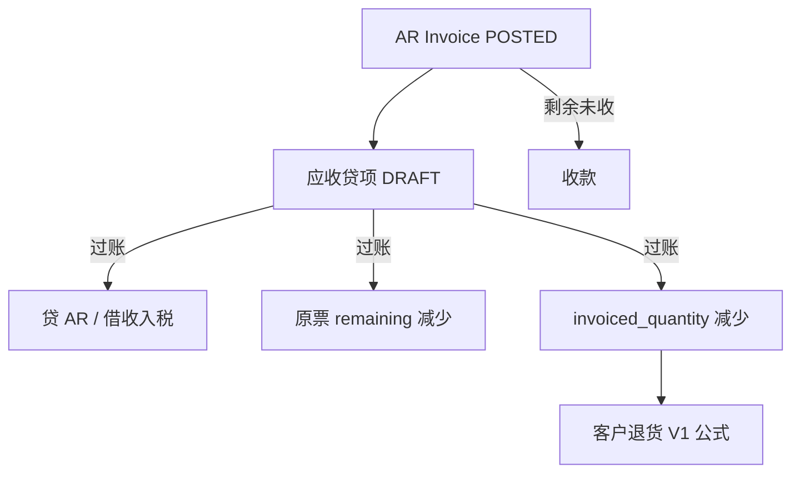

# 02. 目标流程：应收贷项（To-Be）

> 原则：应收贷项是 FI 单据，一对一已过账 AR 发票；过账时拆 applied / refundable、回减交货占用。  
> 客户退货不生成贷项。退货 V1 可退公式不改。  
> 命名一律 **应收贷项 / `AR_CREDIT_MEMO`**。  
> 真实现金退款见 [客户退款-主流程V1](../客户退款-主流程V1/02-目标流程.md)。

---

## 1. 目标单据链

```text
AR(POSTED) ─► 应收贷项 ─► 贷应收 / 借收入与销项税
                │
                ├─► 原票 remaining ↓、credited / applied_credit ↑
                └─► 交货行 invoiced_quantity ↓（仅 SHIPMENT 行）
                         │
                         └─► 客户退货按 V1：占用下降即可退
```



与发票作废对照：

```text
VOID AR     ─► 整单冲凭证 + 回吐全部占用；有过账收款则禁止
应收贷项    ─► 部分数量/金额；原票保留 POSTED；applied 冲未收，超出部分记 refundable
```

与客户退货对照：

```text
贷项先过账 ─► 只动应收与占用，不动库存
退货后过账 ─► 入库 + 冲回 COGS
```

---

## 2. 作业

1. 进入 `/fi/ar-credit-memos`（FI「应收应付」菜单，排在应收发票之后、应付贷项附近）。
2. 新增：从一张 **POSTED** AR 生成草稿（公司、客户、币别、汇率从原票复制，不可改）。
3. 勾选可贷行，默认带可贷数量。可改：数量（`≤` 可贷）、税额（`tax_amount_overridden`，对标 AR）、备注。不可改：物料、单价、税码、来源行、GL。
4. 提交时填写税务贷项号（`tax_credit_note_no`，禁止占位符）。
5. 审批 → 过账：凭证 + 拆 applied/refundable + 回减占用。
6. 草稿可删；已过账可 VOID（见 §3.7），不是冲原 AR。

应收发票页：已过账、有可贷行且具备 create 权限时显示「生成贷项」。不在退货页生成贷项。

---

## 3. 规则

### 3.1 准入

- 原单：`ar_invoices.invoice_status = POSTED`
- 一张贷项只对一张 AR（`original_ar_invoice_id`）
- 公司、伙伴、币别、汇率从原票冻结，之后不改
- 明细 `original_ar_invoice_line_id` 必须属于该发票；同贷项内一行对一条发票行
- 禁止手键无来源行

### 3.2 数量与金额（正数）

行数量、单价、金额均为 **正数**。凭证借贷在过账服务里对调。

```text
postedCreditedQty = SUM(已过账贷项行.quantity)          // 同 original_ar_invoice_line_id，排除 VOIDED
otherDraftQty     = SUM(其他 DRAFT 贷项行.quantity)
creditableQty     = ar_line.quantity − postedCreditedQty − otherDraftQty
```

- 草稿占用可贷数量（排除本单），**不**回写 `invoiced_quantity`
- 过账校验：每行 `quantity ≤ creditableQty`（锁原票行）
- 表头 `total_amount ≤ 原票尚未贷回总额`（`total − credited`）。允许超过 `remaining`，超出部分形成待退款
- **草稿互斥不对称**：数量在草稿即互斥；金额只在过账用尚未贷回总额与现金上限卡
- 本波只做「按原行数量 × 原单价」比例贷回。不改单价、不做纯金额价差贷项

单价、税码、税率从原票行按数量比例缩放。税默认重算；允许 `tax_amount_overridden`。

### 3.3 占用（交货行）

仅 `source_doc_type = SHIPMENT` 且 `source_line_id` 为交货行 id 的贷项行：

- **过账**：`updateInvoicedQuantity(quantityDelta = −quantity)`
- **VOID**：`quantityDelta = +quantity`
- **草稿 / 删草稿**：不调用

之后客户退货 V1 公式自动看到更大的 `uninvoicedTxn`。  
`RemoteCustomerReturnCreditMemoService.assertReturnableAgainstInvoice` / hooks **保持 V1**（断言未占用；hook 空）。WM 数量账公式不改。

`SALES_ORDER` 来源的 AR 行：只核销金额，不写交货占用。

### 3.4 原票剩余

`ar_invoices` 增加 `credited_amount`、`applied_credit_amount`（默认 0）。

```text
remaining = total_amount − received_amount − applied_credit_amount
```

- 贷项过账：`credited_amount += 本单 total`，`applied_credit_amount += applied`；重算 `remaining` 与 `receipt_status`
- 贷项 VOID：回滚上述两列（不得负）
- 收款 `applyAr` / `restoreAr` **必须**改用上式，禁止再写 `remaining = total − received`

`receipt_status`：`remaining == 0` → `RECEIVED`（含「被贷项结清」）；`received > 0` 且 `remaining > 0` → `PARTIAL`；否则 `UNRECEIVED`。收款挑票仍看 `remaining > 0`。

排程本波不因贷项重算；收款硬闸仍是表头 `remaining`。

### 3.5 过账拆分

锁贷项、原 AR、原 AR 行之后：

```text
remainingBefore      = total − received − appliedCredit
grossCreditAvailable = total − credited
appliedAmount        = min(creditMemo.total, remainingBefore)
refundableGross      = creditMemo.total − appliedAmount
```

校验：`creditMemo.total ≤ grossCreditAvailable`；每行数量 ≤ 可贷。不再使用 `total ≤ remainingBefore`。

收款折扣：待退款不得超过该票剩余实收现金（`Σ allocated_amount`，不含 `discount_amount`）。超过则拒绝，禁止静默截断。对标应付贷项 / 供应商退款 V1。

本位币快照一律按贷项（即原票）汇率重乘：

```text
memoTotalBase    = round(total × exchangeRate, 2)
appliedBase      = round(appliedAmount × exchangeRate, 2)
refundableBase   = memoTotalBase − appliedBase
```

`refund_status`：`NOT_REQUIRED` / `UNREFUNDED` / `PARTIAL` / `REFUNDED`。现金退款回写见 [客户退款-主流程V1](../客户退款-主流程V1/02-目标流程.md)。

### 3.6 凭证

对标 `ArInvoicePostingServiceImpl`，金额为正、借贷对调：

| 原 AR | 贷项 |
|--------|------|
| 借应收（伙伴 GL） | 贷应收 |
| 贷收入（行 GL） | 借同一科目 |
| 贷销项税 | 借销项税（税码 `outputGlAccountId` 或 `OUTPUT_TAX`） |

- `sourceModule = AR`，`sourceDocType = AR_CREDIT_MEMO`
- `postDate = credit_date`；已关期间拒绝过账
- 本波不强制 `credit_date ≥ 原票 invoice_date`
- 汇率冻结为原票快照
- 数量记账政策：贷项**仍过账**（冲债权）

不写客户退货。不生成付款行。不改原票 `journal_entry_id`。

### 3.7 VOID 贷项

仅 `POSTED` → `VOIDED`：

1. 触及的交货行若存在 **POSTED** 客户退货 → 拒绝。须先冲销该退货单。REVERSED 不算。  
   **有意偏严**：与应付贷项相同，不按数量拆「这笔退货是否吃了本贷项释放的占用」。
2. 存在有效客户退款核销 → 拒绝
3. 冲本单凭证，`journal_entry_id` 置空
4. 回加 `invoiced_quantity`。若占用已被后续 AR（含草稿）重新占走，SD cap 会失败；须先改/删后续占用。专用 i18n
5. 回减 `credited_amount` 与 `applied_credit_amount`，重算 remaining / receipt_status
6. `voided_by` / `voided_at`

后置收款不拦 VOID 贷项：作废后 `remaining` 加回，已收金额保留。

### 3.8 其他闸门

| 闸 | 规则 |
|----|------|
| AR 草稿 | 不可为原单；客户退货对草稿占用仍拒绝 |
| 作废原 AR | 存在非 VOIDED 贷项 → 禁止 VOID 发票 |
| 过账收款 | 不直接拦贷项；待退款不得超过剩余实收现金。有 `refundable>0` 的未作废贷项时禁止撤原收款 |
| 财务关帐 | `credit_date` 落在期间内且状态为 `DRAFT` / `PENDING_APPROVAL` / `APPROVED` → 拒绝关帐。`POSTED` / `VOIDED` 不拦 |
| 改公司国家码 | **不**新增 `hasOpenArCreditMemos` |
| 成卡 | 无；AR 行不成固定资产 |

### 3.9 从 AR 生成草稿

`createDraftFromArInvoice(arInvoiceId)`：

- 仅 POSTED
- 行：`creditableQty > 0`
- 默认数量 = `creditableQty`
- `tax_credit_note_no` 草稿用 `PENDING-` + UUID（对标 AR `tax_invoice_no` / 应付贷项占位符）；提交时禁止占位符
- 唯一约束：`(company, partner, tax_credit_note_no)` 与 AR `tax_invoice_no` **命名空间独立**

---

## 4. 与客户退货的分工

| | 应收贷项 | 客户退货 |
|--|----------|----------|
| 模块 | FI | WM |
| 先发生 | **先** | 占用下降之后 |
| 库存 | 不动 | 入库 |
| 应收 | 减少 | 不动 |
| 占用 | 过账回减 `invoiced_quantity` | 只读占用算可退 |
| 自动生成对方 | 否 | 否 |

作业顺序（已开票要退货）：

```text
1. 财务：从 AR 生成贷项 → 过账
2. 仓库：客户退货 → 过账
3. 若要撤回：先冲销退货，再 VOID 贷项
```

只贷不退：允许。

---

## 5. API

对标 `/api/v1/fi/ap-credit-memos`。权限前缀 `/fi/ar-credit-memos`。

| 方法 | 路径 | 权限 |
|------|------|------|
| POST | `/api/v1/fi/ar-credit-memos/page` | read |
| GET | `/{id}` | read |
| POST | `/` | create |
| PUT | `/{id}` | update |
| DELETE | `/bulk-delete` | delete |
| POST | `/from-ar-invoice` | create |
| PUT | `/action` | update（SUBMIT / APPROVE / UNAPPROVE / POST / VOID） |
| POST | `/{id}/items/page` | read |
| POST | `/{id}/items` | update |
| PUT | `/{id}/items/{itemId}` | update |
| DELETE | `/{id}/items/bulk-delete` | update |
| POST | `/{id}/creditable-lines/page` | read |

建表头必须带 `originalArInvoiceId`。不要提供「从客户退货生成贷项」。

可退款查询（给退款页用，可与本波或退款波一起做）：

```text
POST /api/v1/fi/ar-credit-memos/refundable/page
```

固定 `POSTED && refund_remaining > 0`。

---

## 6. 前端

唯一作业：`/fi/ar-credit-memos`。页面结构复制 `pages/fi/ap-credit-memos`：

- 主从表、DRAFT 可改
- 「从应收发票生成」
- 工作流动作与 AR 相同
- 展示 applied / refundable / refunded / refundStatus

应收发票列表/详情：可贷时显示「应收贷项」。  
收款单 STANDARD 不增加贷项核销类型。

文案：zh-CN / en-US / vi-VN 均用「应收贷项」（英文 `AR Credit Memo`）。

客户退货占用失败：已过账占用改为「先过账应收贷项或作废发票」；草稿占用仍「改/删发票行」。

---

## 7. 模块边界

| 动作 | 模块 |
|------|------|
| 贷项 CRUD / 过账 / VOID | `lychee-erp-fi` |
| 关帐未过账贷项 | `FiscalPeriodManageServiceImpl`（按 `credit_date`） |
| 回减占用 | 现有 `RemoteDeliveryService.updateInvoicedQuantity`（加交货行锁） |
| VOID 时是否有已过账退货 | 新 `RemoteCustomerReturnService.existsPostedByDeliveryItemIds` |
| 客户退货可退 | **不改**计算器与 CreditMemo V1 断言 |

---

## 8. 本波不做

- 未分配贷项（过账必须拆完 applied / refundable）
- 一张贷项核多张 AR
- 贷项收款排程
- 从客户退货自动生成贷项
- 负数量 / `document_kind` 做在 `ar_invoices` 上
- 纯金额 / 改单价的价差贷项
- 账龄报表
- 客户预收款退回（不是本贷项路径）
