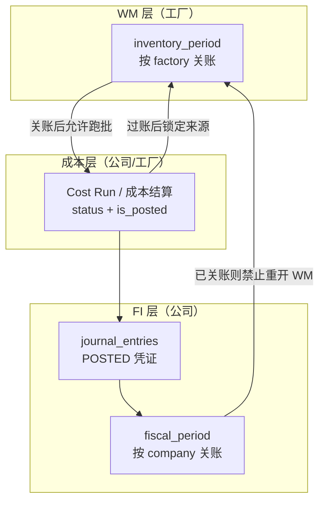

这是一个非常敏锐且直击 ERP 财务与物流整合 (FI-MM Integration) 痛点的问题。

**答案是：绝对会存在这个问题。这正是 ERP 实施和设计中最容易出现“账料不符”的致命风险点。**

如果在 `inventory_periods` 重开 (Re-open) 期间补打了单据，而这些单据对应的财务凭证 (Journal Entries) 没有正确抛转给 `fiscal_periods`（或者抛转失败，或者因为重开账逻辑不完善导致漏抛），那么在最终 FI 关账时，**库存次分类账 (Sub-ledger)** 与 **总账 (General Ledger)** 的数据将永远对不上。

以下为您详细分析这个问题的根源、风险表现，以及规范 ERP 系统是如何防范和解决这个问题的。

### 一、 风险发生的情境推演

假设今天是 11 月 3 日，正在结 10 月份的账：

1. **10 月 WM 关账：** 仓库主管在 11/1 把 `inventory_periods` (10月份) 关了。此时，10 月的期末数量已被固化到 `inventory_balances`。
2. **FI 过渡期（计算中）：** 财务主管开始跑 10 月份的成本分摊和实际成本计算。
3. **发现异常要求重开：** 财务或业务发现漏打了一张 10/28 的巨大收货单，导致数量对不上。此时，`fiscal_periods` (10月份) 还没关账。于是，经过核准，`inventory_periods` 被重开。
4. **【风险引爆点】** 仓库补打了 10/28 的收货单（日期落在 10 月）。
5. **重新 WM 关账 & FI 关账。**

**如果系统设计不严谨，可能出现以下差异灾难：**

- **问题 1：凭证抛转失败/时间差错位。** 补打的那张 10/28 收货单，如果没有即时抛转出财务凭证（因为可能排程没扫到），或者被抛转到了 11 月的财务凭证里（系统拿了系统当前时间而不是过账日期），那么 10 月的总账成本就少了这笔。
- **问题 2：成本重算遗漏。** 如果财务已经跑完了一部分成本结算（比如计算好了移动平均价），这笔突然补打的 10 月单据没有触发成本重新计算，就会导致整个库存金额计算错误。


### 二、 规范 ERP 的防范机制与系统设计方案

为了防止这种“重开账导致的异步”，规范的 ERP 在架构设计上必须具备以下防线：

#### 防线 1：即时或原子的凭证抛转 (Real-time Integration)

最根本的解决方式是，让“库存异动 (Stock Transaction)”与“会计凭证 (Journal Entry)”形成强绑定的原子操作。

- **设计原则**：当那张 10/28 的收货单被过账时，系统不只是写入 `stock_transactions`，还必须在**同一个数据库事务 (Transaction)** 内，直接生成一张 10 月份的 `journal_entries`（借：存货，贷：应付暂估 GR/IR）。
- **结果**：即使 `inventory_periods` 重开后补了单，财务立刻就在未关账的 10 月 `fiscal_periods` 中看到了一笔新的未结凭证。只要凭证进了总账，账料就是相符的。


#### 防线 2：成本计算的防呆机制 (Costing Run Dependency)

如果贵公司的成本是在月底才统一步骤批次结算（Batch Costing Run），而非即时移动平均：

- **设计原则（职责分离）**：
  1. **作废 Cost Run 仅财务可执行**（`POST /fi/cost-calculations/{id}/invalidate`）：`DRAFT` / `FINALIZED` 直接失效并停用 ACTUAL；`POSTED` 须先冲销凭证再失效。
  2. **仓库重开 `inventory_periods` 前**，系统按 **公司 + 会计年/期** 检查是否仍存在活跃 Cost Run（`DRAFT` | `FINALIZED` | `POSTED`）。有则 **拒绝重开**，提示财务先作废，**不由 WM 自动 INVALIDATED**。
  3. 联动粒度与 Cost Run 一致（公司级聚合），不以可选的 `inventory_period_id` 作为唯一匹配键。
- **关联表**：`cost_calculations` → `cost_calculation_items` / `cost_allocations` / `material_costs`（`cost_calculation_id` 追溯）。
- **结果**：强迫财务在同意 WM 重开前主动作废当期成本；WM 重关后必须**重新执行完整成本结算**，才能进行 FI 关账。
- **详细表结构**：见 `docs/database/FI_schema_design.md` §3.12–§3.15、§7。


#### 防线 3：过账日期 (Posting Date) 与输入日期 (Entry Date) 的严格区分

- `Entry Date`：实际敲键盘的系统时间（例如 11/3）。这个日期不可修改。
- `Posting Date`：影响属于哪个月份的过账日期（例如 10/28）。
- **设计原则**：当 `inventory_periods` (10月) 处于重开状态时，所有补打的单据其 `Posting Date` 必须严格校验是否落在 10 月的 `start_date` 和 `end_date` 之间，并且其产生的财务凭证也必须使用相同的 `Posting Date` 抛入总账。


#### 防线 4：对账报表 (Reconciliation Report) 作为 FI 关账的最后守门员

在允许财务主管按下 FI 关账按钮前，系统应强制跑出一个报表，比对：

- 所有处于当期的 `inventory_balances` 加总金额 (Sub-ledger)
- **必须等于**
- 会计科目表 `gl_accounts` 中“存货相关科目”的当期期末余额 (General Ledger)

如果差异不为 0，系统应该直接抛出 Exception，**禁止 FI 关账**，并提示用户去找出哪几笔 `stock_transactions` 没有产生 `journal_entries`。

### 总结给您的开发建议

在您目前的 Lychee ERP 架构中，要想避免您提出的问题，建议在设计财务集成部分时注意以下几点：

1. **单据过账交易化 (Transactional Posting)**：在开发各种出入库 Service（如 `GoodsReceiptService`, `StockIssueService`）时，最好规划一个通用的 `FinanceIntegrationService`，在库存数据存盘的同一个 `@Transactional` 里，把资料送给财务模组生成暂存或确定的财务明细。
2. **严格管控重开权 (Strict Re-open Policy)**：`reopenInventoryPeriod` 在现实中是个极其敏感的操作。应权限控管 + 审计；**系统硬门禁**为：对应公司会计期无活跃 Cost Run（须财务先 `invalidate`）且 FI 期间未关。仓库不得间接作废成本结果。

您的顾虑是非常专业的实施顾问/系统架构师才会考虑到的层面，这确实是 ERP 稳定性的生命线。

规范 ERP 里，**工厂可以管** `inventory_period`**，但不能「随便重开」**——靠的不是某一张表，而是一套 **期间锁层级 + 依赖检查 + 权限分离 + 审计** 的组合控制。核心思想是：

> **WM 重开会破坏 FI 已认定的成本与凭证，因此重开权必须比 WM 关账、Cost Run、FI 过账更严；Cost Run 作废权在财务，仓库重开前系统验证无活跃成本结算。**

---


## 1. 期间锁的层级（Period Lock Hierarchy）

规范 ERP 通常把期间分成多层，**下层未解锁前，上层不能随意回退下层**：




**控制原则**：


| 若已发生                          | 则禁止 / 限制                        |
| ----------------------------- | ------------------------------- |
| 存在活跃 Cost Run（`DRAFT` / `FINALIZED` / `POSTED`） | **禁止**重开 WM，直至财务执行 `invalidate` 作废 |
| Cost Run 已 `POSTED` | 财务须先冲销凭证并作废，仓库才能重开 |
| `fiscal_period` 已关账           | **绝对禁止**重开 WM（需先 FI 反关账，极少授权）   |
| 存在未冲销的库存凭证                    | 禁止重开，或重开前必须先 void/reverse 关联 JE |


也就是说：**不是工厂「能不能点重开按钮」，而是系统先查下游依赖，不满足就硬挡。**

---


## 2. 重开前的系统硬检查（Dependency Check）

规范 ERP 在 `reopenInventoryPeriod(factory, period)` 执行前，会做类似检查清单：

### 2.1 成本结算依赖

- 按工厂所属 **公司 + 会计年/期** 解析对应 `fiscal_period`，检查是否存在 `cost_calculations` 且 `status IN (DRAFT, FINALIZED, POSTED)`（公司级 Cost Run，不依赖单厂 `inventory_period_id`）。
- 实现：`RemoteCostCalculationInvalidationService.assertNoActiveCostRunForReopen(companyId, fiscalYear, periodNo)`，由 `reopenInventoryPeriod` 在改状态前调用。

**规则（已落地）**：

```text
仓库申请/执行重开
    ↓
系统：FI 期间未关？
    ↓
系统：该公司该会计期是否仍有活跃 Cost Run？
    · 有 DRAFT / FINALIZED / POSTED → 拒绝，提示财务先作废
    · 无（仅 INVALIDATED 或尚无 run）→ 允许重开
    ↓
财务侧（若被拒）：执行 invalidate
    · POSTED → 冲销 JE + INVALIDATED
    · DRAFT / FINALIZED → INVALIDATED + 停用 ACTUAL
    ↓
仓库再次 reopen（通过校验）
```

- **不作**：WM 重开时自动 `INVALIDATED`（避免仓库权限间接改 FI 结果、财务不知情）。
- 一公司多工厂：任一工厂重开前，只要该公司该期仍有活跃 Cost Run，一律拒绝（与公司级聚合一致）。


### 2.2 财务凭证依赖

- 该 factory 在该 inventory period 内产生的 `stock_transactions`，是否都已生成 `journal_entries` 且状态为 `POSTED`？
- 是否存在已对账锁定的凭证（月结对账标记）？


### 2.3 会计期间依赖

- 对应 `company_id` 的 `fiscal_period` 是否已 `is_closed = true`？
- 若 FI 已关 → 重开 WM **一律拒绝**（SAP 里相当于 OB52 已关账期间）


### 2.4 跨工厂一致性（一公司多工厂）

- Cost Run 按公司聚合全工厂异动；重开门禁也按 **公司 + 会计期**。
- 任一工厂重开前，须该公司该期 Cost Run 已由财务作废（或不存在活跃 run）。
- **禁止**「单厂重开却只失效绑了该 `inventory_period_id` 的 run」——会漏掉未填 id 或绑其它厂的公司级 run。

这是多工厂 ERP 常见痛点：**WM 按厂、FI 按公司，控制粒度要在应用层显式定义。**

---


## 3. 权限与职责分离（SoD）

「工厂管理 inventory_period」≠「工厂用户能重开」。


| 操作       | 典型授权对象                         |
| -------- | ------------------------------ |
| WM 关账    | 仓库主管 / 工厂物流经理                  |
| 发起重开申请   | 极少人，通常需书面原因                    |
| **作废 Cost Run（invalidate）** | **仅 FI 成本会计 / 总账**（含未过账草稿/定稿） |
| **批准/执行 WM 重开** | 在财务已清场（无活跃 Cost Run）后，由授权角色执行 |
| 冲销成本凭证   | 随 `POSTED` 的 invalidate 由财务执行 |
| FI 反关账   | 财务总监级（极敏感）                     |


规范做法：

- **Reopen = 财务先作废成本 + 仓库再重开**（系统强制校验；可选再加 Maker-Checker 审批流）
- 仓库不能通过重开间接 `INVALIDATED`；只能在财务清场后执行 reopen
- 系统记录：谁作废 Cost Run、谁重开 WM、何时、原因码（漏单 / 盘点差异 / 数据错误等）

---


## 4. 重开与成本作废的顺序（SoD，非 WM 自动 cascade）

**正确顺序**：

1. **财务**对当期活跃 `cost_calculations` 执行 `invalidate` → `INVALIDATED`
2. 停用该 run 写入的 `material_costs.is_active`
3. 若曾 `POSTED` → invalidate 内生成 **冲销凭证**（reversal JE）
4. 写 **audit log**
5. **仓库**执行 `reopenInventoryPeriod`：系统确认无活跃 Cost Run 后才改 `is_closed`
6. WM 重关后，通知/由财务 **重新 start → complete → post** Cost Run

**错误顺序（已废弃）**：WM 重开时自动把未过账 Cost Run 标为 `INVALIDATED`——仓库权限越权改 FI，且财务可能不知道要重跑。

这与防线 2 一致：**作废权在财务；重开前必须已无活跃成本结算。**

---


## 5. 与凭证「账务期间」如何对齐

规范 ERP 区分三个时间概念：


| 概念                        | 作用         |
| ------------------------- | ---------- |
| **Document / Entry Date** | 系统录入时间，不可改 |
| **Posting Date**          | 决定进哪个月的总账  |
| **Period Status**         | 该月是否允许过账   |


**WM 重开控制凭证期间的方式**：

1. **重开期间内**：允许补录单据，但 `posting_date` 必须落在该 `inventory_period` 的 `[start_date, end_date]`
2. **补单过账**：同一事务内生成 `journal_entries`，`fiscal_period_id` 指向 **业务月份**（10 月），不是当前系统月份（11 月）
3. **FI 未关账**：10 月 `fiscal_period` 仍 open，补单凭证可进 10 月 GL
4. **FI 已关账**：即使 WM 重开，**也不允许** posting 到已关 FI 期 → 必须走「调整期 / 次月冲回」等特殊流程

所以：**控制工厂不能随便重开 WM，本质是保护「FI 已认定的 posting period」不被无声篡改。**

---


## 6. 参考 SAP / Oracle 的对应概念（行业惯例）

虽不看你们代码，但规范 ERP 的命名不同、逻辑类似：


| 概念     | SAP 大致对应                       | 控制要点         |
| ------ | ------------------------------ | ------------ |
| 工厂库存期间 | MM 物料期间（MMPV / OB52 物料视图）      | 工厂级开/关       |
| 成本结算   | CKMLCP / 实际成本核算                | 关 WM 后跑，过账后锁 |
| 财务期间   | FI 过账期间（OB52）                  | 公司级，关后禁止一切过账 |
| 重开     | 极少，需 reversing + authorization | 非仓库自助        |


SAP 典型顺序：**先关物料期间 → 跑成本 → 对账 → 关 FI 期间**。物料期间重开会要求撤销/重算物料分类账，且 FI 已关则根本不允许。

---


## 7. 可落地的控制策略（设计建议）

若要在 Lychee 里实现「工厂不能随便重开」，建议至少具备：

### A. 状态机（比 boolean 更严）

`inventory_periods.status`：
`OPEN` → `CLOSING` → `CLOSED` → `REOPEN_REQUESTED` → `REOPENED` → `CLOSED`

重开必须走 `REOPEN_REQUESTED`，不能 `CLOSED → OPEN` 一跳。

### B. 重开前置 API 检查（已落地逻辑）

```
IF fiscal_period.is_closed THEN REJECT
IF EXISTS cost_calculation
     WHERE company + fiscal_period matched
       AND status IN (DRAFT, FINALIZED, POSTED) THEN REJECT
     -- message: finance must invalidate first
IF NOT authorized for WM reopen THEN REJECT
THEN delete inventory_balances, set inventory_period open
-- do NOT auto-invalidate cost runs here
```


### C. 公司级 Cost Run 门禁

FI 关账前检查：

- 该公司下 **所有 factory** 的当月 `inventory_period` 均为 `CLOSED`
- 存在有效 `POSTED`（或至少 `FINALIZED`）且未 `INVALIDATED` 的 Cost Run
- 账料对平


### D. 重开次数 / 冷却期

- 同一 period 每月最多重开 N 次
- 超过则仅 CFO 可批
- 全部重开操作不可物理删除，只审计

---


## 8. 一句话总结

规范 ERP 的做法是：

1. **WM 重开是例外流程，不是工厂日常权限**
2. **重开前检查：无活跃 Cost Run（财务已 invalidate）、FI 期间未关**
3. **Cost Run 作废仅财务执行；WM 重开不再自动 cascade INVALIDATED**
4. **补单凭证严格按 posting date 进对应 fiscal period，FI 关账后禁止回写**
5. **一公司多工厂时，单厂重开按公司级成本门禁校验**

因此，公司级 Cost Run **反向锁住** 该公司该会计期下各工厂的 WM 重开：工厂不能在财务未作废成本的情况下单方面重开。