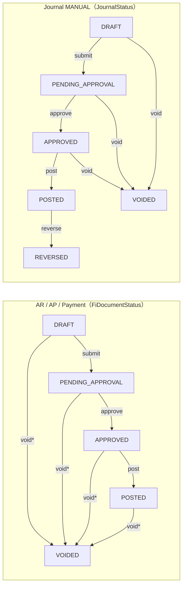

# API 端点 × 状态矩阵（AR / AP / Payment / Journal）

> 本文档与 [02.控制发票-收付款-凭证状态逻辑.md](./02.控制发票-收付款-凭证状态逻辑.md) 配套，描述**当前后端实现**下的 API 前置状态、按钮显隐规则与跨单据约束，供前端与后端校验对齐。
>
> 基准路径：`/api/v1/fi/...`

**图例：** ✅ 允许 | ❌ 拒绝 | ⚠️ 允许但有额外条件 | — 不适用

**状态缩写：** `D` = DRAFT · `PA` = PENDING_APPROVAL · `A` = APPROVED · `P` = POSTED · `V` = VOIDED · `R` = REVERSED（仅 Journal）

---

## 一、状态枚举对照

| 单据 | 状态字段 | Enum | 可用值 |
|------|----------|------|--------|
| AR Invoice | `invoiceStatus` | `FiDocumentStatus` | D, PA, A, P, V |
| AP Invoice | `invoiceStatus` | `FiDocumentStatus` | D, PA, A, P, V |
| Payment | `status` | `FiDocumentStatus` | D, PA, A, P, V |
| Journal Entry | `status` | `JournalStatus` | D, PA, A, P, V, **R** |

发票另有**业务执行状态**（与生命周期独立）：

| 单据 | 字段 | Enum | 含义 |
|------|------|------|------|
| AR Invoice | `receiptStatus` | `ArReceiptStatus` | UNRECEIVED / PARTIAL / RECEIVED |
| AP Invoice | `paymentStatus` | `ApPaymentStatus` | UNPAID / PARTIAL / PAID |

业务状态在 Payment **过账（POSTED）** 时反写，Payment **作废** 时回滚；不替代 `invoice_status` / `status` 生命周期判断。

---

## 二、统一生命周期主流程



\* void 在 POSTED 时可能触发凭证冲销；若存在下游 POSTED 收付款引用发票则拒绝。

Journal **AUTO** 凭证由业务单据过账时直接创建为 `POSTED`，无 D → PA → A 阶段。

---

## 三、AR Invoice（`/api/v1/fi/ar-invoices`）

### 3.1 生命周期 API

| API | Method | 前置状态 | D | PA | A | P | V | 目标状态 | 额外条件 / 联动 |
|-----|--------|----------|---|---|---|---|---|----------|----------------|
| `/{id}/submit` | POST | D | ✅ | ❌ | ❌ | ❌ | ❌ | PA | |
| `/bulk-approve` | POST | PA | ❌ | ✅ | ❌ | ❌ | ❌ | A | 写 `approvedAt` / `approvedBy` |
| `/bulk-unapprove` | POST | A | ❌ | ❌ | ✅ | ❌ | ❌ | D | 清 `approvedAt` / `approvedBy`；**AR 独有** |
| `/bulk-post` | POST | A | ❌ | ❌ | ✅ | ❌ | ❌ | P | 至少 1 行明细；伙伴 GL；各行 GL；**自动生成 AUTO 凭证（POSTED）** |
| `/{id}/void` | POST | 非 V | ✅ | ✅ | ✅ | ⚠️ | ❌ | V | ⚠️ 存在 **POSTED** 收付款 → 拒绝；P 且有过账凭证 → **冲销凭证** |

### 3.2 主档 / 明细 CRUD

| API | Method | D | PA | A | P | V |
|-----|--------|---|---|---|---|---|
| `PUT /{id}` | PUT | ✅ | ❌ | ❌ | ❌ | ❌ |
| `DELETE /bulk-delete` | DELETE | ✅ | ❌ | ❌ | ❌ | ❌ |
| `POST/PUT/DELETE /{id}/items*` | * | ✅ | ❌ | ❌ | ❌ | ❌ |
| `GET /{id}`, `/page`, `/items/page` | GET | ✅ | ✅ | ✅ | ✅ | ✅ |

### 3.3 前端按钮建议

| 按钮 | 显示条件 |
|------|----------|
| 编辑 / 删行 / 删单 | `invoiceStatus === DRAFT` |
| 提交 | `DRAFT` |
| 审批 | `PENDING_APPROVAL` |
| 反审批 | `APPROVED` |
| 过账 | `APPROVED` |
| 作废 | `!== VOIDED` 且无 POSTED 收付款引用 |
| 查看凭证 | `journalEntryId != null` |

---

## 四、AP Invoice（`/api/v1/fi/ap-invoices`）

### 4.1 生命周期 API

| API | Method | 前置状态 | D | PA | A | P | V | 目标状态 | 额外条件 / 联动 |
|-----|--------|----------|---|---|---|---|---|----------|----------------|
| `/{id}/submit` | POST | D | ✅ | ❌ | ❌ | ❌ | ❌ | PA | |
| `/{id}/approve` | POST | PA | ❌ | ✅ | ❌ | ❌ | ❌ | A | 写 `approvedAt` / `approvedBy` |
| `/{id}/post` | POST | A | ❌ | ❌ | ✅ | ❌ | ❌ | P | 至少 1 行；伙伴/行 GL；**AUTO 凭证**；`remainingAmount = totalAmount` |
| `/{id}/void` | POST | 非 V | ✅ | ✅ | ✅ | ⚠️ | ❌ | V | ⚠️ 存在 **POSTED** 付款 → 拒绝；P 且有过账凭证 → **冲销凭证** |

### 4.2 主档 / 明细 CRUD

与 AR 相同：**仅 DRAFT** 可改删；GET 任意状态可读。

### 4.3 前端按钮建议

| 按钮 | 显示条件 |
|------|----------|
| 编辑 / 删行 / 删单 | `DRAFT` |
| 提交 | `DRAFT` |
| 审批 | `PENDING_APPROVAL` |
| 过账 | `APPROVED` |
| 作废 | `!== VOIDED` 且无 POSTED 付款引用 |

> **与 AR 差异：** AP 使用单条 `approve` / `post`；AR 使用 `bulk-approve` / `bulk-post`；AR 多 `bulk-unapprove`，AP 无反审批。

---

## 五、Payment（`/api/v1/fi/payments`）

> 模型：**先资金后核销**（见 [09.收付款先资金后核销实施计划.md](09.收付款先资金后核销实施计划.md)）。  
> `amount` = 银行实收/实付；`unallocatedAmount = amount - Σ(allocated+discount)`。

### 5.1 生命周期 API

| API | Method | 前置状态 | D | PA | A | P | V | 目标状态 | 额外条件 / 联动 |
|-----|--------|----------|---|---|---|---|---|----------|----------------|
| `/{id}/submit` | POST | D | ✅ | ❌ | ❌ | ❌ | ❌ | PA | |
| `/{id}/approve` | POST | PA | ❌ | ✅ | ❌ | ❌ | ❌ | A | 写 `approvedAt` / `approvedBy` |
| `/{id}/post` | POST | A | ❌ | ❌ | ✅ | ❌ | ❌ | P | 银行账户 GL；按头 `amount` 生成 **AUTO 凭证**。STANDARD 不要求有行，可保留 `unallocatedAmount`。**供应商退款**必须恰好一行 `AP_CREDIT_MEMO` 且 `allocated = amount`，过账后 `unallocated = 0`；凭证 `sourceDocType = SUPPLIER_REFUND`、模块 `AP` |
| `/{id}/void` | POST | 非 V | ✅ | ✅ | ✅ | ⚠️ | ❌ | V | P → **冲销银行凭证 + 回滚全部核销行**。STANDARD：目标 AP 有 `refundable>0` 的未作废贷项则拒绝。退款：先回滚贷项核销与汇兑凭证，再冲银行凭证 |

CRUD DTO 带 `paymentPurpose`（`STANDARD` / `SUPPLIER_REFUND`）。Payment page 可按 purpose 过滤。

| API | Method | 说明 |
|-----|--------|------|
| `GET /by-line/{lineId}` | GET | 按核销行定位收付款单（凭证跳转 `PAYMENT` / `PAYMENT_ALLOC` / `SUPPLIER_REFUND_ALLOC`） |

### 5.2 主档 / 明细 CRUD

| API | D | PA | A | P | V |
|-----|---|---|---|---|---|
| `PUT /{id}`、删单、`/{id}/items` 行 CRUD | ✅ | ❌ | ❌ | ❌ | ❌ |
| `/{id}/items` GET | ✅ | ✅ | ✅ | ✅ | ✅ |
| GET 主档 | ✅ | ✅ | ✅ | ✅ | ✅ |

供应商退款草稿 `/{id}/items` 只允许恰好一行 `AP_CREDIT_MEMO`。DRAFT 且无行时可改 `paymentPurpose`。

### 5.3 核销 API（仅 POSTED）

| API | Method | 前置 | 行为 |
|-----|--------|------|------|
| `/{id}/allocations` | POST | P，`unallocatedAmount` 足够 | STANDARD：新增核销行并立即反写发票；`discount`/`GL_ACCOUNT` 产调整凭证。**供应商退款：拒绝**（过账时已全额核销） |
| `/{id}/allocations/{lineId}` | DELETE | P | STANDARD：回滚该行；目标 AP 有 `refundable>0` 的未作废贷项则拒绝。**供应商退款：拒绝**（只整单 VOID） |

### 5.4 收付款行引用发票

| 场景 | 校验 |
|------|------|
| `allocationType = INVOICE` + `apInvoiceId` | AP 必须 `POSTED`；STANDARD DISBURSEMENT；partner/company/currency 一致；≤ remaining |
| `allocationType = INVOICE` + `arInvoiceId` | AR 必须 `POSTED`；STANDARD RECEIPT；partner/company/currency 一致；≤ remaining |
| `allocationType = INVOICE` 且两者皆无 | 拒绝 |
| `allocationType = GL_ACCOUNT` | 必须 `glAccountId`；STANDARD |
| `allocationType = AP_CREDIT_MEMO` | 仅 `paymentPurpose = SUPPLIER_REFUND`；贷项 `POSTED` 且 `refundRemaining > 0`；同行 `allocated =` 头 `amount`；同公司/供应商/币别；交叉货币拒绝 |
| STANDARD 使用 `AP_CREDIT_MEMO` | 拒绝 |
| 同单重复核销同一发票 / 同一贷项 | 拒绝 |
| Σ 核销额 > `amount` | 拒绝 |

Open Invoices：现有 AP/AR page + filter（`invoiceStatus=POSTED` 且 `remainingAmount>0`）。  
可退款贷项：`POST /api/v1/fi/ap-credit-memos/refundable/page`（固定 `POSTED && refundRemaining > 0`；权限 `payments:read` + `ap-credit-memos:read`）。

### 5.5 前端按钮建议

| 按钮 | 显示条件 |
|------|----------|
| 编辑 / 删行 / 删单 | `DRAFT` |
| 添加拟核销行（items） | `DRAFT`；STANDARD 可选发票仅 **POSTED**；退款选一张可退款贷项，POSTED 后禁止追加/删行 |
| 核销（allocations） | `POSTED` 且 `unallocatedAmount > 0` 且 **非供应商退款** |
| 提交 / 审批 / 过账 | D → PA → A → P |
| 作废 | `!== VOIDED` |

---

## 5b、应付贷项（`/api/v1/fi/ap-credit-memos`）

贷项过账允许 `total > remaining`：拆 `applied`（冲未付）与 `refundable`（待退款）。有有效供应商退款时禁止 VOID 贷项。

| API | Method | 说明 |
|-----|--------|------|
| `POST /refundable/page` | POST | 可退款贷项分页；服务端固定 `POSTED && refundRemaining > 0` |

应付贷项响应含 `appliedAmount` / `refundableAmount` / `refundedAmount` / `refundRemainingAmount` / `refundStatus`。

---

## 六、Journal Entry（`/api/v1/fi/journal-entries`）

Journal 分 **MANUAL（手工）** 与 **AUTO（业务自动生成）** 两套 UI 规则。

### 6.1 MANUAL 凭证 — 生命周期

| API | Method | 前置状态 | D | PA | A | P | V | R | 目标状态 | 额外条件 |
|-----|--------|----------|---|---|---|---|---|---|----------|----------|
| `/{id}/submit` | POST | D | ✅ | ❌ | ❌ | ❌ | ❌ | ❌ | PA | 借贷平衡、≥2 行、期间未关 |
| `/{id}/approve` | POST | PA | ❌ | ✅ | ❌ | ❌ | ❌ | ❌ | A | 同上校验 |
| `/{id}/post` | POST | A | ❌ | ❌ | ✅ | ❌ | ❌ | ❌ | P | 同上校验 |
| `/{id}/void` | POST | 非 P/R/V | ✅ | ✅ | ✅ | ❌ | ❌ | ❌ | V | **POSTED / REVERSED 不可 void** |
| `/{id}/reverse` | POST | P | ❌ | ❌ | ❌ | ✅ | ❌ | ❌ | 原→R，新→P | 生成红字凭证 |

### 6.2 MANUAL 凭证 — CRUD

| API | D | PA | A | P | V | R |
|-----|---|---|---|---|---|---|
| `PUT`、`DELETE`、行 CRUD | ✅ | ❌ | ❌ | ❌ | ❌ | ❌ |
| GET | ✅ | ✅ | ✅ | ✅ | ✅ | ✅ |

约束：`journalType = MANUAL` 且 `status = DRAFT` 才可编辑/删除。

### 6.3 AUTO 凭证

| 操作 | 行为 |
|------|------|
| 创建 | 发票/付款过账时系统直接 `POSTED` |
| 编辑 / 删 / submit / approve / post / void | ❌ 禁止（非 MANUAL 或状态非 DRAFT） |
| 冲销 | **应通过作废源头 AR/AP Invoice 或 Payment**；前端不应在凭证页暴露冲销按钮 |

### 6.4 前端按钮建议

| 按钮 | MANUAL 显示条件 | AUTO 显示条件 |
|------|-----------------|---------------|
| 编辑 / 删行 / 删单 | `DRAFT` | 隐藏 |
| 提交 | `DRAFT` | 隐藏 |
| 审批 | `PENDING_APPROVAL` | 隐藏 |
| 过账 | `APPROVED` | 隐藏 |
| 作废 | D / PA / A | 隐藏 |
| 冲销 | `POSTED` 且未 REVERSED | 隐藏 |
| 查看来源单据 | 有 `sourceDocType` / `sourceDocId` | 显示跳转 |

---

## 七、四表汇总：状态 → 按钮矩阵

| 状态 | 编辑 | 删除 | 提交 | 审批 | 反审批* | 过账 | 作废 | 冲销** |
|------|------|------|------|------|---------|------|------|--------|
| **AR/AP/Pay: D** | ✅ | ✅ | ✅ | ❌ | ❌ | ❌ | ✅ | — |
| **AR/AP/Pay: PA** | ❌ | ❌ | ❌ | ✅ | ❌ | ❌ | ✅ | — |
| **AR/AP/Pay: A** | ❌ | ❌ | ❌ | ❌ | AR✅ | ✅ | ✅ | — |
| **AR/AP/Pay: P** | ❌ | ❌ | ❌ | ❌ | ❌ | ❌ | ⚠️† | — |
| **AR/AP/Pay: V** | ❌ | ❌ | ❌ | ❌ | ❌ | ❌ | ❌ | — |
| **Journal MANUAL: D** | ✅ | ✅ | ✅ | ❌ | ❌ | ❌ | ✅ | ❌ |
| **Journal MANUAL: PA** | ❌ | ❌ | ❌ | ✅ | ❌ | ❌ | ✅ | ❌ |
| **Journal MANUAL: A** | ❌ | ❌ | ❌ | ❌ | ❌ | ✅ | ✅ | ❌ |
| **Journal MANUAL: P** | ❌ | ❌ | ❌ | ❌ | ❌ | ❌ | ❌ | ✅ |
| **Journal MANUAL: V/R** | ❌ | ❌ | ❌ | ❌ | ❌ | ❌ | ❌ | ❌ |
| **Journal AUTO: P** | ❌ | ❌ | ❌ | ❌ | ❌ | ❌ | ❌ | ❌‡ |

\* 反审批仅 AR（`bulk-unapprove`）  
\*\* 冲销仅 Journal MANUAL（`/{id}/reverse`）  
† 无 POSTED 收付款引用时可 void；POSTED 时内部冲销凭证  
‡ AUTO 冲销走源头业务单据 void，不在 Journal 页操作

---

## 八、跨单据约束（按钮联动）

| 场景 | 规则 | 影响按钮 |
|------|------|----------|
| 发票被 POSTED Payment 引用 | 禁止 void 发票 | 发票「作废」隐藏/禁用 |
| 发票非 POSTED | 禁止 Payment 行引用 | 收付款「选发票」仅 POSTED |
| 发票 POSTED、无收付款 | 允许 void → 冲销发票凭证 | 发票「作废」可用 |
| AP POSTED 且 `creditedAmount < totalAmount`、有可贷行 | 允许生成贷项 | 应付发票「生成贷项」 |
| 贷项 POSTED 且 `refundRemaining > 0` | 允许登记供应商退款 | 贷项「登记供应商退款」 |
| 贷项有有效供应商退款 | 禁止 VOID 贷项 | 贷项「作废」隐藏 |
| 目标 AP 有 `refundable>0` 的未作废贷项 | 禁止撤原付款 / VOID 原付款 | 原付款「作废」/ 删核销行失败 |
| Payment POSTED void | 冲销凭证 + 回滚核销 | Payment「作废」可用 |
| AUTO 凭证 | 不可手工 edit/void | Journal 仅「查看 + 跳转来源」（含 `SUPPLIER_REFUND` / `SUPPLIER_REFUND_ALLOC`） |
| 会计期间已关 | post / reverse 等校验失败 | 过账/冲销需判断期间 |

正确撤销顺序（已付 AP 已开待退款贷项并已退款）：

```
1. void 供应商退款
2. 冲销采购退货（若有）
3. void 应付贷项
4. void 原付款（此时 refundable 已为 0）
5. void 原 AP（若需要）
```

---

## 九、API 形态差异速查

| 能力 | AR | AP | Payment | Journal |
|------|----|----|---------|---------|
| 提交 | `POST /{id}/submit` | 同左 | 同左 | 同左 |
| 审批 | `POST /bulk-approve`（批量） | `POST /{id}/approve` | `POST /{id}/approve` | `POST /{id}/approve` |
| 反审批 | `POST /bulk-unapprove` | 无 | 无 | 无 |
| 过账 | `POST /bulk-post`（批量） | `POST /{id}/post` | `POST /{id}/post` | `POST /{id}/post` |
| 作废 | `POST /{id}/void` | 同左 | 同左 | `POST /{id}/void` |
| 冲销 | 无（void 内部处理） | 无 | 无 | `POST /{id}/reverse` |

---

## 十、关帐相关状态检查

关帐（`FiscalPeriod.close`）时，期间内不得存在以下**未过账**单据（`DRAFT` / `PENDING_APPROVAL` / `APPROVED`）：

- AP Invoice（`invoice_date` 在期间内）
- **AP Credit Memo**（`credit_date` 在期间内）
- **AR Invoice**（`invoice_date` 在期间内）
- Payment（`payment_date` 在期间内）

`POSTED` / `VOIDED` 不影响关帐；`APPROVED` 未过账会阻塞关帐。

---

## 十一、主要校验消息 Key（i18n）

| Key | 场景 |
|-----|------|
| `validation.ar_invoice.status.not_draft` | AR 非草稿编辑/提交 |
| `validation.ar_invoice.status.not_pending_approval` | AR 非待审批却审批 |
| `validation.ar_invoice.status.not_approved` | AR 非已审批却过账/反审批 |
| `validation.ar_invoice.void.has_payments` | AR 作废但有 POSTED 收付款 |
| `validation.ap_invoice.status.not_draft` | AP 非草稿编辑 |
| `validation.ap_invoice.status.not_pending_approval` | AP 非待审批却审批 |
| `validation.ap_invoice.status.not_approved` | AP 非已审批却过账 |
| `validation.ap_invoice.void.has_posted_payments` | AP 作废但有 POSTED 付款 |
| `validation.payment.status.not_draft` | Payment 非草稿编辑 |
| `validation.payment_line.ap_invoice.not_posted` | 核销 AP 发票未过账 |
| `validation.payment_line.ar_invoice.not_posted` | 核销 AR 发票未过账 |
| `validation.payment_line.invoice.required` | INVOICE 核销未指定发票 |
| `validation.journal_entry.status.not_draft` | Journal 非草稿编辑 |
| `validation.journal_entry.journal_type.not_manual` | 修改 AUTO 凭证 |
| `validation.journal_entry.void.posted` | 已过账凭证禁止 void |
| `validation.fiscal_period.close.unposted_ar_invoices` | 关帐阻塞：未过账 AR |
| `validation.fiscal_period.close.unposted_ap_invoices` | 关帐阻塞：未过账 AP |
| `validation.fiscal_period.close.unposted_ap_credit_memos` | 关帐阻塞：未过账应付贷项 |
| `validation.fiscal_period.close.unposted_payments` | 关帐阻塞：未过账 Payment |

---

*文档版本：与后端 `lychee-erp-fi` 模块当前实现同步（含 Payment 先资金后核销、供应商退款 `SUPPLIER_REFUND`、`/allocations` API、AR/AP 核销对称校验）。*
