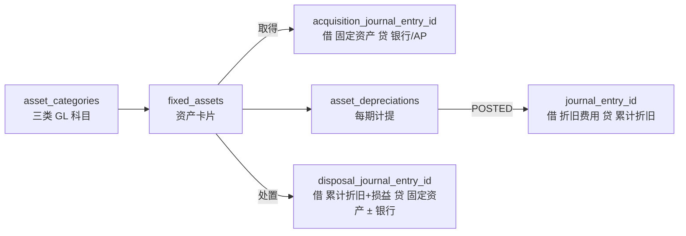

从会计实务看，固定资产（FA）模块产生的分录，本质是维护 **「原值 − 累计折旧 = 账面价值」** 这条等式，并在取得、折旧、处置等环节把变动反映到总账。下面按业务场景说明，并对照你们 `asset_categories`、`fixed_assets`、`asset_depreciations` 的设计。

---

## 一、固定资产涉及的三类核心科目

`asset_categories` 已配置其中四类（自动过账的基础）：

| 科目角色 | 字段 | 典型科目举例 | 性质 |
|----------|------|--------------|------|
| 固定资产原值 | `asset_account_id` | 1601 固定资产—机器设备 | 资产 |
| 累计折旧 | `accumulated_depreciation_account_id` | 1602 累计折旧—机器设备 | 资产备抵（贷方余额） |
| 折旧费用 | `depreciation_account_id` | 6602 管理费用—折旧 / 5101 制造费用—折旧 | 费用 |
| 处置损益 | `disposal_gain_loss_account_id` | 6115 资产处置损益（利得贷／损失借；勿与 6301/6711 混用） | 损益 |

**报表关系**：
- 资产负债表：`asset_account` − `accumulated_depreciation` = **账面价值**（对应 `fixed_assets.current_value`）
- 利润表：每期 `depreciation_account` 进 **当期损益**

处置时还需要（`asset_categories.disposal_gain_loss_account_id`）：
- **资产处置损益**（或营业外收入/支出）
- **银行存款 / 应收账款**（出售收款，由处置请求的 `receiptGlAccountId` 指定）
- 有时还有 **固定资产清理** 过渡科目（当前实现合并为一张 `disposal_journal_entry_id`）

---

## 二、取得 / 资本化 — 资产入账

### 场景 A：外购设备，货到票到，直接资本化

```
借：固定资产—机器设备（asset_account_id）     100,000
贷：银行存款 / 应付账款                        100,000
```

### 场景 B：先费用化采购，后判定应资本化（较少见）

```
# 先误进费用
借：管理费用—维修费                           100,000
贷：应付账款                                  100,000

# 后调整资本化
借：固定资产—机器设备                         100,000
贷：管理费用—维修费                           100,000
```

### 场景 C：在建工程（CIP）完工转入固定资产（系统默认资本采购路径）

资本性物料（`VC-ASSET`）经 AP 入账时：

```
# AP 发票过账（FiPostingKey.CIP → 1604）
借：在建工程（CIP）                           100,000
贷：应付账款                                  100,000
```

FA 卡片资本化（`capitalize`，贷方默认科目判定 CIP；也可显式传 `creditGlAccountId`）：

```
借：固定资产—机器设备（asset_account_id）     100,000
贷：在建工程（CIP）                           100,000
```

**从 AP 行手动生成卡片**（`POST /fixed-assets/from-ap-invoice-lines`）：
- 来源查询（减少前端关联）：
  - `GET /ap-invoices/{id}/fa-source`：单张发票 CIP 行 + `eligible` / `alreadyUsed` / 预估拆卡数
  - `GET /ap-invoices/fa-eligible-lines?companyId=`：公司下已过账 CIP 候选行扁平列表
- 请求必填 `assetCategoryId` + `lineIds`（取自上述来源中 `eligible=true` 的 `lineId`）
- `quantity` 须为正整数；1 行拆 N 卡（`split_no` 1..N）
- 原币：`acquisition_amount_txn = lineAmount/N`（最后一张吃尾差）；`acquisition_currency_id` / `acquisition_exchange_rate` 取自发票
- 本位币：`original_value` 按行本位总额 `lineAmount×rate` 同样均分+尾差
- 默认不自动资本化；`autoCapitalize=true` 时逐张转固（贷 CIP）

**会计要点**：
- 入账金额 = **取得成本**（买价 + 关税 + 运输 + 安装 + 其他可直接归属成本），对应 `fixed_assets.original_value`
- 一般 **取得时不记累计折旧**
- AP **不直接**借最终固定资产科目，避免与 FA 资本化双记
- 凭证写入 `fixed_assets.acquisition_journal_entry_id`，`journal_entries.source_module = 'FA'`

---

## 三、折旧计提 — FA 模块最核心的 recurring 分录

每期按 `depreciation_method`（直线法 / 余额递减法）计算 `depreciation_amount`，**标准分录只有两行**：

```
借：折旧费用（depreciation_account_id）         8,333
贷：累计折旧（accumulated_depreciation_account_id）  8,333
```

### 数值示例（直线法）

设备原值 100,000，残值 5,000，使用年限 10 年（120 月）：

```
月折旧 = (100,000 − 5,000) ÷ 120 = 791.67
```

对应 `asset_depreciations`：
- `depreciation_amount` = 791.67
- `accumulated_depreciation_after` = 上期累计 + 791.67
- `fixed_assets.accumulated_depreciation` / `current_value` 同步更新

### 按部门归属费用科目（实务常见）

同一类别资产，管理用进管理费用，生产用进制造费用：

```
借：管理费用—折旧（管理部门资产）               3,000
    制造费用—折旧（生产部门资产）               5,333
贷：累计折旧—机器设备                           8,333
```

实现上可在 `journal_entry_lines.department_id` 带 `fixed_assets.department_id`，或按类别/用途映射不同 `depreciation_account_id`。

### 余额递减法

```
月折旧 = 期初账面价值 × depreciation_rate
（且保证最后不会低于 salvage_value）
```

分录形式相同，只是 `depreciation_amount` 算法不同。

### 过账与期间

- 每月/每会计期跑折旧批处理，一条 `asset_depreciations` 对应一张（或合并进一张）凭证
- `journal_entry_id` 关联折旧凭证
- `depreciation_date` 应落在 `fiscal_period_id` 对应区间内
- `status`: `DRAFT` → `POSTED`

**重要**：折旧 **不减少** `asset_account` 原值，只增加 `accumulated_depreciation`；原值在处置前一般不变。

---

## 四、处置 / 出售 / 报废

处置时要 **一次清掉原值 + 累计折旧**，并与处置对价比较，确认损益。

### 场景 A：报废，无残值收入

账面：原值 100,000，累计折旧 85,000，账面价值 15,000

```
借：累计折旧—机器设备                         85,000
    资产处置损失（或营业外支出）               15,000
贷：固定资产—机器设备（asset_account_id）    100,000
```

→ `disposal_gain_loss` = **-15,000**（损失）

### 场景 B：出售，有收款

账面价值 15,000，售价 20,000（含税另计）

```
借：累计折旧—机器设备                         85,000
    银行存款                                   20,000
贷：固定资产—机器设备                         100,000
    资产处置收益（或营业外收入）                5,000
```

→ `disposal_gain_loss` = **+5,000**（收益）  
→ `disposal_amount` = 20,000  
凭证：`fixed_assets.disposal_journal_entry_id`

### 场景 C：用「固定资产清理」过渡（规范 ERP 常见）

**Step 1 转入清理**

```
借：固定资产清理                               15,000
    累计折旧                                    85,000
贷：固定资产                                  100,000
```

**Step 2 收到处置款**

```
借：银行存款                                   20,000
贷：固定资产清理                               20,000
```

**Step 3 结转损益**

```
借：固定资产清理                                5,000
贷：资产处置收益                                5,000
```

系统可合并为一张 `disposal_journal_entry_id`，逻辑不变。

### 处置前必须先提足折旧？

- **不必等到 FULLY_DEPRECIATED** 才能处置
- 处置日若当月尚未计提，实务上常 **先补提当月/至处置日折旧**，再处置
- `status` → `DISPOSED` 或 `SOLD`

---

## 五、其他常见 FA 业务（扩展）

当前表结构未单独建模，但规范 ERP 通常也支持：

### 1. 减值（Impairment）

可收回金额 < 账面价值时：

```
借：资产减值损失
贷：固定资产减值准备
```

减值后折旧基数 = 新账面价值 − 残值。你们 schema 暂无「减值准备」科目字段，若要做需扩展。

### 2. 后续支出资本化 vs 费用化

- **增加产能/延长寿命** → 增加 `original_value`（或单独子资产卡片）
- **日常维修** → 直接进费用，不进 FA

### 3. 部门间调拨

仅保管/成本中心变更、**不变动原值** 时，通常 **不过账**，只改 `department_id`；若涉及法人间转移，则是 **资产出售 + 购入**，整套 FA 分录。

### 4. 折旧冲销 / 重跑

错误计提后：

```
借：累计折旧
贷：折旧费用
（或整张凭证 VOID + REVERSED）
```

对应 `asset_depreciations.status = 'VOIDED'` + `journal_entries` 冲销。

---

## 六、与「成本分摊里的折旧」的区别

在 `06.会计分录.md` 成本分摊中提到的折旧，和 FA 模块折旧是 **两层关系**：

| 步骤 | 模块 | 分录 | 含义 |
|------|------|------|------|
| ① FA 计提 | `asset_depreciations` | 借折旧费用，贷累计折旧 | 固定资产 **入账折旧** |
| ② 成本分摊 | `cost_allocations` | 借制造费用—生产部，贷制造费用—厂务部 | 若折旧费用在厂务部池子里，**再摊到生产部门** |
| ③ 成本吸收 | Cost Run | 借 WIP/FG，贷制造费用已吸收 | 制造费用（含折旧） **进产品成本** |

**FA 模块本身只负责 ①**；②③ 属于 CO 模块，不再重复记「累计折旧」。

---

## 七、对照你们表结构的凭证映射



| 业务 | 系统记录 | 凭证特征 |
|------|----------|----------|
| 资本化取得 | `acquisition_journal_entry_id` | 借 `asset_account_id`，贷 银行/AP/CIP |
| 每期折旧 | `asset_depreciations.journal_entry_id` | 借 `depreciation_account_id`，贷 `accumulated_depreciation_account_id` |
| 出售/报废 | `disposal_journal_entry_id` | 借 累计折旧 + 损益 ± 银行，贷 `asset_account_id` |

`journal_entries` 建议：
- `source_module = 'FA'`
- `source_doc_type = 'FIXED_ASSET' / 'ASSET_DEPRECIATION' / 'ASSET_DISPOSAL'`
- `source_doc_id` = 对应主键

---

## 八、完整样例：一台设备的生命周期

**2025-01 购入**（原值 120,000，残值 0，10 年直线法）

```
# 取得
借：固定资产—设备    120,000
贷：应付账款          120,000
```

**2025-01 ~ 2025-12 每月折旧**（1,000/月）

```
借：制造费用—折旧      1,000
贷：累计折旧—设备      1,000
× 12 期 → asset_depreciations × 12
```

**2026-06 出售**，售价 115,000（此时累计折旧 18,000，账面 102,000）

```
# 若 6 月折旧尚未提，先补：
借：制造费用—折旧      1,000
贷：累计折旧            1,000

# 处置（累计折旧 19,000，账面 101,000）
借：累计折旧—设备       19,000
    银行存款           115,000
贷：固定资产—设备      120,000
    资产处置收益        14,000
```

---

## 九、实施时需明确的会计政策

1. **折旧起点**：`start_depreciation_date` 是次月开始还是当月按天折算  
2. **费用科目映射**：同一 category 是否按 `department_id` 分管理费用 / 制造费用  
3. **处置损益科目**：统一「资产处置损益」还是分营业外收入/支出  
4. **批处理合并**：一张凭证合并全公司折旧，还是按 category/department 拆分多行  
5. **部分处置**：一张卡片拆部分原值（需支持 quantity/component 或拆卡片）

---

## 十、一句话总结

固定资产模块在 GL 上的核心分录就三类：

1. **取得**：借 **固定资产**，贷 **银行/应付/在建工程**  
2. **折旧**（每期）：借 **折旧费用**，贷 **累计折旧** ← `asset_depreciations` 的核心  
3. **处置**：借 **累计折旧 + 处置损益 ± 收款**，贷 **固定资产** ← `disposal_journal_entry_id`

`asset_categories` 决定取得／折旧／处置用的四类科目；出售收款科目由处置请求的 `receiptGlAccountId` 指定。若需要，我可以再写一版与 `journal_entry_lines` 字段一一对应的过账行示例（含 `department_id`、`source_doc_type`）。