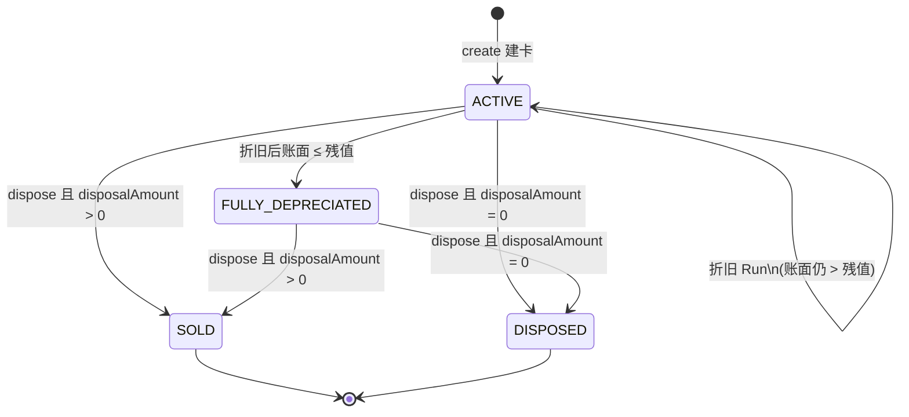

# 06.2 固定资产状态控制

本文档依据当前实现（`FixedAssetServiceImpl` / `FixedAssetManageServiceImpl` / `AssetDepreciationRunServiceImpl`）整理 `fixed_assets.status` 的含义、流转与作业闸门。会计分录细节见 `06.1-固定资产会计分录.md`。

---

## 一、状态枚举

| 状态 | 含义 | 如何进入 |
|------|------|----------|
| `ACTIVE` | 在用（含已建卡未资本化、已资本化仍在折旧） | 建卡默认 |
| `FULLY_DEPRECIATED` | 提足折旧（账面价值 ≤ 残值） | 折旧 Run 后自动置位 |
| `SOLD` | 出售处置（处置金额 > 0） | `dispose` |
| `DISPOSED` | 报废/无偿处置（处置金额 = 0） | `dispose` |

对应代码：`FixedAssetStatus`。

> **说明**：系统没有单独的「草稿 / 已资本化」状态。是否已资本化由 `acquisition_journal_entry_id IS NOT NULL` 判定；是否已提折旧由 `accumulated_depreciation > 0`（及 `asset_depreciations`）判定。

---

## 二、状态流转



终态：`SOLD` / `DISPOSED`（当前无反冲、无重新启用）。

---

## 三、作业权限矩阵

| 作业 | ACTIVE（未资本化） | ACTIVE（已资本化） | FULLY_DEPRECIATED | SOLD / DISPOSED |
|------|:------------------:|:------------------:|:-----------------:|:---------------:|
| 查询 / 分页 | ✅ | ✅ | ✅ | ✅ |
| 修改主档 | ✅ 全量核算字段可改 | ✅ 仅非核算字段 | ❌ | ❌ |
| 删除 | ✅（须未资本化且累计折旧=0） | ❌ | ❌ | ❌ |
| 资本化 `capitalize` | ✅（且尚未资本化） | ❌ 已资本化 | ❌ | ❌ |
| 折旧 Run | 跳过（未资本化） | ✅ | 不参与（仅查 ACTIVE） | ❌ |
| 处置 `dispose` | ❌ 须先资本化 | ✅ | ✅ | ❌ |

---

## 四、各状态控制细则

### 4.1 ACTIVE

**进入**：建卡时强制 `status = ACTIVE`，`accumulated_depreciation = 0`，`current_value = original_value`。

**子阶段（非独立 status，由字段表达）**：

| 子阶段 | 判定 | 典型场景 |
|--------|------|----------|
| 卡片草稿 | `acquisition_journal_entry_id == null` | 已建卡、总账尚未入固定资产 |
| 在用折旧中 | 已资本化且 `current_value > salvage_value` | 正常按期计提 |

**修改（`update`）**：

- 仅 `status == ACTIVE` 可改；否则 `validation.fixed_asset.status.not_editable`。
- **核算锁定**条件：`acquisition_journal_entry_id != null` **或** `accumulated_depreciation > 0`。
  - 锁定后**禁止**变更：类别、原值、取得日、开始折旧日、残值、折旧方法、耐用月数 → `validation.fixed_asset.accounting_fields.locked`。
  - 锁定后**允许**变更：名称、存放地点、部门、保管人、备注。
- 未锁定：可改核算字段；残值未传时按类别 `salvage_rate` 重算；累计折旧仍置 0、账面=原值。

**删除（`deleteBulk`）**：

- 必须 `ACTIVE`。
- 已资本化 → `validation.fixed_asset.capitalized.not_deletable`。
- 累计折旧 > 0 → `validation.fixed_asset.depreciated.not_deletable`。

**资本化**：

- 必须 `ACTIVE` 且 `acquisition_journal_entry_id == null`。
- 成功后**不改变** `status`，只写入 `acquisition_journal_entry_id`。

**折旧**：

- 批处理只拉取 `status = ACTIVE`。
- 单资产计提额外要求：已资本化、该期间未计提、`start_depreciation_date ≤ period.endDate`、可折金额 > 0。
- 计提后若 `current_value ≤ salvage_value` → 转为 `FULLY_DEPRECIATED`。

**处置**：

- `ACTIVE` 可处置，但必须已资本化。
- 默认 `catchUpDepreciation = true`：处置前对处置日所在会计期间补提（仅当仍为 `ACTIVE` 时执行）。

---

### 4.2 FULLY_DEPRECIATED

**进入**：折旧后账面价值 ≤ 残值时由系统置位。

**允许**：

- 查询。
- 处置（出售或报废）。**不再**做处置前补提（补提条件要求当前为 `ACTIVE`）。

**禁止**：

- 修改、删除、资本化。
- 折旧 Run（查询条件仅为 `ACTIVE`，不会选中）。

---

### 4.3 SOLD / DISPOSED

**进入**（`dispose` 成功后）：

| 条件 | 结果状态 |
|------|----------|
| `disposalAmount > 0` | `SOLD`（须传 `receiptGlAccountId`） |
| `disposalAmount = 0` | `DISPOSED`（报废，无需收款科目） |

同时写入：`disposal_date` / `disposal_amount` / `disposal_gain_loss` / `disposal_journal_entry_id` / `disposed_at` / `disposed_by`，并将 `current_value = 0`。

**允许**：查询。

**禁止**：修改、删除、资本化、折旧、再次处置。

---

## 五、与资本化标志的关系

```
status                          acquisition_journal_entry_id
─────────                       ────────────────────────────
ACTIVE                          null     → 可删、可改核算、可资本化、不可折旧、不可处置
ACTIVE                          有值     → 不可删、核算锁定、可折旧、可处置
FULLY_DEPRECIATED               有值     → 不可折旧、可处置
SOLD / DISPOSED                 有值     → 终态
```

资本化是折旧与处置的前置条件；状态本身不表达「已资本化」。

---

## 六、折旧记录状态（附）

`asset_depreciations.status`（`AssetDepreciationStatus`）与卡片状态独立：

| 状态 | 当前实现 |
|------|----------|
| `DRAFT` | 创建后立即过账，过渡态 |
| `POSTED` | 已生成 JE 并回写卡片 |
| `VOIDED` | 枚举已预留，**尚无**冲销/重跑 API |

卡片同一期间唯一约束：`(tenant_id, fixed_asset_id, fiscal_period_id)`，防止重复计提。

---

## 七、关键校验码速查

| 校验码 | 场景 |
|--------|------|
| `validation.fixed_asset.status.not_editable` | 非 ACTIVE 修改 |
| `validation.fixed_asset.status.not_deletable` | 非 ACTIVE 删除 |
| `validation.fixed_asset.capitalized.not_deletable` | 已资本化删除 |
| `validation.fixed_asset.depreciated.not_deletable` | 已有累计折旧删除 |
| `validation.fixed_asset.accounting_fields.locked` | 锁定后改核算字段 |
| `validation.fixed_asset.already_capitalized` | 重复资本化 |
| `validation.fixed_asset.status.not_capitalizable` | 非 ACTIVE 资本化 |
| `validation.fixed_asset.not_capitalized` | 未资本化处置 |
| `validation.fixed_asset.status.not_disposable` | 非 ACTIVE/FULLY_DEPRECIATED 处置 |
| `validation.fixed_asset.disposal_gain_loss_account.required` | 类别未配处置损益科目 |
| `validation.fixed_asset.dispose.receipt_gl_account_id.required` | 出售未传收款科目 |

---

## 八、实现入口

| 能力 | 类 / API |
|------|----------|
| CRUD | `FixedAssetServiceImpl` → `/api/v1/fi/fixed-assets` |
| 资本化 / 处置 | `FixedAssetManageServiceImpl` → `/{id}/capitalize`、`/{id}/dispose` |
| 折旧批处理 | `AssetDepreciationRunServiceImpl` → `/api/v1/fi/asset-depreciations/run` |

---

## 九、当前未实现（状态相关）

- 折旧冲销（`VOIDED`）及卡片从 `FULLY_DEPRECIATED` 回退到 `ACTIVE`
- 处置反冲（`SOLD`/`DISPOSED` → 恢复在用）
- 暂停折旧、闲置等中间状态
- 独立的「已资本化」卡片状态（现用 JE 关联表达）
