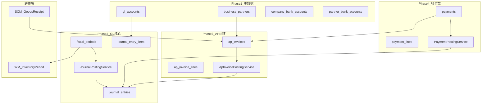
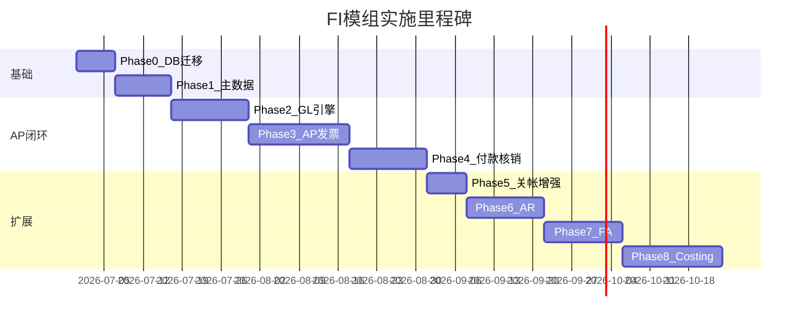

# FI 模组系统开发实施计划

## 现状评估


| 维度   | 现状                                                                                                                                                                                                       | 目标                                                                                                                        |
| ---- | -------------------------------------------------------------------------------------------------------------------------------------------------------------------------------------------------------- | ------------------------------------------------------------------------------------------------------------------------- |
| 数据库  | [v0/20260617-initial-db.sql](lychee-erp/src/main/resources/db/changelog/v0/20260617-initial-db.sql) 含旧版 FI 表（无 `company_id`、直接关联 `supplier_id`/`customer_id`、`status_option_id`、`payment_allocations` 等） | [FI_schema_design.md](docs/database/FI_schema_design.md) + [schema_tables/FI](docs/database/sql/schema_tables/FI) 共 20 张表 |
| 应用代码 | 仅 [FiscalPeriod](lychee-erp-fi/src/main/java/com/lychee/erp/fi/model/FiscalPeriod.java) CRUD + 关帐/重开（10 个 Java 文件）                                                                                       | 完整 FI 子域                                                                                                                  |
| 跨模块  | WM 已通过 [RemoteFiscalPeriodService](lychee-erp-common/src/main/java/com/lychee/erp/common/service/RemoteFiscalPeriodService.java) 同步库存期间                                                                  | 需扩展 company 维度、期间校验、FI 过帐接口                                                                                               |


**关键差距**：现有 `FiscalPeriod` 实体缺少 `company_id`、`closed_at`/`closed_by`；`RemoteFiscalPeriodService.listByFiscalYear` 未按公司过滤；旧表与新设计字段命名不一致（如 `voucher_no` → `journal_no`）。

---

## 总体架构




**开发规范**（沿用现有模块模式）：

- 按照后端开发规范  backend-development RULE
- 包路径：`com.lychee.erp.fi.{controller,dto,mapper,model,repository,service}`
- 参考实现：[FiscalPeriodController](lychee-erp-fi/src/main/java/com/lychee/erp/fi/controller/FiscalPeriodController.java) + WM [InventoryPeriodManageServiceImpl](lychee-erp-wm/src/main/java/com/lychee/erp/wm/service/impl/InventoryPeriodManageServiceImpl.java)
- 状态机规则：[02.控制发票-收付款-凭证状态逻辑.md](docs/chartExp/财务/02.控制发票-收付款-凭证状态逻辑.md)
- 关帐防呆：[01.控制库存与财务的关帐控制.md](docs/chartExp/财务/01.控制库存与财务的关帐控制.md)

---

## Phase 0：数据库破坏性迁移 + 基础对齐（约 1 周）

**目标**：Liquibase 按 [FI_schema_design.md §6 部署顺序](docs/database/FI_schema_design.md) 重建 FI 表，同步修正已有 FiscalPeriod 代码。

**Liquibase 变更**（新建 `lychee-erp/src/main/resources/db/changelog/v1/2026/0629-001-fi-schema-migration.sql` 等，分 changeset）：

1. DROP 旧 FI 相关表及 FK（`payment_allocations`、`ap_invoices`、`ar_invoices`、`payments`、`journal_*`、`gl_accounts`、`fiscal_periods`、`asset_*`、`fixed_assets`、`cost_*` 等）
2. 按顺序 CREATE 20 张新表（直接引用 [schema_tables/FI](docs/database/sql/schema_tables/FI) 内容）
3. 种子数据：默认 COA 模板、测试 tenant 的 fiscal periods（含 `company_id`）

**代码对齐**：

- 更新 `FiscalPeriod` 实体/DTO/Repository/Service，增加 `companyId`、`closedAt`、`closedBy`
- 扩展 `RemoteFiscalPeriodService`：`listByCompanyAndFiscalYear(companyId, fiscalYear)`；WM 同步逻辑需传入 `companyId`（通过 factory → company 映射）
- 在 `lychee-erp-common` 新增 FI 枚举常量（`JournalStatus`、`InvoiceStatus`、`PaymentStatus`、`GlAccountType` 等，对应设计文档 §4）

**验收**：Liquibase 在 dev 环境成功执行；FiscalPeriod API 支持按 company 分页/关帐；WM 库存期间同步仍可用。

---

## Phase 1：主数据层（约 1.5 周）

**目标**：建立 FI 运作所需的主档，为 AP 闭环提供科目、往来、银行账户。

### 1.1 会计科目 `gl_accounts`

- 完整 CRUD + 树形查询（`parent_id` 层级）
- 校验：统制科目 `is_reconciliation=true` 不可手工过帐（预留 JournalPostingService 钩子）
- API：`/api/v1/fi/gl-accounts`
- 权限：`/fi/gl-accounts:{read|create|update|delete}`

### 1.2 往来单位 `business_partners`

- FI 维护财务属性（`gl_account_id`、`payment_term_option_id`、`credit_limit`）
- **同步服务** `BusinessPartnerSyncService`：
  - 监听/定时从 SCM `suppliers`、SD `customers` 同步 `partner_code`/`partner_name`/`tax_id`（只读副本）
  - `RemoteSupplierService` / `RemoteCustomerService`（common 接口 + SCM/SD 实现）
- API：`/api/v1/fi/business-partners`

### 1.3 银行账户

- `company_bank_accounts`：公司资金账户，关联 GL 银行/现金科目（见 [05.公司银行帐号.md](docs/chartExp/财务/05.公司银行帐号.md)）
- `partner_bank_accounts`：往来单位收款账户
- API：`/api/v1/fi/company-bank-accounts`、`/api/v1/fi/partner-bank-accounts`

**交付物**：主数据 CRUD + i18n + RBAC 菜单种子 + OpenAPI 文档。

---

## Phase 2：总账核心引擎（约 2 周）

**目标**：实现可复用的传票过帐引擎，所有子帐（AP/AR/FA/Costing）均通过此引擎写 GL。

### 2.1 传票 CRUD

- `journal_entries` + `journal_entry_lines`（Header-Line 模式）
- 手工传票录入 API（`journal_type=MANUAL`）
- 借貸平衡校验（表头 `total_debit`/`total_credit` 与明细汇总一致）
- 单号生成：`DocumentNumberGeneratorService`（规则如 `JE-{company}-{yyyyMM}-{seq}`）

### 2.2 `JournalPostingService`（核心）

统一处理以下逻辑（参考 [06.会计分录.md](docs/chartExp/财务/06.会计分录.md)）：


| 校验项  | 规则                                                   |
| ---- | ---------------------------------------------------- |
| 期间开放 | `fiscal_periods.is_closed=false` 且 `post_date` 落在期间内 |
| 科目有效 | `gl_accounts.is_active=true`；统制科目拒绝 MANUAL 直接过帐      |
| 借貸平衡 | Σdebit = Σcredit（原币 + 本币）                            |
| 状态流转 | DRAFT → APPROVED → POSTED；POSTED 后不可改                |
| 冲销   | 生成反向分录，原凭证 `REVERSED`，写入 `reversal_entry_id`         |


### 2.3 `JournalEntryManageService`

- `submit` / `approve` / `post` / `void` / `reverse`
- AUTO 凭证（`source_module=AP|AR|CASH`）禁止手工修改，只能作废源头单据触发冲销

**验收**：可手工录入并过帐平衡传票；期间关帐后拒绝过帐；冲销链路正确。

---

## Phase 3：AP 应付闭环（约 2.5 周，第一期业务目标）

**目标**：实现 SCM 采购 → AP 发票 → 过帐 → 付款核销完整链路（见 [03.实际作业流程发票-付款.md](docs/chartExp/财务/03.实际作业流程发票-付款.md)）。

### 3.1 AP 发票

- `ap_invoices` + `ap_invoice_lines` Header-Line CRUD
- 状态机：`invoice_status`（DRAFT → PENDING_APPROVAL → APPROVED → POSTED → VOIDED）+ `payment_status`（UNPAID/PARTIAL/PAID）
- 三单匹配预留：`source_doc_type=RECEIPT|PURCHASE_ORDER`，关联 SCM 收货单/采购单
- 唯一约束：同一供应商 `external_invoice_no` 不可重复

### 3.2 `ApInvoicePostingService`

过帐时分录（`source_module=AP`）：

```
借：费用/库存科目（按 ap_invoice_lines.gl_account_id）
    应交税费（如有）
贷：应付账款（business_partners.gl_account_id 统制科目）
```

- 过帐后写 `journal_entry_id`，状态 → POSTED
- 作废：若无 POSTED 付款引用 → 冲销凭证（场景 2）；若有 → 拦截（场景 3）

### 3.3 SCM 集成

- `RemoteGoodsReceiptForApService`（或在 AP Service 内调用现有 [RemoteGoodsReceiptService](lychee-erp-wm/src/main/java/com/lychee/erp/wm/service/impl/RemoteGoodsReceiptServiceImpl.java)）
- 从收货单拉取明细生成 AP 发票草稿（物料、数量、单价快照）
- 可选：收货过帐时同学事务写暂估凭证（GR/IR），Phase 3 可先只做「手工/半自动从收货单创建 AP 发票」

**验收**：从 SCM 收货单创建 AP 发票 → 审批过帐 → GL 可查凭证 → 作废/冲销符合状态逻辑文档。

---

## Phase 4：收付款与核销（约 2 周）

**目标**：收/付款「先资金后核销」闭环（见 [04-01](docs/chartExp/财务/04-01.系统付款功能.md)、[04-02](docs/chartExp/财务/04-02.系统收款功能.md)、[09](docs/chartExp/财务/09.收付款先资金后核销实施计划.md)）。

### 4.1 付款单

- `payments` + `payment_lines`；`RECEIPT` / `DISBURSEMENT` 同一模型
- `amount` 头档独立；`unallocated_amount = amount - Σ(allocated+discount)`
- `allocation_type` 支持 INVOICE / GL_ACCOUNT / PREPAYMENT
- 银行快照：`internal_bank_account_id` 及公司银行账户快照字段

### 4.2 `PaymentPostingService`

过帐分录（按头 `amount`，不要求有行）：

```
RECEIPT:      借 银行存款 / 贷 伙伴往来
DISBURSEMENT: 借 伙伴往来 / 贷 银行存款
```

- 过账时若已有拟核销行则应用；否则保留全部 `unallocated_amount`
- POSTED 后通过 `/allocations` 继续核销并反写发票

### 4.3 作废联动

- 作废 POSTED 付款 → 冲销银行凭证 + 回滚全部核销 + 释放发票额度
- 之后才允许作废发票

**验收**：先过账后核销、DRAFT 勾选一次过账、部分/合并核销、未分配余额再次 allocate、作废顺序防错生效。

---

## Phase 5：会计期间关帐增强（约 1 周）

**目标**：FI 关帐前强制校验，防止账料不符（见 [01.控制库存与财务的关帐控制.md](docs/chartExp/财务/01.控制库存与财务的关帐控制.md)）。

扩展 [FiscalPeriodManageServiceImpl](lychee-erp-fi/src/main/java/com/lychee/erp/fi/service/impl/FiscalPeriodManageServiceImpl.java)：


| 关帐前检查    | 说明                                                          |
| -------- | ----------------------------------------------------------- |
| 子期间顺序    | 已有：前期必须先关                                                   |
| 未过帐单据    | 拦截 DRAFT/APPROVED 的 AP 发票、付款单                               |
| WM 期间    | 该公司下所有 factory 的 `inventory_periods` 已关                     |
| Cost Run | 关联 `cost_calculations` 已 `status = POSTED`（Phase 7 后启用） |
| 对账报表     | 存货 GL 余额 vs WM `inventory_balances` 差异 = 0（调用 WM 或 FI 内聚合）  |


WM 重开联动：按公司+会计期校验无活跃 Cost Run；须财务先 `invalidate`（Phase 8）。

---

## Phase 6：AR 应收闭环（约 2 周）

**目标**：SD 销售 → AR 发票 → 收款，镜像 AP 架构。

- `ar_invoices` + `ar_invoice_lines`
- `ArInvoicePostingService`（`source_module=AR`）
- SD 集成：从 `deliveries`/`sales_orders` 创建 AR 发票草稿
- `payments.payment_type=RECEIPT` + 收款核销（见 [04-02.系统收款功能.md](docs/chartExp/财务/04-02.系统收款功能.md)）

---

## Phase 7：固定资产（约 2 周）

- `asset_categories` → `fixed_assets` → `asset_depreciations`
- 取得/处置/折旧 Run → 自动生成 `source_module=FA` 凭证
- 折旧 Run 按 `fiscal_period_id` 批量计提，唯一约束防重复

---

## Phase 8：成本计算（约 2.5 周 → 按制造标准成本路线重开）

> **状态**：脚手架（状态机 API）已有；完整业务实现见 [08.成本方法实现计划.md](08.成本方法实现计划.md)。
>
> **政策锁定**：公司默认 `STANDARD_COST` 日常出库；Cost Run 写 `ACTUAL_COST` 快照（不参与出库取价）；`MOVING_AVERAGE` 保留枚举、本期不实现。

- `fi_costing_policies` 公司成本政策
- 标准成本维护 → 发货/领料取价 → 收货按标准 + PRICE_VAR；生产领料 WIP
- `cost_calculations` Cost Run：状态 `DRAFT` → `FINALIZED` → `POSTED`（作废 → `INVALIDATED`）；WM 异动聚合 → items / allocations → ACTUAL 快照 → `source_module=COSTING`
- 往返修正：草稿可 refresh-items；已定稿未过账可 reopen；已过账须 invalidate（冲销）后新建
- WM 重开：系统拒绝存在 `DRAFT`/`FINALIZED`/`POSTED` 的公司级 Cost Run；财务先 `invalidate` 后仓库才能重开

---

## 横切关注点（贯穿各 Phase）

### 权限与菜单

- 每个资源 4 权限：`read/create/update/delete`；Manage 动作（post/void/close）用 `update`
- 在 ADM 模块注册菜单树：`FI > 主数据 / 总账 / 应付 / 应收 / 收付款 / 固定资产 / 成本`

### i18n

- `messages*.properties`：`validation.fi.*`、`entity.*`
- 枚举显示走 Dictionary 或专用 enum properties

### 跨模块 Remote 接口（common）


| 接口                             | 提供方 | 消费方                |
| ------------------------------ | --- | ------------------ |
| `RemoteFiscalPeriodService`    | FI  | WM（已有，需扩展 company） |
| `RemoteGlAccountService`       | FI  | 各模块过帐              |
| `RemoteJournalPostingService`  | FI  | SCM/WM/SD 即时凭证     |
| `RemoteBusinessPartnerService` | FI  | AP/AR              |
| `RemoteApInvoiceService`       | FI  | SCM                |


### 测试策略

- 单元测试：`JournalPostingService` 平衡校验、状态机转换
- 集成测试：AP 发票过帐 → 付款核销 → 冲销全链路（Testcontainers + PostgreSQL）
- 不追求每 CRUD 都测，聚焦过帐与状态防错

---

## 建议里程碑与时间线



| 里程碑           | 交付                               | 预估            |
| ------------- | -------------------------------- | ------------- |
| M1            | DB 迁移 + FiscalPeriod 对齐 + GL 主数据 | Phase 0–1     |
| M2            | 手工传票 + AP 发票过帐                   | Phase 2–3     |
| **M3（第一期上线）** | **AP 发票 + 付款 + 核销 + 基础关帐**       | **Phase 4–5** |
| M4            | AR 闭环                            | Phase 6       |
| M5            | FA + Costing + 完整关帐对账            | Phase 7–8     |


---

## 风险与缓解


| 风险                           | 缓解                                           |
| ---------------------------- | -------------------------------------------- |
| v0 旧表 DROP 影响其他模块 FK         | 迁移前 Grep 全库 FK 依赖；分 changeset 可回滚            |
| WM FiscalPeriod 缺 company 维度 | Phase 0 同步改 WM sync API，factory → company 映射 |
| 过帐引擎复杂度                      | Phase 2 先支持 MANUAL + AP AUTO，其他模块后续接入        |
| SCM 三单匹配业务规则未定型              | Phase 3 先做「从收货单生成草稿」，三单匹配校验迭代                |


---

## 第一期（M3）最小可交付范围

若需压缩 scope，M3 必须包含：

1. Phase 0–2 全部
2. Phase 3 AP 发票（含 SCM 收货单导入）
3. Phase 4 AP 付款（INVOICE 核销 + 基础 GL_ACCOUNT 行）
4. Phase 5 基础关帐（未过帐单据拦截 + WM 期间检查）

可延后至 M4+：预收预付（PREPAYMENT）、AR、FA、Costing、对账报表、应付贷项（见 [应付贷项](../应付贷项/README.md)）。