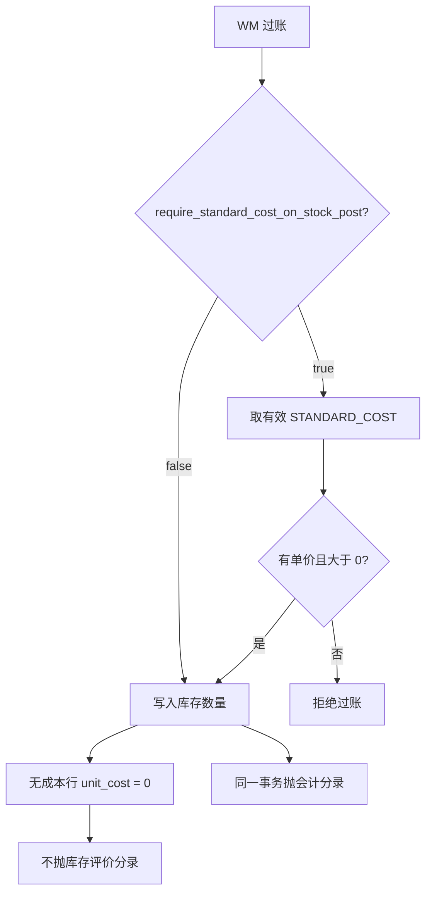

# 08.1 未上线成本时的库存过账（数量记账）

> 上线初期公司暂未启用会计成本（FI Costing）时，日常收发仍须过账；与 [08.成本方法实现计划.md](08.成本方法实现计划.md)「日常取标准有效单价」并存的**公司级过渡政策**。

## 1. 问题

已锁定路径：日常出入库把 **标准有效单价** 写入 `stock_transactions.unit_cost`，月末 Cost Run 以该流水为实际物料成本依据。

过账在同一事务内还有第二层：**库存评价分录**（收货 `INV_STOCK` / `GRIR` / `PRICE_VAR`，发料 `COGS` 或 `WIP` vs `INV_STOCK`）。

上线初期常见状态：

- 未维护 `material_costs`（`STANDARD_COST`，且单价 `> 0`）
- 往往也尚未备齐会计期、评价类、科目确定

结果：仓库数量业务被 FI 成本主数据阻塞，无法 `post`。

`stock_transactions.unit_cost` 列本身允许 `0`（`NOT NULL DEFAULT 0`）。阻塞发生在应用层严格取价，不是表约束。

## 2. 已锁定决策

| 项 | 决策 |
|----|------|
| 开关位置 | [`fi_costing_policies`](../../database/sql/schema_tables/FI/fi_costing_policies.sql)，**不**放 `companies` |
| 新栏 | `require_standard_cost_on_stock_post boolean NOT NULL DEFAULT true` |
| 默认 | `true`：已上成本的公司行为不变 |
| `false` 含义 | **数量记账**：过账只记数量；`unit_cost` / `total_amount` 写 `0`；**整笔跳过**库存评价分录 |
| 无政策行 | 视为 `true`（与现有「无政策则 `STANDARD_COST`」一致，偏严） |
| 关账 | `false` 时 `require_posted_cost_run_on_close` 必须为 `false`；禁止对该期间跑正式 Cost Run |
| 日后启用成本 | 切換日 + 期初存货评价；**不**回写历史 `stock_transactions.unit_cost` |

与现有栏位对齐：`require_posted_cost_run_on_close` 管关账是否强制 Cost Run；本栏管**日常过账**是否强制标准成本。

## 3. 为何不放 companies

- `companies` 管组织 / 本币，不含模块开关。
- 成本严格度已集中在 `fi_costing_policies`（一公司一行）。
- 放公司主档会出现「无政策行」与「公司旗标」两套语义。

## 4. 行为矩阵

| 场景 | `require_standard_cost_on_stock_post = true` | `= false`（数量记账） |
|------|----------------------------------------------|----------------------|
| 有有效标准成本 | 写入该单价；抛评价分录 | 仍写入该单价（有则用）；无分录政策见下节 |
| 无有效标准成本 / 单价 ≤ 0 | **拒绝过账**（维持现讯） | **允许过账**；明细单价与金额为 `0` |
| 库存评价分录 | 现逻辑（缺成本、缺科目确定仍拒） | **不抛** `INV_STOCK` / `COGS` / `WIP` / `GRIR` / `PRICE_VAR`；单据 `journal_entry_id` 可为 null |
| Cost Run | 允许（另受关账政策约束） | **禁止**对该公司跑正式 Cost Run |
| 采购成本分析 | 标准侧无则显示 0（现口径） | 仍可用 GR 冻结 PO 价做采购实绩；勿把 `unit_cost=0` 当标准 |

`false` 时即使部分物料已有标准成本：V1 **整单不抛库存评价分录**，避免同一公司「有的行有凭证、有的行没有」。数量与单价仍按行写入（有成本写成本，无则 0）。若后续需要「有成本的行仍抛分录」，另开需求，不在 V1。



## 5. 必须同一政策的过账入口

全部走 `StockLedgerUnitCostResolver` 的严格取价，或财务集成内再次 `findActiveUnitCost`：

| 入口 | 模块 | 说明 |
|------|------|------|
| `GoodsReceiptServiceImpl.postGoodsReceipt` | WM | 收货 / 生产入库 / 外协入库（经 GR） |
| `RemoteGoodsReceiptFinanceServiceImpl.postGoodsReceipt` | FI | GR/IR 分录；`false` 时整单不调用或直接 return null |
| `StockIssueServiceImpl.postStockIssue` | WM | 发料 |
| `StockIssuePostingServiceImpl.postStockIssue` | FI | COGS / WIP；`false` 时不调用或 return null |
| `StockTransferServiceImpl` | WM | 调拨 |
| `PhysicalInventoryPostingServiceImpl` | WM | 盘点过账 |
| `OutsourceInventoryServiceImpl` | WM | 外协发料等 |
| `StockLedgerReconciliationServiceImpl` | WM | 期间对账调整 |

冲销：已过账单据优先复用当时流水单价（现 `resolveForReverse*`）。数量记账期间原单为 0 则冲销亦为 0；无凭证则无需冲销分录。

## 6. 明确不做

| 方案 | 原因 |
|------|------|
| 全域宽松（一律允许 0） | 拆掉已上成本公司的门禁 |
| 无标准时用 PO / 最近进价填 `unit_cost` | 违反「日常取标准单价」；污染 Cost Run 依据 |
| 宽松取价仍抛分录（`INV_STOCK=0`，PO 全进 `PRICE_VAR`） | 总账存货为 0、价差进损益，比无凭证更难对账 |
| 只改收货、不改发料 / 盘点 / 外协 / 对账 | 同一公司收得进、出不去 |
| 启用成本后回写历史 `unit_cost` | 改写已过账事实；当时无凭证则账料仍对不上 |
| 把开关放在 `companies` | 见 §3 |

## 7. 日后启用 FI 成本（切換，不是只改旗标）

`false` → `true` **不会**修复历史流水。

1. **切換日前**的 `unit_cost = 0` 不得作为标准成本快照，也不得作为该期间 Cost Run 来源。
2. **不要**回写历史明细单价。
3. 切換步骤：
   1. 库存盘点 / 账料数量对账
   2. 维护切換当期 `material_costs`（`STANDARD_COST`）
   3. **期初存货评价**（数量 × 标准，一笔开账分录）
   4. 政策改为 `require_standard_cost_on_stock_post = true`
   5. 之后日常收发才开始累积「可作为月末依据」的明细
4. 历史期间采购对比：用 [11.物料采购成本分析.md](11.物料采购成本分析.md)（GR 冻结 PO 价），不用 `unit_cost=0` 的进出明细。

建议：政策从 `false` 改为 `true` 时校验——该公司不存在活跃 Cost Run；切換当月会计期尚未关账。V1 可用操作规程约束，代码硬门禁可放后续。

## 8. 结构要点（待实现时）

### 8.1 表

[`fi_costing_policies`](../../database/sql/schema_tables/FI/fi_costing_policies.sql) 增加：

```sql
require_standard_cost_on_stock_post boolean NOT NULL DEFAULT true
```

COMMENT：`When true, stock post requires active standard unit cost > 0 and posts inventory valuation journals. When false, quantity-only: unit_cost=0 allowed, skip inventory valuation journals, Cost Run disallowed.`

更新政策时：若本栏为 `false`，则 `require_posted_cost_run_on_close` 不得为 `true`。

### 8.2 取价

`StockLedgerUnitCostResolver` 按公司政策在 Required / Lenient 间分支；调用方不必各写一套。无政策行 = 严格。

财务集成：政策 `false` 时不生成库存评价分录，避免 `INV_STOCK=0` 的凭证。

`RemoteMaterialCostService` / `MaterialUnitCostResolver` 的 EFFECTIVE 取价规则不变。

### 8.3 Cost Run

`startRun`（及任何会聚合 `stock_transactions` 金额的入口）：若该公司 `require_standard_cost_on_stock_post = false`，直接拒绝。

### 8.4 前端

成本政策表单增加该开关；关闭时提示：只记数量、不抛存货凭证、不可做 Cost Run。过账失败讯文保持现有 `validation.*.material.cost.required`（仅 `true` 时出现）。

## 9. 相关文档

- [08.成本方法实现计划.md](08.成本方法实现计划.md)
- [10.1-成本会计分录.md](10.1-成本会计分录.md)
- [01.控制库存与财务的关帐控制.md](01.控制库存与财务的关帐控制.md)
- [11.物料采购成本分析.md](11.物料采购成本分析.md)
- [FI_schema_design.md](../../database/FI_schema_design.md) §3.19a
- schema：[fi_costing_policies.sql](../../database/sql/schema_tables/FI/fi_costing_policies.sql)、[stock_transactions.sql](../../database/sql/schema_tables/WM/stock_transactions.sql)、[material_costs.sql](../../database/sql/schema_tables/FI/material_costs.sql)、[companies.sql](../../database/sql/schema_tables/BASIS/companies.sql)（明确不改）
