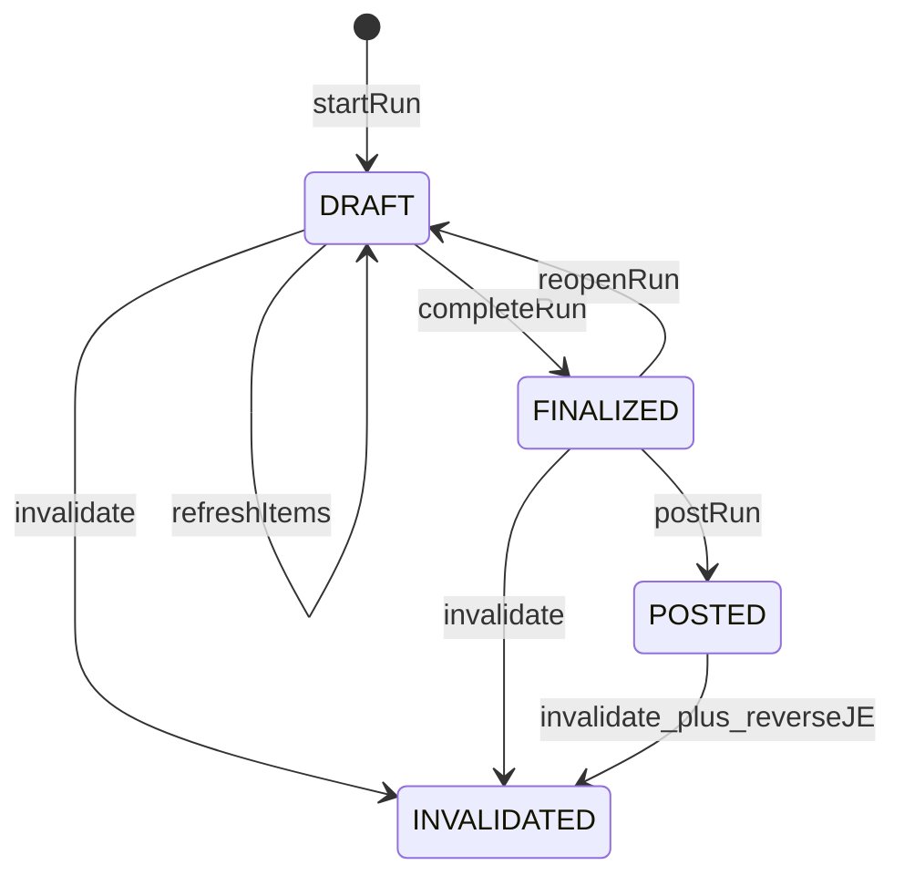

# 08. 成本方法实现计划（制造 · 标准成本主路径）

> 与 Cursor 执行计划「制造成本方法（cost_method）系统实现执行计划」对齐的业务可读副本。

## 1. 已锁定政策

| 项 | 决策 |
|----|------|
| 公司默认计价 | `STANDARD_COST` |
| 日常出库/收货存货 | 取标准有效单价 |
| 月末 Cost Run | 写 `ACTUAL_COST` 快照；**不**用于日常出库 |
| Cost Run 汇总 | 本期收发排除内部调拨 `STOCK_TRANSFER`；期初仍含全部类型 |
| Cost Run 实际成本 | `startRun`：流水 WAC 记入 `materialCost`；`completeRun`：`cost_allocations` 按 `cost_element` 拆池——`LABOR`→`laborCost`，`OVERHEAD`→`overheadCost`，基数 `(openingQty+receiptQty)`；`calculatedUnitCost = 料+工+费` |
| Cost Run 差异基数 | `(calculated − standard) × (issueQty + closingQty)`；采购价差仍在收货 `PRICE_VAR` |
| Cost Run 差异过账 | 结存部分 → `INV_STOCK` vs `PRICE_VAR`；发出部分 → `COGS` vs `PRICE_VAR`；分摊仍 Dr WIP / Cr 来源制造费用 |
| Cost Run 状态 | `DRAFT` → `FINALIZED` → `POSTED`；作废/冲销 → `INVALIDATED`。`is_posted` 与 `POSTED` 同步 |
| Cost Run 往返修正 | 草稿可「重新汇总来源」；已定稿未过账可「退回编辑」再改分摊/重算；已过账须先作废冲销再新建 |
| WM 重开与 Cost Run | 财务先 `invalidate`；仓库 reopen 按公司+会计期校验无活跃 run（不自动 cascade 作废） |
| 移动平均 | 枚举保留，本期不实现 |
| 差异结算政策 | 过账按结存/发出拆分（不再整笔进 COGS） |
| 吸收基准 | 政策保留 `LABOR_HOURS`；实现暂按数量池；人工金额可由作业 Excel 算后以 `cost_element=LABOR` 录入 |

 ### 业务状态

### 操作 × 状态矩阵

左侧「用户表述」为界面按钮/菜单用语；括号内为 API/代码名。

| 用户表述（界面） | API | DRAFT 草稿 | FINALIZED 已定稿 | POSTED 已过账 | INVALIDATED 已失效 |
|------------------|-----|------------|------------------|---------------|-------------------|
| 开始成本结算 | `start` | 拒（已有活跃单） | 拒 | 拒 | 允许新建 |
| 维护费用分摊 | 编辑 allocation | Y | N | N | N |
| 重新汇总来源 | `refreshItems` | Y | N | N | N |
| 完成结算（定稿） | `complete` | Y | N | N | N |
| 退回编辑 | `reopen` | N | Y | N | N |
| 过账 | `post` | N | Y | N | N |
| 作废结算 | `invalidate` | Y | Y | Y（先冲销凭证） | N |

## 2. 结构要点

- 新表 [`fi_costing_policies`](../../database/sql/schema_tables/FI/fi_costing_policies.sql)：公司默认 method / 差异政策 / 吸收基准 / 关账是否强制 Cost Run
- `material_costs` 双轨：`STANDARD_COST`（日常）与 `ACTUAL_COST`（月结快照）
- 取价：`RemoteMaterialCostService` 按公司政策 method + 优先当前 fiscal period
- 发料：销售 → `COGS`；生产 → `WIP`
- 收货：`INV_STOCK`=标准金额，`GRIR`=PO 金额，差额 `PRICE_VAR`

## 3. 阶段

| Phase | 内容 |
|-------|------|
| 0 | 政策表 + 取价改造 + 文档 |
| 1 | 标准成本 CRUD |
| 2 | 收货标准入库 + WIP/COGS 拆分 |
| 3 | Cost Run 聚合 / 分摊 / 过账 / invalidate / reopen / refresh-items |
| 4 | 关账检查 + STANDARD vs ACTUAL 对比查询 |

## 4. Backlog（明确不做）

- 移动平均引擎
- 完整工时主数据与精细 OH 吸收
- 差异按期末库存比例分摊

## 5. 相关文档

- [06.2-成本会计分录.md](06.2-成本会计分录.md)
- [07.fi模组开发实施计划.md](07.fi模组开发实施计划.md) Phase 8
- [01.控制库存与财务的关帐控制.md](01.控制库存与财务的关帐控制.md)
