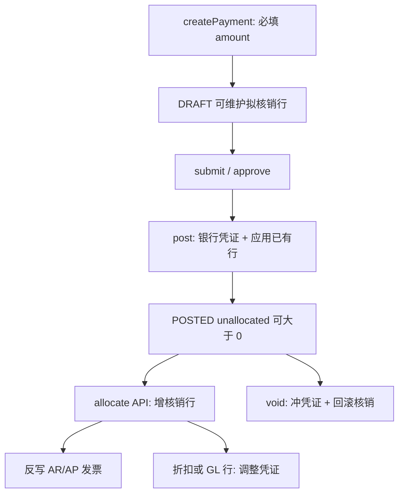

# 收付款先资金后核销 — 实施计划

## 产品决策

采用文档路径：**先登记收/付款资金 → 过账产生银行凭证并保留 `unallocated_amount` → 再对未结发票做核销**。

会计默认（与 [04-02.系统收款功能.md](04-02.系统收款功能.md) 一致）：

- **过账**：按头档 `amount` 生成银行往来凭证；**不要求**已有核销行；`unallocated_amount = amount`（若过账时已有拟核销行则先应用再留余）。
- **核销**：主要反写发票 `paid/received/remaining` 与收付状态；`discount` / `GL_ACCOUNT` 行另产调整凭证；纯发票核销不重做银行分录。

适用范围：**RECEIPT 与 DISBURSEMENT 同一套模型**（本阶段不做付款建议、银企直联、账龄报表）。

## 目标数据流



## 金额语义

```text
amount              = 银行实收/实付（头档独立，必填 > 0）
allocatedTotal      = Σ(line.allocatedAmount + line.discountAmount)
unallocatedAmount   = amount - allocatedTotal
拒绝 allocatedTotal > amount
```

## 过账凭证（按头 amount）

| paymentType | 分录 |
|-------------|------|
| RECEIPT | 借：公司银行 GL；贷：伙伴 GL |
| DISBURSEMENT | 借：伙伴 GL；贷：公司银行 GL |

## 核销 API

| API | 行为 |
|-----|------|
| `POST /{id}/allocations` | 仅 `POSTED`；body = 单行或批量 `PaymentLineRequest` |
| `DELETE /{id}/allocations/{lineId}` | 回滚该行对发票的影响，重算 `unallocated`，冲调整凭证 |

- DRAFT：拟核销行仍用 `/{id}/items` CRUD（不过账不改发票）。
- POSTED：写入口仅 `/allocations`；`/items` 只读。

## 预收/预付

过账后 `unallocatedAmount > 0` 的单据视为可继续核销的预收/预付池。  
预收冲销 = 对未分配余额再次 `POST /{id}/allocations` 增加 `INVOICE` 行。

## 验收场景自测清单

| # | 场景 | 预期 |
|---|------|------|
| 1 | 收款只填金额无线 → 过账 | 银行凭证 OK；`unallocated=amount`；发票不变 |
| 2 | 对上一步 POST `/allocations` 核销两张 AR | 发票 PARTIAL/RECEIVED；`unallocated=0` |
| 3 | 付款 DRAFT 勾选两张 AP → 过账 | 一次核销完；兼容旧路径 |
| 4 | 付款先过账无行 → 后再 allocate | AP `paid/remaining/paymentStatus` 正确 |
| 5 | 超额核销 AR/AP | 拒绝 |
| 6 | 作废已核销 POSTED 单 | 冲银行凭证 + 回滚发票 |
| 7 | partner/company/currency 不一致 | 拒绝 |
| 8 | POSTED 后对未分配余额再次 allocate | 预收/预付冲销最小闭环 |

## 明确不做（本迭代）

- 付款建议书 / 批量跑批
- 银企直联、银行流水导入
- 独立预收科目映射表、坏账、客户退款
- 多级审批引擎
- 汇兑损益自动计算

相关 API 状态矩阵见 [02.1-API端点与状态矩阵.md](02.1-API端点与状态矩阵.md) §5。
