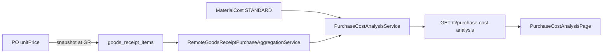

# 11. 物料采购成本分析

> 方案1：在标准成本主路径下提供采购实绩只读分析。详见 [08.成本方法实现计划.md](08.成本方法实现计划.md) §4。

## 1. 目的

让用户按公司 + 会计期间查看物料的**采购实际单价/金额**，并与当期标准成本对比；支持下钻到收货行（含 PO 单号与单据币单价）。

不改变日常库存计价，不改 Cost Run / `MaterialCost.ACTUAL_COST`。

## 2. 数据流

## 3. 实现要点

| 层 | 内容 |
|----|------|
| WM | `GoodsReceiptItemRepository` 按物料聚合；排除 FOC；本币 = qty×price×rate |
| Common | `RemoteGoodsReceiptPurchaseAggregationService` + DTO |
| FI | `PurchaseCostAnalysisController` / Service；拼标准与价差 |
| FE | `/fi/purchase-cost-analysis`；展开行加载 lines |
| ADM | 菜单 + `:read` 权限，见 `menu_purchase_cost_analysis.sql` |

## 4. 验收

1. 仅汇总期间内已过账采购收货；FOC / 冲销不计
2. 多币种：本币 = 单据金额 × 冻结汇率
3. 无标准成本时仍可查看采购侧
4. 下钻行本币合计 ≈ 汇总行采购金额（允许舍入差）
5. 日常出库 / Cost Run 无回归
