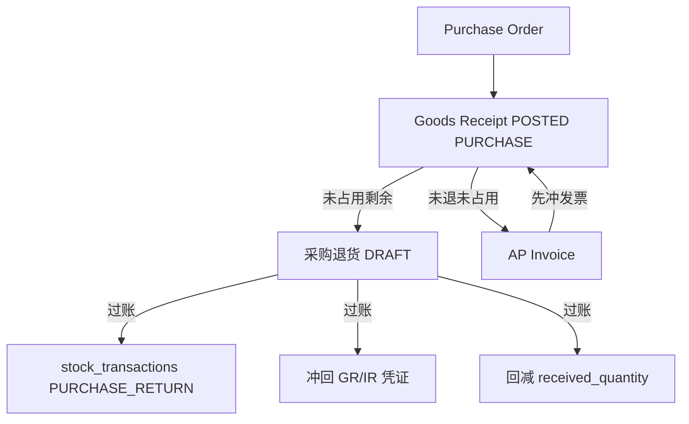

# 02. 目标流程：采购退货（To-Be）

> 原则：采购退货是 WM 库存单据，一对一已过账采购收货；只退未被 AP 占用的数量（含发票草稿）。  
> 命名一律 **采购退货 / `PURCHASE_RETURN`**。

---

## 1. 目标单据链

```text
PO ─► GR(POSTED, receipt_type=PURCHASE) ─► 采购退货单 ─► 库存 −  / 冲回 GR/IR
                         │                      │
                         │                      └─► 回减 PO.received_quantity
                         │
                         └─► AP（仅未退、未被占用剩余）
```



与退料对照：

```text
领料 POSTED ─► 退料单 ─► STOCK_ISSUE_RETURN（+）
收货 POSTED ─► 采购退货 ─► PURCHASE_RETURN（−）
```

收货冲销仍是**整单纠错**，沿用 `GOODS_RECEIPT` 进出对调。采购退货是**业务退回**，可部分、可多次，保留原收货单。

---

## 2. 作业

1. 进入 `/wm/purchase-returns`（WM 菜单，与收货、退料并列）。
2. 新增：选择一张可退的已过账采购收货（同工厂、`receipt_type = PURCHASE`、存在可退行）。
3. 系统带出供应商、工厂、币别、汇率（均来自收货，不可改）。
4. 「汇入可退明细」勾选原收货行，默认带可退数量、仓、批号、`stock_type`。
5. 可改：退货数量（≤ 可退）、`stock_type`、备注、原因码。不可改：物料、仓、批号、单价、税、来源 PO 行。
6. 过账：出库 + 数量账 + GR/IR。草稿可删；已过账可整单冲销退货单（不是冲原收货）。

收货页可提供「生成采购退货」跳到新建并带上 `originalGoodsReceiptId`（权限：`/wm/purchase-returns:create`）。不在收货页直接过账退货。

---

## 3. 规则

### 3.1 准入

- 原单：`goods_receipts.status = POSTED` 且 `receipt_type = PURCHASE`
- 供应商、工厂从原收货复制，之后不改
- V1 **不含**：`OUTSOURCE` / `MISC` / `PRODUCTION_REPORT`、无原收货的直接退、换货、客户退货

### 3.2 一对一

- 表头 `original_goods_receipt_id`：一张采购退货只对一张收货
- 同一收货允许多张退货（部分退）
- 明细 `original_receipt_item_id` 必须属于该收货；同一退货单内一行对一条收货行（唯一约束）
- 禁止手键无来源行

### 3.3 可退数量

收货行新增 `returned_quantity`（**基本单位**，对标领料，仅已过账退货累加）。  
与开票比较一律用**单据单位**，禁止把 `returned_quantity` 再换算回单据单位（双单位往返会有舍入误差）。

```text
postedReturnedTxn = SUM(已过账采购退货行.transaction_quantity)   // 同 original_receipt_item_id
otherDraftTxn     = SUM(其他 DRAFT 采购退货行.transaction_quantity)
otherDraftBase    = SUM(其他 DRAFT 采购退货行.base_quantity)
unreturnedTxn     = transaction_quantity − postedReturnedTxn − otherDraftTxn
unreturnedBase    = base_quantity − returned_quantity − otherDraftBase
uninvoicedTxn     = transaction_quantity − invoiced_quantity
returnableTxn     = min(unreturnedTxn, uninvoicedTxn)            // FOC：只用 unreturnedTxn
```

- `invoiced_quantity` 语义 = **已被 AP 行占用（含 DRAFT）**，不是「已过账发票」。见 01 §4
- `BigDecimal.compareTo`，禁止浮点近似
- 赠品（`is_foc`）：不参与开票，`returnableTxn = unreturnedTxn`
- 草稿占用：排除本单 / 本行
- 过账校验：`transaction_quantity ≤ returnableTxn` **且** `base_quantity ≤ unreturnedBase`
- **已被 AP 占用的数量不能退。** 提示区分：对方是 DRAFT 则改/删发票行；已过账则先过账应付贷项或作废发票。i18n，不要静默截断

贷项：V1 断言已落地。已开票可退靠贷项过账回减 `invoiced_quantity`，本公式不改。见 [应付贷项](../应付贷项/README.md)。

### 3.4 仓 / 批 / 库存状态

| 字段 | 规则 |
|------|------|
| `warehouse_id` | 从原收货行复制，不可改。非库存物料保持 `NULL`，不过库存 |
| `batch_no` | 从原收货行复制，不可改（无批号仍为 `''`） |
| `stock_type` | 默认原收货行；**允许改**（`UNRESTRICTED` / `INSPECTION` / `BLOCKED`）。货已转到可用则从可用出 |

过账时库存物料必须在 **工厂 + 仓 + 物料 + 批号 + 所选 stock_type** 有足够可用实物。不足则拒绝。已发到车间的，先走退料回仓，再做采购退货。禁止改仓改批「用别的批次顶退」。

### 3.5 单价与凭证金额

- 行单价、税码、税率、表头币别与汇率：收货快照，不重查 PO
- 库存流水 `unit_cost`：取原收货过账写入的成本（`findPostedUnitCostsBySourceDocItem(GOODS_RECEIPT, …)`），**禁止**退货时重查当前标准成本
- GR/IR 冲回金额：默认 `退货单据数量 × 收货行 unit_price`（未税，单据币），折本币用收货汇率，`setScale(2, HALF_UP)`
- **清尾**：该收货行未税金额 − 已过账退货已冲回金额 = 剩余；当本行是「最后一笔把未退单据量退完」时，GR/IR 冲回用**剩余金额**，避免分次取整后暂估留分钱
- `PRICE_VAR`：存货侧用上面冻结的原收货 `unit_cost`（数量 × 原流水成本），贷方用本行冲回的 PO 金额；**不要**在 FI 里再 `findActiveUnitCost`。对标退料把 `unitCost` 传入 finance
- 赠品：只出库，不进 GR/IR
- `require_standard_cost_on_stock_post = false`：只记数量，`journal_entry_id` 可空（与收货一致）

凭证挂在**采购退货单** `journal_entry_id`，不改写原收货 `journal_entry_id`。  
`return_date` = 凭证 `postDate`。财务期间关闭时过账失败（`JournalPostingService`）。数量记账无凭证时与收货一样不拦库存期间；本波不新做库存关帐。

### 3.6 过账

同一事务：

1. 锁原收货行，重算可退，超则失败
2. 库存物料：`applyPurchaseReturn`（`PURCHASE_RETURN`，出库）
3. 收货行 `returned_quantity += base_quantity`
4. 来源为 `PURCHASE_ORDER_ITEM`：`updateReceivedQuantity(−transaction_quantity)`
5. 刷新该收货行 / 表头 `invoice_status`（剩余可开票口径见 §3.9）
6. 非赠品：冲回 GR/IR（`afterPosted` 保持 no-op；贷项在 FI 独立过账，见 [应付贷项](../应付贷项/README.md)）
7. 表头 `approved_by` / `approved_at` 记过账人（对标退料，不是独立审批流）
8. 状态 → `POSTED`

不删 `PURCHASE_ORDER → GOODS_RECEIPT` pegging（原收货仍在）。溯源靠 `original_receipt_item_id`，不另写 pegging。

PO 状态（`updateReceivedQuantity` 本波补守卫）：

| 回写前状态 | 退货后 |
|------------|--------|
| `APPROVED` / `PARTIAL` / `COMPLETED` | 按已收重算：0 → `APPROVED`，未收满 → `PARTIAL`，已收满 → `COMPLETED`。`COMPLETED` 因退货变 `PARTIAL` **是预期**：MRP 开量变大，允许再买 |
| `CLOSED`（关单 API 尚未落地，守卫仍要写） | **只改 `received_quantity`，不改行/表头状态**。CLOSED 的 PO 允许退货（货是真退），但不得无声复活进 MRP |

**不**自动 `CLOSED`。

### 3.7 冲销采购退货单

仅 `POSTED` → `REVERSED`：

1. 反向库存（类型仍为 `PURCHASE_RETURN`，进出对调）
2. `returned_quantity -= base_quantity`（不得负）
3. `updateReceivedQuantity(+transaction_quantity)`。回加已收视同再收货：走与收货汇入**同一套超收校验**（`is_unlimited_over_receipt` / `over_receipt_tolerance`）。无上限则放行；有上限且将超则拒绝，提示先冲后补的收货。`CLOSED` 同样只改数量不改状态
4. 冲本单凭证，`journal_entry_id` 置空（与收货冲销现状一致；正向/冲销凭证靠 journal reverse 链，不另存）

现网 `updateReceivedQuantity` 把已收钳到 ≥ 0：本波冲销已先校验 `returned_quantity`，不改该钳制（避免扩大 SCM 范围）。

### 3.8 禁止冲销原收货

原收货存在 `DRAFT` 或 `POSTED` 采购退货 → `reverseGoodsReceipt` 拒绝（对标 `validation.stock_issue.has_returns`）。

本波一并补上：任一收货行 `invoiced_quantity > 0` 也禁止冲销原收货（现网漏洞）。文案：先删除或冲销占用该行的 AP（含草稿）。

### 3.9 从收货开 AP

可开票数量：

```text
returnedTxn = SUM(已过账采购退货行.transaction_quantity)   // 不要换算 returned_quantity
billableTxn = transaction_quantity − invoiced_quantity − returnedTxn
```

- 草稿退货不扣可开票（过账才入账）；草稿已占用可退，避免超开+超退并发时由 §3.3 再拒
- **强制闸门**在 `updateInvoicedQuantity`：`newInvoiced ≤ transaction_quantity − returnedTxn`。只改 `getGoodsReceiptForApInvoice` 不够——发票行手改数量不走生成接口
- `invoice_status` 的「总量」改为剩余可开票基数：`billableTotal = transaction_quantity − returnedTxn`，再 `resolveItemStatus(billableTotal, invoiced)`。全退且从未开票：`billableTotal = 0` 且 `invoiced = 0` → 仍为 `UNINVOICED`；`getGoodsReceiptForApInvoice` 无剩余行时用明确 i18n（不要当成 `already_invoiced`）

---

## 4. 与收货冲销的分工

| | 收货冲销 | 采购退货 |
|--|----------|----------|
| 用途 | 整单记错，作废 | 业务退供应商 |
| 原单 | 变为 `REVERSED` | 保持 `POSTED` |
| 部分数量 | 否 | 是 |
| 流水账类型 | `GOODS_RECEIPT` 对调 | `PURCHASE_RETURN` |
| 已开票 | 禁止（本波补） | 只退未开票 |
| 已有退货 | 禁止 | — |

---

## 5. API

对标 `/api/v1/wm/stock-issue-returns`。权限前缀 `/wm/purchase-returns`。

| 方法 | 路径 | 权限 |
|------|------|------|
| POST | `/api/v1/wm/purchase-returns/page` | read |
| POST | `/api/v1/wm/purchase-returns/returnable-receipts/page` | read |
| GET | `/api/v1/wm/purchase-returns/returnable-receipts/{originalGoodsReceiptId}` | read |
| GET | `/{id}` | read |
| POST | `/` | create |
| PUT | `/{id}` | update |
| DELETE | `/bulk-delete` | delete |
| POST | `/{id}/post` | update |
| POST | `/{id}/reverse` | update |
| POST | `/{id}/items/page` | read |
| POST | `/{id}/returnable-items/page` | read |
| POST | `/{id}/items` | update |
| POST | `/{id}/items/batch-from-receipt` | update |
| PUT | `/{id}/items/{itemId}` | update |
| DELETE | `/{id}/items/bulk-delete` | update |

`returnable-receipts`：`POSTED` + `PURCHASE` + 存在 `returnableBase > 0` 的行。  
建表头必须带 `originalGoodsReceiptId`；明细只接受该收货的行 id。

不要提供 `goods-receipts/items/from-source` 的 `PURCHASE_RETURN_ITEM` 实现。

---

## 6. 前端

唯一作业：`/wm/purchase-returns`。页面结构复制 `pages/wm/stock-issue-returns`：

- 主从表、DRAFT 可改
- 汇入可退收货行（`ImportReceiptItemModal`）
- 过账 / 冲销按钮
- 仓、批号只读；`stock_type`、数量可编辑

收货列表/详情：有可退行且具备 create 权限时显示「采购退货」。  
**不要**独立 SCM 菜单，**不要**负向收货类型。

文案：zh-CN / en-US / vi-VN 均用「采购退货」对应译名，不要「供应商退货 / Return to Vendor」作为正式名称（英文可用 `Purchase Return`）。

---

## 7. 已开票与贷项

V1 硬规则不变：已占用数量不可退（含 AP 草稿）。`assertReturnableAgainstInvoice` 已实现；`afterPosted` / `afterReversed` 保持 no-op。

二期**不改** §3.3 公式，也**不**在退货过账里生成贷项。已开票要退：

```text
财务过账应付贷项 → invoiced_quantity ↓ → 采购退货按 V1 可退
撤回：先冲销退货，再 VOID 贷项
```

完整规则、表、API 见 [应付贷项](../应付贷项/02-目标流程.md)。WM 仍只依赖 CreditMemo 断言 + `updateInvoicedQuantity`，不写 AP / 贷项实体。

---

## 8. 模块边界

| 动作 | 模块 |
|------|------|
| 单据 CRUD / 过账 / 冲销 | `lychee-erp-wm` |
| 回减 / 加回 PO 已收 | 现有 `RemotePurchaseOrderItemReceiveService` |
| GR/IR 冲回 | `RemotePurchaseReturnFinanceService`（新，对标收货 finance） |
| 贷项 | FI 独立子域，见 [应付贷项](../应付贷项/README.md)。WM 只保留 V1 未开票断言 |
| 可开票扣已退 | `RemoteGoodsReceiptServiceImpl.getGoodsReceiptForApInvoice` |

PP 不直接依赖采购退货实体。MRP 只看到 PO 已收减少后的开量。

---

## 9. V1 不做

- 客户退货
- 委外收货退回
- 杂项 / 生产入库退
- 换货（退 + 再收）
- 无原收货的直接退供应商
- 负收货 / `receipt_type` 增加退货
- AP 贷项（独立专题 [应付贷项](../应付贷项/README.md)，不在本波采购退货交付）
- 采购成本分析扣减退货
- 退货后自动关闭 PO
