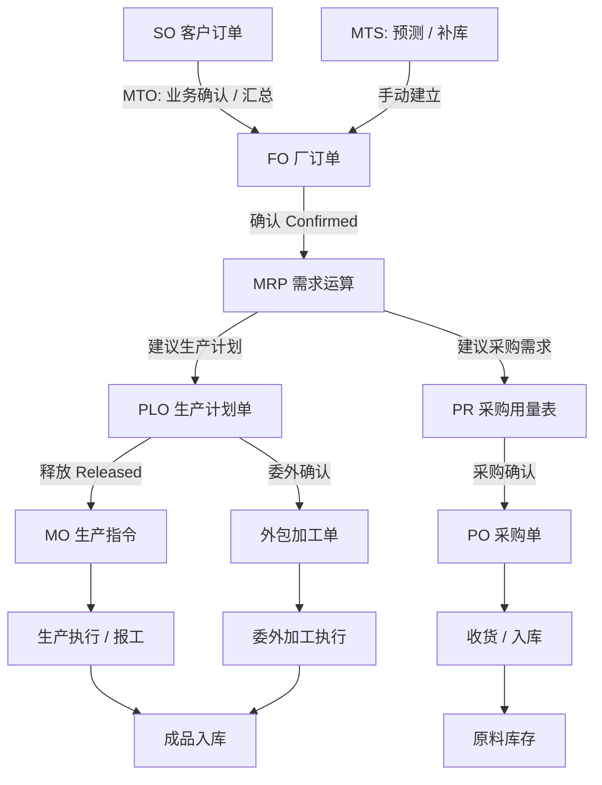
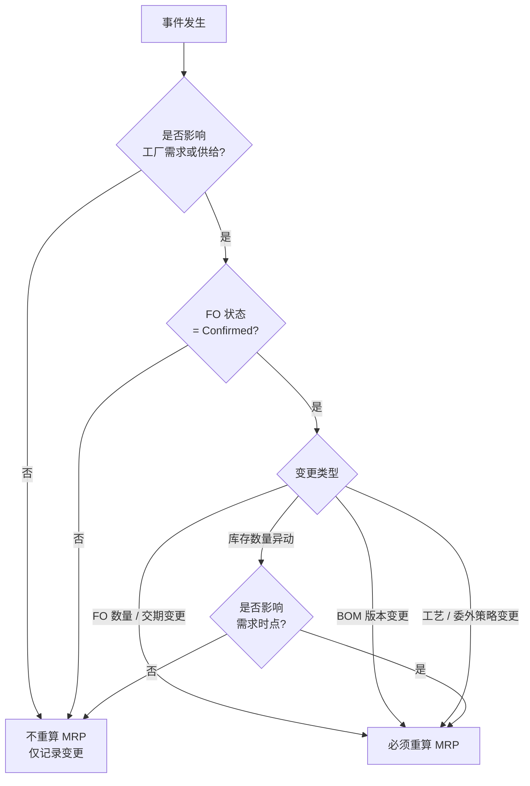
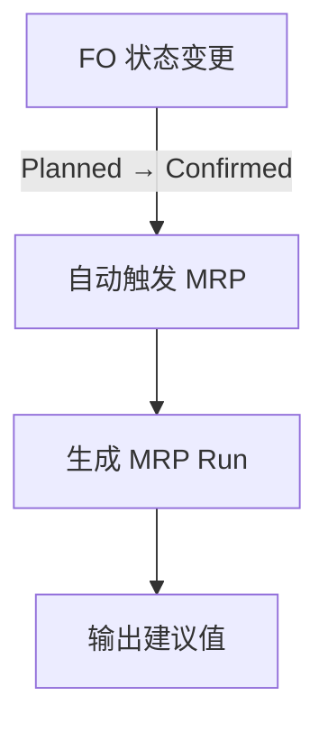
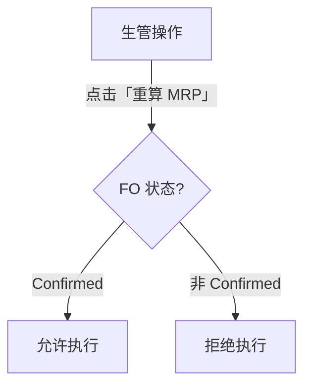
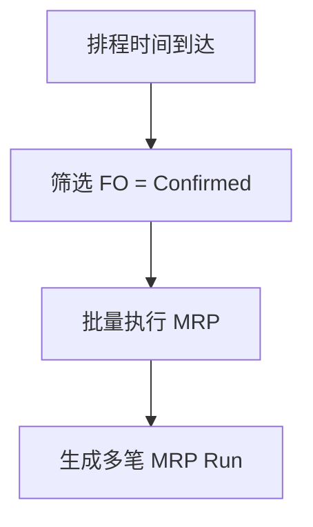
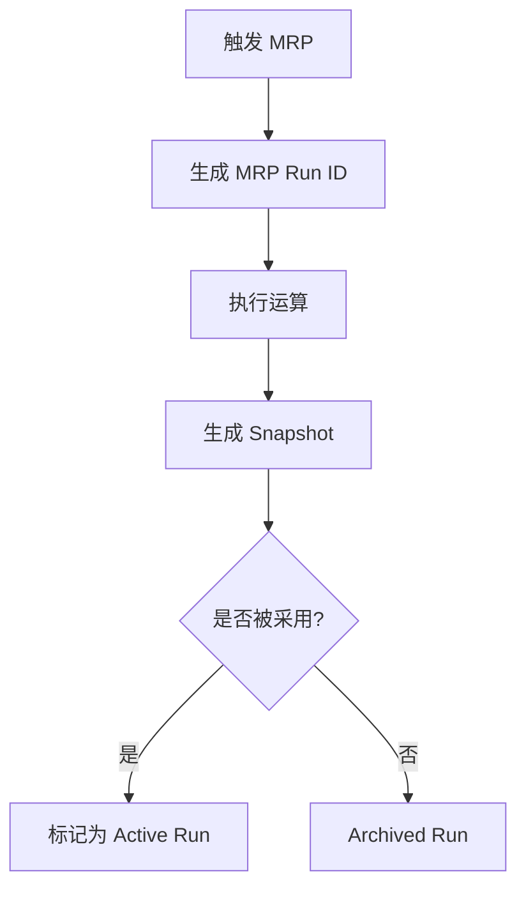
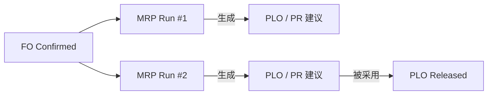
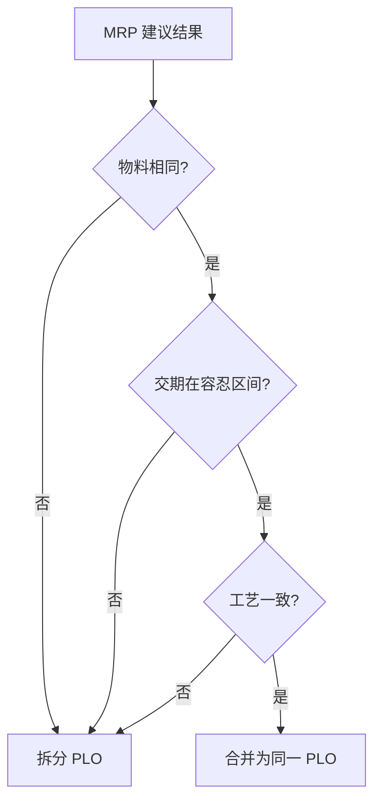
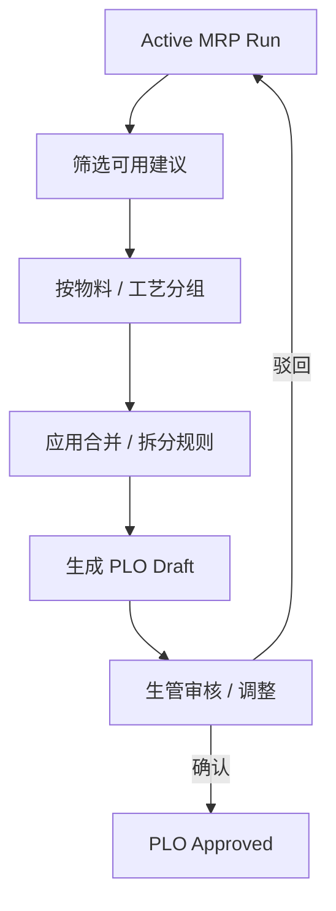

# KHH ERP 系统流程技术文档

## 1. 文档目的

本文档依据《KHH-ERP-系统流程》整理，以技术视角说明 ERP 系统从**业务接单（SO）**到**生产、采购执行（MO / PO）**的整体流程，明确各单据角色、系统计算逻辑（MRP）及部门职责，作为系统设计、开发与沟通的统一依据。

---

## 2. 核心流程总览（修正版）

ERP 主流程以「**客户需求驱动、厂端计划承接**」为核心，包含两种主要模式：

1. **MTO (Make-to-Order) 模式**：
   ```text
   SO → FO → MRP → PLO → MO / PO
   ```
2. **MTS (Make-to-Stock) 模式**：
   ```text
   手动建立 FO (预测/补库) → MRP → PLO → MO / PO
   ```

流程说明：

1. **客户订单（SO）** 由业务部门建立，代表客户层级的原始需求（仅 MTO）
2. **厂订单（FO）** 将多个 SO 汇总、调整（MTO），或直接手动建立（MTS），形成工厂可执行的需求集合
3. **MRP 运算** 针对 FO 进行需求与时间计算，产出生产与采购的「建议值」
4. **生产计划单（PLO）** 为生管确认后的计划冻结结果
5. **生产指令（MO） / 采购单（PO）** 作为最终执行单据

> 关键设计原则：**MRP 的输入对象是 FO，而不是直接的 SO**。MTS 模式下，直接通过 FO 表达工厂自主发起的生产需求。

---

## 3. 主要单据与定义

## 3.1 SO / FO / MRP 关系对照表

| 项目      | SO（Sales Order） | FO（Factory Order） | MRP（需求计划运算）   |
| ------- | --------------- | ----------------- | ------------- |
| 单据性质    | 业务单据            | 计划承接单据            | 系统运算过程        |
| 主要来源    | 客户 / 业务部门       | 1. 一个或多个 SO 汇总 (MTO)<br>2. 手动建立 (MTS - 预测/补库) | FO + BOM + 库存 |
| 是否人工维护  | 是               | 是                 | 否             |
| 是否可频繁修改 | 是               | 有控制               | 不适用           |
| 是否直接执行  | 否               | 否                 | 否             |
| 主要用途    | 表达客户需求          | 转换为工厂需求           | 计算建议生产 / 采购量  |
| 输出结果    | —               | 进入 MRP            | 建议生产量、采购量     |
| 典型责任部门  | 业务              | 业务 / 生管           | 系统            |

---

## 3.2 单据明细说明

### 3.1 SO – Sales Order（客户订单）

* 来源：业务部门
* 内容：客户、产品、数量、交期
* 角色：**需求源头**

SO 是所有后续计划与执行的起点。

---

### 3.2 MRP – Material Requirements Planning（需求计划运算）

* **输入**：FO + 物料主档 + BOM + 库存
* **输出**：
  * 建议生产数量
  * 建议采购数量

MRP 结果为「**系统建议值**」，不可直接执行，需人工确认。

> 关键逻辑：MRP 运算始终以 FO（Factory Order）作为需求输入，无论该 FO 是来源于 SO（MTO）还是手动建立（MTS）。

---

### 3.3 FO – Factory Order（厂订单）

* **来源**：
  * **MTO (Make-to-Order)**：由多个 SO 汇总生成，关联具体客户需求。
  * **MTS (Make-to-Stock)**：手动建立，代表来自预测或库存回补的需求（此时 FO 没有对应 SO）。
* **用途**：
  * 统一工厂生产视角
  * 平衡产能与交期
  * 作为 MRP 运算的唯一驱动源（Demand Signal）

> FO 是业务需求（SO）或工厂计划（MTS）向生产体系转换的关键桥梁。

---

### 3.4 PLO – Production Plan Order（订单生产计划单）

* 由 FO 经检查、调整后生成
* 内容：

  * 计划生产数量
  * 计划时间区间
* 状态：

  * 计划中
  * 已确认

PLO 标志着「**计划冻结点**」。

---

### 3.5 MO – Manufacturing Order（生产指令单）

* 由已确认的 PLO 生成
* 用途：

  * 指导现场生产
  * 派工、报工、入库

MO 是生产执行层的核心单据。

---

### 3.6 PR – Purchase Requirement（采购用量表）

* 来源：MRP 运算结果
* 内容：

  * 原物料需求数量
  * 需求时间

PR 属于「**建议采购需求**」。

---

### 3.7 PO – Purchase Order（原物料采购单）

* 由采购部门根据 PR 确认生成
* 用途：

  * 对外采购
  * 供应商交期管理

PO 是采购执行层单据。

---

### 3.8 外包加工单

* 适用情境：

  * 委外制程
  * 外协生产
* 由生管确认后生成

外包加工单可视为特殊类型的 MO。

---

## 4. 部门职责划分

### 4.1 业务部门

* 建立与维护 SO
* 确认订单汇总至 FO
* 协调客户交期

---

### 4.2 生管部门

* 执行 MRP 后的检查与调整
* 确认 PLO
* 决定是否投产或委外
* 生成 MO / 外包加工单

---

### 4.3 采购部门

* 审核 PR 建议值
* 生成 PO
* 管理供应商与交期

---

## 5. 流程分阶段说明

### 阶段一：需求形成

* SO 建立
* 多 SO 汇总为 FO

---

### 阶段二：计划计算

* 执行 MRP
* 生成：

  * 建议生产量
  * 建议采购量

---

### 阶段三：计划确认

* 生管检查与调整
* 形成并确认 PLO

---

### 阶段四：执行拆分

* 生产：PLO → MO
* 采购：MRP → PR → PO
* 委外：PLO → 外包加工单

---

## 6. 系统设计要点（技术视角）

1. **建议值与确认值分离**

   * MRP 结果不可直接执行

2. **单据状态驱动流程**

   * SO → FO → PLO → MO / PO

3. **多 SO 对一 FO 的汇总关系**

   * 支持交期与数量再平衡

4. **生产与采购并行但解耦**

   * MO 与 PO 独立生命周期

---

## 7. 单据状态流转（State Machine）

本章节定义 ERP 核心单据的状态机（State Machine），用于约束单据生命周期、控制可执行动作，并作为系统实现（API、权限、校验逻辑）的依据。

---

### 7.1 SO（Sales Order）状态流转

```text
Draft → Confirmed → In Progress → Closed
              ↘ Cancelled
```

| 状态          | 说明    | 允许动作    | 是否影响 MRP |
| ----------- | ----- | ------- | -------- |
| Draft       | 草稿    | 编辑、删除   | 否        |
| Confirmed   | 已确认   | 汇总生成 FO | 是（经 FO）  |
| In Progress | 已纳入生产 | 查询      | 否        |
| Closed      | 已结案   | 查询      | 否        |
| Cancelled   | 已取消   | 查询      | 否        |

> 设计原则：SO 的变更**不直接触发 MRP**，仅通过 FO 间接影响。

---

### 7.2 FO（Factory Order）状态流转

```text
Planned → Confirmed → Frozen → Closed
           ↘ Cancelled
```

| 状态        | 说明  | 允许动作          | 是否可触发 MRP |
| --------- | --- | ------------- | --------- |
| Planned   | 计划中 | 调整数量、交期、SO 关联 | 否         |
| Confirmed | 已确认 | 触发 MRP        | 是         |
| Frozen    | 已冻结 | 仅查询           | 否         |
| Closed    | 已结案 | 查询            | 否         |
| Cancelled | 已取消 | 查询            | 否         |

> **FO → Confirmed** 是最关键的控制点，通常作为 **MRP 触发条件**。

---

### 7.3 PLO（Production Plan Order）状态流转

```text
Planned → Approved → Released → Closed
             ↘ Rejected
```

| 状态       | 说明   | 允许动作   | 后续影响         |
| -------- | ---- | ------ | ------------ |
| Planned  | 系统生成 | 调整     | 不可执行         |
| Approved | 生管确认 | 释放     | 可生成 MO / 外包单 |
| Released | 已下达  | 查询     | 执行中          |
| Closed   | 已完成  | 查询     | 结束           |
| Rejected | 已驳回  | 重算 MRP | 回到 FO        |

---

### 7.4 MO（Manufacturing Order）状态流转

```text
Created → Released → In Progress → Completed
                       ↘ Cancelled
```

| 状态          | 说明  | 典型行为  |
| ----------- | --- | ----- |
| Created     | 已生成 | 派工准备  |
| Released    | 已下达 | 开始生产  |
| In Progress | 生产中 | 报工、领料 |
| Completed   | 完工  | 入库    |
| Cancelled   | 已取消 | 终止    |

---

### 7.5 PO（Purchase Order）状态流转

```text
Created → Approved → Sent → Received → Closed
                     ↘ Cancelled
```

| 状态        | 说明  | 典型行为 |
| --------- | --- | ---- |
| Created   | 已建立 | 编辑   |
| Approved  | 已核准 | 发单   |
| Sent      | 已发出 | 等待交货 |
| Received  | 已收货 | 入库   |
| Closed    | 已结案 | 完成   |
| Cancelled | 已取消 | 终止   |

---

### 7.6 状态机设计总结原则

1. **计划单据（SO / FO / PLO）与执行单据（MO / PO）严格分离**
2. **只有 FO Confirmed 才允许触发 MRP**
3. **MRP 只生成建议值，不产生执行状态**
4. **Released 状态即代表对现场 / 供应商的承诺，不可随意回退**

---

## 8. ERP 端到端流程 Mermaid 图

以下流程图以 **需求 → 计划 → 运算 → 执行** 为主线，反映标准制造型 ERP 的核心逻辑，可直接用于 Markdown / Git / Wiki。



---

### 8.1 图例与设计说明

* **SO / MTS**：需求来源。SO 代表客户订单（MTO），MTS 代表手动建立的预测或补库需求。
* **FO**：厂订单，计划承接层。汇总 SO 或承接 MTS 需求，是 MRP 的唯一输入。
* **MRP**：系统运算层，仅产出建议值
* **PLO**：计划冻结点（连接计划与执行）
* **MO / PO / 外包单**：执行层单据，对现场或供应商产生承诺

---

## 9. MRP 重算触发条件 Mermaid 图

本章节说明 **MRP 是否需要重算** 的判定逻辑，用于避免不必要的运算，同时确保计划正确性，是 ERP 系统中的关键控制设计。



---

### 9.1 常见事件与 MRP 重算规则表

| 事件类型              | 是否重算 MRP | 说明                  |
| ----------------- | -------- | ------------------- |
| SO 新增 / 修改        | 否        | 仅当 SO 汇总并更新 FO 后才影响 (MTO) |
| 手动建立 FO (MTS)     | 是        | 直接作为独立需求源，Confirmed 后触发 |
| FO 数量变更           | 是        | 直接影响生产与采购需求         |
| FO 交期变更           | 是        | 影响需求时间点             |
| FO 备注变更           | 否        | 不影响计划               |
| FO 状态变为 Confirmed | 是        | 进入可计算状态             |
| BOM 版本调整          | 是        | 影响用量结构              |
| 库存数量调整            | 视情况      | 仅当影响缺料判断            |
| 采购在途数量变更          | 是        | 影响可用量               |
| MO / PO 状态变更      | 否        | 属于执行层               |

---

### 9.2 设计建议（实务）

1. **MRP 重算应为显式行为**

   * 自动 + 手动触发并存

2. **避免因 SO 频繁修改导致重算**

   * 以 FO 为唯一触发入口

3. **记录 MRP 运算快照**

   * 便于追溯与差异分析

---

## 10. MRP 触发方式定义

本章节定义 **MRP 的触发方式与使用场景**，用于在系统层面平衡「计划及时性」与「系统稳定性」，避免无控制的频繁重算。

---

### 10.1 MRP 触发方式总览

MRP 触发分为三种模式：

1. **自动触发（Auto Trigger）**：关键状态变化时系统自动执行
2. **手动触发（Manual Trigger）**：生管人员主动发起
3. **批次触发（Batch Trigger）**：定时或集中运算

---

### 10.2 自动触发（Auto Trigger）



**适用情境**

* 新 FO 确认
* FO 数量或交期在 Confirmed 状态下被调整

**设计规则**

* 仅限 **FO = Confirmed**
* 每次触发生成独立的 `MRP Run ID`
* 若已有未处理的 MRP Run，可选择：

  * 覆盖（覆盖旧建议）
  * 排队（等待处理）

---

### 10.3 手动触发（Manual Trigger）



**适用情境**

* BOM / 工艺调整后
* 库存异常修正后
* 模拟不同计划方案

**设计规则**

* 需具备生管权限
* 系统需提示：

  * 本次重算影响的 FO 范围
  * 是否覆盖现有建议值

---

### 10.4 批次触发（Batch Trigger）



**适用情境**

* 夜间集中运算
* 大量 FO 同时存在
* 需要统一计划基准日

**设计规则**

* 通常每日 1 次（如凌晨）
* 运算期间应锁定 FO 关键字段
* 批次失败需可重跑

---

### 10.5 触发方式对照表

| 触发方式 | 发起者 | 是否即时 | 适用规模     | 风险控制    |
| ---- | --- | ---- | -------- | ------- |
| 自动   | 系统  | 是    | 单笔 / 小规模 | 严格条件    |
| 手动   | 生管  | 是    | 中小规模     | 权限 + 提示 |
| 批次   | 系统  | 否    | 大规模      | 排程 / 锁定 |

---

### 10.6 设计总结原则

1. **FO Confirmed 是所有触发的前置条件**
2. **自动用于即时性，批次用于稳定性**
3. **手动触发用于例外与模拟场景**
4. **每次 MRP 运算必须可追溯（Run ID）**

---

## 11. Step 2：MRP 运算结果版本化（Run / Snapshot）

本章节定义 **MRP 运算结果的版本化机制**，用于解决多次重算、方案比较、历史追溯与执行隔离问题，是中大型 ERP 系统的必备设计。

---

### 11.1 为什么需要 MRP 版本化？

若缺乏版本化，MRP 常见问题包括：

* 新一次重算直接覆盖旧建议，无法回溯
* 生管无法比较不同方案（交期 / 数量）
* 已生成 PLO / MO 后，建议值来源不清

因此系统必须引入：

> **MRP Run（运算批次） + MRP Snapshot（结果快照）** 的概念。

---

### 11.2 核心概念定义

| 名称           | 说明                |
| ------------ | ----------------- |
| MRP Run      | 一次完整的 MRP 运算执行记录  |
| Run ID       | 每次运算唯一编号          |
| Snapshot     | 某次 Run 下的完整建议结果集合 |
| Active Run   | 当前被生管采用的 Run      |
| Archived Run | 已被弃用但保留的历史 Run    |

---

### 11.3 MRP Run 生命周期



---

### 11.4 Run 与业务单据关系



> 同一 FO 可对应 **多次 MRP Run**，但**同一时间只能有一个 Active Run**。

---

### 11.5 采用（Apply）规则

**生管采用某一 Run 时，系统应执行：**

1. 将该 Run 标记为 **Active**
2. 基于 Snapshot 生成或更新 PLO / PR
3. 检查冲突：

   * 已 Released 的 PLO 不可被覆盖
   * 仅允许新增或调整未释放计划

---

### 11.6 覆盖与保护规则

| 场景             | 系统行为             |
| -------------- | ---------------- |
| 新 Run 产生       | 不自动覆盖旧 Run       |
| Active Run 再重算 | 生成新 Run，旧 Run 归档 |
| PLO 已 Released | 禁止覆盖对应需求         |
| FO Frozen      | 禁止产生新 Run        |

---

### 11.7 数据模型建议（简化）

```text
MRP_RUN
- id
- trigger_type (AUTO / MANUAL / BATCH)
- trigger_by
- trigger_time
- status (CREATED / COMPLETED / ARCHIVED / ACTIVE)
- fo_id

MRP_RESULT
- run_id
- item_id
- suggestion_type (PRODUCTION / PURCHASE)
- quantity
- due_date
```

---

### 11.8 设计总结原则

1. **MRP 结果永不直接覆盖**
2. **采用（Apply）是显式动作**
3. **执行单据必须可追溯到 Run ID**
4. **Frozen FO 是计划边界**

---

## 12. Step 3：MRP → PLO 转换规则

本章节定义 **如何将 MRP 运算结果（建议值）转换为可执行的生产计划单（PLO）**，是从「系统建议」走向「人工确认计划」的关键步骤。

---

### 12.1 转换设计目标

MRP → PLO 转换需同时满足：

1. **计划可执行**：符合产能、制程与管理习惯
2. **结果可解释**：生管能理解为何这样拆分 / 合并
3. **执行可保护**：不破坏已 Released 的计划

---

### 12.2 转换前置条件

只有符合以下条件的 MRP Run 才允许转换为 PLO：

* MRP Run 状态 = **Active**
* 对应 FO 状态 = **Confirmed**
* FO 未被标记为 **Frozen**

---

### 12.3 基本转换原则

#### 原则一：物料一致性

* 同一 **成品 / 半成品** 才可合并

#### 原则二：时间区间容忍度

* 需求日期在可配置区间内（如 ±3 天）可合并

#### 原则三：工艺一致性

* 制程路线、是否委外必须一致

---

### 12.4 合并（Merge）规则



**常见合并维度**

* 物料编码
* 工厂 / 生产线
* 制程路线

---

### 12.5 拆分（Split）规则

即使来源于同一 MRP 建议，也必须拆分的情境：

* 交期跨度过大
* 数量超过单一批次上限
* 不同委外 / 内制策略
* 不同生产线或工厂

---

### 12.6 已执行计划的保护规则

| 场景               | 系统行为      |
| ---------------- | --------- |
| PLO = Released   | 不可覆盖，只能新增 |
| MO = In Progress | 禁止回溯修改    |
| FO Frozen        | 禁止生成新 PLO |

---

### 12.7 转换流程示意



---

### 12.8 数据模型建议（简化）

```text
PLO
- id
- item_id
- quantity
- plan_start_date
- plan_due_date
- routing_id
- outsource_flag
- status (PLANNED / APPROVED / RELEASED)
- source_mrp_run_id
```

---

### 12.9 设计总结原则

1. **MRP 只给建议，PLO 才是计划**
2. **合并与拆分必须可配置**
3. **已释放计划绝不回写**
4. **PLO 必须可追溯到 MRP Run**

---

## 13. 结语

本流程体现 ERP 系统「**计划先行、执行可控**」的核心设计思想，可作为：

* 系统功能拆分依据
* 数据表与状态机设计参考
* 前后端流程对齐文档

后续可在此基础上补充：

* 单据状态流转表
* 数据模型（ER Diagram）
* API / 权限设计说明
