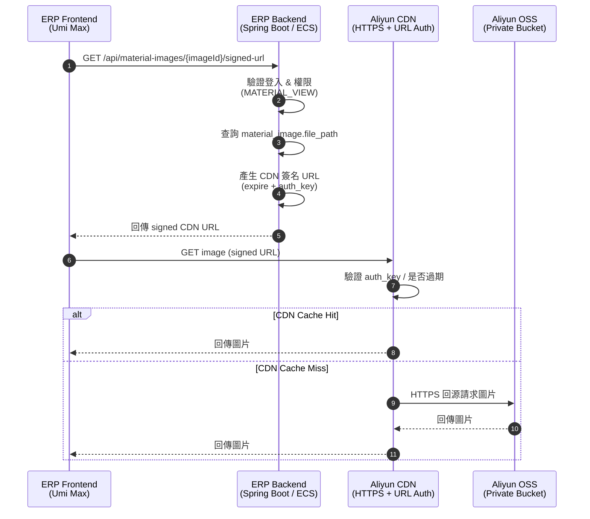
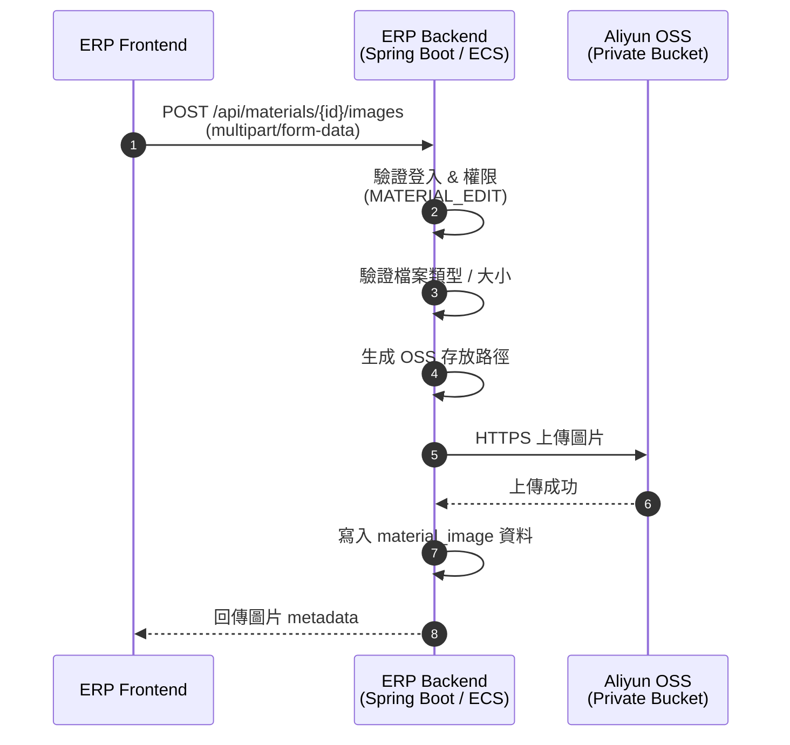
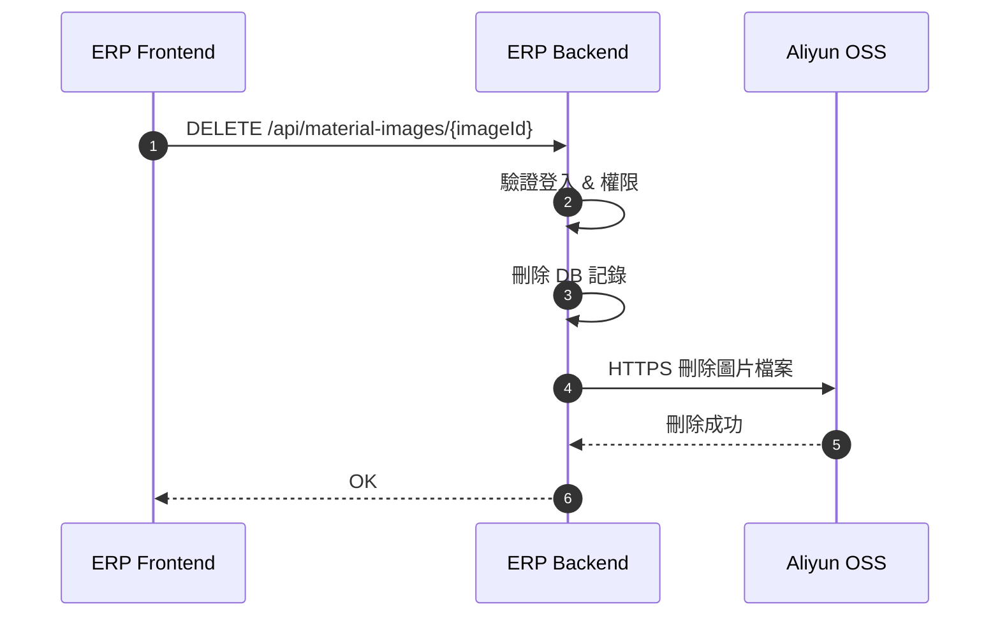
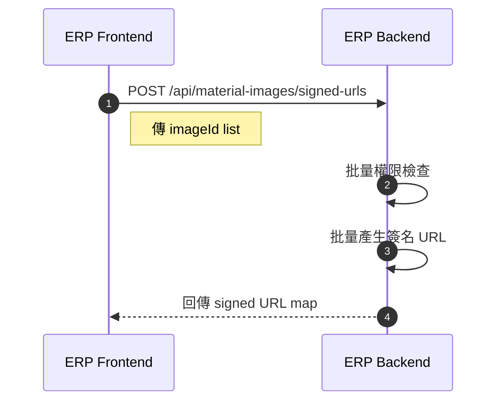

**「ERP 前端 + 後端 + CDN + OSS（CDN 簽名 URL）」的架構時序圖**

一、圖片「顯示 / 讀取」流程（CDN 簽名 URL）

---

二、圖片「上傳」流程（ERP → OSS）

---

三、圖片「刪除」流程

---

四、列表頁「批量取得簽名 URL」（效能優化）

---

五、設計說明
圖片資源存放於阿里雲 OSS（Private Bucket），
所有圖片請求統一經由阿里雲 CDN，並透過 ERP 後端動態產生短效 CDN 簽名 URL。
ERP 後端負責權限與簽名，CDN 負責快取與效能，OSS 僅作為安全儲存層。
