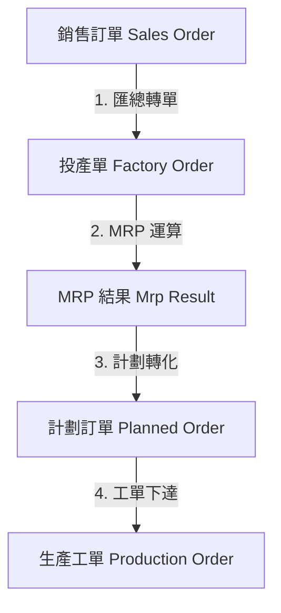

# 📦 KHH ERP: 生產規劃 (PP) 資料流技術文件

本文件描述了從銷售訂單 (SO) 開始，經過投產、MRP 運算，最終轉化為生產工單 (MO) 的完整流程。

## 🔄 核心流程概覽

---

## 1. 需求匯總：SO 轉 FO (Factory Order)
**業務目的：** 將來自不同客戶、不同交期的銷售需求進行初步過濾與匯總，形成工廠內部的「投產計畫」。

*   **觸發點：** `FactoryOrderServiceImpl.convertFromSalesOrders`
*   **關鍵邏輯：**
    *   **狀態過濾：** 僅處理狀態為 `CONFIRMED` (已確認) 且尚未完全分配的 SO 項目。
    *   **資料層級：**
        *   **FO Header (主檔)：** 記錄客戶、建檔日期、狀態。通常按「銷售單」或「客戶+日期」進行分組。
        *   **FO Item (明細)：** 關聯具體的產品料號（包含規格、顏色、尺寸）、數量與需求日期（Due Date）。
    *   **回寫機制：** 轉換成功後，會回寫 SO 項目的 `allocated_quantity` (已分配數量)，確保不會重複投產。

---

## 2. 需求展開：MRP 運算 (Mrp Result)
**業務目的：** 根據投產需求，透過 BOM (物料清單) 遞歸展開，計算出「什麼時間」需要「生產或採購什麼」。

*   **觸發點：** `MrpServiceImpl.calculateMrp`
*   **關鍵邏輯：**
    *   **需求來源：** 讀取所有狀態為 `CONFIRMED` 的投產單 (FO)。
    *   **BOM 爆炸 (Explosion)：** 根據產品料號查找「當前有效版本」的 BOM。
    *   **損耗計算：** 運算時會根據 `bom_items` 中的 `scrap_rate` 自動計入**零件損耗**，確保產出目標成品數量時，原材料供應充足。
    *   **產出物：** 產生 `MrpResult` 記錄。每一條結果都精確到：
        *   `material_id`: 具體產品/零件。
        *   `required_date`: 需求日期（考慮提前期推算）。
        *   `suggested_action`: 建議動作 (生產/採購/委外)。

---

## 3. 執行計畫：MRP 轉 PLO (Planned Order)
**業務目的：** 將系統建議 (Result) 轉化為可管理的執行計畫 (Order)。Planner (生管) 可在此階段進行合併、調整或確認。

*   **觸發點：** `MrpServiceImpl.convertToPlannedOrders`
*   **關鍵邏輯：**
    *   **精確度：** 每個產品料號 + 不同的需求日期 (Required Date) 會產生獨立的 PLO。
    *   **防止重複：** 系統會檢查 `source_factory_order_item_id`，若該需求已存在「已確認 (Firmed)」或「已轉化 (Converted)」的計畫單，則不會重複產生。
    *   **可追溯性：** PLO 會記錄 `mrp_run_id` 與 `source_id`，確保可以追溯回最原始的投產需求。

---

## 4. 指令下達：PLO 轉 MO (Production Order)
**業務目的：** 將生產計畫正式下發給車間執行。

*   **觸發點：** `PlannedOrderServiceImpl.convertToProductionOrder`
*   **關鍵邏輯：**
    *   **二度展開：** 此時會再次根據 BOM 展開該產品所需的「原材料/半成品」明細，存入 `ProductionOrderComponent`。
    *   **數量計算：** `MO 預計產量 * (BOM 單位用量 * (1 + 損耗率))`。
    *   **狀態聯動：** 轉換後，原 PLO 狀態更新為 `CONVERTED`，並記錄 `related_production_order_id`。

---

## 📊 資料實體關聯 (Key Entities)

| 階段 | 主要 Table | 關鍵欄位 | 說明 |
| :--- | :--- | :--- | :--- |
| **投產** | `factory_order_items` | `product_material_id`, `quantity`, `due_date` | 承接 SO 的原始需求 |
| **運算** | `mrp_results` | `suggested_action_type`, `required_quantity` | 系統計算的「建議值」 |
| **計畫** | `planned_orders` | `order_type`, `status_option_id` | 生管確認後的「待執行計畫」 |
| **執行** | `production_orders` | `bom_id`, `planned_quantity` | 車間執行的「正式指令」 |

---

### 💡 開發備註
1.  **規格化處理：** 所有的 `material_id` 均已指向最末端的具體品項（含規格/顏色/尺寸），系統在每一層級均保持此精確度。
2.  **時效性：** MRP 運算依賴 `findActiveBomsByDate`，確保在產品變更 (ECN) 過程中，舊需求用舊 BOM，新需求用新 BOM。
