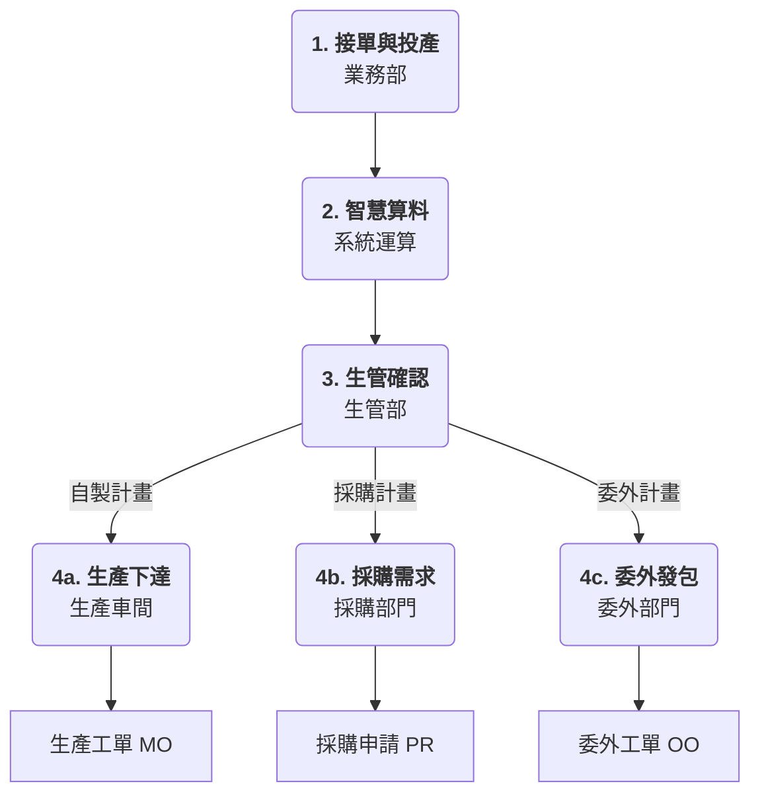

---

# 🏭 KHH ERP: 生產規劃 (PP) 業務操作指南

歡迎使用 KHH ERP 生產規劃模組。本手冊將帶您了解從接到訂單到車間開工的完整業務路徑。

## 🌟 流程總覽：從需求到執行的全路徑

---

### 第一步：接單與投產 (Sales Order to Factory Order)
**【誰來做？】** 業務人員 或 生管人員
**【做什麼？】** 
當客戶下達**銷售訂單 (SO)** 且公司確認可以接單後，我們會執行「匯總投產」。
*   **為什麼要這一步？** 客戶的訂單可能很零散，我們會將相同產品、交期接近的需求匯總成一張**投產單 (FO)**，方便工廠安排。
*   **關鍵點：** 只有「已確認」的銷售單才能轉入生產流程，避免因訂單變更導致生產錯誤。

---

### 第二步：智慧算料 (MRP Calculation)
**【誰來做？】** 系統自動運算 (由管理員觸發)
**【做什麼？】** 
系統會根據投產單，自動翻閱**產品清單 (BOM)**，幫您算清楚：
1.  **算缺料：** 生產這批貨需要哪些原物料？哪些要買？哪些自己做？
2.  **算時間：** 考慮到零件採購需要時間、生產也需要時間，最晚什麼時候要開始動工？
3.  **算損耗：** 考慮到生產過程會有正常報廢，系統會自動多算一點點（損耗率），確保最後交貨數量足夠。

---

### 第三步：生管計畫確認 (Planned Order)
**【誰來做？】** 生管人員 (Planner)
**【做什麼？】** 
系統運算完後會給出建議，生管人員會在**計畫訂單 (Planned Order)** 界面看到這些建議。根據物料屬性，計畫會分為三種類型：
1.  **自製 (Production)：** 由工廠內部車間生產。
2.  **採購 (Purchase)：** 向供應商購買原材料或零件。
3.  **委外加工 (Outsource)：** 發送給外部廠商進行加工。

**操作重點：**
*   **檢視：** 看看系統建議的日期和數量是否合理。
*   **調整：** 如果有緊急插單或設備維修，生管可以手動調整數量或日期。
*   **鎖定：** 確認沒問題後，將計畫「轉化」，進入下一步。

---

### 第四步：執行指令下達 (Order Execution)
**【誰來做？】** 生產主管、採購人員
**【做什麼？】** 
當計畫單確認後，會根據類型轉化為正式的執行文件：

#### 1. 生產工單 (Production Order / MO)
這是針對「自製」類型的指令。
*   **領料清單：** 系統會自動產生領料明細，告訴倉庫該發什麼料。
*   **施工憑證：** 記錄預計產量、開工與完工時間，作為車間生產依據。

#### 2. 採購單 (Purchase Order / PO)
這是針對「採購」類型的指令。系統會根據 MRP 算出的「採購用量」，自動彙整需求。
*   **採購建議：** 匯總多張訂單的原材料需求，進行大宗採購以降低成本。
*   **正式採購：** 轉化為採購模組的正式採購單。

#### 3. 委外工單 (Outsource Order)
這是針對「委外加工」類型的指令。
*   **加工費管理：** 記錄委外單價與加工要求。
*   **委外領料：** 管理發送給廠商的原材料。

---

## 💡 常見問題 (Q&A)

*   **Q: 為什麼我轉不出投產單？**
    *   A: 請檢查銷售訂單是否已「確認」，或者該項目是否已經轉過投產單了（系統會防止重複下單）。
*   **Q: 如果生產過程中有物料變更怎麼辦？**
    *   A: 系統會根據訂單日期自動抓取「當時有效」的 BOM 版本。如果是臨時變更，生管可以在計畫轉化工單前進行調整。
*   **Q: MRP 計算出的原料數量為什麼比理論用量多一點？**
    *   A: 這是因為系統計入了原料的「損耗率」。例如生產 100 個成品需要原料 A，若原料 A 損耗率為 5%，系統會建議領取 105 原料 A，以確保扣除加工損耗後仍能完成 100 個成品。

---

