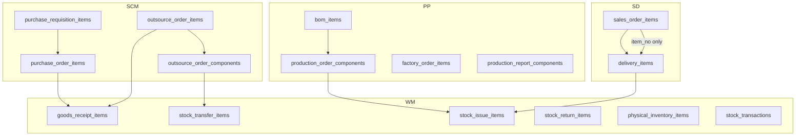

# 明細表項次代號與來源項次欄位補全執行計劃

## 1. 目標與欄位規範

### 1.1 項次代號 `item_no`


| 屬性      | 規範                                                                |
| ------- | ----------------------------------------------------------------- |
| 型別      | `integer NOT NULL`                                                |
| 編碼      | 同一單據表頭下 10、20、30… 遞增                                              |
| 唯一性     | `UNIQUE (tenant_id, {header_fk}, item_no)`                        |
| 自動賦值    | 新建/批量新增明細時由後端自動計算 `MAX(item_no) + 10`（首筆為 10）                     |
| 與 FI 差異 | FI 模組使用 `line_no`（1、2、3…）；營運模組採 `item_no`（10、20、30…），命名與步長不同但語意一致 |


### 1.2 來源單據四欄位（標準語意）

適用於「明細表且記錄來源單據」者，以及 **庫存流水帳** `stock_transactions`（供未來轉傳票）：


| 欄位                   | 語意                                        |
| -------------------- | ----------------------------------------- |
| `source_doc_type`    | 來源單據類型（既有）                                |
| `source_doc_id`      | **來源單據表頭 ID**                             |
| `source_doc_no`      | **來源單據表頭編號**                              |
| `source_doc_item_id` | **來源明細 ID**（新增或補齊）                        |
| `source_doc_item_no` | **來源明細項次**（新增，`integer`，對應來源表的 `item_no`） |


> 注意：FI 模組使用 `source_line_id` / `source_line_no`（見 [ar_invoice_lines.sql](docs/database/sql/schema_tables/FI/ar_invoice_lines.sql) / [journal_entry_lines.sql](docs/database/sql/schema_tables/FI/journal_entry_lines.sql)），本次營運模組統一採 `source_doc_item_*` 命名，後續跨模組（含庫存轉傳票）在 DTO 層映射至 `source_line_*`。

---

## 2. 盤查結果總表




### 2.1 僅需補 `item_no`（10 張）


| 模組  | 表                              | 表頭 FK                     | 現況          |
| --- | ------------------------------ | ------------------------- | ----------- |
| SD  | `sales_order_items`            | `sales_order_id`          | 無 `item_no` |
| SCM | `purchase_requisition_items`   | `purchase_requisition_id` | 無           |
| SCM | `purchase_order_items`         | `purchase_order_id`       | 無           |
| SCM | `outsource_order_items`        | `outsource_order_id`      | 無           |
| SCM | `outsource_order_components`   | `outsource_order_item_id` | 無           |
| PP  | `bom_items`                    | `bom_id`                  | 無           |
| PP  | `production_order_components`  | `production_order_id`     | 無           |
| PP  | `factory_order_items`          | `factory_order_id`        | 無           |
| PP  | `production_report_components` | `production_report_id`    | 無           |
| WM  | `physical_inventory_items`     | `physical_inventory_id`   | 無           |


### 2.2 需補 `item_no` + 來源項次欄位（5 張明細）


| 模組  | 表                      | 現有來源欄位                                   | 缺口                                                  | 語意問題                                                                                                                                                                                   |
| --- | ---------------------- | ---------------------------------------- | --------------------------------------------------- | -------------------------------------------------------------------------------------------------------------------------------------------------------------------------------------- |
| SD  | `delivery_items`       | `source_doc_id/no`, `source_doc_item_id` | `item_no`, `source_doc_item_no`                     | `source_doc_id` 設計為表頭 ID，語意正確                                                                                                                                                          |
| WM  | `goods_receipt_items`  | `source_doc_id/no`                       | `item_no`, `source_doc_item_id/no`                  | `**source_doc_id` 目前存的是來源項次 ID**（見 [GoodsReceiptGenerationServiceImpl.java](lychee-erp-wm/src/main/java/com/lychee/erp/wm/service/impl/GoodsReceiptGenerationServiceImpl.java) L191）   |
| WM  | `stock_issue_items`    | `source_doc_id/no`                       | `item_no`, `source_doc_item_id/no`                  | `**source_doc_id` 目前存 component/delivery item ID**（見 [StockIssueItemServiceImpl.java](lychee-erp-wm/src/main/java/com/lychee/erp/wm/service/impl/StockIssueItemServiceImpl.java) L435） |
| WM  | `stock_transfer_items` | `source_doc_id/no`                       | `item_no`, `source_doc_item_id/no`                  | 同上，存 component ID                                                                                                                                                                      |
| WM  | `stock_return_items`   | `source_doc_type/id`                     | `item_no`, `source_doc_no`, `source_doc_item_id/no` | 缺 `source_doc_no`，且 `source_doc_id` 語意待統一                                                                                                                                              |


### 2.3 需補來源項次欄位、不加 `item_no`（1 張流水帳）


| 模組  | 表                    | 現有來源欄位                  | 缺口                                         | 說明                                                                                                                                                                                                                                   |
| --- | -------------------- | ----------------------- | ------------------------------------------ | ------------------------------------------------------------------------------------------------------------------------------------------------------------------------------------------------------------------------------------ |
| WM  | `stock_transactions` | `source_doc_type/id/no` | `source_doc_item_id`, `source_doc_item_no` | 庫存流水帳非單據明細，不加 `item_no`。`source_doc_id` **已是表頭 ID**（見 [StockTransactionLedgerServiceImpl.java](lychee-erp-wm/src/main/java/com/lychee/erp/wm/service/impl/StockTransactionLedgerServiceImpl.java)）。未來庫存異動轉傳票時，需依來源明細項次對應傳票行；故本次納入必做。 |


**寫帳時來源映射（未來轉傳票關鍵）**：


| `transaction_type` / `source_doc_type` | `source_doc_id`（表頭）       | `source_doc_item_id`（明細）      |
| -------------------------------------- | ------------------------- | ----------------------------- |
| GOODS_RECEIPT / BACKFLUSH              | `goods_receipts.id`       | `goods_receipt_items.id`      |
| STOCK_ISSUE / STOCK_RETURN             | `stock_issues.id`         | `stock_issue_items.id`        |
| STOCK_TRANSFER                         | `stock_transfers.id`      | `stock_transfer_items.id`     |
| ADJUSTMENT（實盤）                         | `physical_inventories.id` | `physical_inventory_items.id` |
| 期間調節等無明細來源                             | 既有表頭                      | 允許 NULL                       |


### 2.4 不納入本次


| 表                                 | 說明          |
| --------------------------------- | ----------- |
| `sales_forecasts`                 | 無表頭-明細結構    |
| `production_backflush_exceptions` | 異常記錄表，非業務明細 |


---

## 3. 資料庫變更設計

### 3.1 Liquibase 遷移檔

新增：[lychee-erp/src/main/resources/db/changelog/v1/2026/0708-001-item-no-and-source-doc-item.sql](lychee-erp/src/main/resources/db/changelog/v1/2026/0708-001-item-no-and-source-doc-item.sql)（檔名依實際日期調整）

**Step A — 加欄位（先 nullable）**

```sql
-- 範例：sales_order_items
ALTER TABLE lychee_erp.sales_order_items ADD COLUMN item_no integer NULL;

-- 有來源欄位者
ALTER TABLE lychee_erp.delivery_items
  ADD COLUMN item_no integer NULL,
  ADD COLUMN source_doc_item_no integer NULL;

ALTER TABLE lychee_erp.goods_receipt_items
  ADD COLUMN item_no integer NULL,
  ADD COLUMN source_doc_item_id bigint NULL,
  ADD COLUMN source_doc_item_no integer NULL;
-- stock_issue_items, stock_transfer_items 同上
-- stock_return_items 另加 source_doc_no varchar(50), source_doc_item_id/no

-- 庫存流水帳（不加 item_no；來源項次允許 NULL，因期間調節等可能無明細）
ALTER TABLE lychee_erp.stock_transactions
  ADD COLUMN source_doc_item_id bigint NULL,
  ADD COLUMN source_doc_item_no integer NULL;
```

**Step B — 歷史資料回填**

- **item_no 回填**（各表通用模式，按 `id` 排序）：

```sql
UPDATE lychee_erp.sales_order_items t
SET item_no = sub.rn * 10
FROM (
  SELECT id, ROW_NUMBER() OVER (PARTITION BY tenant_id, sales_order_id ORDER BY id) AS rn
  FROM lychee_erp.sales_order_items
) sub
WHERE t.id = sub.id;
```

- **delivery_items**：`source_doc_item_no` 從 `sales_order_items.item_no` JOIN 回填（`source_doc_item_id` 已存在）
- **goods_receipt_items 語意修正**（關鍵）：
  1. `source_doc_item_id = source_doc_id`（現值為 PO/委外項次 ID）
  2. `source_doc_id` 改寫為表頭 ID（JOIN `purchase_order_items` → `purchase_order_id`，或 `outsource_order_items` → `outsource_order_id`）
  3. `source_doc_item_no` 從來源表 `item_no` 回填
- **stock_issue_items / stock_transfer_items**：依 `source_doc_type` 分支回填（component ID → item ID + header ID；delivery item → delivery header ID）
- **stock_return_items**：從 `original_issue_item_id` 關聯 `stock_issue_items` 繼承來源四欄位
- **stock_transactions**：依 `source_doc_type` + `source_doc_id`（表頭）+ 物料/倉庫/批號/數量近似匹配回填對應明細的 `id`/`item_no`；匹配不確定者維持 NULL（不強制）

**Step C — 設 NOT NULL + 唯一約束**

```sql
ALTER TABLE lychee_erp.sales_order_items ALTER COLUMN item_no SET NOT NULL;
ALTER TABLE lychee_erp.sales_order_items
  ADD CONSTRAINT uk_sales_order_items_item_no UNIQUE (tenant_id, sales_order_id, item_no);
```

`stock_transactions.source_doc_item_id/no` **維持可空**（期間調節、無法精確匹配的歷史資料）。

**Step D — 調整既有唯一約束（WM 必做）**

現有 UK 使用 `source_doc_id` 作為項次級唯一鍵，語意修正後必須改為 `source_doc_item_id`：

- [stock_issue_items.sql](docs/database/sql/schema_tables/WM/stock_issue_items.sql) L33：`uk_stock_issue_items` 將 `source_doc_id` 替換為 `source_doc_item_id`
- [stock_transfer_items.sql](docs/database/sql/schema_tables/WM/stock_transfer_items.sql) L34：同上

`stock_transactions` 建議新增索引（非 UK）：

```sql
CREATE INDEX idx_stock_transactions_source_item
  ON lychee_erp.stock_transactions (tenant_id ASC, source_doc_type ASC, source_doc_item_id ASC);
```

**Step E — 同步 schema 文檔**

更新 [docs/database/sql/schema_tables/](docs/database/sql/schema_tables/) 下對應 **16** 個 `.sql` 檔（含 [stock_transactions.sql](docs/database/sql/schema_tables/WM/stock_transactions.sql)），保持與 Liquibase 一致。

---

## 4. 應用層變更

### 4.1 共用項次編號服務（新建）

在 [lychee-erp-common](lychee-erp-common) 新增 `DocumentItemNoService`（或各模組 Repository 提供 `findMaxItemNo(headerId)`）：

- 輸入：表頭 ID
- 輸出：下一個 item_no（10 起，步長 10）
- 批量新增時在記憶體中遞增，避免重複查詢

### 4.2 Entity / DTO / Mapper（按模組）

每張明細表需更新：


| 層級                   | 涉及模組路徑                                                                                      |
| -------------------- | ------------------------------------------------------------------------------------------- |
| Entity               | `lychee-erp-sd/model`, `lychee-erp-scm/model`, `lychee-erp-pp/model`, `lychee-erp-wm/model` |
| Request/Response DTO | 各模組 `dto/request`, `dto/response`                                                           |
| MapStruct Mapper     | 檢查各模組 `mapper/*ItemMapper.java, 會自動map或ignore, 通常不需調整`                                      |


`item_no`：Response 必回傳；Request 可選（由後端自動生成，與 FI `line_no` 模式一致）。

`source_doc_item_no`：建立下游單據時從來源明細讀取並快照寫入，不允許前端任意修改（除管理員特例）。

### 4.3 Service 層重點改造（WM 工作量最大）


| 服務         | 檔案                                                                                                                                          | 變更                                                                                                                    |
| ---------- | ------------------------------------------------------------------------------------------------------------------------------------------- | --------------------------------------------------------------------------------------------------------------------- |
| 收貨產生       | [GoodsReceiptGenerationServiceImpl.java](lychee-erp-wm/src/main/java/com/lychee/erp/wm/service/impl/GoodsReceiptGenerationServiceImpl.java) | `sourceDocId` → 表頭 ID；新增 `sourceDocItemId/No`；自動 `item_no`                                                            |
| 領料         | [StockIssueItemServiceImpl.java](lychee-erp-wm/src/main/java/com/lychee/erp/wm/service/impl/StockIssueItemServiceImpl.java)                 | 同上；`generateUniqueKey` 改用 `sourceDocItemId`                                                                           |
| 調撥         | [StockTransferItemServiceImpl.java](lychee-erp-wm/src/main/java/com/lychee/erp/wm/service/impl/StockTransferItemServiceImpl.java)           | 同上                                                                                                                    |
| AP 發票橋接    | [RemoteGoodsReceiptServiceImpl.java](lychee-erp-wm/src/main/java/com/lychee/erp/wm/service/impl/RemoteGoodsReceiptServiceImpl.java)         | `sourceLineId/No` 改讀 `source_doc_item_id/no`                                                                          |
| 交貨         | [DeliveryItemServiceImpl.java](lychee-erp-sd/src/main/java/com/lychee/erp/sd/service/impl/DeliveryItemServiceImpl.java)                     | 建立時寫入 `source_doc_item_no`；自動 `item_no`                                                                               |
| 庫存流水帳寫入    | [StockTransactionLedgerServiceImpl.java](lychee-erp-wm/src/main/java/com/lychee/erp/wm/service/impl/StockTransactionLedgerServiceImpl.java) | `persist(...)` 新增 `sourceDocItemId`/`sourceDocItemNo`；各 `record*Line` 從對應 Item 帶入 `line.getId()` + `line.getItemNo()` |
| Entity/DTO | `StockTransaction.java`、`StockTransactionResponse`                                                                                          | 新增兩欄並對外暴露，供未來轉傳票查詢                                                                                                    |


### 4.4 Repository 查詢修正（WM）

以下查詢目前以 `sourceDocId` 代表項次 ID，需改為 `sourceDocItemId`：

- [GoodsReceiptItemRepository.java](lychee-erp-wm/src/main/java/com/lychee/erp/wm/repository/GoodsReceiptItemRepository.java) L30-45
- [StockIssueItemRepository.java](lychee-erp-wm/src/main/java/com/lychee/erp/wm/repository/StockIssueItemRepository.java) L35-50
- [StockTransferItemRepository.java](lychee-erp-wm/src/main/java/com/lychee/erp/wm/repository/StockTransferItemRepository.java)

### 4.5 i18n

在 [messages.properties](lychee-erp/src/main/resources/i18n/messages.properties) 及 `_zh_CN`、`_vi` 新增：

- `validation.*.item_no.required`
- `validation.*.source_doc_item_id.required`（視業務 nullable 策略）

### 4.6 Common DTO 擴充

- [RemoteDeliveryItemDTO](lychee-erp-common) 等跨模組 DTO 補 `itemNo`、`sourceDocItemNo`
- [RemoteGoodsReceiptForApInvoiceDTO](lychee-erp-common) 的 `sourceLineNo` 改為讀取持久化的 `source_doc_item_no`

### 4.7 未來轉傳票對接要點（本階段預留）

轉傳票時建議以 `stock_transactions` 為來源：

- `source_doc_type` + `source_doc_id` → 傳票 header 關聯營運單據
- `source_doc_item_id` + `source_doc_item_no` → 映射至 `journal_entry_lines.source_line_id` / `source_line_no`
- 無 `source_doc_item_id` 的調節類流水，傳票可依彙總規則產生，不強制逐行對應

本階段不實作傳票產生，僅確保流水帳欄位完整、寫入邏輯就緒。

---

## 5. 分階段執行順序


### Phase 1 — 上游單據明細（無來源欄位，風險低）

1. SCM：`purchase_requisition_items` → `purchase_order_items` → `outsource_order_items` → `outsource_order_components`
2. SD：`sales_order_items`
3. PP：`bom_items` → `factory_order_items` → `production_order_components` → `production_report_components`
4. WM：`physical_inventory_items`
5. 各 Item Service 接入 `DocumentItemNoService`

### Phase 2 — 下游單據與 WM 來源欄位標準化（風險高）

1. 執行 DB 遷移 Step A–D
2. SD：`delivery_items` 補 `source_doc_item_no`
3. WM：四張來源明細表語意修正 + Service/Repository 改造
4. WM：`stock_transactions` 補 `source_doc_item_id/no`；改造 [StockTransactionLedgerServiceImpl](lychee-erp-wm/src/main/java/com/lychee/erp/wm/service/impl/StockTransactionLedgerServiceImpl.java) 寫帳帶入明細項次
5. 驗證跨模組流程：SO → Delivery → Stock Issue → AR Invoice；PR → PO → GR → AP Invoice；委外 → 調撥/收貨；過帳後 `stock_transactions` 含來源項次

### Phase 3 — 收尾

1. 更新 [docs/database/sql/schema_tables/](docs/database/sql/schema_tables/) 全部 **16** 檔（含 `stock_transactions`）
2. 回歸測試與資料一致性校驗 SQL
3. 確認未來轉傳票可依 `source_doc_item_id/no` 映射至 `journal_entry_lines.source_line_id/no`（本階段僅預留欄位與寫入，不實作傳票產生）

---

## 6. 測試要點


| 場景           | 驗證項                                                                                      |
| ------------ | ---------------------------------------------------------------------------------------- |
| 新建銷售訂單 3 行明細 | item_no = 10, 20, 30；UK 不衝突                                                              |
| 銷售訂單轉交貨單     | delivery `source_doc_item_id/no` 正確；delivery 自身 item_no 遞增                               |
| PO 收貨        | `source_doc_id` = PO 表頭；`source_doc_item_id` = PO 項次                                     |
| 生產領料 / 銷售出庫  | `source_doc_item_id` 指向 component 或 delivery item                                        |
| 收貨/領料過帳後流水帳  | `stock_transactions.source_doc_item_id` = 對應 item.id；`source_doc_item_no` = item.item_no |
| 歷史資料遷移後      | 既有單據 item_no 連續；來源四欄位非空（有來源者）；流水帳盡量回填來源項次                                                |
| 唯一約束         | 同一收貨單同來源項次不可重複 upsert                                                                    |


### 資料一致性校驗 SQL（遷移後執行）

```sql
-- 檢查 item_no 空值
SELECT 'sales_order_items' AS tbl, COUNT(*) FROM lychee_erp.sales_order_items WHERE item_no IS NULL
UNION ALL SELECT 'delivery_items', COUNT(*) FROM lychee_erp.delivery_items WHERE item_no IS NULL;
-- ...其餘表

-- 檢查 goods_receipt 來源語意
SELECT COUNT(*) FROM lychee_erp.goods_receipt_items gri
JOIN lychee_erp.purchase_order_items poi ON gri.source_doc_item_id = poi.id
WHERE gri.source_doc_id != poi.purchase_order_id;

-- 檢查新寫入流水帳是否有來源項次（過帳後抽樣）
SELECT COUNT(*) FROM lychee_erp.stock_transactions
WHERE source_doc_type IN ('GOODS_RECEIPT','STOCK_ISSUE','STOCK_TRANSFER')
  AND source_doc_item_id IS NULL;
```

---

## 7. 風險與注意事項

1. **WM `source_doc_id` 語意變更是破壞性變更**：必須在同一 Liquibase changeset 中完成「加欄 → 回填 → 改 UK → 更新程式」，避免新舊程式並行期間寫入錯誤資料。
2. **outsource_order_components 的 item_no 範圍**：建議唯一鍵為 `(tenant_id, outsource_order_item_id, item_no)`，項次在委外訂單行下遞增，而非整張委外單。
3. **與 FI 整合**：FI 使用 `source_line_id/no`（integer），營運模組使用 `source_doc_item_id/no`；[ArInvoiceFromDeliveryServiceImpl](lychee-erp-fi/src/main/java/com/lychee/erp/fi/service/impl/ArInvoiceFromDeliveryServiceImpl.java) 等需在讀取 delivery/GR 時映射正確欄位；未來庫存轉傳票同樣由 `stock_transactions.source_doc_item_`* 映射至 `journal_entry_lines.source_line_*`。
4. **型別修正**：原需求 `varchar(10)` 已依確認改為 `integer NOT NULL`，與 FI `line_no` 型別一致，僅步長不同。
5. **stock_transactions 歷史回填**：舊資料僅有表頭來源，無直接明細 FK；需依物料/倉庫/批號近似匹配，匹配失敗維持 NULL；新寫入必須填充（有明細來源時）。

