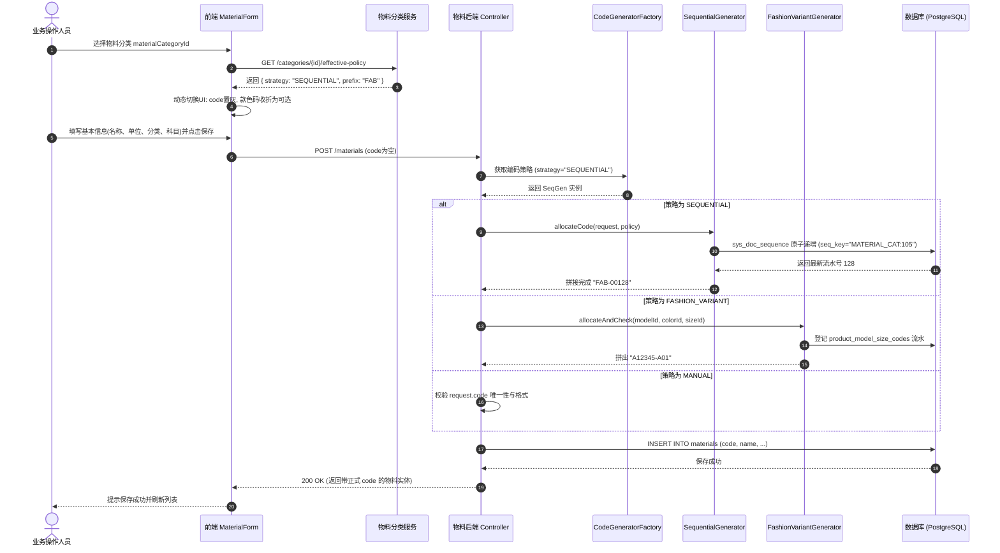

# 02. 编码策略体系与目标业务流程

---

## 1. 三大编码策略详细定义

```text
                               ┌─────────────────────────┐
                               │     物料编码策略体系     │
                               └────────────┬────────────┘
                ┌───────────────────────────┼───────────────────────────┐
                ▼                           ▼                           ▼
   ┌─────────────────────────┐ ┌─────────────────────────┐ ┌─────────────────────────┐
   │ 策略 1: FASHION_VARIANT  │ │   策略 2: SEQUENTIAL    │ │     策略 3: MANUAL      │
   │  (款色码变体矩阵策略)    │ │   (分类前缀序列流水号)  │ │   (外部手工/客户指定)   │
   ├─────────────────────────┤ ├─────────────────────────┤ ├─────────────────────────┤
   │ 适用：成衣、鞋靴、文胸   │ │ 适用：标品配件、原料、包│ │ 适用：OEM客供料、老系统 │
   │ 规则：款号+本款色+尺码号 │ │ 规则：前缀+年月+递增流水│ │ 规则：用户自由录入      │
   │ 例：A12345-A01          │ │ 例：FAB-00042           │ │ 例：CUST-PO-99881       │
   │ 核心维度：款/色/码必填  │ │ 核心维度：款色码折叠为可选│ │ 核心维度：手填+唯一性校验│
   └─────────────────────────┘ └─────────────────────────┘ └─────────────────────────┘
```

### 1.1 策略一：`FASHION_VARIANT`（款色码变体矩阵）
* **定位**：承接鞋服时尚行业核心业务（完全向下兼容 V1 设计）。
* **编码公式**：
  $$\text{区分颜色：} \text{code} = \text{model.code} + \text{"-"} + \text{colorLetter} + \text{sizeSku} \quad (\text{例：A12345-A01})$$
  $$\text{不区分色：} \text{code} = \text{model.code} + \text{"-"} + \text{sizeSku} \quad (\text{例：A12345-01})$$
* **数据约束**：
  - `productModelId`、`productSizeId` 必填；
  - 若款号维护了本款颜色（`distinguishColor == true`），`colorId` 必填且必须属于本款颜色池；
  - 尺码必须属于款号绑定的尺码组；
  - 尺码流水（01~99）由 `product_model_size_codes` 严格分配并落库；
  - **变体唯一性与排他性**：由物化列条件唯一索引 `uk_materials_tenant_fashion_variant_color / nocolor`（数据库物理底线硬防线，仅限 `is_fashion_variant = true`）、领域策略服务 `assertVariantUnique`（业务查重排除自身）以及 `UNIQUE(tenant_id, code)`（全局防重）三重保障，彻底将 V1 无条件物理索引解耦重构为精准条件索引。
* **作业入口**：
  - **批量主入口**：`/mm/materials` 工具栏「组合生成（`VariantGenerateModal`）」；
  - **单笔补充入口**：`MaterialForm`（仅用于单件补码）。

---

### 1.2 策略二：`SEQUENTIAL`（分类前缀序列流水号）
* **定位**：适用于原材料（面料、辅料）、包材、备品备件以及非变体单一成品（如帆布包、水杯）。
* **编码公式**：
  $$\text{code} = \text{Prefix} + \text{Separator} + [\text{DateSegment}] + \text{Sequence}$$
  - **Prefix（前缀）**：
    - 若分类自身配置了 `code_prefix`，优先采用；
    - 独立号池模式（`is_seq_shared = false`）：自身未配置时，默认直接取当前分类自身 `code`（如 `FAB`）；
    - 共用号池模式（`is_seq_shared = true`）：自身未配置时，默认继承号池属主（`poolOwner`）的 `code_prefix` 或分类 `code`，确保同号池编码前缀一致；
  - **Separator（分隔符）**：默认 `-`；
  - **DateSegment（可选静态日期掩码）**：若分类配置了 `date_format` 则嵌入（如 `yyMM`）。注意：物料主数据跨期永不重置，该掩码仅作为号码静态分段，流水计数器不重置；
  - **Sequence（递增序列）**：支持指定补零位数 `seq_length`（默认 5 位，如 `00042`）。
* **数据约束与流水池隔离**：
  - 款号、颜色、尺码**不是编码的一部分**，表单默认作为可选属性折叠；
  - **流水物理隔离**：每个分类拥有专属的 `seq_key = 'MATERIAL_CAT:' + seqScopeCategoryId`，在 `sys_doc_sequence` 中独立递增，确保各分类号段相互隔离、互不挤占；
  - **共用父级流水（可选）**：当子分类配置 `is_seq_shared = true` 时，号池作用域 `seqScopeCategoryId` 自动锚定父级号池属主 ID，其默认前缀也统一继承号池属主的前缀/代码，实现多子分类共享同一大类号段且编码格式统一；
  - **高并发原子递增与断号权衡**：单笔新增时前端传入的 `code` 为空，由后端的 `SequentialCodeGenerator` 基于 `sys_doc_sequence`（PostgreSQL `INSERT ON CONFLICT DO UPDATE RETURNING`）在独立事务中原子递增发号。该设计确保高并发下**绝对不会产生重复编码且锁持有时间极短**；若后续业务事务发生异常回滚，已领取的号码不回滚（工业 ERP 允许极罕见断号，严禁重号）；
  - **界面禁用手填与接口契约**：单笔物料维护界面中，`SEQUENTIAL` 策略下物料编码由前端强制设为只读且不提交 `code`（传空），由后端的 `SequentialCodeGenerator` 基于 `sys_doc_sequence` 原子递增发号，严禁在交互界面上手填串号；仅在未来数据迁移、Excel 批量导入或外部 OpenAPI 集成等特殊场景下，若入参显式提供了非空 `code`，后端才允许原样校验防重并落库（详见 §4.4）；
  - **租户前缀唯一性门禁**：不同独立号池之间严禁生效相同的前缀，避免发生 `prefix + seq` 在租户内碰撞。

---

### 1.3 策略三：`MANUAL`（外部手工录入 / 客户指定）
* **定位**：适用于 OEM 代工客户指定料号、带行业通用标准号（如国标代码、CAS 号）的原材料、以及历史系统迁移数据。
* **编码公式**：
  - 由操作人员在界面直接键入任意有效字符串。
* **数据约束**：
  - 后端执行 `NOT BLANK`、最大长度（$\le 50$）及租户内全局唯一性校验（`existsByCode`）；
  - **与变体硬约束解耦（OEM 赋能）**：允许不同客户指定料号挂载相同的款号或尺码（如 `NIKE-40` 与 `ADI-40` 挂同一版型），由于物化标记 `is_fashion_variant = false`，完全脱离变体三维排他物理索引的限制。

---

## 2. 前端表单（MaterialForm）动态自适应行为矩阵

当用户在 `MaterialForm` 中切换 `materialCategoryId`（物料分类）时，前端通过分类继承算法实时解析出当前分类的有效策略，表单界面**瞬时自适应重构**：

| 表单区域 / 字段 | `FASHION_VARIANT`（变体策略） | `SEQUENTIAL`（自动序列策略） | `MANUAL`（手工策略） |
| :--- | :--- | :--- | :--- |
| **物料编码（`code`）** | 禁用直接输入，通过款式+色+码动态建议回填；带有 Alert 建议状态机。 | **只读/禁用输入**。<br/>显示占位符：「*保存时系统自动分配流水号*」。 | **必填输入框**。<br/>允许用户直接键盘输入。 |
| **产品款式（`productModelId`）** | **必填**。仅展示可售且自制的款号。 | **折叠为可选扩展属性**（用于标品研发追踪）。 | **折叠为可选扩展属性**（支撑 OEM 代工挂载版型）。 |
| **颜色选择（`colorId`）** | **必填（分色时）**。受款式颜色池约束。 | 渲染通用全局色卡选择（可选）。 | 渲染通用全局色卡选择（可选）。 |
| **尺码选择（`productSizeId`）** | **必填**。受款号绑定的尺码组约束。 | 渲染通用全局尺码选择（可选）。 | 渲染通用全局尺码选择（可选，支撑 OEM 代工尺码标注）。 |
| **批量生成向导入口** | 工具栏**激活「组合生成」**。 | 工具栏**禁用或隐藏**「组合生成」。 | 工具栏**禁用或隐藏**「组合生成」。 |

---

## 3. 全生命周期端到端业务时序

### 3.1 单笔新增/保存时序（含策略分流）



### 3.2 组合生成向导（VariantGenerateModal）前置与双重防呆

在鞋服矩阵生成场景中，用户通过「组合生成」向导批量生成 SKU。现网向导分为三步：1) 选择款号；2) 勾选颜色与尺码矩阵；3) 填写公共主数据（含分类、单位、科目等）。防呆机制需在前后端双向设防：

```text
打开「组合生成向导」
  │
  ├─ 步骤 1: 款号校验
  │    ├─ 款号是否已选？──(否)──► 拦截：「请先选择款号」
  │    └─ 款号是否绑定尺码组？──(否)──► 拦截：「请先为该款号维护尺码组」
  │
  ├─ 步骤 2: 矩阵勾选
  │    └─ 仅允许勾选状态为 NEW 的合法格子 (1~200 个)
  │
  └─ 步骤 3: 目标分类选择与保存 (前后端双重门禁)
       │
       ├─► 前端门禁: 监听 values.materialCategoryId，自动校验策略。
       │     若策略 != FASHION_VARIANT ──► 红色提示：「该分类非变体编码策略，不能用于变体批量生成」，禁用提交按钮。
       │
       └─► 后端门禁 (API 强拦截):
             POST /api/mm/materials/variant-generate 接口收到请求后，
             立即解析 common.materialCategoryId 的有效策略。
             若 policy.getStrategy() != FASHION_VARIANT:
             直接抛出 400 业务异常 (validation.material.variant.generate.notFashionVariantCategory)，拒绝执行生成。
```

---

## 4. 物料全生命周期行为规格（Lifecycle Operations）

除了单笔新增与批量生成外，物料主档在修改、复制、导入等操作中必须遵循严格的策略自适应规则：

### 4.1 修改物料（UPDATE / PUT）
1. **物料编码（`code`）不可变性与免发号保证**：
   - 物料主档一旦持久化落库，其 `code` 成为库存、BOM、采购及财务凭证的核心业务主键引用，**永久只读，严禁修改**；
   - 后端在 `updateMaterial` 中校验：若 `StringUtils.hasText(request.getCode())` 且 `!request.getCode().equals(entity.getCode())`，抛出不可修改校验异常（`validation.material.code.immutable`）；
   - 若入参 `request.getCode()` 为空或未传（如前端只读字段未序列化提交），后端自动沿用 `entity.getCode()`，**严禁在修改流程中触发发号器分配流水**，避免号码浪费与断号。
2. **分类变更边界（Category Switch Boundaries）**：
   - 若用户修改物料分类，系统重新解析目标分类与当前分类的有效策略：
     - **强隔离红线**：若试图在变体策略（`FASHION_VARIANT`）与非变体策略（`SEQUENTIAL` / `MANUAL`）之间跨策略变更分类，**后端直接抛出业务异常予以拦截（`validation.material.category.strategyMismatch`）**。原因：变体物料编码、款式维度及尺码流水一旦生成落库已具备特定领域语义，不可随意篡改其主档性质；如确需更换业务属性，必须将旧物料标记为停用，并在新分类下建档；
     - **非变体策略间变更（`SEQUENTIAL` ↔ `MANUAL`）**：允许修改分类。此时物料编码保持原值**不重新发号**，系统同步将实体的 `material_category_id` 更新为目标分类（`is_fashion_variant` 保持 `false`）；若新分类的前缀与原物料编码前缀不一致，系统在前端给出轻量提示「变更分类不会修改已分配的物料编码」。
3. **变体三维锁定（V1 规则继承）**：
   - 具有完整款号与尺码的变体物料，保存后禁止修改 `productModelId`, `colorId`, `productSizeId`（抛出 `validation.material.variant.dimension.immutable`）；
   - 在更新校验时，将 `existing` 实体传入变体校验服务，变体排他查重排除自身 ID。

### 4.2 复制物料（handleCopy）
现网列表页提供「复制」功能（`handleCopy`），在 V2 架构下的自适应行为如下：
1. **`SEQUENTIAL` 策略**：
   - 复制时前端自动将 `id`、`code` 清空并传给新增抽屉；
   - 表单中 `code` 保持只读灰显，提示「保存时系统自动分配流水号」，点击保存时生成全新的递增序列号。
2. **`FASHION_VARIANT` 策略**：
   - 复制时清空 `code`，但保留款号、分类等基础字段；
   - 用户必须更改颜色（`colorId`）或尺码（`productSizeId`），表单根据新变体重新触发变体建议状态机；
   - 若用户未修改颜色或尺码直接保存，将被 `assertVariantUnique` 及数据库部分唯一索引拦截。
3. **`MANUAL` 策略**：
   - 复制时清空 `code`，输入框高亮开放，等待用户录入全新料号。

### 4.3 分类配置变更与维护禁则（Category Governance）
为了保证编码体系的单调性与数据一致性，物料分类自身的属性修改受以下规则约束：
1. **物料引用时策略锁定**：
   - 若当前分类或其任一后代子分类下已经存在关联物料（`materials.material_category_id = cat.id`）：**禁止修改其 `code_strategy`**，防止存量变体与非变体语义混淆。
2. **层级移动（`parent_id` 变更）治理门禁**：
   - 若当前分类及其子树下已有存量物料，修改 `parent_id`（跨父节点移动）时，系统必须校验移动前后解析出的有效策略 `strategy` 是否发生变化。严禁通过移动分类节点将其从变体树挂载至非变体树（或反之）；
   - 若当前分类配置了 `is_seq_shared = true` 且其原号池已实际发过号（`sys_doc_sequence` 中有计数记录），**严禁修改 `parent_id` 导致号池属主漂移（`seqScopeCategoryId` 发生变更）**，防止造成流水断号或跨号池混淆；
   - 若移动前后策略一致且属主未冲突，系统需重新执行全租户独立号池生效前缀防重校验（`EffectivePrefix` 唯一性），确认无前缀碰撞后方可允许变更父节点。
3. **共用号池（`is_seq_shared`）合法性门禁**：
   - 后端在保存/更新分类时执行校验：仅当父级节点的最终有效策略为 `SEQUENTIAL` 时，才允许配置 `is_seq_shared = true`；
   - 若父节点有效策略为 `FASHION_VARIANT` 或 `MANUAL`（或为根节点无父级），后端直接拒绝并抛出 `validation.materialCategory.shared.parentNotSequential` 异常。
4. **发号后号池配置与分类代码锁定**：
   - 若分类对应的号池在 `sys_doc_sequence` 中已有计数记录（已实际发过号）：
     - **禁止修改 `is_seq_shared` 以及显式配置的 `code_prefix`**（仅允许增加流水位数 `seq_length`）；
     - 若该分类自身未显式配置 `code_prefix`（即默认以自身分类 `code` 作为流水前缀），**同时锁定分类自身的 `code` 不得更名修改**，杜绝号码前缀突变（如原为 `FAB-00010` 突然变成 `KNIT-00011`）或导致跨号池断号冲突。
5. **分类删除安全门禁**：
   - 后端在 `deleteMaterialCategoryBulk` 时进行前置防御检查：若分类下存在子分类，或存在已被任何物料引用的情况，拒绝物理删除并抛出业务提示（`validation.materialCategory.hasMaterialsOrChildren`），引导用户使用「停用」状态。
6. **分类停用与号池保留**：
   - 分类停用后，新建物料的下拉树中禁用该节点；已有关联物料不受影响；
   - `sys_doc_sequence` 中对应的 `seq_key` 记录永久保留，绝不清零或物理删除。

### 4.4 批量导入与集成接口（规范预留）
> 注：当前现网物料主档以界面单笔新增与「组合生成向导」为主，尚未上线 Excel 批量导入。本节作为后续导入功能与 OpenAPI 集成的统一技术契约：
1. **统一路由**：批量导入程序与外部集成接口必须统一调用 `MaterialCodeGeneratorFactory`，不得绕过策略直插数据库。
2. **`SEQUENTIAL` 导入**：
   - Excel 模板中允许 `code` 列为空；
   - 导入服务遍历保存时，若该行所属分类为 `SEQUENTIAL` 且 `code` 为空，后端自动原子递增分配编码并回填落库；
   - 若 Excel 显式提供了 `code`，则原样校验防重并存入（支持手工补录）。
3. **`FASHION_VARIANT` 导入**：
   - 要求款号、颜色、尺码非空且合法，由变体服务自动核验编码公式并占位流水。
4. **`MANUAL` 导入**：
   - `code` 列必填，为空则整行报错。

---

## 5. 物料类型（MaterialType）与分类策略（CodingStrategy）的协同

| 控制维度 | 物料类型 (`material_types`) | 物料分类 (`material_categories`) |
| :--- | :--- | :--- |
| **关注核心** | 财务评估、总账科目、进销存单据流 | 物理品类、产品形态、编码规则 |
| **典型字段** | `is_sold`, `is_manufactured`, `is_inventoried` | `code_strategy`, `code_prefix`, `seq_length` |
| **表单显隐控制** | 决定是否触发标准成本核算、是否加载评估类下拉 | **唯一决定** `code` 只读态、款号/色/码的显隐与必填 |
| **冲突兜底原则** | 若分类策略为 `FASHION_VARIANT`，但物料类型不是自制成品：前端在表单顶部给出提示警示，后端以分类策略为准执行款色码完整性校验。 |
