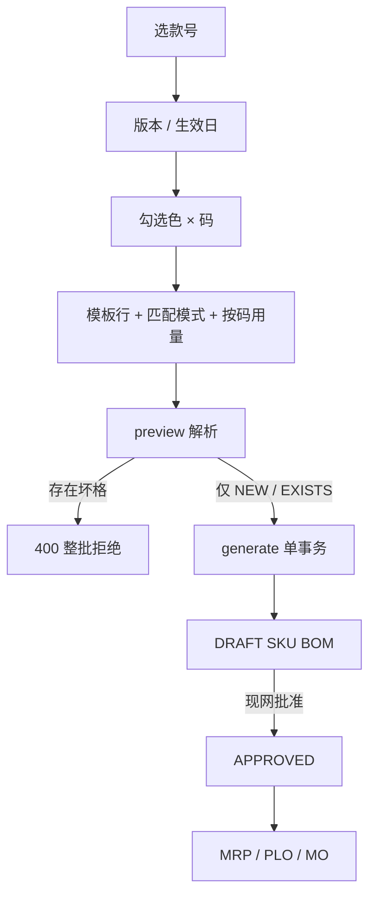

# 02. 目标流程：按款生成 BOM（To-Be）

> 原则：模板在请求里，执行 BOM 仍在 SKU；一次事务写头+行；只出 DRAFT。  
> 命名一律 **按款生成 BOM**。表与解析契约以 [03-schema设计.md](./03-schema设计.md) 为准。

---

## 1. 目标数据链

```text
款号 ProductModel
  │
  ├─ 已存在的自制变体 SKU（is_fashion_variant ∧ isManufactured）
  │
  └─ 请求内模板行（种子料 + 匹配模式 + 默认用量 + 可选按码用量）
           │  按父件色解析子件、按父件码换算用量
           ▼
     SKU 级 bill_of_materials (DRAFT) + bom_items
           │
           ▼
     现网 bulk-approve ──► MRP / 计划单 / 工单
```



与物料变体对照：

```text
物料：预览色×码格子 → 建 NEW SKU（公共主数据）
BOM ：预览色×码格子 → 为 NEW 格写头+行（公共版本/日期 + 模板解析）
```

现网单笔 `BillOfMaterialForm` **保留**，用于非变体、补一行、改 DRAFT。

---

## 2. 作业

### 2.1 按款生成（PP，主作业）

1. 进入 `/pp/bill-of-materials`，工具栏「按款生成 BOM」（对标物料「组合生成」）。
2. 步骤 1：选 `productModelId`；填共用 `version`、`validFrom`、可选 `validTo` / `description`。款号须已绑尺码组（与物料向导同一前置）。
3. 步骤 2：勾选本款颜色、尺码（数据源 `GET /mm/product-models/{id}/variant-setup`）。不分色则无颜色多选。只生成**已存在**的自制变体 SKU；缺料格子预览为 `MISSING_SKU`，不在本波建料。
4. 步骤 3：`EditableProTable` 维护模板行：项次、匹配模式、种子物料、默认用量、可选按码用量（`sizeQuantities`）、损耗、倒扣、备注、行状态。至少一行。吊牌等全码同量只填默认用量；面料等按 `variant-setup.sizes` 展开各码绝对用量。
5. 步骤 4：调 `preview`。矩阵展示每格状态；展开或侧栏可看该格解析后的子件与 **该格用量**。只勾选 `NEW` 格提交（`EXISTS` 跳过，坏格禁止勾选）。
6. `generate`：单事务为每个 NEW 格插入 1 头 + 全部解析行，状态 `DRAFT`。成功后刷新列表。用户再用现网批量批准。

向导关闭不落模板。要再生成：重开向导重填（或以后另开 Super BOM 专题）。

### 2.2 单笔维护（现网，不改作业）

非变体自制件、OEM、只改一份 SKU：仍走 `BillOfMaterialForm` + `BomItemForm`。  
生成出的 DRAFT 与手建 DRAFT 无区别，可继续逐行改。

### 2.3 批准

不新增按钮语义。列表已有 `bulk-approve` / `unapprove` / `obsolete`。生成成功 **不得** 在同一请求里批准。

---

## 3. 规则

### 3.1 父件准入

目标 SKU 必须同时：

```text
productModelId     = 请求款号
isFashionVariant   = true
productSizeId      ≠ null          // 完整变体
materialType.isManufactured = true
activeStatus       = ACTIVE
```

区分色：`colorId` 必须落在本款颜色池。不分色：`colorId` 必须空，请求 `colorIds` 必须空。  
`SEQUENTIAL` / `MANUAL` 父件不进本向导（无矩阵）。

### 3.2 模板行准入

| 字段 | 规则 |
|------|------|
| 行数 | 1～50 |
| `itemNo` | 可空；空则按行序 10/20/30…（对标现网 BOM 默认步长）。同一请求内项次不得重复 |
| `matchMode` | 必填，见 §3.3 |
| `seedMaterialId` | 必填。须存在、`ACTIVE`、`materialType.isInventoried = true` |
| `quantity` | 必填，`> 0`，`compareTo`，精度 6。未点名的尺码回退此值 |
| `sizeQuantities` | 可空。按码绝对用量，见 §3.4。空 = 全码用 `quantity` |
| `scrapRate` | 可空，默认 0，`>= 0`。与按码加放无关，禁止拿损耗当尺码倍率 |
| `isBackflush` | 可空 = 现网「跟随工厂物料」 |
| `activeStatus` | 必填，默认 `ACTIVE` |
| `remarks` | 可空，≤ 1000 |

`FIXED`：种子就是落库子件，不要求种子有款号。  
非 `FIXED`：种子 **必须** `productModelId ≠ null`，否则模板级 400（不要等到格子上 `UNRESOLVED`）。  
`COLOR_MATCH`：种子 `productSizeId` 必须空（对色家族按「一色一料、无尺码」查找）。种子带尺码 → 模板级 400，提示改用 `COLOR_SIZE_MATCH`。

### 3.3 匹配模式（对每个目标 SKU 解析一行）

令父件 = 该格 SKU，种子 = 模板行 `seedMaterialId` 对应物料。

| 模式 | 查找键 | 典型用料 |
|------|--------|----------|
| `FIXED` | 种子自身 | 吊牌、胶袋、通用五金 |
| `COLOR_MATCH` | 种子.`productModelId` + 父件.`colorId`（父件无色则 `color_id IS NULL`）+ `product_size_id IS NULL` | 同款对色面料/里布（无尺码） |
| `SIZE_MATCH` | 种子.`productModelId` + 父件.`productSizeId` + 种子.`colorId`（种子无色则 `IS NULL`） | 同色（或无色）对码配件 |
| `COLOR_SIZE_MATCH` | 种子.`productModelId` + 父件.`colorId` + 父件.`productSizeId` | 已变体化的半成品（鞋面、裁片） |

命中集合再滤：`activeStatus = ACTIVE`、`id ≠ 父件.id`。

```text
0 条     → 该行 UNRESOLVED
1 条     → RESOLVED，componentMaterialId = 该料
>1 条    → 该行 CONFLICT
命中 = 父件 → 该行 SELF_REF（计入坏格）
```

同一目标 SKU 上，两行解析到同一 `componentMaterialId` → 后行 `DUPLICATE`（`uk_bom_items` 不允许）。

对色面料若走 `SEQUENTIAL` 且没有款号：不能用 `COLOR_MATCH`。业务须给该面料家族挂同一个 `productModelId`（V2 允许非变体物料折叠挂款），或改用 `FIXED` 接受全色同料。  
**禁止**「同分类 + 同色」模糊查找（一分类多面料会乱匹配）。

匹配模式只决定 **用哪颗子件**。用量由 §3.4 按父件尺码换算，与模式正交：`FIXED` + 按码用量（面料一料多码）、`COLOR_MATCH` + 按码用量（对色且大码加量）都合法。

### 3.4 按码用量（SIZE_SCALE）

权威在请求里的绝对量表，**不**落新表、**不**进 `BomComponentMatchMode`。

```text
resolvedQty(父件) =
    sizeQuantities 中 productSizeId == 父件.productSizeId 的 quantity
    否则 quantity（默认用量）
```

同一尺码、不同颜色共用一行 `sizeQuantities`（海军蓝 S 与黑色 S 同米数）。颜色不参与用量键。

| 规则 | 值 |
|------|-----|
| `sizeQuantities` 空 / null | 全码用 `quantity`（吊牌、胶袋） |
| 某码未列入 | 回退 `quantity`，预览该行 `usedDefaultQuantity = true`，**不是**坏格 |
| 列入的 `productSizeId` | 必须属于本款尺码组，否则模板级 400 |
| 同一行重复 `productSizeId` | 模板级 400 |
| 各码 `quantity` | 必填，`> 0`，精度 6 |
| 表长 | ≤ 本款尺码组档位数 |
| 某码就是不要这行 | 不要写 0（现网用量必须 `> 0`）；不勾选该码，或该行不要用在那些 SKU |

百分比加放（「M = 1.20 当 100%，XL = 110%」）只做 **步骤 3 的填表助手**：选基准码 + 基准量，其它码填 %，前端折成绝对 `sizeQuantities` 再提交。API **不收** 百分比字段，库内 **不存** 公式。日后单笔改 XL 只改该 SKU 行上的绝对量。

**禁止**：按工单产量乘用量（展开是 MRP / 工单的事）；用 `scrapRate` 模拟加码。

### 3.5 预览格子状态

格子 = 请求勾选的色 × 码（不分色则仅码）。状态按顺序判定，先中先停：

```text
1. 无完整自制变体 SKU           → MISSING_SKU
2. SKU 存在但准入失败           → INELIGIBLE
     （非自制 / 非变体 / 非 ACTIVE / 色模式与本款不符）
3. 已存在 (productMaterialId, version) 的 BOM
                                 → EXISTS（带 existingBomId / bomStatus）
4. 任一模板行非 RESOLVED        → 格状态 = 最严重行态
     严重度：CONFLICT = DUPLICATE = SELF_REF > UNRESOLVED
5. 否则                         → NEW
```

`EXISTS` **不**再跑解析（避免误导「会覆盖」）。要换料：先删该版本 DRAFT，或换一个 `version`。

坏格：`MISSING_SKU` / `INELIGIBLE` / `UNRESOLVED` / `CONFLICT` / `DUPLICATE` / `SELF_REF`。  
与物料向导相同：勾选集合里出现坏格 → `generate` 400，errorData 带回完整 preview。  
`EXISTS` 可出现在 preview，生成时跳过并计入 `skippedExisting`。  
`NEW` 勾选数必须 1～200，否则 400。

空模板行：`preview` 仍返回 SKU/EXISTS/MISSING（供步骤 2/4 看格子）；`generate` 要求模板 ≥ 1 行。

已跑解析的格（`NEW` 与坏格里已点名的行）`items[].quantity` 必须是 **该格已换算用量**，不是模板默认值原样。`usedDefaultQuantity` 供预览标注「用默认」。`EXISTS` 仍不解析、不带用量。

### 3.6 写入

同一事务：

```text
对每个勾选且 status=NEW 的格子：
  INSERT bill_of_materials
    product_material_id = 该 SKU
    version / validFrom / validTo / description = 请求共用
    bom_status = DRAFT
  INSERT bom_items × 模板行数
    item_no / component_material_id / quantity（该格 resolvedQty）/ scrap_rate /
    is_backflush / remarks / active_status
禁止调用现网 createBillOfMaterial + createBomItem 循环
禁止部分提交
撞 uk_bom_product_version（并发）→ ValidationException，整批回滚
```

不重算 LLC。不写工单。不改物料。

`validTo` 可空。若两者都有：`validFrom ≤ validTo`，否则模板级 400。  
`version` 必填，长度 ≤ 20（现网列）。

### 3.7 与单笔校验对齐

生成落行后的数据必须能被现网 `updateBomItem` / 批准接受：

- 子件存在且库存类（`isInventoried`）
- 子件 ≠ 父件
- 同一 BOM 子件不重复
- 用量 > 0

现网单笔 **没有** 循环 BOM 检测；本波生成也不做图遍历。批准仍走现网 LLC。

---

## 4. API

权限前缀 `/pp/bill-of-materials`。现网头行接口全部保留。

| 方法 | 路径 | 权限 |
|------|------|------|
| POST | `/api/v1/pp/bill-of-materials/generate/preview` | read |
| POST | `/api/v1/pp/bill-of-materials/generate` | create |

V1 **不做** 生成用的 PDF、异步作业、按款查询缺 BOM 的独立列表接口（preview 已含格子）。

### 4.1 请求（preview / generate 同形）

`generate` 比 preview 多要求：模板行非空、勾选细胞非空。Preview 的 `cells` 可空 = 按 `colorIds` × `productSizeIds` 全展开；generate 的 `cells` **必填**，只处理列出的格（对标物料 `generateVariants`）。

字段与 Java 形状见 `03` §4。

### 4.2 响应

- preview：矩阵列 + 行 + 扁平 `cells`（含 `items[]` 解析明细）。对标 `MaterialVariantPreviewResponse`。
- generate：`created: BillOfMaterialResponse[]`、`skippedExisting: int`。不返回行明细（列表刷新即可）。

坏格 / 模板非法：`ValidationException.withErrorData(..., preview)`，前端弹出与物料向导同一类预览错误。

### 4.3 枚举导出

`EnumController` 增加 `BomComponentMatchMode`。格子状态 / 行解析状态是生成专用，可只放 DTO，不必进全局 enums（前端用 i18n map）。若希望表格 `valueEnum` 统一，也可一并导出 `BomGenerateCellStatus`。

### 4.4 不做的接口

| 不要 | 原因 |
|------|------|
| `copyBom` / `copy-from/{bomId}` | 本专题不做复制 |
| `POST /bill-of-materials/bulk` 只收 N 个现网 Request | 没有匹配规则，对色仍要人肉拆 N 份 |
| MM `generateVariants` 顺带写 BOM | 模块越权；SKU 与 BOM 作业分离 |
| 款号级 `bom_templates` CRUD | V1 不做 Super BOM |

---

## 5. 前端

### 5.1 入口

唯一新作业：`pages/pp/bill-of-materials/components/BomGenerateDrawer`。  
列表 `toolBarRender` 加按钮，**不要**新菜单。复制 `VariantGenerateModal` 的 `StepsForm` 骨架，不要从 `BillOfMaterialForm` 上长向导。

locale：zh-CN / en-US / vi-VN。按钮「按款生成 BOM」/ `Generate by style`。不要「复制 BOM」「批量生产」。

### 5.2 步骤与防呆

| 步 | 内容 | 拦截 |
|----|------|------|
| 1 款号与表头 | 款号、版本、生效日 | 未选款；款号无尺码组（`variant-setup.sizeGroupId` 空） |
| 2 色 × 码 | checkbox，默认全勾本款色/码 | 区分色未勾色；未勾码 |
| 3 模板行 | EditableProTable + 按码用量列 | 0 行；`COLOR_MATCH` 种子带尺码；非 FIXED 种子无款号；按码表重码 / 组外码 / ≤0 |
| 4 预览 | 色行 × 尺码列；格上 Tag | 勾选 NEW 数 0 或 >200；勾了坏格 |

步骤 2 进入时可先用空模板调一次 preview，把 `MISSING_SKU` 标在 checkbox 旁（「该色该码尚无自制 SKU」）。不强制。

步骤 3 `MaterialSelect`：库存类物料；不要排除「将来某个父件」——父件在步骤 4 按格校验 `SELF_REF`。

`matchMode` 用 `ProFormSelect` + 枚举。切换模式不自动清种子，但要即时提示种子是否满足 §3.2。

按码用量：步骤 3 按 `variant-setup.sizes`（`sequence` 序）为每行展开尺码列，单元格绑定 `sizeQuantities[productSizeId]`。空单元格 = 回退默认 `quantity`，不要提交 `0`。可选「按 % 填」：指定基准码后把各码 % 折成绝对量写入这些列；提交 payload **只有** `quantity` + `sizeQuantities`。

只读：`bomStatus !== DRAFT` 与本向导无关（向导只创建）。

脏检查：对标物料向导，关闭用 `useFormOpenChangeHandler`；提交成功先打 `submitted`。

### 5.3 预览矩阵

复用物料向导的色行 × 尺码列。Tag 色：

| 状态 | 色 | 可勾选提交 |
|------|----|------------|
| `NEW` | green | 是 |
| `EXISTS` | default | 否（跳过） |
| 坏格 | red / orange | 否 |

默认勾选全部 `NEW`。点格看 `items[]`：种子编码 → 解析编码、模式、行态、**该格用量**（回退默认时标注）。

### 5.4 单笔页

不改。生成后的 DRAFT 双击仍进 `BillOfMaterialForm`。

---

## 6. 模块边界

| 动作 | 模块 |
|------|------|
| preview / generate、头行落库 | `lychee-erp-pp`（`BomGenerateService`） |
| 款号色码池、变体唯一查找 | PP 调 `MaterialRepository` / `ProductModelRepository`（现网已用） |
| `GET .../variant-setup` | **不改**，前端直调 MM |
| `generateVariants` / `copyBom` | **不改、不实现** |
| MRP / LLC / 工单展开 | **不改** |
| 前端向导 | `lychee-frontend/src/pages/pp/bill-of-materials/components/BomGenerateDrawer.tsx` |
| 菜单 | 仍 `PP01` `/pp/bill-of-materials` |

禁止 `lychee-erp-mm` 依赖 PP 写 BOM。禁止 PP 调 MM Controller。

---

## 7. V1 不做

- 复制已有 BOM 到其它 SKU（含物料向导 `copyBom`）
- Super BOM / `bom_templates` 落库与变更同步
- 色码映射表（父海军蓝 → 面料藏青）
- 按码用量百分比公式落库 / API 收 %（只允许前端折算）
- 按工单产量缩放 BOM 用量
- 「同分类 + 同色」模糊匹配
- 生成时建缺失 SKU / 缺失子件
- 覆盖已有版本（含覆盖 DRAFT）
- 自动批准、生成后重算 LLC
- 运行时款号 BOM 继承
- `SEQUENTIAL` / `MANUAL` 父件批量
- Excel / EDI 导入 BOM
- 异步作业、进度条服务端推送（200 格 × 50 行同步事务可接受）
- 循环 BOM 图检测
- 把 CRM/工艺路线卷进本向导
