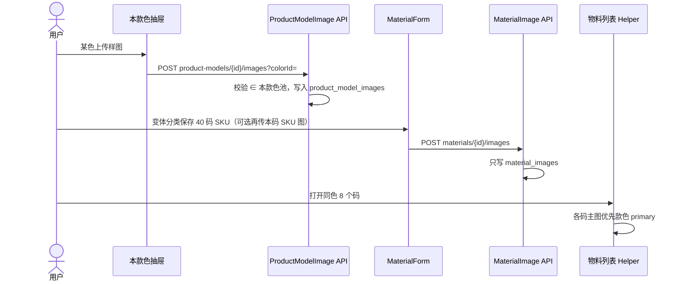

# 02. 目标流程（To-Be）

---

## 1. 职责拆分

```text
┌─ 物料分类（树）──────────────────────────────────────┐
│ code_strategy 只选发号器                               │
│   FASHION_VARIANT → 公式 A12345-A01 + 尺码流水 token   │
│   SEQUENTIAL      → 分类前缀流水                       │
│   MANUAL          → 用户录入，租户内 code 唯一         │
└────────────────────────────────────────────────────────┘
                         │ 写入：is_fashion_variant = (strategy == FASHION_VARIANT)
                         ▼
┌─ 物料行 ─────────────────────────────────────────────┐
│ is_fashion_variant = 是否占用款×色×码那一格            │
│ true  → 变体校验、部分唯一索引、锁款号主数据            │
│ false → 款色码可为属性（OEM）；不占格                   │
│ 与图档无关                                             │
└────────────────────────────────────────────────────────┘

┌─ 款色图 product_model_images ──┐  ┌─ SKU 图 material_images ──┐
│ 键 (model, color)；不分色 NULL  │  │ 键 material_id             │
│ 入口：款号 / 本款色抽屉         │  │ 入口：物料抽屉（现网）     │
│ API：/mm/product-models/...     │  │ API：/mm/materials/...     │
└─────────────────────────────────┘  └───────────────────────────┘
                         │ 展示：款色 primary 优先，否则回退 SKU
                         ▼
              列表 / 详情 / FO/SO 样图框
```

两种合法组合（无第三种「手工码占正品格」）：

| | 分类策略 | 注记 | 料号 | 占格 |
|---|----------|------|------|------|
| ① 自制变体 | `FASHION_VARIANT` | 强制 `true` | 公式 | 是 |
| ② OEM / 标品挂版型 | `MANUAL` / `SEQUENTIAL` | 恒 `false` | 手工/流水 | 否 |

禁止：变体分类里 `false`（公式码必须占格）。禁止：仅因 `productModelId != null` 推 `true`。禁止：用户在表单或请求里改注记。

---

## 2. 变体保存与尺码组

### 2.1 注记写入（现网，不改公式）

```text
policy = resolve(materialCategoryId)
generator = factory.get(policy.strategy)     # 发号仍只看分类
generator.validate + allocateCode
entity.isFashionVariant = (policy.strategy == FASHION_VARIANT)
```

`MaterialRequest` **不增加** `isFashionVariant`。Mapper 继续 `ignore`。更新时仍按**目标分类**策略重写该列（与现网 `setIsFashionVariant(isTargetFashion)` 相同）。跨 `FASHION_VARIANT` ↔ 非变体改分类仍 `strategyMismatch`。

### 2.2 变体维度：尺码必须在组内

`FashionVariantCodeGenerator.validate` 已要求款号、尺码、名称。`validateVariantDimensions` 去掉「无尺码组则跳过」的短路。变体路径上：

```text
productModelId、productSizeId 必填                    # 现网 FashionVariantCodeGenerator
if model.sizeGroupId == null
    → 400 validation.material.variant.generate.sizeGroup.required
加载尺码组
if productSizeId ∉ 组
    → 400 validation.material.variant.size.notInGroup
分色：colorId 必填且 ∈ 本款色池；不分色：colorId 必须空
完整三维：assertVariantUnique + 色模式锁定
已保存变体：款/色/码不可改（existing.isFashionVariant）
```

不要写成 `findFetchedBySizeGroupId(null)` 后拿空集当「不在组内」——无组是另一类错误，须单独 400。

MANUAL / SEQUENTIAL **不调用** `validateVariantDimensions`：可选挂款号/任意尺码，不占格。前端变体分类在款号未绑组时继续用 `fashionSizeGroupMissing` 禁用提交；后端必须同样拦截。

### 2.3 组合生成

仍要求目标分类 `FASHION_VARIANT`。`EXISTS` 只认 `is_fashion_variant = true`。MANUAL 同款同码不挡生成（该格仍 `NEW`）。`copyImages` / `copyBom` **忽略，不实现**。

### 2.4 尺码流水 token（生成器语义，勿改错）

保存公式变体时 `FashionVariantCodeGenerator.allocateCode` → `resolveOrAllocateCode` → `persistAllocatedTokens`。

`SizeSkuAllocator` 会把「本色域已有变体物料、但还没有 `product_model_size_codes` 行」的尺码纳入补号（`untokenedMaterials`），保证同色尺码号单调递增，**不改已有物料的 `code`**。

不要把「某条路径保存时不主动发 token」理解成「生成器要排除这些尺码」。排除后后面的码会从 01 重排，号会错位。`loadMaterialSizeIds` 继续只看 `is_fashion_variant = true`。

### 2.5 前端 `MaterialForm`

| | 变体分类 | 非变体分类 |
|---|----------|------------|
| 编码 | 只读建议 / 保存发号 | MANUAL 手填；SEQUENTIAL 只读流水 |
| 款色码 | 必填（现网） | 折叠可选 |
| 变体注记 | **无开关**（保存后即 true） | **无开关**（恒 false） |
| 图片 | 现网 `MaterialImageManager` → 只打物料图 API | 同左 |

`completeVariant` 保持 `Boolean(id && initialValues.isFashionVariant)`。`useMaterialVariantSuggest` 的 `enabled` **仍仅** `strategy === 'FASHION_VARIANT'`。

---

## 3. 图片：两套资产，展示优先回退

### 3.1 拥有者与入口

图写进哪张表，只由**上传入口**决定，不看 `is_fashion_variant`，不看分类策略。

```text
product_model_images
  键 = (tenant_id, product_model_id, color_id)
  color_id NULL = 本款不分色（本款颜色 0 行）
  入口 = 款号页 / 本款色抽屉
  OSS = {tenantCode}/product-model/{modelCode}/{colorId|nocolor}/{ts}{ext}

material_images
  键 = material_id
  入口 = 物料抽屉 MaterialImageManager（路径不变）
  OSS = {tenantCode}/material/{materialCode}/...
```

**不**挂 `product_model_colors.id`（整表 replace 会孤儿；不分色也没有行）。键仍是 `(model, color_id)`，与本款色池做**应用层一致性检查**：

| 本款 `product_model_colors` | 合法 `product_model_images.color_id` | 非法 |
|------------------------------|--------------------------------------|------|
| ≥1 行（分色） | 非空且 ∈ 本款色池 | 池外色、或 NULL |
| 0 行（不分色） | 必须 NULL | 任意非空 `colorId` |

款色上传不满足上表 → 400。**禁止**把 `material_images` 复制/提升进款色表。  
**本款色 replace**：**不级联删图**。顺序：① 现网变体 `in_use` → ② 去掉的色（或改色模式时的旧键）仍有 `product_model_images` → 400，提示先在本款色抽屉删图。  
款色 **GET** 只返回仍符合上表的行；池外残留不展示，须运维修数，禁止用删色顺带 GC。

**`file_path` 禁止跨表共用。** 删 SKU 图、删物料，不得碰到 `product-model/` 对象；删款色图不得碰到 `material/` 对象。

### 3.2 解析顺序（不看注记）

**物料列表 / 详情主图**

```text
if material.productModelId != null:
    先读 product_model_images(model, color) 的 primary   # 不分色 color 为 NULL
    没有 → 本 SKU material_images primary
else:
    本 SKU material_images primary
```

**FO/SO 样图（每个 ModelColorKey 一框）**

```text
先读该 (model, color) 的款色 primary
没有 → 本单候选 SKU 的 material_images，min(materialId) 且 is_primary
仍无 → null，模板空框
```

同款同色 8 个码：只要本款色传过图，列表与打印共用。未传款色图时，现网已挂在某个码上的 SKU 图仍能显示（无迁图也能用）。OEM 与正品若共用同一 `(model, color)` 且已有款色图，样图框也走这套——视觉资产按款色，不按料号身份。

### 3.3 上传入口与属主

1. **物料抽屉**：始终调用 `/mm/materials/{id}/images`，始终读写该 `materialId` 的 `material_images`。未保存须先保存。变体不改入口、不做门面。
2. **本款色抽屉**：按色上传/删/设主图，无 SKU 也可。权限 `product-models:update`。不分色款在款号侧提供一套 `colorId` 省略（NULL 键）的图库。
3. **delete / set-primary** 必须校验路径属主：物料接口的 `imageId` 必须属于该 `materialId`；款色接口的 `imageId` 必须属于该 `modelId` 及请求的色键。现网 `deleteImage(imageId)` 未绑 `materialId`，本期一并补上。

### 3.4 生命周期

| 事件 | 款色图 | 本 SKU 图 |
|------|--------|-----------|
| 物料抽屉上传/删图 | 不动 | 读写本行 + 其 OSS |
| 本款色抽屉上传/删图 | 读写该 (model, color) + 其 OSS | 不动 |
| 删除某个尺码 SKU | **不删** | 随物料删行 + 删其 OSS |
| 本款去掉某色，该色仍有款色图 | **400**，先删图；不删 OSS | 不变 |
| 本款色仍被变体占用 | 现网 `in_use` 已禁止删色 | — |
| 删除款号 | 无物料后若仍有款色图 → **400** 先删图 | — |
| 用户要把旧 SKU 图变成共享色图 | **不自动 copy**；在本款色重新上传 | 旧行可留可删，用户自理 |

不要为「该色已无变体 SKU」去 GC 款色图。款色行在就不是 OSS 孤儿。

---

## 4. 时序（本款色传图后，变体列表共用）



物料抽屉传的图只服务「该 SKU / 回退」；要让整色共用，必须走款号入口。
