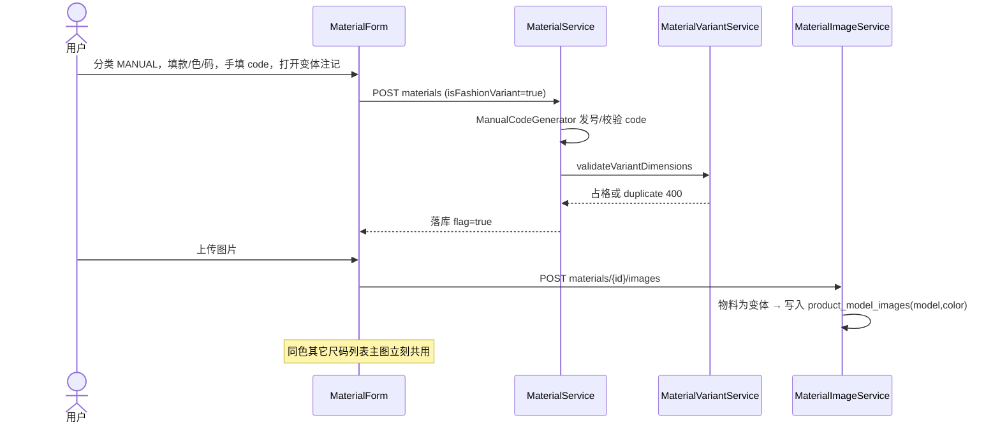

# 02. 目标流程（To-Be）

---

## 1. 职责拆分

```text
┌─ 物料分类（树）──────────────────────────────────────┐
│ code_strategy 只选发号器                               │
│   FASHION_VARIANT → 公式 A12345-A01 + 尺码流水 token   │
│   SEQUENTIAL      → 分类前缀流水                       │
│   MANUAL          → 用户录入，租户内 code 唯一         │
└────────────────────────────────────────────────────────┘
                         │ 不写入 is_fashion_variant（变体分类除外：强制 true）
                         ▼
┌─ 物料行 ─────────────────────────────────────────────┐
│ is_fashion_variant = 是否占用款×色×码那一格            │
│ true  → 变体校验、部分唯一索引、锁款号主数据、款色图   │
│ false → 款色码可为属性（OEM）；图走 material_images    │
└────────────────────────────────────────────────────────┘
```

三种合法组合：

| | 分类策略 | 注记 | 料号 | 占格 |
|---|----------|------|------|------|
| ① 自制变体 | `FASHION_VARIANT` | 强制 `true` | 公式 | 是 |
| ② OEM 挂版型 | `MANUAL` / `SEQUENTIAL` | 默认 `false` | 手工/流水 | 否 |
| ③ 客供号正品格 | `MANUAL` / `SEQUENTIAL` | 用户勾选 `true` | 手工/流水，**不改写、不发 token** | 是 |

禁止：变体分类里 `false`（公式码必须占格）。禁止：仅因 `productModelId != null` 推 `true`。

---

## 2. 注记写入

### 2.1 创建 / 更新（`MaterialServiceImpl`）

`MaterialRequest.isFashionVariant` 可空。分类策略仍决定发号器；注记单独算：

```text
requested = Boolean.TRUE.equals(request.isFashionVariant)

if strategy == FASHION_VARIANT:
    flag = true                          # 忽略请求
    FashionVariantCodeGenerator.validate + allocateCode  # 现网不变
else:
    flag = requested
    发号器仍是 MANUAL / SEQUENTIAL       # 不调用公式发号、不 persistAllocatedTokens
    if flag:
        须 productModelId、productSizeId 非空
        调用 MaterialVariantService.validateVariantDimensions
        # 含唯一、色模式、本款色、尺码组；三维不可变见 2.2
    else:
        不跑变体校验
entity.isFashionVariant = flag
```

勾选 `true` 时若该格已有另一颗 `true` → 现网 `validation.material.variant.duplicate`（或 nocolor 对应码），属资料冲突，不是系统异常。

### 2.2 三维不可变（按**目标**注记）

现网 `assertDimensionImmutable` 看 `existing.isFashionVariant`。解耦后：

- 目标 `true` 且已是完整变体 → 款/色/码不可改（与现网相同）。
- 目标 `false` → **本笔不锁**。允许同一保存里取消勾选并改尺码/颜色（纠正手误）。
- 新建：无 existing，不锁。

前端锁定用「已保存 **且表单当前注记仍为 true**」，取消勾选后字段立即解开，不必先保存。

### 2.3 组合生成

仍要求目标分类 `FASHION_VARIANT`（批量公式发号入口不变）。`EXISTS` 继续只认 `is_fashion_variant = true`，因此 ③ 占用的格子不会再生成公式 SKU。`copyImages` / `copyBom` **忽略，不实现**。

### 2.4 分类变更

本期 **维持** `strategyMismatch`：禁止在 `FASHION_VARIANT` 与 `MANUAL`/`SEQUENTIAL` 之间改分类。解耦注记不顺便开放跨策略迁类（公式码 + token 仍绑在变体分类树上）。`SEQUENTIAL` ↔ `MANUAL` 仍允许；注记保持请求值（可与原值不同，走 2.1）。

### 2.5 前端 `MaterialForm`

| | 变体分类 | 非变体分类 |
|---|----------|------------|
| 编码 | 只读建议 / 保存发号 | MANUAL 手填；SEQUENTIAL 只读流水 |
| 款色码 | 必填（现网） | 默认折叠可选 |
| 变体注记开关 | **不展示**（恒 true） | 款+码齐全时展示 Switch；默认关 |
| 开关打开后 | — | 色/码按本款池/尺码组约束（与变体分类相同）；分色则色必填 |

`completeVariant`（锁三维、锁类型等）：`Boolean(id && 当前注记为 true)`。变体分类下保存后恒锁。

---

## 3. 图片：变体款色共享

### 3.1 拥有者

```text
product_model_images
  键 = (tenant_id, product_model_id, color_id)
  color_id NULL = 本款不分色（本款颜色 0 行）
```

**不**挂 `product_model_colors.id`（整表 replace 会孤儿；不分色也没有行）。键仍是 `(model, color_id)`，与本款色池做**应用层一致性检查**（PostgreSQL 无法对「分色有行 / 不分色无行」建复合 FK）：

| 本款 `product_model_colors` | 合法 `product_model_images.color_id` | 非法 |
|------------------------------|--------------------------------------|------|
| ≥1 行（分色） | 非空且 ∈ 本款色池 | 池外色、或 NULL |
| 0 行（不分色） | 必须 NULL | 任意非空 `color_id` |

**写入**（款色上传、物料门面在注记 true 时）：不满足上表 → 400。**禁止**把 `material_images` 复制/提升进款色表。  
**本款色 replace**：**不级联删图**。顺序：① 现网变体 `in_use` → ② 若去掉的色（或从分色改回不分色时的有色键 / 从不分色改分色时的 NULL 键）仍有 `product_model_images` → 400，提示先在本款色抽屉删图。避免 replace 误触把 OSS 清掉。  
**读取**：只返回仍符合上表的行。正常路径下不应出现池外残留；若有，不展示，须运维修数，禁止用删色顺带 GC。

| 物料 | 图 |
|------|----|
| `is_fashion_variant = true` | 只读写款色图 |
| `false` | 只读写 `material_images`（本 `material_id`） |

同款同色：8 个尺码变体共用一套多图 + 一张 primary。OEM 未勾选注记的挂图不进正品款色池。

**`file_path` 禁止跨表共用。** 款色对象只活在 `{tenant}/product-model/...`；SKU 对象只活在 `{tenant}/material/{materialCode}/...`。删 SKU 图、删物料、或 `deleteImage` 打 OSS 时，不得碰到款色对象。

### 3.2 解析顺序

**物料列表 / 详情主图**

```text
if material.isFashionVariant:
    只读款色 primary（无则空，黄标缺图；不回退本 SKU 的 material_images）
else:
    本 SKU material_images primary
```

**FO/SO 样图（每个 ModelColorKey 一框）**

```text
若该键在本单出现过 is_fashion_variant = true 的物料
  → 只读 product_model_images 该 (model, color) 的 primary；无则空框
否则（仅非变体挂了该款色）
  → 本单候选 SKU 的 material_images，min(materialId) 且 is_primary
仍无 → null，模板空框
```

注记为 true 时，物料主图 / 抽屉 / 打印的图**只来自** `product_model_images`。

### 3.3 上传入口

1. **物料抽屉（主作业）**：变体 SKU 的 `MaterialImageManager` 仍调 ` /mm/materials/{id}/images`，后端按注记门面到款色表。提示：按款色共享，同色全部尺码一起变。未保存物料仍须先保存（需要 `materialId` 才能知道款色键）。款号页可在无 SKU 时先传图（入口 2）。
2. **本款色抽屉**：按色上传/删/设主图，SKU 尚未生成也可以。权限 `product-models:update`。
3. 非变体：现网物料图片 API，行为不变。

OSS：变体 `{tenantCode}/product-model/{modelCode}/{colorId|nocolor}/{ts}{ext}`。非变体仍 `{tenantCode}/material/{materialCode}/...`。

### 3.4 生命周期

| 事件 | 款色图 (`product_model_images` + 其 OSS) | 本 SKU 图 (`material_images` + 其 OSS) |
|------|------------------------------------------|----------------------------------------|
| 取消注记 `true→false` | **不删**（款色主数据；本款该色已无变体也不自动清，下一颗勾选仍可用） | 若仍有闲置行则重新展示；无行则可再传 SKU 图 |
| 勾选注记 `false→true` | **不**从 SKU 图 copy 进来。无款色图则列表/打印空，须在款色入口上传 | **保留行**（注记 true 时不读、不展示）。改回 false 仍可用。禁止两表共 path |
| 删除某个尺码 SKU | **不删**款色图 | 本 SKU 的 `material_images`（若仍有）随物料删行 + 删其 OSS |
| 本款去掉某色，该色仍有款色图 | **400**，先删图；不删 OSS | 不变 |
| 本款色仍被变体占用 | 现网 `in_use` 已禁止删色 | — |
| 删除款号 | 无物料后：若仍有款色图 → **400** 先删图；无图才删款 | — |
| 删一张款色图 | 只删该款色 `file_path` 对应对象 | 不得删 |

`true→false` 留下的款色文件**不是 OSS 孤儿**：仍有 `product_model_images` 行，本款色抽屉可见。不要为「没有变体 SKU」去 GC。

`false→true` **不做逆向 copy**。两套图各管各的：true 只读款色；false 只读本 SKU。SKU 行在 true 期间闲置但不删，避免误当成「提升失败的残留」去扫 OSS。用户要让变体看见图，只在本款色 / 变体物料门面（写的仍是 `product_model_images`）上传。

禁止把 `material_images.file_path` 指给 `product_model_images`，或运行时把 SKU 对象 copy 进 `product-model/`。

---

## 4. 时序（非变体分类勾选变体 + 传图）



变体分类路径与现网相同，只是注记仍强制 true；上传同样进款色表。
