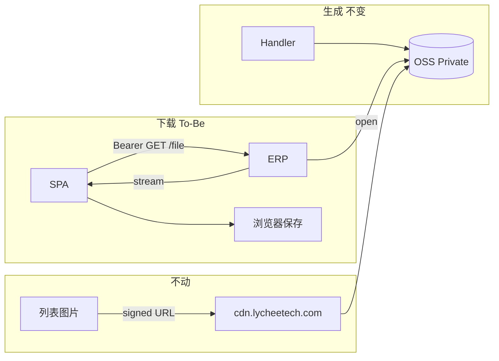

# 02. 目标流程：作业文件同源代理下载（To-Be）

> 原则：OSS 只负责存；浏览器只跟已经通的 ERP 域名要文件。  
> 图片继续 CDN。导入空模板、单据 PDF 的同源字节流是本专题的对照，不是要重做的对象。

---

## 1. 目标交付链

```text
生成（现网，不变）
  Handler.export / importData → 临时文件 → OSS

下载（本专题）
  浏览器 + Bearer → GET ERP /api/v1/report/.../{id}/file
                         │
                         ├─ 鉴权：登录 + 本人（ADMIN 例外）+ Handler 业务权限
                         ├─ 校验：COMPLETED / 未过期 / 对象存在
                         └─ StorageService.open → 流式写入 HTTP 响应
                         │
                         ▼
  前端 request(responseType: 'blob') → downloadBlob → 成功提示
```



用户日常导出：**一条网**（与列表、轮询相同）。CDN pending 不再能在作业已完成后把下载卡死。

---

## 2. 用户作业

1. 列表点导出（权限、`beforeExport` 现网不变）。
2. 小数据同步完成 / 大数据轮询至 `COMPLETED`（现网不变）。
3. 前端 **直接** `GET /export-jobs/{id}/file`（带 Authorization），不再先取 URL。
4. 响应完整到达后触发保存，再提示成功。传输期间：列表 `ExportButton` 保持 `loading`；**所有** `downloadApiFile` 调用另有全局 `message.loading`（含导出/导入中心操作列）。
5. 失败（权限、过期、OSS、超时）：`downloadApiFile` 自行提示并 **throw**（`skipErrorHandler: true`，不走会吞异常的全局 handler）。`useExportJob` 进 `catch`，**不出现成功文案**。
6. 导出中心「下载」走同一 `GET /file`；传输中有 loading，禁止无反馈连点。

导入：结果 Modal「下载错误报告」、导入中心「源文件 / 错误报告」同样改代理；模板下载已是同源，只复用同一工具函数。

与现行对比：

| 步骤 | As-Is | To-Be |
|------|-------|-------|
| 文件生成 | OSS | OSS（不变） |
| 取文件 | 签发 CDN URL + iframe | `GET /file` + blob |
| 成功提示 | URL 到手即成功 | blob 落盘后成功 |
| 失败可见性 | CDN 挂了无提示 | HTTP 错误由 `downloadApiFile` 解析并 throw；无成功 toast |
| 导出中心 | 再签发一次 CDN，点完无反馈 | 再走一次 `/file`；`message.loading` 至结束 |
| 图片 | CDN | CDN（不变） |

---

## 3. 页面与组件（无新菜单）

不新增页面、权限码、作业类型。改调用点：

| 入口 | 现网 | To-Be |
|------|------|-------|
| `useExportJob.downloadJobFile` | `getExportJobDownloadUrl` + `downloadByUrl` | `downloadExportJobFile(id)` |
| 导出中心操作列 | 同上 | 同上工具函数 |
| `useImportJob.downloadErrorReport` | `getImportJobErrorReportUrl` + `downloadByUrl` | `downloadImportJobErrorReport(id)` |
| 导入中心源文件 / 错误报告 | source-url / error-report-url | `downloadImportJobSource` / `downloadImportJobErrorReport` |
| 导入模板 | 已是 blob | 抽到共用 `downloadApiFile`，行为不变 |

`ExportButton` / `ExcelImportButton` 对外 props 不变。

---

## 4. 下载语义

### 4.1 何时允许下

与现网签发条件对齐，只是改为开流：

| 对象 | 条件 |
|------|------|
| 导出文件 | `COMPLETED` + `filePath` 非空 + 未过期 |
| 导入源文件 | `sourceFilePath` 非空 + 未过期（创建后即有源文件） |
| 导入错误报告 | `COMPLETED` + `errorReportFilePath` 非空 + 未过期 |

RUNNING / PENDING / FAILED：现网校验 key，整段 JSON 错误，不开始流。

### 4.2 响应形态

**禁止**再包 `ApiResponse<T>`（与 PDF、导入模板一致）。成功是原始字节：

```text
200
Content-Type: 由 Handler.fileFormat() / 固定 xlsx
Content-Disposition: attachment; filename*=UTF-8''...
Content-Length: job.fileSize（有则带，便于浏览器进度）
Body: OSS 对象流
```

文件名用作业表上的 `fileName` / `sourceFileName` / `errorReportFileName`。**空或空白时必须 fallback**（`{jobType}` + `fileFormat` 副档名，导入用 `.xlsx`），禁止把 null 传给 `ContentDisposition.filename`（Spring 会 `IllegalArgumentException` → 500）。不要依赖 OSS 对象元数据（代理层自己写头）。

### 4.3 鉴权与审计

与现网 download-url 同一套，从「签发」挪到「开流」：

- Controller：`isAuthenticated()`（列表页导出用户未必有 `/report/export-jobs:read`）
- 服务层：本人；`ROLE_ADMIN` 例外；按 `jobType` 重验 Handler `requiredAuthority`
- 越权 404
- `log.info` 在 **open 成功、即将写响应时** 打（仍无法保证客户端收完，但比签发更接近真实下载）

### 4.4 删除旧入口

本波 **删除**（Controller + FE），避免两套交付并存：

```text
GET /api/v1/report/export-jobs/{id}/download-url
GET /api/v1/report/import-jobs/{id}/source-url
GET /api/v1/report/import-jobs/{id}/error-report-url
```

`StorageService.generateSignedUrl` **保留**，图片继续用。

---

## 5. 前端要点

### 5.1 共用 `downloadApiFile`

对照 **`requestPdfBlob`**（`src/utils/request-pdf-blob.ts`），**不要**对照普通 JSON `request`。

现网 `requestConfig.errorHandler`：展示通知后 `return`，不 re-throw。未设 `skipErrorHandler: true` 时，4xx/5xx 的 `await request()` **resolve 为 undefined**，随后 `message.success` 仍会执行 → 假成功重现。

锁定请求选项：

```text
method: 'GET'
responseType: 'blob'
getResponse: true
timeout: 300_000
skipErrorHandler: true          // 必须。让 promise reject，并避免 handler 先弹窗再吞掉
```

函数内顺序：

1. `message.loading({ key: 'job-file-download', duration: 0 })`（文案 `component.export.downloading`）
2. `request` 如上
3. HTTP 错误或 `Content-Type` 为 JSON / 非附件 MIME：把 Blob 解析为 API JSON，`message.error`（或 `notification.error`）后 **throw**（可抽类似 `toPdfRequestError` 的附件版，不要调用 `assertPdfBlob`）
4. 成功：`parseFileNameFromContentDisposition` → `downloadBlob`
5. `finally`：`message.destroy('job-file-download')`

`skipErrorHandler` 之后全局 handler **不会**弹窗，错误 UI 必须由本函数负责，再 throw，好让 `useExportJob` 的 `catch` 拦住成功 toast。

不要用 `iframe` / `<a href>` 打 `/file`：该请求必须带 Bearer。

导出/导入中心无行级 loading：全局 `message.loading` 负责反馈；**连点去重**放在 `downloadApiFile` 的 in-flight Promise Map（同一 URL join，禁止空 `return`）。不必再做 `downloadingId`。

catch 无 HTTP 响应时（Axios `ECONNABORTED`、断网）`error.response` 为 undefined，必须先可选链再读 Blob，见 [03](./03-schema设计.md) §5 / [04](./04-实施清单.md) §3.2。

### 5.2 `useExportJob` 状态

- `downloadJobFile` 改为 `await downloadExportJobFile(id)`
- **成功 toast 仅在 await 正常结束后**；`catch` 只终止流程（错误已由 `downloadApiFile` 提示）。现网 catch 注释「请求错误已由全局 errorHandler 提示」在 `skipErrorHandler` 下不再成立，须改注释以免后人删掉 throw
- `exporting` 覆盖「建作业 + 轮询 + 拉文件」全过程；传输未完按钮不可再点
- 轮询超时文案仍可指向导出中心；中心下载已是同源，这条引导重新成立
- 成功文案可保留「导出完成，文件已开始下载」——此时 blob 已交给浏览器

### 5.3 `downloadByUrl`

作业文件不再调用。若全库无引用则 **删除** 函数及 iframe / 60s 清理。  
`config.ts` 里 CDN `preconnect` **保留**（图片）。

---

## 6. 应用与网关

### 6.1 后端流式

**锁定 `StreamingResponseBody`，禁止 `InputStreamResource`。**

原因：`InputStreamResource.isOpen()` 恒为 true，`contentLength()` 会抛 `IllegalStateException`；`ResourceHttpMessageConverter` 常因此写不出 `Content-Length`，浏览器没有总大小。流关闭也绑在 Converter 的 finally 上，客户端中断时时机不直观。

```java
return ResponseEntity.ok()
        .contentType(MediaType.parseMediaType(download.contentType()))
        .header(HttpHeaders.CONTENT_DISPOSITION, disposition.toString())
        // contentLength 仅在 job.fileSize != null 时设置（primitive，禁止传 null）
        .contentLength(download.contentLength())
        .body((StreamingResponseBody) outputStream -> {
            try (InputStream in = download.content()) {
                in.transferTo(outputStream);
            }
        });
```

- `try-with-resources` 覆盖传完与异常/客户端断开，`close()` 走到现网 `open()` wrapper 的 `ossClient.shutdown()`
- **禁止** `ByteArrayOutputStream` / `byte[]` 把整对象读进堆（导入模板可以，作业文件不行）
- 服务层先校验并 `open` 成功，再返回 `ResponseEntity`；OSS 缺失必须在写 body 之前变成 JSON 400
- Controller **不要**在 return 前关掉 `download.content()`
- 不占 `exportTaskExecutor`；这是 HTTP 响应写出

`StreamingResponseBody` 会启用 Servlet 异步。必须同时配 Spring 超时，否则 Tomcat 默认约 30s 会抛 `AsyncRequestTimeoutException`，Nginx/前端的 300s 无效。见 §6.3。

### 6.2 Nginx

**不要**为作业下载再拆 `location ~` 正则。正则 `location` 里 `proxy_pass` 若带 URI（现网是 `http://backend:9000/api/;`）会 `nginx -t` 失败：`proxy_pass cannot have URI part in location given by regular expression`。

只改两个 server 已有的 `location /api/`：

```text
proxy_read_timeout 300s;
proxy_send_timeout 300s;
```

`lycheetech.com` 与 `khh.lycheetech.com` 各一份，禁止只改一个 host。现网未设，默认读超时 60s。加在通用 `/api/` 上同时保护其它慢查询，足够稳妥。不强制 `proxy_buffering off`。

### 6.3 Spring MVC 异步超时（必须，与 Nginx/前端对齐）

`StreamingResponseBody` 触发 Servlet 3 异步。`spring.mvc.async.request-timeout` 默认 `-1`，实际是 **Tomcat 异步超时约 30s**。20 万行 xlsx 或越南慢网（例如 200KB/s × 20MB ≈ 100s）会在第 30 秒被 `AsyncRequestTimeoutException` 掐断——此时 Nginx 与 Axios 的 300s 尚未生效。

`lychee-erp/src/main/resources/application.yaml`：

```yaml
spring:
  mvc:
    async:
      request-timeout: 300000   # 300s，毫秒
```

三层必须同为 300s：Spring 异步 / Nginx `proxy_read_timeout` / 前端 `timeout: 300_000`。不要用 `server.tomcat.connection-timeout` 代替。

---

## 7. API 一览（相对现网）

导出 `/api/v1/report/export-jobs`：

| 方法 | 路径 | 本波 |
|------|------|------|
| POST `/`、GET `/{id}`、POST `/page`、DELETE `/bulk-delete` | 不变 |
| GET `/{id}/file` | **新增**，原始附件流 |
| GET `/{id}/download-url` | **删除** |

导入 `/api/v1/report/import-jobs`：

| 方法 | 路径 | 本波 |
|------|------|------|
| GET `/templates/{jobType}`、POST `/`、GET `/{id}`、POST `/page`、DELETE `/bulk-delete` | 不变 |
| GET `/{id}/source` | **新增**，源文件流 |
| GET `/{id}/error-report` | **新增**，错误报告流 |
| GET `/{id}/source-url`、`/{id}/error-report-url` | **删除** |

契约细节见 [03](./03-schema设计.md)。

---

## 8. 明确不做

| 不做 | 原因 |
|------|------|
| 改 OSS 前缀 / 生命周期 / 作业表 | 存储层正确 |
| 图片改走应用代理 | CDN 对该流量有命中；`` 需要签名 URL |
| 保留 download-url 作降级 | 双路径会让故障复现；与 PLO「旧 convert 同期删除」相同 |
| OSS 预签名直链（绕过 CDN） | 仍跨域、仍是第二条网 |
| `fetch` 流式写入磁盘 / File System Access | 浏览器支持差；几十 MB blob 可接受 |
| 下载百分比进度条 | 有 `Content-Length` 时浏览器自己有；应用内只用 `message.loading` |
| 邮件把报表当附件外发 | 仍可继续用 OSS；不在本专题 |
| 修阿里云 CDN 覆盖 / 海外加速 | 运维可并行，不替代同源交付 |

---

## 9. 作业路径验收（纸面）

1. 列表导出小数据：无 download-url 请求；有 `GET .../file`；本地出现 xlsx  
2. 列表导出异步：轮询 COMPLETED 后自动 `GET /file`，loading 持续到文件开始保存  
3. CDN 人为不可达时，导出仍能完成（只要 ERP→OSS 通）  
4. 导出中心下载同一路径  
5. 未完成 / 过期 / 他人作业：JSON 错误，不生成损坏 xlsx  
6. 导入错误报告、源文件、空模板均可下  
7. 物料图片仍走 `cdn.lycheetech.com`  
8. 网络里不再出现作业文件的 `download-url` / `auth_key`  
9. 下载失败有错误提示，且无成功 toast（含 400/404；禁止「错误弹窗 + 绿色成功」并存）  
10. 传输中再点导出：按钮仍 loading，不建第二份作业  
11. 导出/导入中心点下载：出现「正在下载」；同一 URL 连点只有一条 `/file`  
12. `fileName` 为空时仍 200，Disposition 有 fallback 文件名  
13. `application.yaml` 已设 `spring.mvc.async.request-timeout: 300000`  
