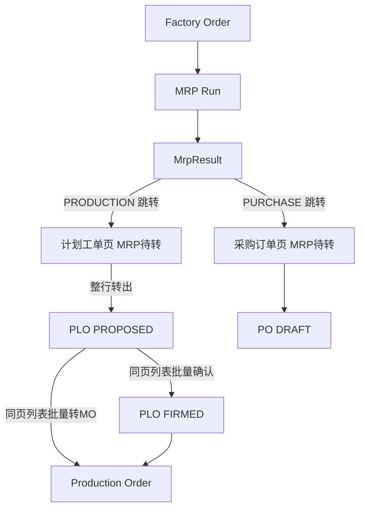

# 02. 目标流程：计划工单作业台（To-Be）

> 原则：单据链不变；计划员日常收敛到「计划工单页（MRP 待转 Tab + 计划工单列表）」。  
> 采购对照：[`../20260825-purchase/02-目标流程.md`](../20260825-purchase/02-目标流程.md) §1–§2。  
> 工具栏对照：`sales-orders/index.tsx` 的 `hasUniformStatus` + `ExecuteButton` + `tableAlertRender`。

---

## 1. 目标单据链（与现网相同）

```text
                    ┌─ PRODUCTION ─→ PLO ─→ MO
FO ─→ MRP ─→ MrpResult
                    └─ PURCHASE ──→ 采购订单页 MRP 待转 ─→ PO   （已有，不变）
```

变化的是**谁在哪张页面点转单**，不是中间少一张单。



计划员日常生产建议：**一个作业页**（待转 + 已转 PLO），不再打开 MRP 结果去 POST，也不再逐行点「更多」。

---

## 2. 计划员作业

1. （可选）MRP 结果滤「建议生产」，点「前往 MRP 转计划工单」→ `/pp/planned-orders?tab=mrp`（可带 `factoryId`）。无 `/pp/planned-orders:update` 时禁用并提示无权限。
2. 或直接打开计划工单页，切 **MRP 待转** Tab。
3. 看到该范围**最新 OPERATIVE Run** 上未转的 `PRODUCTION` 结果：物料、工厂、建议量、需求日、计划起止、Run 编号、是否因已有锁定 PLO 不可转。
4. 勾选可转行，确认后整行生成 `PROPOSED` PLO（1 结果 : 1 PLO）。
5. 切 **计划工单** Tab（同页，不必换菜单）：勾选后批量确认 / 转 MO / 删除。改数量日期仍进行表编辑（保存即 FIRMED，现网不变）。

与现行对比：

| 步骤 | As-Is | To-Be |
|------|-------|-------|
| 找到待转生产建议 | 打开某次 Run 的结果，滤 PRODUCTION | PLO 页待转 Tab，自动最新 Run |
| 转 PLO | 结果页勾选 POST | 待转 Tab 勾选 POST |
| 确认 / 转 MO | 行内更多，一次一条 | 工具栏智能批量（规则同现网状态机） |
| 历史 Run | 仍可从该 Run 转出 | 结果只读；转单只走最新 Run |

MRP 结果列表的 PRODUCTION 按钮 **跳转**，与 PURCHASE 对称。**不要**在结果页继续提供「转计划单」提交。

---

## 3. 页面结构

`/pp/planned-orders` 使用 `PageContainer.tabList`，不另挂菜单。

| Tab key | 查询参数 | 内容 |
|---------|----------|------|
| `orders` | 无 `tab` 或 `tab` 缺省 | 现网 PLO 列表 + 智能批量工具栏（默认） |
| `mrp` | `?tab=mrp` | MRP 生产待转工作台 |

`factoryId` 查询参数：仅待转 Tab 用作搜索表单初值（与采购工作台相同），不隐藏其它工厂的已有 PLO。

```text
type PlannedOrderWorkspace = 'orders' | 'mrp'
```

切换 Tab 用 `setSearchParams({ replace: true })`。当前 Tab **从 `searchParams.get('tab')` 派生**，不要抄采购页 `useState` 只在 mount 读一次 URL。否则结果页跳转、侧栏再点同一路由、浏览器前进后退时，Tab 与 URL 会脱节。

---

## 4. MRP 待转 Tab

### 4.1 准入（列出）

与采购待转同一套「该厂最新 Run」定义，见 [`../20260825-purchase/04-实施清单.md`](../20260825-purchase/04-实施清单.md) §3.2：

```text
COMPLETED + OPERATIVE
AND (factory_id = 该行工厂 OR factory_id IS NULL)
按 id 倒序取 1 条
```

列出同时满足：

- `suggestedActionType = PRODUCTION`
- `convertStatus = OPEN`（生产无 PARTIAL；`remaining = required`）
- `mrpRunId` = 该行工厂的最新覆盖 Run

不把历史 Run、PURCHASE、已转结果放进待转池。跨工厂一次提交允许，按行校验各自最新 Run。

### 4.2 行是否可勾选

| 条件 | 勾选 |
|------|------|
| OPEN + 最新 Run + 无保护 PLO | 可 |
| 需求 FO 上已有同物料 FIRMED/CONVERTED PLO（现网 `hasProtectedOrder`） | **禁用**；列或 tooltip 说明「需求已有锁定/已转计划单」 |

禁止再静默 skip：提交里若仍含不可转行（并发锁定），**整批失败**，一条 PLO 都不建。

### 4.3 转单规则（与现网 `convertToPlannedOrders` 相同）

- 整行：`convertedQuantity += requiredQuantity` → `CONVERTED`
- PLO：`MAKE` / `PROPOSED` / 数量与起止日抄结果 / 写 `mrpRunId`
- Pegging：`demand=MRP_RESULT`，`supply=PLANNED_ORDER`，`peggedQuantity=requiredQuantity`
- **不在工作台改数量、日期、供应商、单位**。要改，先转出再打开 PLO 表单（保存即 FIRMED）
- **不预览拆单**：生产无供应商分组，1:1 出 PLO，用 `ExecuteButton` 确认即可（不必采购那种分组 Modal）
- 返回新建 PLO 列表（至少 `id` / `orderNo`），成功文案带单号
- 提交前对 `mrpResultId` **升序**加锁，同事务内按 `factoryId` 缓存最新 Run（见 [04](./04-实施清单.md) §3.1）

### 4.4 工作台列与工具栏

只读列：工厂、物料、基本单位、建议量、需求日、计划开始、计划结束、Run 编号、转换状态、保护原因（不可转时）。  
可 Pegging：`sourceType=MRP_RESULT`，`sourceId=record.mrpResultId`（DTO 没有 `id`，不要传 `record.id`）。  
`rowKey="mrpResultId"`。  
工具栏：转计划工单（无勾选禁用；含不可转行禁用）。`ExecuteButton` 确认文案用 `convertConfirmTitle` / `convertConfirmContent`（带 `{count}`）。搜索走 `MrpResult` 字段：`factoryId`、`material.code_or_name`、日期；**禁止**抄 PLO 列表的 `productMaterial.*`。

无新增、无行内编辑。单位只展示物料基本单位，不可改。

### 4.5 回退

维持现网：删除 **PROPOSED** PLO → 回减 `convertedQuantity` → 结果回到 OPEN → 再次出现在待转池（若仍是最新 Run）。  
FIRMED / CONVERTED 删除规则不变（CONVERTED 不可删）。

---

## 5. 计划工单 Tab：智能批量

行内不再提供确认 / 取消确认 / 转 MO / 删除。这些全部上到工具栏。  
行内保留：**编辑**（双击 / 操作列）、**Pegging**。CONVERTED 仍不可编、checkbox 禁用。

不提供「新增」。OUTSOURCE 若出现在列表：不可转 MO（现网）；确认/取消确认/删除规则与 MAKE 相同。

### 5.1 按钮启用（对**当前勾选**计算，空选全部禁用）

用现网 `getPlannedOrderRowActions` 的规则做「全部满足才亮」，不要误用「必须同一状态」去卡转 MO / 删除。

| 按钮 | 启用条件 | 提交前再断言 |
|------|----------|--------------|
| 确认计划 | 全部 `PROPOSED` | `assertBulkStatus(..., 'PROPOSED')` |
| 取消确定 | 全部 `FIRMED` | `assertBulkStatus(..., 'FIRMED')` |
| 转生产工单 | 全部 `MAKE` 且状态 ∈ {PROPOSED, FIRMED}（**允许混态**） | 前端按行规则再挡一层；后端维持整批失败 |
| 批量删除 | 全部状态 ≠ CONVERTED（**允许 PROPOSED+FIRMED 混选**） | 后端已拒 CONVERTED |

混选 PROPOSED+FIRMED 时：确认 / 取消确定禁用并 tooltip；转 MO 与删除仍可用。这与销售订单「确认只吃 DRAFT」不同，因为转 MO 本来就允许两种来源状态。

`tableAlertRender` 使用 `renderBulkStatusTableAlert(selectedRows, 'orderStatus', enums?.PlannedOrderStatus)`。混态时的「状态不一致」提示仍显示，但**不要**据此禁用转 MO / 删除。

空选 tooltip：`pages.common.noRowsSelected`。  
确认 / 取消确定在有选但不均匀时：沿用/补充 `pages.pp.plannedOrders.bulkFirmProposedOnly` 与 `bulkUnfirmFirmedOnly`。  
转 MO 非法时：`pages.pp.plannedOrders.bulkConvertMakeOpenOnly`（非 MAKE 或含 CONVERTED）。  
删除非法时：`pages.common.bulkDeleteDraftOnly` 不套用（PLO 无 DRAFT）；用 `pages.pp.plannedOrders.bulkDeleteConvertedForbidden`。

样式对齐销售订单：确认 `color="green" variant="solid"`；取消确定 `danger`；转 MO 用现网 `ExecuteButton` 主按钮（`textId=pages.pp.plannedOrders.convertToMo`）。

### 5.2 后端收紧（行为与工具栏一致）

现网 firm/unfirm **静默忽略**非法 id。To-Be：

- `bulk-firm`：任一非 PROPOSED → `ValidationException`，整批不改
- `bulk-unfirm`：任一非 FIRMED → 整批不改
- `bulk-convert-to-mo` / `bulk-delete`：保持现网整批失败

禁止再出现「点了成功但只改了一部分」。

### 5.3 转 MO 语义（不变）

- PROPOSED 可直接转 MO（现网如此）。修正 tooltip，不要写成必须先 FIRMED
- 仍整单数量、按开工日匹配 BOM、写 PLO→MO pegging、回写 FO 分配
- 不在工具栏预览 MO 号；成功后 `reload` + 通用成功提示即可。若后端已返回 MO 列表可带单号，非必须

---

## 6. API

权限一律 `/pp/planned-orders:update`（与现网 firm / convert-to-mo 相同）。待转列表只读可用 `:read`。

### 6.1 待转分页

```text
POST /api/v1/pp/planned-orders/pending-mrp-items/page
```

请求：标准 `ProPageRequest`（可含 `factoryId`、物料、日期）。  
响应：`PendingMrpProductionItemResponse[]`（字段见 [03](./03-schema设计.md)）。

实现放在 PP 内（不必 Remote DTO 跨模块）：

- 待转分页：`MrpService.findPendingProductionItems`（与 `findPendingPurchaseItems` 同构，谓词改成 `PRODUCTION` + `OPEN`）
- 转单：`MrpConversionService.convertToPlannedOrders` 收口
- `PlannedOrderController` 只挂路由并注入上述两个服务；**不要**把 `MrpResult` Specification 写进 `PlannedOrderService`

### 6.2 从建议转 PLO

```text
POST /api/v1/pp/planned-orders/from-mrp-results
Body: Set<Long> mrpResultIds
```

- 空集合：空操作
- 先把 id **升序**，再逐条 `findByIdForUpdate`（交叉勾选时防死锁）
- 校验 PRODUCTION、OPEN、最新 Run、非保护 → 走现网建 PLO + pegging + `applyConvertedQuantity`
- 最新 Run：同事务按 `factoryId` 缓存，不要每行再查一遍
- 全部成功才提交；返回 `List<PlannedOrderResponse>`
- 并发已被转：按现网数量校验失败（`convert.exceeds.remaining` / 非 OPEN）

`MrpConversionService.convertToPlannedOrders` 收口到此路径：补上最新 Run 与保护失败，去掉静默 skip。

### 6.3 删除旧入口

```text
POST /api/v1/pp/mrp-runs/{id}/results/convert-to-planned-orders
```

本波 **删除**（Controller + FE `convertToPlannedOrders`）。避免结果页与工作台两处可转。  
结果分页 API 保留，供 Run 详情只读。

### 6.4 现网 PLO API

`/page`、`PUT /{id}`、`/bulk-delete`、`/bulk-firm`、`/bulk-unfirm`、`/bulk-convert-to-mo` 路径不变；firm/unfirm 校验见 §5.2。

---

## 7. 前端要点

### 7.1 计划工单页

- `useSearchParams` 解析 `tab` / `factoryId`。Tab **受控于 URL**（§3），只抄采购页的 `PageContainer.tabList` 与 `setSearchParams({ replace: true })`，不要抄它的 `useState(workspace)` 初始化
- `orders`：把 `columns.tsx` 收到 `columns/plannedOrderMain.tsx`（符合页面规范）；工具栏按 §5.1
- `mrp`：新组件 `components/MrpProductionWorkbench.tsx`（不要复用采购工作台；无供应商/单价/部分转）
- 转单成功：清空勾选、reload 待转表；**不要强制切到 orders**（与采购成功后留在待转一致）
- 空选必须让转 MO / 删除也禁用：`[].every(...)` 在 JS 里是 `true`，见 [04](./04-实施清单.md) §3.3
- i18n：`en-US` / `vi-VN` / `zh-CN`

### 7.2 MRP 结果页

PRODUCTION 工具栏改为与 PURCHASE 相同的跳转按钮：

- `pathName="/pp/planned-orders"`，`accessAction="update"`
- `showConfirm={false}`
- `history.push(factoryId ? /pp/planned-orders?tab=mrp&factoryId= : /pp/planned-orders?tab=mrp)`
- 去掉 rowSelection（PRODUCTION 不再在此勾选）
- `ALL` 提示改为「请选择建议类型以进入对应工作台」（采购 / 生产都是跳转）

### 7.3 行内更多

`PlannedOrderMoreActionsButton` 只留 Pegging。若只剩一项，可改为 `buildActions({ onPegging })`，删除下拉。  
`getPlannedOrderRowActions` 继续给工具栏复用（批量启用），不要删。

---

## 8. 明确不做

| 不做 | 原因 |
|------|------|
| MRP 算完自动转 PLO | 单据链确认门；PROPOSED 下轮仍清 |
| 待转 Tab 直接出 MO / 自动 FIRMED | 跳过计划层 |
| 生产部分转、改建议量再转 | 与现网整行约定冲突；改量走 PLO 表单 |
| 待转池跨多个 Run | 与采购已锁决策一致 |
| 手建 PLO、OUTSOURCE 工作台 | 本期无入口 |
| 新菜单 / 新权限码 | 沿用计划工单 update/read |
| 改清理、供给、Pegging 模型 | 现网正确 |

---

## 9. 作业路径验收（纸面）

1. 最新 OPERATIVE Run 有 OPEN 生产建议 → 待转 Tab 看得到  
2. 结果页 PRODUCTION → 跳到 `?tab=mrp`，不再 POST convert  
3. 勾选转出 → PROPOSED PLO + 结果 CONVERTED + pegging  
4. 同页 `orders` 勾选多条 PROPOSED → 批量确认 / 或直接批量转 MO  
5. PROPOSED+FIRMED 混选：确认禁用，转 MO 可用  
6. 已有 FIRMED PLO 的 FO 需求：待转行不可勾，提交也不会静默成功  
7. 再跑 Regenerative：未确认 PLO 仍被清；FIRMED 仍占供给  
8. 采购待转路径不受影响  
9. 空选：确认 / 取消确定 / 转 MO / 删除全部禁用  
10. `?tab=mrp` 深链与结果页跳转都能落到待转 Tab（Tab 跟 URL）  
