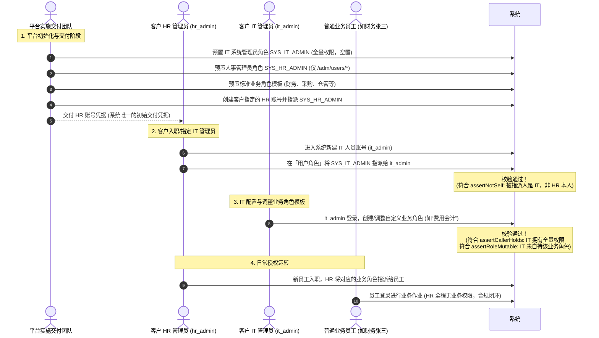
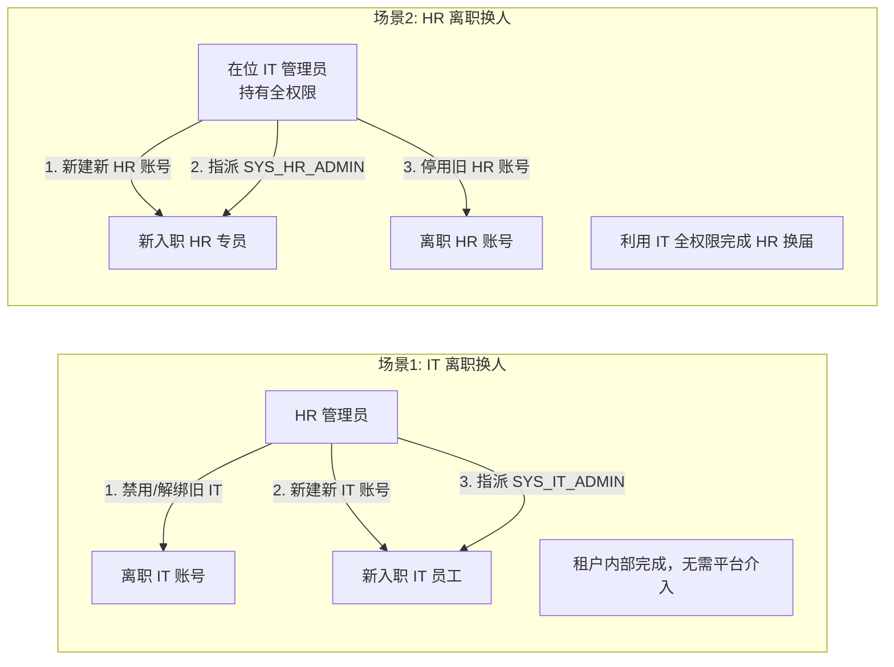

# 权限系统现状与交付运维指南

> 本文档用于系统性记录系统在完成 **P0 安全加固** 后的权限运行模型、管理限制、交付与初始化方案、管理职责分离（SoD）边界及常见风险防范。  
> 关联问题评估与长远路线见 [01-现状与问题.md](./01-现状与问题.md)。

---

## 目录
- [一、权限架构运行现状 (P0 落地后)](#一权限架构运行现状-p0-落地后)
  - [1. 权限判定与数据结构](#1-权限判定与数据结构)
  - [2. 关键安全边界与防护拦截](#2-关键安全边界与防护拦截)
- [二、三大硬性管理限制解析](#二三大硬性管理限制解析)
  - [限制 1：不能把角色分给自己 (assertNotSelf)](#限制-1不能把角色分给自己-assertnotself)
  - [限制 2：不能改自己正在持有的角色功能 (assertRoleMutable)](#限制-2不能改自己正在持有的角色功能-assertrolemutable)
  - [限制 3：只能授出自己已拥有的功能 (assertCallerHolds)](#限制-3只能授出自己已拥有的功能-assertcallerholds)
- [三、平台交付客户方案（HR 指定 IT 自治闭环）](#三平台交付客户方案hr-指定-it-自治闭环)
  - [1. 核心设计思想：平台不绑定具体 IT 个人](#1-核心设计思想平台不绑定具体-it-个人)
  - [2. 标准角色与账号规划](#2-标准角色与账号规划)
  - [3. 交付与初始化 SOP](#3-交付与初始化-sop)
  - [4. 人员更迭与租户自治（IT/HR 离职交接）](#4-人员更迭与租户自治ithr-离职交接)
  - [5. 系统发版与权限更新保障](#5-系统发版与权限更新保障)
- [四、职责分离（SoD）：权限管理者与业务作业隔离](#四职责分离sod权限管理者与业务作业隔离)
  - [1. 核心诉求](#1-核心诉求)
  - [2. 现有机制实现方案（方案 A：角色模板化 + 纯安全/HR管理员）](#2-现有机制实现方案方案-a角色模板化--纯安全hr管理员)
  - [3. 为什么不能让业务主管自行维护角色（方案 B 风险评估）](#3-为什么不能让业务主管自行维护角色方案-b-风险评估)
- [五、平台兜底机制与应急运维 (Break-Glass)](#五平台兜底机制与应急运维-break-glass)

---

## 一、权限架构运行现状 (P0 落地后)

在完成 P0 安全加固后，ADM 权限模块修补了严重的自提权、目录篡改与认证漏洞，形成了如下闭环机制：

### 1. 权限判定与数据结构

```text
[用户 User]
    │
    ▼ (多对多：user_roles，具备 isActive、expiresAt、assignedBy 审计)
[角色 Role] (具备 activeStatus、isSystem 保护标记)
    │
    ▼ (多对多：role_permissions，按租户隔离)
[权限 Permission] (由 menu_id + action_option_id 组合)
    │
    ├─► [菜单 Menu]：具备 path (如 /fi/journal-entries，只读不可篡改)
    └─► [动作选项 OptionValue]：PERMISSION_ACTION (read/create/update/delete/approve/unapprove/post/reverse/void)
```

用户登录时，`AuthenticationCacheServiceImpl` 动态加载其有效角色名下所有未过期、激活的菜单与动作，组合成形如：
`/fi/journal-entries:post`、`/scm/purchase-orders:approve` 的授权字符串注入 Spring Security。

### 2. 关键安全边界与防护拦截

| 控制面 | 涉及代码 | 防护效果 |
| :--- | :--- | :--- |
| **API 默认防护** | `AuthorizationRuleInterceptor` + `@PreAuthorize` | 控制器所有 Handler 强制要求权限注解，无注解请求直接 500/403 阻断 |
| **JWT 安全校验** | `MultiTenantJwtDecoder` | 严格校验 Issuer 白名单（仅信任配置的 Keycloak 地址且租户处于 ACTIVE 状态）；强制校验 `azp`/`aud`；防止伪造与 SSRF |
| **租户管理隔离** | `TenantController` + `PlatformSecurity` | 租户层 CRUD 必须由配置在 `lychee.security.platform-admins` 的平台管理员身份执行，租户普通用户无权跨租户操作 |
| **目录防篡改** | `MenuServiceImpl` + `OptionValueServiceImpl` | 菜单的 `path` 禁止修改；`PERMISSION_ACTION` 分类及其字典值锁定为 `is_system = true`，租户端不可增删改 |
| **指派与时效** | `findActivePermissionsByUserId` | 严格过滤 `isActive = true`、未到 `expiresAt`、角色与菜单均为 `ACTIVE` 的权限记录 |

---

## 二、三大硬性管理限制解析

为了防止授权过程中的特权蔓延与自授权闭环，系统在服务层强校验了三条关键防线：

```mermaid
flowchart TD
    subgraph 操作1: 用户角色指派 [UserRoleController.createUserRole]
        Op1[为用户指派角色] --> C1{被指派人 == 调用者本人?}
        C1 -- 是 --> Deny1[抛出: validation.user.role.self.forbidden<br/>禁止给自己分角色]
        C1 -- 否 --> Allow1[允许分配角色给他人<br/>(调用者无需持有该角色的业务权限)]
    end

    subgraph 操作2: 角色功能配置 [RolePermissionController.updateRolePermission]
        Op2[编辑角色的功能权限] --> C2{目标角色是系统保护角色?}
        C2 -- 是 --> Deny2A[抛出: validation.role.system.protected]
        C2 -- 否 --> C3{调用者本人当前持有该角色?}
        C3 -- 是 --> Deny2B[抛出: validation.role.permission.self.forbidden<br/>禁止改自己正在持有的角色]
        C3 -- 否 --> C4{勾选的权限 ⊆ 调用者当前拥有的权限?}
        C4 -- 否 --> Deny2C[抛出: validation.role.permission.not.held<br/>只能授出自己已拥有的功能]
        C4 -- 刻 --> Allow2[允许更新角色权限]
    end
```

### 限制 1：不能把角色分给自己 (assertNotSelf)
- **实现位置**：`UserRoleServiceImpl.assertNotSelf(userId)`
- **核心逻辑**：检查 `Objects.equals(userId, CurrentTenant.userId())`，禁止对当前登录用户自身添加、更新或批量删除角色。
- **业务目的**：防自提权。持有人事/用户指派权的操作者，无法暗中把“财务总监”、“系统管理员”等特权角色挂到自己账号下。

### 限制 2：不能改自己正在持有的角色功能 (assertRoleMutable)
- **实现位置**：`RolePermissionServiceImpl.assertRoleMutable(roleId)`
- **核心逻辑**：检查当前登录用户当前有效持有的所有角色，若被编辑的 `roleId` 在其中，或者被编辑的角色为 `is_system = true`，直接拒绝。
- **业务目的**：防在位篡改。即使操作者持有角色的编辑权限（`/adm/roles:update`），他也无法在运行时向自己正在使用的角色中追加新的高危权限。

### 限制 3：只能授出自己已拥有的功能 (assertCallerHolds)
- **实现位置**：`RolePermissionServiceImpl.assertCallerHolds(permissions)`
- **核心逻辑**：检查被配置进角色的所有 `permission_id`，必须全量包含在调用者当前有效持有的权限集合中（通过 `findActivePermissionsByUserId`）。
- **业务目的**：遵循安全委托（Delegation）原则。操作者无法凭空给他人配置自己都不具备的业务功能，杜绝通过角色设计越权扩大权限。

---

## 三、平台交付客户方案（HR 指定 IT 自治闭环）

### 1. 核心设计思想：平台不绑定具体 IT 个人

在企业管理实务中：
1. **IT 人员变动频繁**：交付前绑定的 IT 人员可能在上线期调整、离职或转岗；
2. **组织权责归位**：系统内“谁是合法的 IT 人员”应由客户企业的人事（HR）或企业高管依据内部组织编制来指定，而非由外部软件平台开发商越俎代庖。

因此，平台在向客户交付时，**不交付任何绑定了具体人员的超级管理员账号**，而是交付一套**“预置空置超管角色 + 交付指定 HR 管理员账号”**的自治体系。

### 2. 标准角色与账号规划

| 标识 | 类型 | 角色编码 (`code`) | 界面显示名称 (`name`) | 权限边界 | 交付时的状态 |
| :--- | :--- | :--- | :--- | :--- | :--- |
| **IT 系统管理员角色** | 系统级角色 (`is_system=true`) | **`SYS_IT_ADMIN`** | **IT 系统管理员** | 包含当前租户下的**全量菜单与动作权限**（全集功能池） | **空置角色**<br/>（平台不绑定具体人员，等待 HR 指派给 IT 工程师） |
| **人事管理角色** | 系统级角色 (`is_system=true`) | **`SYS_HR_ADMIN`** | **人事管理员** | **仅拥有用户管理全权**：<br/>`/adm/users:read`<br/>`/adm/users:create`<br/>`/adm/users:update`<br/>`/adm/users:delete`<br/>*（零业务权限，无 `/fi/*`、无 `/scm/*` 等）* | **交付绑定账号**<br/>交付时直接授权给客户指定对接的 HR 个人账号（如 `hr_admin`） |

> **命名规范说明**：
> - **为什么不用 `SYS_TENANT_ADMIN`？** 客户对云原生多租户的“租户（Tenant）”概念不熟悉，容易产生理解门槛；在企业实际组织中，**`IT 系统管理员`（`SYS_IT_ADMIN`）** 与 **`人事管理员`（`SYS_HR_ADMIN`）** 形成天然的岗位对仗（HR 管人员账号，IT 管系统功能），极度直观自然。
> - **为什么不用 `PLATFORM_ADMIN`？** 平台管理员（Platform Admin）在架构中特指软件开发商的底层跨租户运维人员（通过 `PlatformSecurity` 鉴权），必须与客户企业内部的管理角色严格隔离。
> - **为什么不用普通代码（如 `HR_MGR` / `IT_MGR`）？** 加上 `SYS_` 前缀（`SYS_IT_ADMIN`、`SYS_HR_ADMIN`），明确其为系统底层预置、受 `is_system=true` 保护的基础设施角色，与企业自定义的业务岗位角色形成清晰分层。

---

### 3. 交付与初始化 SOP



#### 详细操作流程：
1. **平台实施交付**：
   - 数据库初始化时，生成 `SYS_IT_ADMIN`（全量权限）与 `SYS_HR_ADMIN`（仅 `/adm/users/*`）。
   - 向客户索取唯一对接人（客户企业指定的 HR/组织管理员）。
   - 创建该 HR 账号，指派 `SYS_HR_ADMIN` 角色，并将该账号凭据交付给客户。
2. **客户 HR 激活 IT 账号**：
   - HR 登录系统后，首先在「用户管理」中建立本企业的 IT 工程师账号（如 `it_admin`）；
   - 在「用户角色指派」中，将 `SYS_IT_ADMIN` 授予 `it_admin`。
   - **技术判定**：因为被指派人是 IT，非 HR 本人，完全满足 `assertNotSelf`，顺利通过。
3. **IT 管理员编排业务角色**：
   - IT 员工使用 `it_admin` 登录，负责企业岗位角色建模（维护财务、供应链、生产等业务角色）；
   - **技术判定**：因为 IT 拥有 `SYS_IT_ADMIN`（持有全量权限），在给业务角色勾选权限时，完全满足 `assertCallerHolds`（只能授出已拥有的功能）；同时业务角色不是 IT 正在持有的角色，满足 `assertRoleMutable`。
4. **日常授权流转**：
   - 日常业务员工入职/转岗，统一由 HR 登录系统完成角色分配。

---

### 4. 人员更迭与租户自治（IT/HR 离职交接）

该模式最大的优势在于：**在人员变动时，租户内部完全自治，彻底杜绝死锁，且无需平台方介入：**



1. **IT 离职或岗位变更（最常见）**：
   - 传统交付方案中，IT 离职后因 `assertNotSelf` 无法移交自身角色，必须找平台管理员后台刷库。
   - **本方案**：HR 直接在用户界面停用离职 IT 账号，为新接任的 IT 创建账号，并重新指派 `SYS_IT_ADMIN` 即可。**交接即刻完成。**
2. **HR 离职或岗位变更**：
   - 此时在位的 IT 管理员持有全量权限，可以由 IT 管理员新建新 HR 账号并指派 `SYS_HR_ADMIN`，随后停用旧 HR 账号。
   - **双权互锁互备**，既实现了权责分离，又天然构成了容灾冗余。

---

### 5. 系统发版与权限更新保障

- **潜在问题**：系统发版上线了新功能（例如新增了 `/fi/cost-calculations:post`），此时租户内所有人都尚未具备该新权限。若由客户在界面上配置，会被 `assertCallerHolds` 拦截。
- **解决标准**：**必须通过系统 Liquibase 迁移脚本自动追加**。
  - 参考已落地的 `0923-001-permission-p0-hardening.sql`：升级脚本扫描系统新菜单与新动作，自动向各租户内置的 `SYS_IT_ADMIN` 角色补齐关联。
  - 客户的 IT 管理员在升级后自动获得新功能，随后可在前端界面将其进一步授权给业务角色。

---

## 四、职责分离（SoD）：权限管理者与业务作业隔离

### 1. 核心诉求
在内控合规（如上市审计、SOX 法案）中，要求：**“负责授权的人（IT/HR 权限管理员），严禁拥有实际的业务作业权限（如财务凭证制作、过账、付款审批、采购审核等）”**。

### 2. 现有机制实现方案（方案 A：角色模板化 + 纯安全/HR管理员）

**现有代码天然支持此诉求，无需修改后端一行代码。**

#### 区分两类权限行为：
1. **把角色分配给人（`UserRoleController`）**：日常 99% 的授权操作。
   - 校验条件：仅需 `/adm/users:create/update`，以及 `assertNotSelf`。
   - **完全不要求分配者拥有该角色内的业务权限！**
2. **修改角色拥有的权限码（`RolePermissionController`）**：低频的角色设计操作。
   - 校验条件：需要 `/adm/roles:update`、`assertRoleMutable` 及 `assertCallerHolds`。

#### 落地配置矩阵：

| 岗位 | 分配的角色 / 权限 | 能否进行财务/业务作业？ | 能否在界面分配权限？ |
| :--- | :--- | :--- | :--- |
| **纯人事/权限管理员**<br/>(`hr_admin`) | **绑定 `SYS_HR_ADMIN`**：<br/>`/adm/users:read`<br/>`/adm/users:create`<br/>`/adm/users:update`<br/>`/adm/users:delete`<br/>*（零业务权限，无 `/fi/*`、无 `/scm/*`）* | ❌ **绝对不能**<br/>(调用财务/采购 API 直接报 403) | ✔ **可以**<br/>在界面进入「用户角色」，将预置的“财务主管”、“采购员”分配给他人；受 `assertNotSelf` 保护无法分给自己 |
| **标准业务角色**<br/>(如财务主管) | 包含业务所需的完整权限（如 `/fi/journal-entries:*`） | ✔ **可以**<br/>持证人员正常办理业务 | ❌ **不能**<br/>无 `/adm/users:*`，无法私自增减人员权限 |

---

### 3. 为什么不能让业务主管自行维护角色（方案 B 风险评估）

有人曾提出折中构想（方案 B）：*让财务总监拥有 `/adm/roles:*`（角色编辑权），由财务总监在界面上自定义财务角色，再让安全管理员指派。*

**该方案存在严重越权漏洞，严禁采纳！** 风险点如下：

1. **横向“越权投毒”（特权提升漏洞）**：
   - 财务总监拥有全套财务审批权（`/fi/payments:approve` 等）；
   - 系统中存在其他非系统角色（如“普通采购员”、“仓库发料员”）；
   - 财务总监由于持有 `/adm/roles:update`，且自己并没有挂载“普通采购员”角色，他可以调用接口**将“财务付款审批”勾选追加到“普通采购员”角色中**：
     - `assertRoleMutable` 检查通过（因为他本人不是采购员）；
     - `assertCallerHolds` 检查通过（因为被加的付款权限正是他本人持有的）；
   - **后果**：整个采购部门所有挂着“普通采购员”的员工瞬间获得了财务审批权，彻底摧毁内控防线。
2. **缺乏角色域（Role Domain）隔离**：
   - 现行数据库 `roles` 表为租户内全局扁平表，没有按业务域（`domain/module`）划分范围。
   - `/adm/roles:delete` 批量删除角色、`deleteRolePermissionBulk` 批量清空角色权限时，**完全不校验操作者是否持有这些权限**。财务总监可以恶意或误操作删除供应链、生产部门的角色与权限，造成全租户业务瘫痪。

> **结论**：**角色的定义属于系统建模，必须由系统管理员/IT 统一维护（方案 A）；业务部门如需调整岗位权限边界，必须走审批工单由管理员在后台配置。**

---

## 五、平台兜底机制与应急运维 (Break-Glass)

为了应对客户租户内部可能出现的极端死锁风险（如 HR 与 IT 同时离职且未完成交接、Keycloak 密码全员失效等），平台提供了外部应急机制：

1. **平台管理员凭证配置**：
   在 Spring Boot 配置文件（`application.yaml` / `application-local.yaml`）中指定宿主平台管理员：
   ```yaml
   lychee:
     security:
       platform-admins: lychee-erp:d2e662a9-617b-4326-a21c-d9e8a9022b98
   ```
2. **Break-Glass 运维通道**：
   - 平台管理员通过 `@platformSecurity.isPlatformAdmin()` 认证，不依赖租户内权限记录。
   - 遇到极端死锁时，客户可通过商务工单申请。平台管理员通过专有运维工具/API 直连数据库或租户管理接口，为客户租户重新激活或派发初始 `SYS_HR_ADMIN` 账号。
   - 平台层的一切操作必须记录于宿主审计日志，作为外部安全审计凭据。
