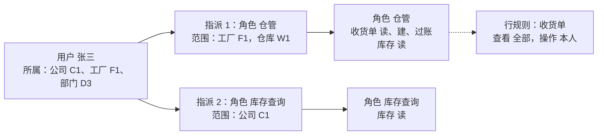
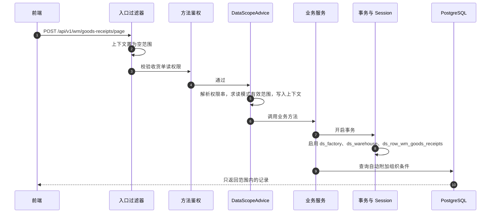

---
puppeteer:
  format: "A4"
  landscape: true
---
<style>
@page {
  size: A4 landscape;
  margin: 12mm;
}

.markdown-preview.markdown-preview table {
  display: table;
  width: 100%;
  max-width: 100%;
  table-layout: fixed;
  overflow: visible;
}


.markdown-preview.markdown-preview th,
.markdown-preview.markdown-preview td {
  overflow-wrap: anywhere;
  word-break: break-word;
  white-space: normal;
}

.markdown-preview.markdown-preview td code,
.markdown-preview.markdown-preview th code {
  white-space: pre-wrap;
  overflow-wrap: anywhere;
}
</style>

# P1 资料权限设计

> 本文是权限重构 P1 阶段的设计稿。P1 在现有功能权限（`菜单路径:动作`）之上增加**资料范围**：用户能看、能操作哪些公司、工厂、仓库的单据，以及是否只限本部门或本人。
>
> - 前置文档：[01-现状与问题.md](./01-现状与问题.md)（问题评估与路线）、[02-权限现状与交付运维指南.md](./02-权限现状与交付运维指南.md)（P0 落地后的运行模型）。
> - 现状部分以 2026-09-23 的代码为准；与 02 不一致的地方列在 1.2 节。
> - 状态：设计稿，待评审。第十五节的待确认事项需要业务方拍板。

---

## 目录

- [〇、结论摘要](#〇结论摘要)
- [一、现状核对](#一现状核对)
- [二、P1 范围评估](#二p1-范围评估)
- [三、设计原则](#三设计原则)
- [四、概念模型](#四概念模型)
- [五、数据模型](#五数据模型)
- [六、范围求值规则](#六范围求值规则)
- [七、受控资源登记](#七受控资源登记)
- [八、运行时机制](#八运行时机制)
- [九、管理面改造](#九管理面改造)
- [十、前端改造](#十前端改造)
- [十一、迁移与上线](#十一迁移与上线)
- [十二、测试策略](#十二测试策略)
- [十三、分期与工作量](#十三分期与工作量)
- [十四、风险与对策](#十四风险与对策)
- [十五、待确认事项](#十五待确认事项)
- [附录 A：P1-0 技术验证清单](#附录-ap1-0-技术验证清单)
- [附录 B：参照建单接口](#附录-b参照建单接口)
- [附录 C：isAuthenticated() 辅助接口](#附录-cisauthenticated-辅助接口)
- [附录 D：过滤条件模板](#附录-d过滤条件模板)

---

## 〇、结论摘要

**要解决的问题。** 现在的权限只回答"能不能用这个功能"。持有 `/scm/purchase-orders:read`，就能看到租户内所有工厂的采购订单；持有 `/scm/purchase-orders:approve`，就能审核任何工厂的采购订单。多公司、多工厂的客户一上线，这就是最直接的越权面。

**方案一句话。** 范围挂在角色指派上，行规则挂在角色的菜单上；读取由 Hibernate 过滤器在 ORM 层统一加条件，写入由"主资源过滤 + 写守卫 + 来源校验"把关；判定不了时默认拒绝。

**关键决策：**

1. **范围挂在指派上，跟随权限串。** 每条 `user_roles` 指派增加组织范围，分公司、工厂、仓库三个维度，每个维度可选"全部 / 所属 / 指定"。判断某个权限串时，只取持有这个权限串的那些指派的范围，再求并集。这样同一个人可以在 A 工厂当仓管，在 B 工厂只做查询。
2. **组织只向下覆盖。** 公司覆盖其下的工厂和仓库，工厂覆盖其下的仓库；下级维度单独设定时以设定为准。不向上推导，所以只有工厂范围的人看不到公司级的财务单据。
3. **部门和本人用行规则表达，不作为范围维度。** 角色对某个菜单可以设"全部 / 本部门 / 本部门及下级 / 本人"，查看和操作分开设置（P1-b）。
4. **读：所有登记过的资源一律过滤。** 单据头、明细（经单据头子查询）、台账都登记组织字段。列表、详情、导出、统计和关联数据走同一套条件，服务层 544 处 `findById` 和 131 处动态查询都不用改。
5. **写：只过滤主资源，另加写守卫和来源校验。** 写接口只过滤"用户正在操作的那类单据"，过账、回写来源单据等连带处理不受影响。新增和修改在落库前校验组织字段；25 个参照建单接口显式校验来源单据。
6. **默认拒绝。** Web 请求确定不了权限串时，范围为空；后台作业不受限。豁免必须显式声明，并由覆盖测试把关。
7. **下拉和辅助接口按页面上下文收窄。** 前端在请求头里带上当前页面路径，后端按这个页面的读权限求范围。不带时取用户全部指派的并集，所以上限不会超过用户本身的范围。
8. **授出的范围不能超过管理员自己的管理范围。** 这是 HR 分级管理的基础。
9. **上线无感。** 存量指派迁移为"公司 = 全部"，行为和现在一致；功能开关可以一键关闭过滤。

**分期与工作量（人日，粗估）：**

| 阶段 | 内容 | 估算 |
|---|---|---|
| P1-0 准备 | Hibernate 过滤器技术验证（附录 A）；预置 SYS 角色；删除草稿表；修正 `putIfAbsent`；新增测试 CI | 4–5 |
| P1-a 组织范围 | 表结构与迁移、范围求值、上下文、过滤器登记、写守卫、来源校验、页面上下文、导出导入、管理界面、测试矩阵 | 20–25 |
| P1-b 行规则与分级管理 | 行规则表与界面、本部门/本人规则、用户按公司分级管理、有效范围查询 | 7–9 |

---

## 一、现状核对

### 1. P0 及后续提交已具备的能力

| 能力 | 代码位置 | 说明 |
|---|---|---|
| JWT 只信任配置的 Keycloak 地址和启用中的租户，校验 `azp`/`aud` | `MultiTenantJwtDecoder`、`LycheeSecurityProperties` | 解码器缓存上限 100 个 |
| 权限串只来自 ERP 数据库 | `CustomJwtAuthenticationConverter`、`AuthenticationCacheServiceImpl` | 已不再注入 `ROLE_*`；前端也没有 `ROLE_ADMIN` 依赖 |
| 只加载有效授权 | `PermissionRepository.findActivePermissionsByUserId` | 指派启用且未过期；角色、权限、菜单均为 ACTIVE |
| 控制器默认拒绝 | `AuthorizationRuleInterceptor`、`ControllerAuthorizationCoverageTest` | `/api/**` 下没有 `@PreAuthorize` 的处理器返回 403 |
| 防自提权 | `UserRoleServiceImpl.assertNotSelf`；`RolePermissionServiceImpl.assertRoleMutable`、`assertCallerHolds`；`RoleServiceImpl` | 系统角色不可改、不可删 |
| 权限目录冻结 | `MenuServiceImpl`、`OptionValueServiceImpl`、`OptionCategoryServiceImpl` | 菜单 path 不可改；`PERMISSION_ACTION` 与系统分类锁定 |
| 工作流动作拆分 | 各模块控制器、`DocumentAction`、`0923-001` 迁移 | approve / unapprove / post / reverse / void |
| 制单人不能审核 | `SegregationOfDuties` | 凭证、付款 |
| 导出/导入"查看全部作业" | `ExportJobServiceImpl`、`ImportJobServiceImpl` | 改为 `/report/export-jobs:read`、`/report/import-jobs:read`；下载时重验 handler 的权限 |
| 租户管理 | `TenantController`、`PlatformSecurity` | 只允许配置的平台管理员 |

**结论：** 功能权限这一层已经闭环，但**没有任何记录级的限制**。所有读权限都覆盖租户内全部组织，所有写权限都能操作任何组织的单据。

### 2. 02 文档需要订正或补充的地方

| 02 中的位置 | 02 的描述 | 代码实际 | 处理 |
|---|---|---|---|
| 一.2 "API 默认防护" | 无注解请求"直接 500/403 阻断" | 拦截器抛 `AccessDeniedException`，统一返回 403 | 改为 403 |
| 二 流程图 | `C4 -- 刻 -->` | 笔误 | 改为"是" |
| 三.2、三.3 | 数据库初始化时生成 `SYS_IT_ADMIN`、`SYS_HR_ADMIN` | 迁移和种子数据里都没有这两个角色，全仓检索无结果 | P1-0 的迁移补上（5.5 节） |
| 三.3 第 1 步 | 平台创建 HR 账号并指派 `SYS_HR_ADMIN` | 用户和指派接口都只作用于调用者自己的租户；`TenantServiceImpl` 创建租户时也不预置用户和角色。平台侧目前没有办法在客户租户内建账号、指派角色 | P1-0 提供租户初始化 SQL 模板；是否做平台接口留到 P3 |
| 三.5 | "参考已落地的 0923-001 …… 自动向 `SYS_IT_ADMIN` 补齐" | 0923-001 是按旧动作的授权回填新动作，没有涉及 `SYS_IT_ADMIN` | P1-0 起约定标准片段（11.3 节） |
| 三.2 与 四.1 | 四.1 要求授权者不做业务；三.2 让 `SYS_IT_ADMIN` 持有全部权限 | 两者冲突：IT 同时拥有全部业务操作权 | P1 后可以给 IT 的指派设"无资料范围"来缓解（9.5 节） |

### 3. 与 P1 相关的代码事实

- **规模。** 约 650 个端点；服务层 544 处 `findById`、131 处 `DynamicSpecifications.build`、193 个 `@Query`；`findAllById` 297 处。逐处手写条件既费工又容易漏，这是选择 ORM 层过滤的主要理由。
- **绕过 ORM 的查询很少。**
  - 直接使用 `EntityManager` 的只有 3 处：`SpecificationSlices`（导出分片）、`MaterialBomReferenceRepository`、`ProductionProgressQuerySupport`。
  - 涉及受控表的原生 SQL 只有两类：一是 `PurchaseOrderRepository`、`OutsourceOrderRepository` 的 `existsOpenByCompanyId`，这是停用公司时的完整性检查，本来就应该看全量；二是 `OrderPeggingRepository` 的上下游追溯，用的是递归 CTE，要在服务层处理（7.4 节）。
- **组织字段基本齐全。** 业务表普遍有 `company_id` 或 `factory_id`，台账有 `warehouse_id`，不需要加列（清单见 7.2 节）。
- **组织主数据。** `companies` 有 `parent_id`、`level`；`factories.company_id`；`warehouses.factory_id`；`departments` 有 `company_id`（可空）和 `parent_id`。`users` 有 `company_id`、`factory_id`、`department_id`。
- **组织列缺索引。** 例如 `purchase_orders` 只有供应商索引，`sales_orders` 没有公司索引。
- **缓存。** 权限快照 `UserAuthorities(tenantId, userId, authorities)` 缓存在 `user-authorities`，10 分钟过期，变更时整体驱逐。组织下拉缓存 `COMPANIES/FACTORIES/DEPARTMENTS/WAREHOUSES_OPTION_CACHE` 按租户缓存全集。
- **异步入口 5 处：** `ExportJobEventListener`、`ImportJobEventListener`、`MrpRunEventListener`（异步），`MrpScheduleJob`、`ExchangeRateSyncJob`（定时）。
- **前端** 有 73 个文件使用组织选择器；请求拦截器在 `src/requestConfig.tsx`。
- **CI。** 只有部署工作流 `.github/workflows/deploy.yml`；Dockerfile 构建时 `-x test`，没有任何地方自动跑测试。

### 4. 上线资料范围后需要一并处理的现有写法

| 写法 | 位置 | 在 P1 下的影响 | 处理 |
|---|---|---|---|
| 明细分页用 `getParams().putIfAbsent("xxxId", id)` | 27 个服务类，31 处 | 客户端可以用查询参数覆盖路径里的单据 ID。P1 的明细过滤按明细自己的单据头判断，不会越出范围，但语义是错的 | P1-0 统一改为 `put` |
| `isAuthenticated()` 辅助接口读取带组织的数据 | 附录 C | 任何登录用户都能按任意组织查询 | 读取受控资料的改为页面上下文，低敏参照维持现状 |
| 参照建单只校验目标单据的权限 | 附录 B | 可以引用范围外的来源单据生成新单 | 显式校验来源 |
| 复合权限表达式 | `/fi/ap-credit-memos/refundable/page`（`ap-credit-memos:read and payments:read`） | 从注解推不出唯一的权限串 | 显式声明（8.2 节） |
| 非 read 权限的选择器 | `POST /scm/purchase-orders/pending-mrp-items/page`（`:create`） | 会被当成写模式，关联资源漏过滤 | 声明为读模式 |
| 批量写接口"查不到的 ID 静默跳过" | 各 `bulk-*` 接口 | 范围外的 ID 等同于不存在，不会越权，但用户得不到任何反馈 | 统一加"条数不符即拒绝"（8.4 节） |
| 组织下拉按租户缓存全集 | 各模块的 options 缓存 | 缓存结果不能原样返回给范围不同的人 | 继续缓存全集，返回前按范围过滤 |
| 导出在异步线程执行 | `ExportJobEventListener` | 异步线程没有请求上下文 | 创建作业时记录范围快照（8.7 节） |

---

## 二、P1 范围评估

### 1. 01 文档中 P1 条目的逐项评估

| 01 中的条目 | 本文结论 | 理由 |
|---|---|---|
| 权限目录代码化，菜单改为系统级 | 移到 P3 | P0 已经冻结菜单 path 和动作字典，篡改风险已控制。改成系统级菜单要重构多租户种子数据，和资料权限没有依赖。P1 只补"发版自动给 `SYS_IT_ADMIN` 补权"的标准片段 |
| 指派、范围、行规则三张表 | 保留，改为两张新表 | `user_roles` 在 P0 后已经有启用、到期、指派人、指派时间，本身就是指派，不再另建 `user_role_assignments`。新增 `user_role_scopes` 和 `role_row_rules` |
| `DataScopeService` 与查询、动作两类注入点 | 保留并具体化 | 查询用 Hibernate 过滤器；动作用写守卫、来源校验、批量校验 |
| 前端"资源 × 动作"矩阵，指派页加范围 | 矩阵已基本具备，范围编辑器是 P1 核心 | `RolePermissionPicker` 已经能按菜单勾选动作并全选，P1 只加行规则列 |
| 受限用户的集成测试矩阵 | 保留，并新增测试 CI | 现在没有自动跑测试的流程 |
| 01 四节"`DynamicSpecifications` 加可过滤字段白名单" | 不作为 P1 前置 | 过滤器在 ORM 层生效，客户端参数绕不过范围；字段白名单放到 P3 和字段权限一起做 |

### 2. 与 01 设计的差异

| 项目 | 01 的设计 | 本文 | 原因 |
|---|---|---|---|
| 指派表 | 新建 `user_role_assignments` 取代 `user_roles` | 沿用 `user_roles` | 字段已齐，免去迁移和改界面 |
| 部门维度 | `DEPARTMENT` 作为第四个范围维度，由公司下推 | 不作为范围维度，改由行规则"本部门 / 本部门及下级"按用户所属部门动态判断 | 只有请购、领料、领料退回、生产订单、固定资产带部门字段，其他单据用不上。最常见的需求是"本部门"，指定任意部门的需求很少 |
| 下级公司 | `include_children` 默认 true | 默认 false | 最小授权，需要时在界面勾选 |
| 行规则主键 | `resource_code` + READ/WRITE 各一行 | `menu_id` 一行，含 `read_rule`、`write_rule` | P1 的资源就是菜单 path，`resource_code` 目录属于 P3 |
| 过滤面 | 只对端点对应的实体启用过滤，"不影响其他实体的内部查询" | 读模式对所有登记资源生效，写模式只对主资源生效 | 读接口普遍会顺带返回别的资源，例如订单详情里的收货进度、单据链、监控和下拉。只过滤主实体会留下借道读取的口子。写接口的连带处理必须看全量，所以只有写模式才限定主资源 |

### 3. 不在 P1 的内容

- **工作代理（P2）。** P1 的授权明细里，"本人"用 `ownerIds` 集合表达，P2 代理时可以把委托人加进去，不需要改结构。
- **字段权限（P3）。** 例如成本、单价脱敏。
- **主数据隔离。** 物料、BOM、供应商、客户、科目、税码等继续在租户内共享，这是 01 第七节的默认决定。客户主数据的"本人业务员"规则放在 P1-b 作为可选项。
- **组织主数据维护页。** 公司、工厂、仓库、部门的增删改不按范围隔离，这些页面只有主数据管理员使用；它们的下拉接口按范围过滤。
- **PostgreSQL RLS（P3）。** 作为租户隔离的纵深防御。
- **审批流与任务代理（P3）。**

---

## 三、设计原则

1. **范围跟随权限，条件跟随实体。** 判断"能否对某条记录做某事"时，范围由当前权限串决定，条件由记录所属实体登记的组织字段决定，业务代码里都不用手写。
2. **默认拒绝。** 找不到权限串、找不到登记、找不到范围时，结果为空或拒绝，而不是放行。
3. **只在入口判定。** 用户直接操作的那张单据在入口判定一次；系统内部的连带处理（过账、回写、倒冲、MRP）不重复判定。这和 SAP 的做法一致。
4. **读宽写窄。** 读取要过滤全面，防止借道；写入只约束用户直接操作的对象，避免误伤内部流程。
5. **结构化、可复核。** 范围只能是离散的组织 ID 和固定规则，不接受自由条件表达式，界面能完整展示"某人能看到什么"。
6. **向后兼容。** 存量指派迁移后行为不变；可以用开关关闭；现有接口的请求和响应只增加字段，不改结构。

---

## 四、概念模型

| 术语 | 含义 |
|---|---|
| 功能权限 | 现有的 `菜单路径:动作`，如 `/wm/goods-receipts:post` |
| 指派 | `user_roles` 中的一条记录：某用户持有某角色，带启用状态和到期时间 |
| 组织范围 | 指派上的范围设定，分公司、工厂、仓库三个维度 |
| 行规则 | 角色对某个菜单的附加限制：全部、本部门、本部门及下级、本人；查看和操作各设一个 |
| 授权明细（Grant） | 登录时由有效指派展开的结构：指派 ID、角色、权限串集合、组织范围、各菜单的行规则 |
| 受控资源 | 登记了组织字段的实体，对应一个菜单路径 |
| 主资源 | 当前权限串的菜单路径所对应的受控资源 |
| 有效范围 | 针对某个权限串求出的最终范围：每个维度的组织 ID 集合，以及按行规则分组的集合 |
| 读模式 / 写模式 | 读模式对所有"共享"的受控资源过滤（7.1 节）；写模式只过滤主资源，并启用写守卫 |



按上图，张三的有效范围是：

- **`/wm/goods-receipts:read`**：只有指派 1 持有这个权限串，所以范围是工厂 {F1}；查看规则为"全部"，能看到 F1 的所有收货单。
- **`/wm/goods-receipts:post`**：同样只来自指派 1，范围是工厂 {F1}；操作规则为"本人"，只能过账自己建的 F1 收货单。另外，过账产生的库存流水，仓库必须在 {W1} 内。
- **`/wm/stock-on-hand:read`**：两个指派都持有，取并集，仓库范围是 {W1} 加上 C1 下所有工厂的仓库。

---

## 五、数据模型

### 1. `user_role_scopes`：指派的组织范围

```sql
CREATE TABLE lychee_erp.user_role_scopes
(
	id bigserial NOT NULL,
	tenant_id bigint NOT NULL,
	user_role_id bigint NOT NULL,
	dimension varchar(20) NOT NULL,
	scope_type varchar(10) NOT NULL,
	value_id bigint NULL,
	include_children boolean NOT NULL DEFAULT false,
	created_at timestamp without time zone NULL DEFAULT CURRENT_TIMESTAMP,
	updated_at timestamp without time zone NULL DEFAULT CURRENT_TIMESTAMP,
	created_by bigint NULL,
	updated_by bigint NULL,
	CONSTRAINT user_role_scopes_pkey PRIMARY KEY (id),
	CONSTRAINT fk_user_role_scopes_user_role FOREIGN KEY (user_role_id)
		REFERENCES lychee_erp.user_roles (id) ON DELETE CASCADE,
	CONSTRAINT ck_user_role_scopes_dimension CHECK (dimension IN ('COMPANY', 'FACTORY', 'WAREHOUSE')),
	CONSTRAINT ck_user_role_scopes_type CHECK (scope_type IN ('ALL', 'HOME', 'LIST')),
	CONSTRAINT ck_user_role_scopes_value CHECK ((scope_type = 'LIST') = (value_id IS NOT NULL)),
	CONSTRAINT ck_user_role_scopes_home CHECK (scope_type <> 'HOME' OR dimension IN ('COMPANY', 'FACTORY')),
	CONSTRAINT ck_user_role_scopes_children CHECK (NOT include_children OR (dimension = 'COMPANY' AND scope_type = 'LIST'))
);

CREATE INDEX idx_user_role_scopes_user_role ON lychee_erp.user_role_scopes (user_role_id);
CREATE UNIQUE INDEX uk_user_role_scopes ON lychee_erp.user_role_scopes
	(user_role_id, dimension, scope_type, COALESCE(value_id, 0));
```

| 列 | 说明 |
|---|---|
| `dimension` | `COMPANY` 公司 / `FACTORY` 工厂 / `WAREHOUSE` 仓库 |
| `scope_type` | `ALL` 全部；`HOME` 用户所属，运行时取 `users.company_id` 或 `users.factory_id`；`LIST` 指定 |
| `value_id` | `LIST` 时的组织 ID |
| `include_children` | 仅用于指定公司：是否包含下级公司 |

**规则：**

- 一条指派可以有多行；同一维度的多行取并集。
- 某个维度没有行，表示"不单独设定"，从上级维度推导（6.1 节）。
- 一条指派一行都没有，表示这条指派**不授予任何资料**：功能照常可用，但只能操作不受控的数据。界面上显示为"无资料范围"。
- 同一维度不能既有 `ALL` 又有其他行，保存时拒绝（`validation.user.role.scope.invalid`）。
- 删除指派时，数据库外键级联删除范围行。这一点很重要，因为 `deleteAllInBatch` 走 JPQL 删除，不会触发实体级联。

### 2. `role_row_rules`：角色对菜单的行规则（P1-b）

```sql
CREATE TABLE lychee_erp.role_row_rules
(
	id bigserial NOT NULL,
	tenant_id bigint NOT NULL,
	role_id bigint NOT NULL,
	menu_id bigint NOT NULL,
	read_rule varchar(20) NOT NULL DEFAULT 'ALL',
	write_rule varchar(20) NOT NULL DEFAULT 'ALL',
	created_at timestamp without time zone NULL DEFAULT CURRENT_TIMESTAMP,
	updated_at timestamp without time zone NULL DEFAULT CURRENT_TIMESTAMP,
	created_by bigint NULL,
	updated_by bigint NULL,
	CONSTRAINT role_row_rules_pkey PRIMARY KEY (id),
	CONSTRAINT uk_role_row_rules UNIQUE (tenant_id, role_id, menu_id),
	CONSTRAINT fk_role_row_rules_role FOREIGN KEY (role_id) REFERENCES lychee_erp.roles (id) ON DELETE CASCADE,
	CONSTRAINT fk_role_row_rules_menu FOREIGN KEY (menu_id) REFERENCES lychee_erp.menus (id) ON DELETE CASCADE,
	CONSTRAINT ck_role_row_rules_read CHECK (read_rule IN ('ALL', 'DEPT', 'DEPT_TREE', 'OWN')),
	CONSTRAINT ck_role_row_rules_write CHECK (write_rule IN ('ALL', 'DEPT', 'DEPT_TREE', 'OWN'))
);
```

- 没有记录，表示查看和操作都是 `ALL`（组织范围内全部）。
- `DEPT`、`DEPT_TREE` 只能设在登记了部门字段的资源上；`OWN` 所有资源都能用，因为 `created_by` 是通用字段，部分资源还有业务员、申请人字段。
- 宽窄顺序是 ALL > DEPT_TREE > DEPT > OWN，操作规则不能比查看规则宽，否则会出现"看不到却能操作"。
- 行规则属于角色设计，和改角色权限的约束相同：需要 `/adm/roles:update`，并受 `assertRoleMutable` 约束。

### 3. `export_jobs.scope_snapshot`

```sql
ALTER TABLE lychee_erp.export_jobs ADD COLUMN IF NOT EXISTS scope_snapshot jsonb NULL;
COMMENT ON COLUMN lychee_erp.export_jobs.scope_snapshot IS '创建作业时的有效范围：权限串、各维度集合、行规则分组';
```

这一列有两个用途：异步执行时用它恢复上下文；其他人下载时，用它判断下载者的范围是否覆盖文件内容（8.7 节）。

### 4. 组织列索引

为 7.2 节各表的组织列补 `(tenant_id, company_id)`、`(tenant_id, factory_id)` 或 `(tenant_id, warehouse_id)` 索引，使用 `CREATE INDEX IF NOT EXISTS`。具体清单在 P1-0 用 `pg_indexes` 对比后确定。明细表经单据头子查询过滤，依赖的是明细表上现有的单据头外键索引，也要一并确认。

### 5. 迁移脚本内容

放在 `db/changelog/v1/2026/` 下，按实现日期命名。内容如下：

1. 建 `user_role_scopes`、`role_row_rules`，给 `export_jobs` 加列。
2. **回填存量指派：** 每条现有 `user_roles` 插入一行 `COMPANY / ALL`，保证上线后行为不变。

   ```sql
   INSERT INTO lychee_erp.user_role_scopes (tenant_id, user_role_id, dimension, scope_type, include_children)
   SELECT ur.tenant_id, ur.id, 'COMPANY', 'ALL', false
   FROM lychee_erp.user_roles ur
   WHERE NOT EXISTS (SELECT 1 FROM lychee_erp.user_role_scopes s WHERE s.user_role_id = ur.id);
   ```

3. **预置系统角色：** 每个租户各建一个 `SYS_IT_ADMIN`（全部权限）和 `SYS_HR_ADMIN`（只有 `/adm/users` 的权限），`is_system = true`，不指派给任何人。HR 在指派界面通过 `/adm/user-roles/available-roles` 选角色，这个接口只要求 `/adm/users:read`，所以 `SYS_HR_ADMIN` 不需要角色管理权限。

   ```sql
   INSERT INTO lychee_erp.roles (tenant_id, name, code, description, level, is_system, active_status, created_at, updated_at)
   SELECT t.id, v.name, v.code, v.description, 1, true, 'ACTIVE', now(), now()
   FROM lychee_erp.tenants t
   CROSS JOIN (VALUES
       ('IT 系统管理员', 'SYS_IT_ADMIN', '预置角色：全部功能权限，由 HR 指派给 IT 人员'),
       ('人事管理员',   'SYS_HR_ADMIN', '预置角色：仅用户管理权限')
   ) AS v(name, code, description)
   WHERE NOT EXISTS (SELECT 1 FROM lychee_erp.roles r WHERE r.tenant_id = t.id AND r.code = v.code);

   -- SYS_IT_ADMIN：本租户全部权限
   INSERT INTO lychee_erp.role_permissions (tenant_id, role_id, permission_id, granted_at, created_at, updated_at)
   SELECT r.tenant_id, r.id, p.id, now(), now(), now()
   FROM lychee_erp.roles r
   JOIN lychee_erp.permissions p ON p.tenant_id = r.tenant_id
   WHERE r.code = 'SYS_IT_ADMIN'
     AND NOT EXISTS (SELECT 1 FROM lychee_erp.role_permissions rp WHERE rp.role_id = r.id AND rp.permission_id = p.id);

   -- SYS_HR_ADMIN：只授予 /adm/users 的权限
   INSERT INTO lychee_erp.role_permissions (tenant_id, role_id, permission_id, granted_at, created_at, updated_at)
   SELECT r.tenant_id, r.id, p.id, now(), now(), now()
   FROM lychee_erp.roles r
   JOIN lychee_erp.permissions p ON p.tenant_id = r.tenant_id
   JOIN lychee_erp.menus m ON m.id = p.menu_id AND m.path = '/adm/users'
   WHERE r.code = 'SYS_HR_ADMIN'
     AND NOT EXISTS (SELECT 1 FROM lychee_erp.role_permissions rp WHERE rp.role_id = r.id AND rp.permission_id = p.id);
   ```

4. **删除草稿：** 删除表 `data_permissions`、`role_permission_delegations`、`role_hierarchy`，以及实体 `DataPermission`、`RolePermissionDelegation`、`RoleHierarchy` 和对应的仓库类。这三者都不参与现有鉴权。
5. 组织列索引（上一小节）。

第 3、4 步放在 P1-0 单独发版；第 1、2、5 步随 P1-a 发版。

### 6. 实体与接口变更

- **adm 新增实体：** `UserRoleScope`、`RoleRowRule`。
- **`UserRoleRequest` 增加 `scopes`：** 元素包含 `dimension`、`scopeType`、`valueId`、`includeChildren`。
  - 新建时必填，空列表表示"无资料范围"。
  - 修改时，`null` 表示不变，非 `null` 表示整体替换。
- **`UserRoleResponse` 增加** `scopes` 和 `scopeSummary`，后者是给列表显示的文字摘要，例如"公司：C1（含下级）；仓库：W1、W2"。
- **`UserAuthorities` 增加** `grants`（授权明细列表）和 `home`（所属公司、工厂、部门）。授权明细的结构放在 common 模块，供各业务模块使用。

---

## 六、范围求值规则

### 1. 单条指派的求值

对一条指派 g，按维度分别求集合：

- **公司集合 C(g)：** 公司行的并集。`ALL` 为全部公司；`HOME` 为用户所属公司，所属为空时为空集；`LIST` 为指定公司，勾选"含下级"时加上其全部下级公司。
- **工厂集合 F(g)：** 有工厂行时，取工厂行的并集，`HOME` 为用户所属工厂；没有工厂行时，取 C(g) 下的全部工厂。
- **仓库集合 W(g)：** 有仓库行时，取仓库行的并集；没有仓库行时，取 F(g) 下的全部仓库。

"全部"始终保留为标记，不展开成 ID 列表。这样既能跳过过滤，也能覆盖后来新建的组织。

| 指派的范围设定 | 公司级单据 | 工厂级单据 | 仓库台账 |
|---|---|---|---|
| 公司 = 全部 | 全部 | 全部 | 全部 |
| 公司 = C1 | C1 | C1 下的工厂 | 这些工厂下的仓库 |
| 公司 = C1（含下级） | C1 及其下级公司 | 这些公司下的工厂 | 这些工厂下的仓库 |
| 公司 = 所属 | 用户所属公司 | 其下工厂 | 其下仓库 |
| 工厂 = F1 | 无 | F1 | F1 下的仓库 |
| 工厂 = F1，仓库 = W1 | 无 | F1 | W1 |
| 公司 = C1，工厂 = F1 | C1 | F1 | F1 下的仓库 |
| 仓库 = W1 | 无 | 无 | W1 |
| 不设范围 | 无 | 无 | 无 |

**配置提示：** 工厂岗位如果要引用公司级单据，例如工厂订单要从销售订单带料、出货要引用销售订单，指派时要同时设公司范围，写成"公司 = C1，工厂 = F1"。只设工厂的话，这些页面里的销售订单选择器会是空的。界面的范围摘要会明确显示"公司级单据：无"。

### 2. 多条指派的合并

对权限串 a，先取持有 a 的全部有效指派 grants(a)，再对每个维度取并集。如果 grants(a) 为空，`@PreAuthorize` 已经先拒绝，走不到这一步。

- **读模式：**
  - 所有"共享"的受控资源都按各自维度的并集过滤；"仅本页"的资源只在作为主资源时过滤（7.1 节）。
  - 行规则只作用于主资源；其他资源只按组织过滤。
- **写模式：** 只过滤主资源，使用操作规则。
- **跳过过滤：** 某个维度的并集为"全部"时，这个维度不加条件。主资源在"全部"规则组里覆盖了全部组织时，行过滤也不加。

### 3. 行规则

| 规则 | 条件 |
|---|---|
| `ALL` | 组织范围内全部 |
| `DEPT` | 单据部门 = 用户所属部门 |
| `DEPT_TREE` | 单据部门 ∈ 用户所属部门及其全部下级部门 |
| `OWN` | 单据的任一负责人字段（登记的 `ownerFields`，默认 `created_by`）= 本人 |

- 用户没有所属部门时，`DEPT`、`DEPT_TREE` 的结果为空。
- 一个人在同一个权限串下可能有多条指派、多种规则，这时按规则分组，每组各自取组织并集，组之间是"或"：

  > 组织 ∈ 全部组的组织，**或**（组织 ∈ 本部门组的组织 **且** 部门 = 本部门），**或** …… **或**（组织 ∈ 本人组的组织 **且** 负责人 = 本人）

  这样合并是精确的，不会因为合并而放宽。

### 4. 求值伪代码

```java
EffectiveScope resolve(UserAuthorities user, String authority, Access access) {
    List<Grant> grants = user.grantsHolding(authority);           // 已排除停用、过期的指派
    EffectiveScope.Builder b = EffectiveScope.builder(authority, access);
    for (Grant g : grants) {
        OrgSets org = orgDirectory.expand(g.scopes(), user.home()); // 6.1 的规则，"全部"保持为标记
        RowRule rule = g.rowRule(menuPathOf(authority), access);    // 没有记录为 ALL
        b.add(org, rule, g.ownerIds());                             // ownerIds 目前为 {userId}
    }
    return b.build();   // 各维度并集 + 主资源按规则分组；"全部"组覆盖全部组织时标记为不受限
}
```

同一请求内，同一个权限串只求值一次。

---

## 七、受控资源登记

### 1. 登记方式

```java
@Entity
@Table(name = "purchase_requisitions")
@DataScopeResource(path = "/scm/purchase-requisitions", dimension = Dimension.FACTORY, field = "factoryId",
        departmentField = "departmentId", ownerFields = {"requesterId", "createdBy"})
@Filter(name = DataScopeFilters.FACTORY, condition = "factory_id in (:dsFactoryIds)")
@Filter(name = "ds_row_scm_purchase_requisitions", condition = "……见附录 D……")
public class PurchaseRequisition extends AuditableEntity { ... }

@Entity
@Table(name = "purchase_requisition_items")
@DataScopeResource(path = "/scm/purchase-requisitions", parent = PurchaseRequisition.class,
        parentField = "purchaseRequisitionId")
@Filter(name = DataScopeFilters.FACTORY, condition = "purchase_requisition_id in "
        + "(select h.id from lychee_erp.purchase_requisitions h where h.factory_id in (:dsFactoryIds))")
@Filter(name = "ds_row_scm_purchase_requisitions", condition = "……同一行条件，套在单据头子查询里……")
public class PurchaseRequisitionItem extends AuditableEntity { ... }
```

- `path` 取控制器 `@PreAuthorize` 里的菜单路径。
- **共享方式** `sharing` 有两种：
  - **共享**（`SHARED`，默认）：用于业务单据与台账。在任何读模式页面，都按当前权限串的范围过滤，防止借道读取。
  - **仅本页**（`PRIMARY_ONLY`）：用于组织级参照配置。只在自己的维护页面过滤；被其他页面当参照读取时不过滤。实现上，这类实体只声明 `ds_row_*` 过滤器，不声明共享的维度过滤器。
- 启动时 `DataScopeRegistry` 扫描全部 `@DataScopeResource` 并校验：字段存在；声明了与维度一致的 `@Filter`；明细的父实体已登记；`path` 格式正确。任何一项不通过，启动就失败。

### 2. 受控资源清单

"行规则字段"一列列出 `DEPT`/`OWN` 使用的字段；所有资源都可以用 `created_by` 做"本人"。明细都经单据头过滤。

**FI：维度为公司（`company_id`）**

| 资源 | 明细 / 附属 | 行规则字段 | 共享方式 |
|---|---|---|---|
| `journal_entries` | `journal_entry_lines` | created_by | 共享 |
| `ap_invoices`、`ar_invoices` | 各自的明细行 | created_by | 共享 |
| `ap_credit_memos`、`ar_credit_memos` | 各自的明细行 | created_by | 共享 |
| `payments` | `payment_lines` | created_by | 共享 |
| `fixed_assets`、`asset_depreciations` | — | department_id（固定资产） | 共享 |
| `cost_calculations`、`cost_allocations`、`material_costs` | — | created_by | 共享 |
| `company_bank_accounts` | — | — | 共享（账户信息敏感） |
| `fiscal_periods`、`fi_costing_policies`、`fi_account_determination`、`tax_determinations` | — | — | 仅本页 |

**SD**

| 资源 | 维度 | 明细 | 行规则字段 | 共享方式 |
|---|---|---|---|---|
| `sales_orders` | 公司 | 订单明细 | sales_person_id | 共享 |
| `sales_forecasts` | 公司 | 预测明细 | sales_person_id | 共享 |
| `deliveries` | 工厂 | `delivery_items` | created_by | 共享 |
| `customers`（主数据） | — | — | sales_person_id | P1-b 可选"本人业务员"，默认不受控 |

**SCM：维度为工厂（`factory_id`）**

| 资源 | 明细 | 行规则字段 | 共享方式 |
|---|---|---|---|
| `purchase_requisitions` | 请购明细 | department_id、requester_id | 共享 |
| `purchase_orders` | 订单明细 | created_by | 共享 |
| `outsource_orders` | 订单明细 | created_by | 共享 |
| `material_suppliers`（货源清单） | — | — | 仅本页 |

**WM**

| 资源 | 维度 | 明细 | 行规则字段 | 共享方式 |
|---|---|---|---|---|
| `goods_receipts`、`purchase_returns`、`customer_returns` | 工厂 | 明细（含 warehouse_id） | created_by | 共享；过账校验仓库 |
| `stock_issues`、`stock_issue_returns` | 工厂 | 明细（含 warehouse_id） | department_id | 共享；过账校验仓库 |
| `stock_transfers` | 工厂 | 明细（含调出、调入仓） | created_by | 共享；过账校验仓库 |
| `physical_inventories` | 工厂 | 盘点明细 | created_by | 共享；过账校验仓库 |
| `stock_on_hand`、`stock_transactions`、`inventory_balances` | 仓库 | — | — | 共享（台账） |
| `inventory_periods` | 工厂 | — | — | 仅本页 |

**PP：维度为工厂（`factory_id`）**

| 资源 | 明细 | 行规则字段 | 共享方式 |
|---|---|---|---|
| `production_orders` | 明细 / 组件 | department_id | 共享 |
| `production_reports` | `production_report_components` | created_by | 共享；倒冲不校验仓库 |
| `production_backflush_exceptions` | — | — | 共享 |
| `planned_orders`、`mrp_runs`、`mrp_results`、`mrp_schedules` | — | created_by | 共享 |
| `factory_orders` | 明细 | created_by | 共享 |
| `mrp_parameters` | — | — | 仅本页 |

**basis / ADM**

| 资源 | 维度 | 明细 | 共享方式 |
|---|---|---|---|
| `material_factories`（物料工厂设置） | 工厂 | — | 仅本页 |
| `users`（P1-b） | 公司 | `user_roles`（经 user_id） | 仅本页。其他页面显示人名时不能被过滤 |

合计约 60 个实体（含明细），具体数目以实现时为准。

### 3. 不受控数据（租户内共享）

物料与物料分类、BOM 与工艺、供应商、客户、业务伙伴及其银行账户、会计科目、估价类、税码与税类、付款条件、币别与汇率、单位、单据编号规则、选项字典、菜单、角色、权限。

汇率带有 `company_id`，但被所有单据表单当参照使用。若按公司隔离，只有工厂范围的人在采购订单表单上就取不到汇率，所以保持不受控。

### 4. 特殊资源

- **单据链（`OrderPeggingRepository`）。** 上下游追溯是原生递归查询，不经过过滤器。服务层拿到追溯结果后，用当前上下文加载每个节点的详情；加载不到的节点显示为"无权查看"，只保留类型和 ID，不返回单号、数量、客户等内容。
- **监控看板。**
  - **健康指标：** `MonitorServiceImpl` 已经按每个指标的 `requiredAuthority()` 控制可见性。P1 让每个指标在 `DataScope.call(indicator.requiredAuthority(), READ, ...)` 里求值，范围跟随该指标自己的权限串。现有指标都在 mm 模块，检查的是物料主数据，不受影响；以后新增的受控数据指标会自动按范围计算。
  - **生产进度：** 接口权限是 `/report/monitors:read`，在读模式下按这条权限串的范围过滤（工厂维度）。`ProductionProgressQuerySupport` 走 JPQL/Criteria，过滤器会生效。
  - 以后新增的指标如果用原生 SQL，必须手工加条件。
- **打印。** 取数走详情接口或导出处理器，自动受控。
- **`existsOpenByCompanyId`。** 这是完整性检查，要看全量，保持原生 SQL、不受控。

---

## 八、运行时机制

### 1. 组件一览

| 组件 | 位置 | 职责 |
|---|---|---|
| `Grant` | common | 授权明细：指派 ID、角色、权限串集合、范围行、各菜单行规则、`ownerIds`；随 `UserAuthorities` 缓存 |
| `OrgDirectory` | 接口在 common；实现基于现有 `Remote*Service` 和组织下拉缓存 | 公司树、工厂→公司、仓库→工厂、部门树；按租户缓存 |
| `DataScopeResolver` | common | 权限串 + 读写 → 有效范围（第六节规则）；请求内缓存 |
| `DataScopeContext` | common | 线程上下文：当前权限串、模式、有效范围 |
| `DataScopeEntryFilter` | adm | 每个 Web 请求开始时把上下文置为"空范围"，结束时清除 |
| `DataScopeAdvice` | adm | 控制器方法切面，在 `@PreAuthorize` 之后执行：确定权限串与模式，写入上下文 |
| `DataScopeSessionBinder` | common | 事务开始和上下文切换时，为当前 Hibernate Session 启用或关闭过滤器，并绑定参数 |
| `DataScopeWriteGuard` | common | Hibernate 插入/更新前事件：写模式下校验主资源和库存流水 |
| `DataScopeRegistry` | common | 启动扫描 `@DataScopeResource` 并校验 |
| `@DataScope` | common | 端点声明：权限串、模式、页面上下文、豁免理由 |
| `DataScope` | common | 业务代码 API：`call`、`readSources`、`requireAll`、`current` |
| `DataScopeDeniedException` | common | 写入越界，继承 `AccessDeniedException`，返回 403 和 `error.data.scope.denied` |

### 2. 确定权限串与模式

`DataScopeAdvice` 用 Spring 的 SpEL 解析器解析 `@PreAuthorize` 的表达式树：

- 根节点是 `hasAuthority(x)` 时，用方法参数求出 x，作为权限串。静态写法和 AP/AR `/action`、`OrderPeggingController` 这类动态写法都能覆盖。
- 根节点是 `hasAnyAuthority(...)` 时，逐个求值，范围取并集。
- 其他形式（`and`、`or` 组合）必须用 `@DataScope(authority = ...)` 显式指定。

动作 `read`、`export` 归为读模式，其余动作归为写模式；`@DataScope(mode = ...)` 可以覆盖。

| 端点写法 | 例子 | 权限串 | 模式 |
|---|---|---|---|
| `hasAuthority('x:read')` | `GET /scm/purchase-orders/{id}` | 解析注解 | 读 |
| `hasAuthority('x:approve')` 等 | `POST /scm/purchase-orders/bulk-approve` | 解析注解 | 写 |
| 动态 `hasAuthority(...)` | `/fi/ap-invoices/action`、单据链 | 用方法参数求值 | 按动作 |
| 非读权限的选择器 | `pending-mrp-items/page`（`:create`） | 解析注解 | `@DataScope(mode = READ)` |
| 复合表达式 | `refundable/page` | `@DataScope(authority = "/fi/ap-credit-memos:read")` | 读 |
| `isAuthenticated()`，读取受控资料 | 组织下拉、库存分配建议 | `@DataScope(pageContext = true)` | 读 |
| `isAuthenticated()`，不读受控资料 | 物料下拉、枚举、当前用户菜单 | `@DataScope(exempt = "只读共享主数据")`，空范围不影响结果 | — |

```java
@PostMapping("/pending-mrp-items/page")
@PreAuthorize("hasAuthority('/scm/purchase-orders:create')")
@DataScope(mode = DataScope.Mode.READ)
public ResponseEntity<...> pendingMrpItems(...) { ... }

@GetMapping("/list")
@PreAuthorize("isAuthenticated()")
@DataScope(pageContext = true)
public ResponseEntity<...> listFactories() { ... }
```

**上下文的默认值：**

- **Web 请求：** 由 `DataScopeEntryFilter` 保证至少是"空范围"。任何受控资源都查不到，任何受控写入都被拒绝。
- **非 Web 线程：** 没有上下文，视为系统作业，不受限。
- **业务代码切换：** 通过 `DataScope.call(authority, mode, action)` 进行，结束时恢复原上下文。

### 3. 读：Hibernate 过滤器

- **过滤器定义：**
  - 共享维度过滤器 `ds_company`、`ds_factory`、`ds_warehouse`，参数是 ID 列表。
  - 每个资源一个行过滤器 `ds_row_<资源>`，参数见附录 D。
- **读模式启用规则：**
  - 有效范围里非"全部"的维度，启用对应的 `ds_<维度>`。
  - 主资源的组织受限或有行规则时，启用 `ds_row_<主资源>`。
- **生效面：**
  - 生效：HQL/JPQL、Criteria/Specification（含分页的 count 查询）、`findById`（`@FilterDef(applyToLoadByKey = true)`，Hibernate 6.5 起支持）、懒加载集合。
  - 不生效：原生 SQL、`@Modifying` 批量更新。命中一级缓存的实体也可能绕过过滤，要在附录 A 中验证。
- **空集合：** 统一用哨兵值 `-1` 代替空集合，保证条件为假，不依赖 Hibernate 对空 `IN` 的处理。
- **绑定时机，二选一，由 P1-0 验证后定稿：**
  - **方案一（首选）：** 在事务开始时绑定，通过自定义 `JpaDialect` 或事务管理器钩子实现；`DataScope.call` 切换时对当前 Session 重新绑定。OSIV 下 Session 在请求一开始就打开了，那时上下文还没确定，所以不能在打开 Session 时绑定。
  - **方案二：** 用 `@FilterDef(autoEnabled = true)` 加 `@ParamDef(resolver = ...)`，在生成 SQL 时从上下文取参数；条件里要用标记参数表达"全部"。这个方案依赖解析器在每次执行时都被调用，需要确认查询计划缓存不会让参数失效。

### 4. 写：主资源过滤 + 写守卫

**主资源过滤。**

- 写模式只启用 `ds_row_<主资源>`，使用操作规则。范围外的主资源和它的明细"查不到"，现有代码会按不存在处理（404），或者跳过。
- 其他资源不过滤。过账写库存、回写采购订单已收数量、倒冲领料、生成凭证等连带处理照常进行。

**写守卫。** 在 Hibernate 插入/更新前事件里执行，和查询用同一套判定，只是在 Java 里对实体的新值求值：

1. **主资源单据头：** 新值必须落在写范围内，包括组织字段，以及规则要求的部门和负责人。这样既不能在范围外新建单据，也不能把单据改到范围外。
2. **WM 单据的过账：** 这类资源在登记表中标注了"过账校验仓库"。本次插入的 `stock_transactions`，仓库必须在写范围的仓库集合内；调拨的调出、调入仓都要在范围内。生产报工的倒冲领料不做这项校验，因为原料仓通常不归报工人员管。
3. **越界：** 抛 `DataScopeDeniedException`，返回 403，并记录 WARN 日志。
4. **异常包装：** flush 时抛出的异常可能被 Hibernate 或 Spring 包装，全局异常处理 `GlobalExceptionHandler` 要沿 cause 链找到它。这一点在附录 A 中验证。

**批量写接口。** 为受控资源的 `bulk-*` 写接口统一加 `DataScope.requireAll(ids, entities)`：查到的条数少于请求的 ID 数时，返回 403，让用户明确知道有单据超出范围。

### 5. 参照建单的来源校验

参照建单接口在写模式下执行，读取的来源单据不是主资源，因此不受过滤。如果不做处理，用户就能引用范围外的单据生成新单。

**规则：** 来源单据必须落在**当前（目标）权限串**的范围内，按来源单据自身的维度判断。例如：

- 用 `/fi/ap-invoices:create` 从收货单生成应付发票：收货单是工厂维度，看的是应付发票这条指派推导出的工厂集合。一名 C1 公司范围的会计，可以引用 C1 下所有工厂的收货单。
- 不要求用户另外持有来源单据的读权限，因为应付会计通常没有仓库权限。

**写法：** 在读模式下加载来源单据，再要求全部命中：

```java
List<GoodsReceipt> sources = DataScope.readSources(() -> goodsReceiptRepository.findAllById(sourceIds));
DataScope.requireAll(sourceIds, sources);
```

来源选择器是目标页面上的读接口，已经按目标权限串的读范围过滤，所以和上面的规则一致。25 个接口的清单与处理方式见附录 B。

### 6. 页面上下文（下拉与辅助接口）

- **请求头：** 前端在每个请求上带 `X-Lychee-Scope-For: <当前页面菜单路径>`。
- **后端处理：** 对声明了 `@DataScope(pageContext = true)` 的接口：
  - 用户持有 `<路径>:read` 时，按它的读范围求值。
  - 请求头缺失，或者用户不持有该权限时，取用户全部指派的范围并集，记 DEBUG 日志。
  - 所以请求头只能收窄范围，伪造请求头也无法超出用户本身的范围。
- **组织下拉的返回规则：** 下拉缓存继续按租户缓存全集，返回前按下表过滤。

| 下拉 | 返回 |
|---|---|
| 公司 | 公司集合，加上范围内工厂所属的公司（后者只用于显示层级） |
| 工厂 | 工厂集合，加上范围内仓库所属的工厂 |
| 仓库 | 仓库集合 |
| 部门 | 上述公司下的部门，加上未归属公司的部门 |

- **表单下拉的已知不足：** 表单用的是读范围，所以读范围比写范围宽时，下拉里会出现不能保存的组织，保存时后端返回 403。如果需要更精确，表单可以把请求头写成 `<路径>:<动作>`，后端按该动作求范围。这一步不是 P1 的必做项。

### 7. 导出与导入

**导出：**

- **创建作业时：** 同步执行的 count 和生成都放进 `DataScope.call(handler.requiredAuthority(), READ, ...)`，并把有效范围写进 `export_jobs.scope_snapshot`。
- **异步执行时：** `ExportJobEventListener` 用快照恢复上下文。
- **下载时：**
  - 创建者本人可以下载。
  - 其他人（持有 `/report/export-jobs:read`）下载时，当前对该权限串的有效范围必须覆盖快照，否则返回 403。

**导入：**

- `ImportJobEventListener` 以写模式执行，权限串取 `handler.requiredAuthority()`，范围由传入线程的 `Authentication` 重新求值。
- 写守卫逐行校验。被拒绝的行按导入失败处理，错误信息为 `error.data.scope.denied`；是整单失败还是逐行报错，沿用导入框架现在的做法。

### 8. 后台作业与异步线程

| 入口 | 类型 | 处理 |
|---|---|---|
| `ExportJobEventListener` | 异步 | 用快照恢复读模式上下文 |
| `ImportJobEventListener` | 异步 | 用 `Authentication` 求值，写模式 |
| `MrpRunEventListener` | 异步 | 无上下文，不受限。发起运行时，写守卫已经校验过工厂 |
| `MrpScheduleJob` | 定时 | 无上下文，不受限 |
| `ExchangeRateSyncJob` | 定时 | 无上下文，不受限 |

- 以后新增异步入口时，必须显式决定按哪种方式处理，并列入代码评审清单。
- 线程池线程在 `DataScope.call` 结束时恢复原上下文，防止上下文泄漏到下一个任务。

### 9. 缓存与失效

- **授权明细随 `UserAuthorities` 缓存。** 以下变更沿用现有的整体驱逐：
  - 指派的增删改，包括范围；
  - 角色权限、行规则的变更；
  - 角色启停；
  - 用户所属公司、工厂、部门的变更（"所属"依赖这些字段）。
- **组织展开在求值时进行，不存进授权明细。** 所以组织主数据变更时，只需要驱逐 `OrgDirectory` 和现有的组织下拉缓存。
- **多实例部署前，要改成分布式缓存或广播驱逐。** 这个限制和 P0 相同。

### 10. 错误语义与日志

| 场景 | 返回 |
|---|---|
| 读取范围外的单条记录 | 404，和不存在相同，不泄露记录是否存在 |
| 列表、导出 | 不含范围外记录 |
| 新建或修改到范围外、过账到范围外的仓库 | 403 `error.data.scope.denied` |
| 批量写接口中有 ID 在范围外 | 403 `error.data.scope.denied` |
| 下载他人导出的文件，范围不覆盖 | 403 |

- 拒绝时记 WARN 日志，带上租户、用户、权限串、资源、组织值。每个请求求出的范围摘要记 DEBUG 日志。
- 新增的 i18n 键，zh-CN、en-US、vi-VN 三套都要写：
  - `error.data.scope.denied`
  - `validation.user.role.scope.invalid`
  - `validation.user.role.scope.not.covered`
  - `validation.user.role.scope.home.missing`
  - `validation.role.row.rule.unsupported`
  - `validation.role.row.rule.wider.than.read`

### 11. 功能开关

```yaml
lychee:
  security:
    data-scope:
      enabled: true          # false：不启用过滤器，不做写守卫与来源校验，恢复 P0 行为
      write-guard: ENFORCE   # ENFORCE 拒绝；LOG 只记日志，上线初期观察用
```

### 12. 一次读请求的流程



---

## 九、管理面改造

本节的接口路径都省略了 `/api/v1` 前缀。

### 1. 指派范围

- **接口：** `POST /adm/user-roles`、`PUT /adm/user-roles/{id}`、`POST /adm/user-roles/bulk-create` 都接受 `scopes`（5.6 节）。批量指派时，同一组范围应用到所选的全部角色。
- **保存时校验：**
  - 维度和类型的组合合法；
  - 指定的组织存在；
  - 同一维度不混用"全部"；
  - 选"所属"时，被指派人有对应的所属组织（`validation.user.role.scope.home.missing`）；
  - 授出的范围不超过管理员的管理范围（下一小节）。
- **仍然生效的 P0 约束：** `assertNotSelf`，不能给自己指派，也不能改自己的指派范围。

### 2. 管理范围上限

- **管理范围的定义：** 管理员对 `/adm/users:<动作>` 的有效范围；新建看 `create`，修改看 `update`。
- **逐维度检查：** 新指派每个维度的集合，都必须包含在管理员对应维度的集合里。授出"全部"，要求管理员该维度也是"全部"；"所属"按被指派人当时的所属组织求值。不满足时报 `validation.user.role.scope.not.covered`。
- **删除、停用指派不检查范围**，因为收窄权限总是允许的。P1-b 用户按公司分级后，管理员只能看到和管理范围内用户的指派。
- **交付时** `SYS_HR_ADMIN` 的指派设为"公司 = 全部"，行为和 02 描述一致。

### 3. 行规则维护（P1-b）

- **接口：**
  - `GET /adm/roles/{roleId}/row-rules`，需要 `/adm/roles:read`；
  - `PUT /adm/roles/{roleId}/row-rules`，整体替换，需要 `/adm/roles:update`，受 `assertRoleMutable` 约束。
- **校验：** 资源支持该规则（`validation.role.row.rule.unsupported`）；操作规则不宽于查看规则（`validation.role.row.rule.wider.than.read`）。
- **返回内容：** 带上每个资源支持的规则，来自 `DataScopeRegistry`，前端据此显示可选项。

### 4. 有效范围查询（P1-b）

- **查他人：** `GET /adm/users/{userId}/effective-scope?authority=/wm/goods-receipts:read`，需要 `/adm/users:read`。返回各维度集合、行规则分组，以及每一部分来自哪条指派，用来排查"为什么看不到"。
- **查自己：** `GET /adm/users/current/effective-scope?authority=...`，登录即可访问，只能查自己。

### 5. 对 02 交付模型的影响

1. **交付初始化：** 由租户初始化脚本创建 HR 用户，并指派 `SYS_HR_ADMIN`，范围为"公司 = 全部"（02 三.3 第 1 步的缺口，见 1.2 节）。
2. **HR 指派 `SYS_IT_ADMIN` 时要选范围，有两种做法：**
   - **"公司 = 全部"：** 和 02 现状一致，IT 能看到、能操作所有单据。
   - **"无资料范围"：** IT 仍持有全部功能权限，满足 `assertCallerHolds`，可以配置角色；但看不到、也操作不了任何受控单据，更符合 02 第四节"授权者不做业务"的要求。

     代价有两个：一是主数据（物料、BOM、供应商等不受控数据）仍然可以操作；二是 P1-b 用户按公司分级后，IT 无法再管理用户，HR 换届需要第二个 HR 账号或平台兜底。
   - **建议：** 有内控审计要求的客户用后者，其余用前者。
3. **日常授权：** HR 给员工指派业务角色时同时选范围，界面默认"公司 = 所属"。
4. **发版补权：** 新增权限的迁移脚本，统一追加"授予各租户 `SYS_IT_ADMIN`"的标准片段（11.3 节）。

---

## 十、前端改造

| 位置 | 改动 |
|---|---|
| `src/requestConfig.tsx` 请求拦截器 | 加请求头 `X-Lychee-Scope-For`，取当前路由路径 |
| `src/pages/adm/users/components/UserRoleForm.tsx` | 增加范围编辑器：公司、工厂、仓库各一行，选"不单独设定 / 全部 / 所属 / 指定"。选"指定"时多选组织，公司可勾"含下级"。底部显示生效摘要，例如"公司级单据：C1；工厂级单据：F1；库存：F1 下全部仓库" |
| `src/pages/adm/users/components/UserRolePicker.tsx` | 批量指派时选一次范围，应用到所选角色 |
| `src/pages/adm/users/columns/userRoleColumns.tsx` | 增加"资料范围"摘要列 |
| `src/pages/adm/roles/components/RolePermissionPicker.tsx`、`RolePermissionForm.tsx`、`columns/rolePermissionColumns.tsx` | P1-b：每个菜单行增加"查看范围 / 操作范围"两个下拉，选项按后端返回的支持规则显示 |
| 用户详情 | P1-b：增加"有效范围"查看 |
| 各业务页面 | 不用改。列表和下拉由后端收窄；保存被拒时显示后端消息 |
| i18n | zh-CN、en-US、vi-VN 三套文案 |

新指派的范围编辑器默认预填"公司 = 所属"，保存前必须确认。

---

## 十一、迁移与上线

### 1. 迁移

内容见 5.5 节。P1-0 发版包含预置 SYS 角色、删除草稿；P1-a 发版包含建表、回填存量指派、补索引。

### 2. 上线步骤

1. 发布 P1-a，设 `data-scope.enabled = true`、`write-guard = LOG`。存量指派都是"公司 = 全部"，行为不变；观察日志里有没有写守卫误报。
2. 实施人员按客户组织逐步收窄指派范围，先从仓库、工厂等一线岗位开始。
3. 观察一到两周没有误报后，切到 `write-guard = ENFORCE`。

### 3. 发版补权标准片段

以后凡是新增权限的迁移脚本，都在末尾追加下面的片段，并写进 `.cursor/rules/backend-development.mdc` 的权限约定：

```sql
INSERT INTO lychee_erp.role_permissions (tenant_id, role_id, permission_id, granted_at, created_at, updated_at)
SELECT r.tenant_id, r.id, p.id, now(), now(), now()
FROM lychee_erp.roles r
JOIN lychee_erp.permissions p ON p.tenant_id = r.tenant_id
WHERE r.code = 'SYS_IT_ADMIN'
  AND NOT EXISTS (SELECT 1 FROM lychee_erp.role_permissions rp WHERE rp.role_id = r.id AND rp.permission_id = p.id);
```

### 4. 回退

把 `data-scope.enabled` 设为 `false` 并重启：过滤器、写守卫、来源校验全部关闭，恢复 P0 行为。表结构保留，不需要回滚迁移。

---

## 十二、测试策略

1. **单元测试：**
   - 范围求值（6.1 节表格的每一行）、行规则分组、管理范围上限；
   - 写守卫判定、SpEL 权限串解析、页面上下文的降级规则。
2. **覆盖测试：** 扩展现有的 `ControllerAuthorizationCoverageTest`，检查以下几项：
   - 每个处理器都能确定权限串：单一 `hasAuthority`/`hasAnyAuthority`，或者有 `@DataScope(authority = ...)`。
   - `isAuthenticated()` 处理器必须声明 `@DataScope(pageContext = true)` 或 `@DataScope(exempt = "理由")`，逼开发者对每个这类接口做一次明确判断。
   - 路径以 `/page`、`/list` 结尾或使用 GET 方法、但权限动作不是 read/export 的处理器，必须显式声明模式。
   - `@DataScopeResource` 登记完整：过滤器、字段、父实体。
   - 附录 B、附录 C 的接口以清单形式写入测试；新增这类接口时必须登记。
3. **集成测试：** 使用 Testcontainers PostgreSQL，执行全量 Liquibase 迁移。
   - **测试数据：** 两个公司 C1、C2，各一个工厂 F1、F2，每个工厂两个仓库。
   - **用户：** 全部、公司 C1、工厂 F1、工厂 F1 + 仓库 W11、本人规则、无范围。
   - **每类单据验证：** 列表、详情、明细分页、导出、修改、审核、过账、批量操作、参照建单、下拉、库存辅助接口。
4. **性能：** 在十万级数据量下，对比主要列表页开关前后的执行计划和耗时。
5. **CI：** 新增 `.github/workflows/test.yml`，在 PR 和推送 main 时执行 `./gradlew test`，包含集成测试。镜像构建（Dockerfile `-x test`）不变。

---

## 十三、分期与工作量

估算单位为人日，按一名熟悉代码的后端和一名前端计，只作排期参考。

**P1-0 准备（4–5）**

| 任务 | 估算 |
|---|---|
| Hibernate 过滤器技术验证（附录 A），确定绑定方式 | 2 |
| 迁移：预置 SYS 角色；删除草稿表、实体、仓库类；租户初始化 SQL 模板 | 0.5–1 |
| `putIfAbsent` 31 处改为 `put` | 0.5 |
| 测试 CI 工作流、Testcontainers 基座 | 1 |
| 02 文档勘误 | 0.5 |

**P1-a 组织范围（20–25）**

| 任务 | 估算 |
|---|---|
| 表结构、实体、授权明细加载与缓存 | 2 |
| `OrgDirectory`、范围求值、上下文、入口过滤器与切面、SpEL 解析 | 4 |
| 过滤器定义与约 60 个实体登记 | 3 |
| 写守卫、批量校验、异常映射 | 2 |
| 参照建单来源校验（附录 B） | 2.5 |
| 页面上下文：组织下拉与辅助接口 | 1.5 |
| 导出快照、导入、单据链、监控 | 2 |
| 指派范围 API、管理范围上限 | 2 |
| 前端：范围编辑器、摘要列、请求头、i18n | 3 |
| 集成测试矩阵 | 3–4 |

**P1-b 行规则与分级管理（7–9）**

| 任务 | 估算 |
|---|---|
| 行规则表、API、过滤条件与写守卫中的规则判定 | 2 |
| 前端行规则列 | 1.5 |
| 用户按公司分级管理 | 1.5 |
| 有效范围查询 API 与界面 | 1.5 |
| 测试补充 | 1–2 |

依赖关系：P1-0 的技术验证决定 P1-a 的绑定方式，必须先做完；P1-b 可以在 P1-a 上线观察期内并行开发。

---

## 十四、风险与对策

| 风险 | 影响 | 对策 |
|---|---|---|
| Hibernate 过滤器在关联加载、连接查询中的行为和预期不同 | 页面报错或漏数 | P1-0 先验证；集成测试覆盖主要单据 |
| 某些端点没有声明上下文 | 这些端点查不到受控数据（默认拒绝） | 覆盖测试 + 集成测试矩阵；上线前全量回归 |
| 写接口的连带处理被误过滤 | 过账失败或数据重复 | 写模式只过滤主资源；跨单据流程的集成测试 |
| 参照建单引用范围外的来源 | 越权取数 | 附录 B 逐个校验，并写入测试清单 |
| 读接口里有"查不到就新建"的写法 | 过滤后产生重复数据 | 附录 A 第 10 项专门排查 |
| 范围配置错误 | 用户看不到数据，或看到过多 | 存量迁移为"全部"；界面显示生效摘要；有效范围查询 |
| 性能下降 | 列表变慢 | "全部"时不加条件；IN 列表规模小；补索引；压测 |
| 缓存滞后 | 改范围后最长 10 分钟才生效 | 变更时立即驱逐；单实例部署；多实例前改分布式缓存 |
| 前后端版本不一致 | 下拉范围偏宽 | 缺少请求头时降级为用户全部范围的并集，不会超出用户本身范围 |

---

## 十五、待确认事项

下面几点是业务取舍，都给了默认建议；有不同意见再调整。

| # | 问题 | 默认建议 |
|---|---|---|
| 1 | 新指派的默认范围 | 界面预填"公司 = 所属"，保存前必须确认 |
| 2 | 只有工厂范围的人能否看公司级单据（财务、销售订单） | 不能。需要引用公司级单据的工厂岗位，指派时同时设公司范围 |
| 3 | WM 单据的仓库限制 | 单据按工厂可见；仓库只限制库存台账和过账（调拨的调出、调入仓都要在范围内） |
| 4 | 组织级参照配置（会计期间、成本政策、科目确定、税务确定、物料工厂设置、货源清单、MRP 参数、库存期间） | 只在自己的维护页面按范围隔离，被其他页面引用时不隔离 |
| 5 | 公司银行账户 | 按公司隔离，下拉也隔离 |
| 6 | HR 管理员按公司分级 | P1-b 做；单公司客户无感 |
| 7 | 客户主数据的"本人业务员"规则 | P1-b 提供，默认不启用 |
| 8 | `SYS_IT_ADMIN` 的交付范围 | 有内控要求的客户用"无资料范围"，其余用"公司 = 全部" |
| 9 | 写守卫上线初期的模式 | 先 LOG 观察，再切 ENFORCE |

---

## 附录 A：P1-0 技术验证清单

1. `@FilterDef(applyToLoadByKey = true)` 对 `findById`、`getReferenceById`、多对一懒加载的效果；范围外时是返回空，还是抛 `EntityNotFoundException`。
2. 过滤器在 JPQL join、fetch join、Specification join 中的表现：条件加在 ON 还是 WHERE，以及对 LEFT JOIN 结果的影响。
3. Spring Data 分页的 count 查询是否带过滤条件。
4. 列表参数：空集合用哨兵值 `-1`；集合较大（数百个仓库）时的执行计划。
5. 明细经单据头子查询的条件写法：`{alias}` 占位、`lychee_erp` schema 前缀。
6. 绑定方式：事务开始时绑定，还是 `autoEnabled` + 参数解析器；OSIV 下的时序；查询计划缓存下解析器是否每次执行都被调用。
7. 一级缓存：同一个 Session 里先在不受限的上下文中加载，再在受限的上下文中 `find`，会不会绕过过滤。
8. 写守卫的异常在 flush 中如何被包装，全局异常处理如何解包。
9. `@TenantId` 与过滤器同时存在时生成的 SQL。
10. 读接口中是否有"查不到就新建"的写法。
11. 复核 `@Modifying` 批量更新和原生 SQL 清单，确认没有用户直接触发、却绕过主资源过滤的写入。

## 附录 B：参照建单接口

"来源"一列括号里是来源单据自身的维度；"处理"为"校验"的，按 8.5 节的写法实现。

| 目标单据 | 接口 | 来源 | 处理 |
|---|---|---|---|
| 采购订单 | `/from-mrp-results` | MRP 结果（工厂） | 校验 |
| 采购订单 | `/from-pr-items` | 请购明细（工厂） | 校验 |
| 采购订单 | `/{id}/items/from-pr` | 请购明细（工厂） | 校验 |
| 委外订单 | `/{id}/pull-from-planned-orders` | 计划订单（工厂） | 校验 |
| 调拨单 | `items/batch-from-outsource` | 委外订单（工厂） | 校验 |
| 领料退回 | `batch-from-issue` | 领料单（工厂） | 校验 |
| 领料单 | `batch-from-production` | 生产订单（工厂） | 校验 |
| 领料单 | `batch-from-delivery` | 出货单（工厂） | 校验 |
| 采购退货 | `batch-from-receipt` | 收货单（工厂） | 校验 |
| 盘点单 | `/{id}/generate-items` | 库存（仓库） | 校验 |
| 库存期间 | `/sync-from-fiscal-periods` | 会计期间（参照配置） | 不校验，来源是参照配置 |
| 收货单 | `items/from-source` | 采购订单、委外订单（工厂） | 校验 |
| 客户退货 | `batch-from-issue` | 领料单或出货单（工厂） | 校验 |
| 出货单 | `/{id}/items/batch` | 销售订单（公司） | 校验 |
| 生产订单 | 计划订单 `/bulk-convert-to-mo` | 计划订单（工厂） | 实现时确认：来源就是主资源的，写模式已过滤，不必另校验 |
| 计划订单 | `/from-mrp-results` | MRP 结果（工厂） | 校验 |
| 工厂订单 | `add-items-from-so` | 销售订单（公司） | 校验 |
| 工厂订单 | `add-items-from-forecast` | 销售预测（公司） | 校验 |
| BOM | `/generate/preview`、`/generate` | 主数据 | 不校验，BOM 不受控 |
| 应付发票 | `/from-goods-receipt` | 收货单（工厂） | 校验 |
| 应收发票 | `/from-delivery` | 出货单（工厂） | 校验 |
| 应付贷项 | `/from-ap-invoice` | 应付发票（公司） | 校验 |
| 应收贷项 | `/from-ar-invoice` | 应收发票（公司） | 校验 |
| 固定资产 | `/from-ap-invoice-lines` | 应付发票明细（公司） | 校验 |

## 附录 C：isAuthenticated() 辅助接口

判断标准：接口是否会返回其他组织的业务数据（数量、金额、账户）。

| 接口 | 读取的数据 | 处理 |
|---|---|---|
| `GET /api/v1/basis/companies/list` | 组织 | 页面上下文，按 8.6 节规则过滤 |
| `GET /api/v1/basis/factories/list` | 组织 | 页面上下文 |
| `GET /api/v1/basis/departments/list` | 组织 | 页面上下文 |
| `GET /api/v1/wm/warehouses/list` | 组织 | 页面上下文 |
| `POST /api/v1/wm/stock-on-hand/suggest-allocations` | 库存台账 | 页面上下文 |
| `GET /api/v1/wm/stock-on-hand/available-options` | 库存台账 | 页面上下文 |
| `GET /api/v1/fi/company-bank-accounts/list` | 公司银行账户（共享） | 页面上下文 |
| `GET /api/v1/wm/inventory-periods/open-list` | 参照配置（仅本页） | 声明豁免，行为不变 |
| `GET /api/v1/fi/fiscal-periods/list` | 参照配置（仅本页） | 声明豁免 |
| `POST /api/v1/fi/tax-determinations/resolve` | 参照配置（仅本页） | 声明豁免 |
| 物料工厂设置 `/lookup` | 参照配置（仅本页） | 声明豁免 |
| `GET /api/v1/basis/exchange-rates/resolve` | 不受控数据 | 声明豁免 |
| 科目树、估价类、税码、税类、付款条件、业务伙伴及其银行账户、单据编号配置 | 不受控数据 | 声明豁免 |

"声明豁免"指加上 `@DataScope(exempt = "...")`。这些接口在空范围下执行："仅本页"的参照配置只在作为主资源时才过滤，所以照常返回全部参照数据；万一以后读到共享的受控资源，结果会是空的，集成测试能立即发现。

## 附录 D：过滤条件模板

**共享维度过滤器**（`ds_company`、`ds_factory`、`ds_warehouse`）只有一个参数：ID 列表。

```sql
-- 单据头 / 台账
factory_id in (:dsFactoryIds)
-- 明细
purchase_order_id in (select h.id from lychee_erp.purchase_orders h where h.factory_id in (:dsFactoryIds))
```

**行过滤器** `ds_row_<资源>` 的参数。未使用的规则组绑定 `false` 和 `[-1]`，条件恒为假。

| 参数 | 类型 | 含义 |
|---|---|---|
| `rAllAny`、`rAllIds` | 布尔、ID 列表 | "全部"规则组：是否覆盖全部组织；组织 ID |
| `rDeptAny`、`rDeptIds` | 布尔、ID 列表 | "本部门"规则组 |
| `rTreeAny`、`rTreeIds` | 布尔、ID 列表 | "本部门及下级"规则组 |
| `rOwnAny`、`rOwnIds` | 布尔、ID 列表 | "本人"规则组 |
| `myDeptIds` | ID 列表 | 用户所属部门 |
| `myDeptTreeIds` | ID 列表 | 用户所属部门及全部下级部门 |
| `ownerIds` | ID 列表 | 本人；P2 代理时加入委托人 |

以请购单（工厂维度，有部门字段，负责人为申请人和制单人）为例：

```sql
(:rAllAny = true or factory_id in (:rAllIds))
or ((:rDeptAny = true or factory_id in (:rDeptIds)) and department_id in (:myDeptIds))
or ((:rTreeAny = true or factory_id in (:rTreeIds)) and department_id in (:myDeptTreeIds))
or ((:rOwnAny = true or factory_id in (:rOwnIds))
    and (requester_id in (:ownerIds) or created_by in (:ownerIds)))
```

- 没有部门字段的资源，去掉中间两组。
- 明细把同一条件套进单据头子查询：`purchase_requisition_id in (select h.id from lychee_erp.purchase_requisitions h where <上面的条件，列名加 h. 前缀>)`。
- 在 P1-a（没有行规则）阶段，只有"全部"组有值，条件退化为 `factory_id in (:rAllIds)`。
