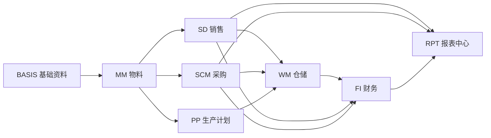
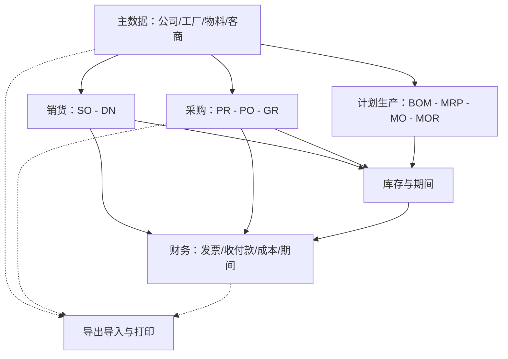

# OV-01 系统整体流程地图

> 受众：全体用户 | 模块：跨模块 | 版本：2026-08-08  
> 预计时长：25 分钟 | 语言：zh | 状态：草稿 | vi 同步：待同步

## 1. 这篇解决什么问题

回答三件事：

1. Lychee ERP 有哪些业务模块、各自管什么  
2. 从接到客户订单到采购、生产、出入库、财务关账，单据大致怎么流  
3. 课堂跟练时该进哪条 [流程剧本（PB）](../03-process-playbooks/PB-01-master-data-ready.md)

本文**不教点击步骤**；动手请跟 PB / 角色手册。

## 2. 模块一览

> **ADM 系统管理**不画进主链：它为上述模块配置菜单与权限，贯穿全程。

| 模块 | 用户常做的事 | 关键单据/对象（缩写） |
|------|--------------|----------------------|
| ADM | 用户、角色、菜单、权限 | — |
| BASIS | 公司、工厂、部门 | — |
| MM | 物料、工厂物料、单位 | 物料主数据 |
| SD | 接单、交货 | SO、DN、客户 |
| SCM | 申请、下单、委外 | PR、PO、OSO、供应商 |
| WM | 收发存、盘点、库存结账 | GR、SI、ST、PI |
| PP | BOM、MRP、工单、产量回馈 | BOM、FO、MRP、PLO、MO、MOR |
| FI | 发票、收付款、凭证、成本、资产 | AR、AP、日记账、成本结算 |
| RPT | 导出/导入作业跟踪与下载 | 导出中心、导入中心 |

缩写释义见 [术语表](../../glossary.md)。

## 3. 主价值链总图

下图是训练用的「一张图」：主数据打底后，销货、采购、生产并行推进，库存与财务在期间末汇合。虚线表示协同，不是强制同一天完成。

## 4. 角色与剧本对照

| 你的岗位 | 先读概念 | 再跟练剧本 |
|----------|----------|------------|
| 全体 | 本文 | [系统入门](../01-getting-started/01-system-overview.md) |
| 主数据 | 本文 §2 | [PB-01](../03-process-playbooks/PB-01-master-data-ready.md) |
| 销售 | [OV-02](./02-order-to-cash.md) | [PB-02](../03-process-playbooks/PB-02-sales-to-delivery.md) |
| 采购 | [OV-03](./03-procure-to-pay.md) | [PB-03](../03-process-playbooks/PB-03-procure-to-pay.md)、[PB-06](../03-process-playbooks/PB-06-export-and-print.md)、[PB-08](../03-process-playbooks/PB-08-outsource-loop.md) |
| 仓储 | OV-03 + [OV-05](./05-period-close-collaboration.md) | PB-03、[PB-05](../03-process-playbooks/PB-05-period-close.md)、[PB-09](../03-process-playbooks/PB-09-physical-inventory.md) |
| 生产计划 | [OV-04](./04-plan-to-produce.md) | [PB-04](../03-process-playbooks/PB-04-mrp-to-production.md) |
| 财务 | OV-02 + OV-03 + OV-05 | PB-03（AP）、PB-05、[PB-07](../03-process-playbooks/PB-07-import-center.md)、[PB-10](../03-process-playbooks/PB-10-order-to-cash.md) |
| 管理员 | 本文 + 运维开通 | [菜单与权限](../05-admin-ops/01-menu-and-permission.md) |

## 5. 课堂使用建议

1. **第 0 节（25 分钟）**：讲本文模块表 + 总图，学员标出自己岗位落在哪几条箭头上。  
2. **第 1 节**：完成系统入门（登录）。  
3. **其后**：按分班进入角色手册与 PB；概念专篇（OV-02～05）可作课前预习。  

## 6. FAQ

**Q：为什么总图里没有把所有菜单画全？**  
A：训练先抓主价值链。固定资产、科目确定等可在财务角色手册与 [FI 速查](../04-module-quickref/fi.md) 中展开。

**Q：委外（OSO）画在哪里？**  
A：归属采购协同生产/仓储的支线；动手见 [PB-08](../03-process-playbooks/PB-08-outsource-loop.md)。

**Q：导出/导入中心是不是业务流程的一环？**  
A：它们是交付与批量维护通道，不替代业务单据本身；见 [导出中心](../01-getting-started/02-export-center.md)、[导入中心](../01-getting-started/03-import-center.md) 与 PB-06 / PB-07。
