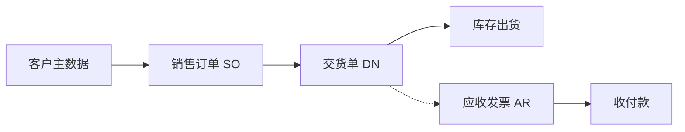

# OV-02 销货闭环（概念）

> 受众：销售、仓储、财务 | 模块：SD / WM / FI | 版本：2026-08-08  
> 预计时长：10 分钟 | 语言：zh | 状态：草稿 | vi 同步：待同步

## 1. 目标

理解从客户订单到交货（及后续应收）的协作关系，再进入动手剧本。

## 2. 流程概念图

| 环节 | 主责 | 交出什么 |
|------|------|----------|
| 客户就绪 | 主数据 / 销售 | 可用客户 |
| SO | 销售 | 已审核（或等效）订单 |
| DN | 销售或仓储（按公司分工） | 实发数量、出货过账 |
| 库存 | 仓储 | 现存量 / 流水变化 |
| AR | 财务 | 开票与过账 |
| 收付款 | 财务 | 收款核销 |

## 3. 跟练入口

- 出货：[PB-02 销售出货](../03-process-playbooks/PB-02-sales-to-delivery.md)  
- 开票收款：[PB-10 销货到收款](../03-process-playbooks/PB-10-order-to-cash.md)  
- 角色：[销售](../02-roles/role-sales.md)、[仓储](../02-roles/role-warehouse.md)、[财务](../02-roles/role-finance.md)  
- 回到总图：[OV-01](./01-system-process-map.md)

## 4. 概念要点（非操作）

- SO 回答「客户要什么、何时要」；DN 回答「实际发了什么」。  
- 部分交货时，未交数量仍挂在 SO 侧跟踪。  
- 已出货纠错走退货/冲销纪律，不是直接删历史单。
