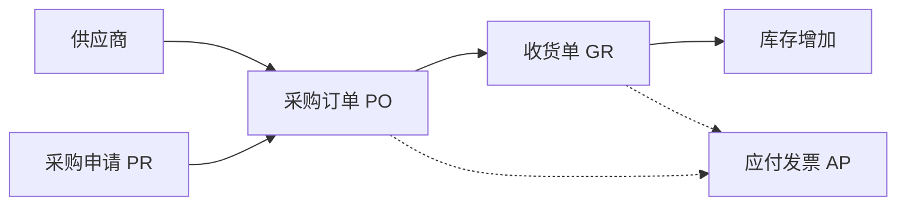

# OV-03 采购闭环（概念）

> 受众：采购、仓储、财务 | 模块：SCM / WM / FI | 版本：2026-08-08  
> 预计时长：10 分钟 | 语言：zh | 状态：草稿 | vi 同步：待同步

## 1. 目标

理解从采购申请到收货再到应付的三角色交接，区分「概念」与「逐步操作」。

## 2. 流程概念图

| 环节 | 主责 | 交出什么 |
|------|------|----------|
| 供应商 / 物料 | 主数据 / 采购 | 可下单主数据 |
| PR | 需求方或采购 | 已审核申请（可按公司跳过） |
| PO | 采购 | 价格、交期、可收货状态；可打印/PDF |
| GR | 仓储 | 实收过账、库存 |
| AP | 财务 | 发票审核与过账 |

委外（OSO）是采购协同生产/仓储的支线：先发料再收货，规则不同于标准 PO。

## 3. 跟练入口

- 标准采购：[PB-03](../03-process-playbooks/PB-03-procure-to-pay.md)  
- 委外支线：[PB-08](../03-process-playbooks/PB-08-outsource-loop.md)  
- 打印 / 导出：[PB-06](../03-process-playbooks/PB-06-export-and-print.md)  
- 角色：采购、仓储、财务手册  
- 总图：[OV-01](./01-system-process-map.md)

## 4. 概念要点（非操作）

- PO 未到可收状态时，仓储通常无法完成 GR。  
- 部分收货后，未清数量继续跟踪。  
- 草稿 PO 的打印/PDF 带水印，勿外发给供应商。
