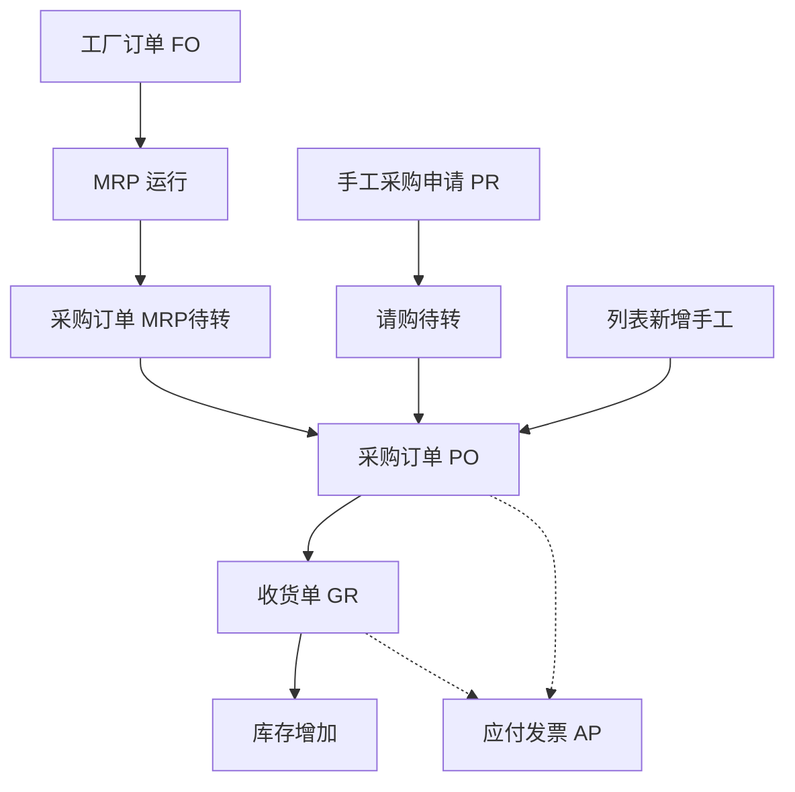

# OV-03 采购闭环（概念）

> 受众：采购、仓储、财务 | 模块：SCM / WM / FI | 版本：2026-08-28  
> 预计时长：10 分钟 | 语言：zh | 状态：草稿 | vi 同步：待同步

## 1. 目标

理解从需求到收货再到应付的三角色交接：原物料以 MRP 为准，采购员在采购订单页完成转单与审核；采购申请只服务内部手工请购。

## 2. 流程概念图

| 环节 | 主责 | 交出什么 |
|------|------|----------|
| 供应商 / 物料供应商 | 主数据 / 采购 | 可下单主数据；默认供应商、单位、末次价 |
| MRP 待转 | 采购（计划员可跳转进入） | 按工厂+供应商生成草稿 PO；原物料不经 PR |
| 采购申请 PR | 需求方或采购 | 仅内部请购；审核后走请购待转 |
| 列表新增 | 采购 | 无来源时手键明细，来源类型固定为手工 |
| PO | 采购 | 价格、交期、已核准后可收货；可打印/PDF |
| GR | 仓储 | 实收过账、库存 |
| AP | 财务 | 发票审核与过账 |

委外（OSO）是采购协同生产/仓储的支线：先发料再收货，规则不同于标准 PO。

## 3. 跟练入口

- 标准采购：[PB-03](../03-process-playbooks/PB-03-procure-to-pay.md)  
- 计划侧衔接：[PB-04](../03-process-playbooks/PB-04-mrp-to-production.md)（建议采购交给采购，不在 MRP 结果页下单）  
- 委外支线：[PB-08](../03-process-playbooks/PB-08-outsource-loop.md)  
- 打印 / 导出：[PB-06](../03-process-playbooks/PB-06-export-and-print.md)  
- 角色：采购、仓储、财务手册  
- 总图：[OV-01](./01-system-process-map.md)

## 4. 概念要点（非操作）

- 采购员日常原物料只开一张菜单：`采购管理 → 采购订单(PO)`（页签「MRP 待转」+「采购单」）。不要先转采购申请。  
- 原物料的实质控制点是 **PO 审核**（已有供应商、数量、价格），不是 PR 审核。  
- PO 未到「已核准」时，仓储通常无法完成 GR。  
- 草稿 PO 已占用需求：不打算下单的草稿应删除后再请计划重跑 MRP。  
- 部分收货后，未清数量继续跟踪。  
- 草稿 PO 的打印/PDF 带水印，勿外发给供应商。
