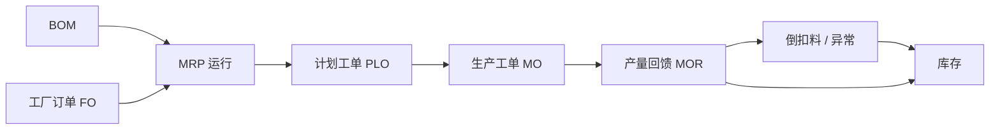

# OV-04 计划生产（概念）

> 受众：生产计划、仓储 | 模块：PP / WM / SCM | 版本：2026-08-08  
> 预计时长：10 分钟 | 语言：zh | 状态：草稿 | vi 同步：待同步

## 1. 目标

理解从 BOM、需求到 MRP、工单与产量回馈的主路径，以及倒扣料异常落在何处。

## 2. 流程概念图

| 环节 | 主责 | 说明 |
|------|------|------|
| BOM | 工程 / 生管 | 成品用料结构 |
| FO | 生管（若启用） | 工厂侧需求入口之一 |
| MRP | 生管 | 算需求与供应建议 |
| PLO → MO | 生管 | 计划落地为可执行工单 |
| MOR | 车间 / 生管 | 报完工 |
| 倒扣料异常 | 生管 + 仓储 | 扣料失败时的处理队列 |

MRP 还可能驱动采购侧需求（转 PR/PO），与 [OV-03](./03-procure-to-pay.md) 衔接。

## 3. 跟练入口

- 操作步骤：[PB-04](../03-process-playbooks/PB-04-mrp-to-production.md)  
- 委外支线（采购主责）：[PB-08](../03-process-playbooks/PB-08-outsource-loop.md)  
- 角色：[生产计划](../02-roles/role-production.md)  
- 总图：[OV-01](./01-system-process-map.md)

## 4. 概念要点（非操作）

- MRP 结果需人工确认，勿盲目全量转工单。  
- 倒扣料模式下，MOR 常伴随组件出库；异常未清可能影响结案。  
- 参数与 BOM 变更先在训练环境验证。
