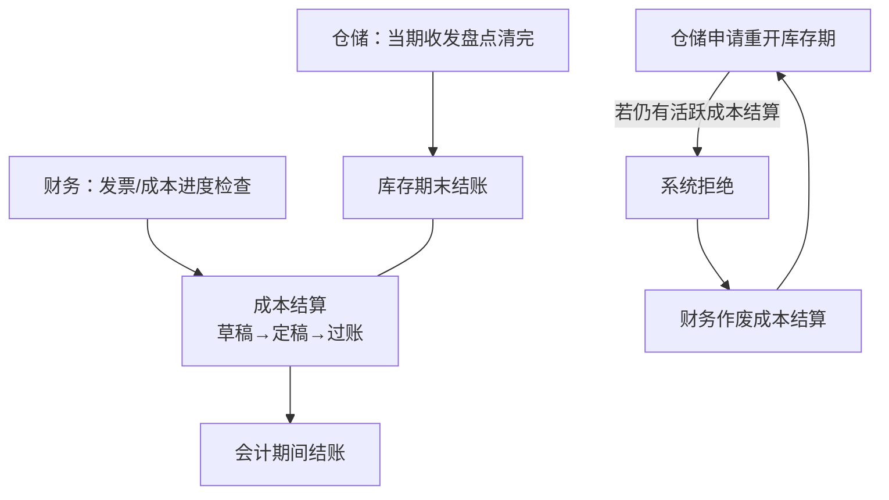

# OV-05 关账协作（概念）

> 受众：仓储、财务 | 模块：WM / FI | 版本：2026-08-01  
> 预计时长：10 分钟 | 语言：zh | 状态：草稿 | vi 同步：待同步

## 1. 目标

理解库存期末结账与财务成本结算 / 会计期间的协作与互锁，避免关账死锁。

## 2. 协作概念图

| 规则（用户语言） | 含义 |
|------------------|------|
| 活跃成本结算 | 成本作业仍处于未作废的进行/定稿/过账等状态（以界面名为准） |
| 重开被拒 | 同公司同期仍有活跃成本结算 → 财务先作废 |
| 作废责任 | 成本结算作废由**财务**执行，不是仓储 |

## 3. 跟练入口

- 操作 / 演练：[PB-05](../03-process-playbooks/PB-05-period-close.md)  
- 角色：[仓储](../02-roles/role-warehouse.md)、[财务](../02-roles/role-finance.md)  
- 总图：[OV-01](./01-system-process-map.md)

## 4. 概念要点（非操作）

- 关账是协作，不是单模块按钮。  
- 训练请使用教员指定期间，勿动生产当期。  
- 禁止为赶进度绕过系统互锁。
